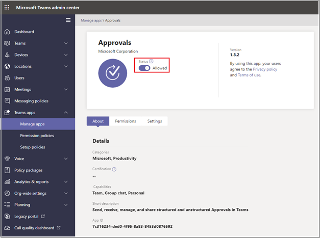

# Teams Approvals app availability

The Approvals app is available as a personal app for all Microsoft Teams users.
The Approvals app provides a simple way to bring auditing, compliance, accountability, and workflows to both structured and unstructured Approvals in Teams.

 

Users can pin the Approvals app to save it to the menu bar.

 

The first approval created from the Approvals app will trigger the provisioning of the Approval Solution in the default Common Data Service (CDS) environment. Approvals created from the Approvals app will be stored in the default CDS environment.

This article describes the Approvals app requirements and roles.

> [!NOTE]
> This feature hasn't been released to Government Community Cloud (GCC), Government Community Cloud High (GCCH), and Department of Defense (DOD) users yet.

## Required permissions and licenses

To use the Approvals app, you need permission for the following items:

- Permissions to create a Microsoft CDS database.

- An account on [flow.microsoft.com](https://flow.microsoft.com/)

- Administrator Role in the target environment.

- License for a [Power Automate](/power-automate/get-started-approvals), an Office 365, or a Dynamics 365.

## Storage with CDS

The Common Data Model (CDM) is the shared data language used by business and analytical applications in the CDS. It consists of a set of a standardized, extensible data schemas published by Microsoft and our partners that enables consistency of data and its meaning across applications and business processes. Learn more about the [Common Data Model of the Microsoft Power Platform](/power-automate/get-started-approvals).

Learn more about the [Approval workflow](/power-automate/modern-approvals).

## Approvals Teams app permissions

The Approvals Teams app lets you access the following features:

- Receive messages and data that you provide to it.

- Send you messages and notifications.

- Render personal apps and dialogs without a Teams-provided header.

- Access your profile information such as your name, email address, company name, and preferred language.

- Receive messages and data that team members provide to it in a channel.

- Send messages and notifications in a channel.

- Access your team's information:
  - team name
  - channel list
  - roster (team member's names and email addresses).

- Use the team's information to contact them.

## Disable the Approvals app

The Approvals app is available by default. You can disable the app in the Teams admin center.

  1. Sign in to the Teams admin center.

  2. Expand **Teams apps** and select **Manage apps**.

  3. Search for the Approvals app.

  4. Select Approvals.

  5. Select the toggle to disable the app for your organization.

## Retention policy

Approvals created from the Approvals App are stored in the default CDS environment, which doesn’t support backups at this time. Learn more about how to [Back up and restore environments - Power Platform \| Microsoft Docs](/power-platform/admin/backup-restore-environments).

## Auditing

The Approvals App logs audit events within the Microsoft 365 Security and Compliance Center. You can view the audit log.

1. Go to the Microsoft 365 Compliance Site.

2. Select the **Audit** section.

3. Search for activities under **Microsoft Teams approvals activities**.

You can search for the following activities:

- Create new approval request

- View approval request details

- Approved approval request

- Rejected approval request

- Canceled approval request

- Shared approval request

- File attached to approval request

- Reassigned approval request

- Added e-signature to approval request

- Viewed e-signature request details

- Reviewed e-signature request

- Canceled e-signature request

For access to more auditing approvals within Flow, enable and configure auditing in the default environment for the primary approval entities Approval, Approval Request, and Approval Response. Create, update, and delete operations are auditable events for Approval records. Learn more about [Audit data and user activity for security and compliance - Power Platform \| Microsoft Docs](/power-platform/admin/audit-data-user-activity).

Auditing can be customized further in the [Microsoft 365 Security and Compliance Center](https://support.office.com/article/go-to-the-office-365-security-compliance-center-7e696a40-b86b-4a20-afcc-559218b7b1b8?ui=en-US&rs=en-US&ad=US).

1. To use the preconfigured reports, sign in to Microsoft 365 Security and Compliance.

2. Select **Search & investigation**.

3. Search the Audit log and select the **Dynamics 365 activities** tab.

Learn more about [Microsoft Dataverse and model-driven apps activity logging - Power Platform](/power-platform/admin/enable-use-comprehensive-auditing).

## Security

From the Teams Approvals app, users have access to create new Approvals and view Approvals that they have sent and received. Users won't have access to Approvals that are created by others unless they're either a responder or a viewer of the request.

> [!Note]
> A user will be given a viewer role of a request if they are part of the chat or channel where the approval was created. They won't have the ability to take action on the request if they weren't given that role when the approval was created.

## Approvals e-signature integration

E-signature approvals created from the Approvals app are stored in the selected provider's cloud environment. For further information about storage around the e-signature agreement, view the selected provider's storage documentation.

To use the Approvals app e-signature feature, you need the following items:

- License for the specific e-signature provider you're choosing to use. In order to obtain a license for your organization, you'll need to go to the provider’s site.

For the Approvals e-signature functionality, third-party signature partners will appear in the Teams Approvals app by default. You can disable specific e-signature providers by accessing app settings in the Teams admin center.

1. In the Teams admin center, under **Manage apps**, select the **Approvals app** and choose **Settings**.

2. Each e-signature provider has a toggle next to it that is in the on position (right) by default. Slide the toggle to the left to disable a specific e-signature provider. If a Teams admin disables a provider, end users won't see the provider when creating an approval. End users will also be unable to view any e-signature requests that were made with that provider.

E-signature Approvals created from the Approvals App are stored in the selected provider’s cloud. You will therefore need to go to the provider's site in order to export any data about e-signatures. Refer to the provider's documentation about export and retention of these agreements.
