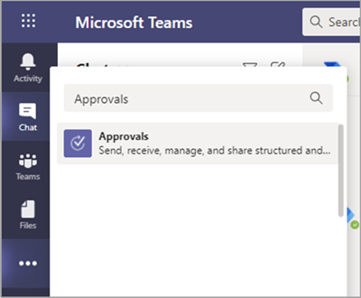
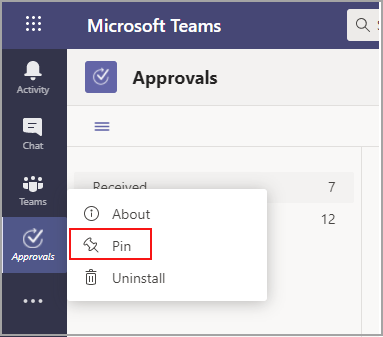
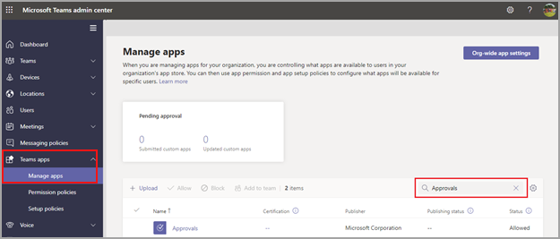

# Teams Approvals app availability

The Approvals app is available as a personal app for all Microsoft Teams users.
The Approvals app provides a simple way to bring auditing, compliance, accountability, and workflows to both structured and unstructured Approvals in Teams.

 

Users can pin the Approvals app to save it to the menu bar.

 

The first approval created from the Approvals app will trigger the provisioning of the Approval Solution in the default Microsoft Dataverse environment. Approvals created from the Approvals app will be stored in the default Microsoft Dataverse environment.

This article describes the Approvals app requirements and roles.

> [!NOTE]
> This feature hasn't been released to Government Community Cloud High (GCCH) and Department of Defense (DOD) users yet.

## Required permissions and licenses

To deploy the Approvals app, you need permission for the following items:

- Permissions to create a Microsoft Dataverse database.

- An account on [powerautomate.microsoft.com](https://powerautomate.microsoft.com/)

- Administrator Role in the target environment.

- License for [Power Automate](/power-automate/get-started-approvals), Office 365, or Dynamics 365.

- License for Microsoft Forms is required for users to set up new approval templates.

To use the Approvals app, you need a license for Power Automate, and your account is automatically added to the Approvals User role in the target environment on your first approval assignment.

## Storage with Microsoft Dataverse

The Common Data Model (CDM) is the shared data language used by business and analytical applications in the Microsoft Dataverse. It consists of a set of standardized, extensible data schemas published by Microsoft and our partners that enables consistency of data and its meaning across applications and business processes. Learn more about the [Common Data Model of the Microsoft Power Platform](/power-automate/get-started-approvals).

Learn more about the [Approval workflow](/power-automate/modern-approvals).

Approvals that are created from a template still store data in Microsoft Dataverse, such as their title, details, template ID, and more. Responses that are submitted on the approval request are stored in Forms. Learn more about [Data storage for Microsoft Forms](https://support.microsoft.com/office/data-storage-for-microsoft-forms-97a34e2e-98e1-4dc2-b6b4-7a8444cb1dc3#:~:text=Where%20data%20is%20stored%20for%20Microsoft%20Forms.%20Microsoft,European-based%20tenants%20is%20stored%20on%20servers%20in%20Europe).

>[!Note]
>If you delete the Form template on the Microsoft Forms site, it'll break your Approval template and users are unable to start the request. Users get an error "CDB TableNotFound" when trying to open an Approval template that is deleted on Microsoft Forms.

Org-scoped templates share the same lifetime of the tenant and team-scoped templates share the same lifetime of the team. So, permanently deleting the team deletes the related templates.

## Approvals Teams app permissions

The Approvals Teams app lets you access the following features:

- Receive messages and data that you provide to it.

- Send you messages and notifications.

- Render personal apps and dialogs without a Teams-provided header.

- Access your profile information such as your name, email address, company name, and preferred language.

- Receive messages and data that team members provide to it in a channel.

- Send messages and notifications in a channel.

- Access your team's information:
  - team name
  - channel list
  - roster (team member's names and email addresses).

- Use the team's information to contact them.

Approval Template Permissions

- All team owners can create an approval template for teams that they own.

- When an admin creates a template for their entire organization for the first time, it will automatically create a new Azure Active Directory (AAD) group for all admins of the tenant, including the global and Teams service admins. These admins are added as owners of the group, so they can co-manage organizational templates. Admins that are new to the organization after the team has been created need to be manually added as group owners so they have the same permissions to manage organization-wide templates.

> [!Note]
> If an admin deletes the group, you have one month to restore it within the Azure Active Directory (AAD) portal to restore all related data. After one month, or if the admin deletes this group within the recycle bin, you will lose all related data.

## Disable the Approvals app

The Approvals app is available by default. You can disable the app in the Teams admin center.

  1. Sign in to the Teams admin center.

  2. Go to **Teams apps** > **Manage apps**.

  3. Search for the Approvals app.

     

  4. Select **Approvals**.

  5. Select the toggle to disable the app for your organization.

     :::image type="content" alt-text="shows the details for the Approvals app." source="media/approvals-details-new.png" lightbox="media/approvals-details-new.png":::

## Pin Approvals to Teams

### Use the Tailored frontline app experience to pin Approvals and other apps to Teams

The tailored frontline app experience in Teams pins the most relevant apps in Teams for users who have an [F license](https://www.microsoft.com/microsoft-365/enterprise/frontline#office-SKUChooser-0dbn8nt). Pinned apps include Approvals, Walkie Talkie, Tasks, and Shifts. By default, this feature is on, giving your frontline workers an out-of-the-box experience that's tailored to their needs.

The apps are pinned to the app bar—the bar on the side of the Teams desktop client and at the bottom of the Teams mobile clients—where users can quickly and easily access them.

To learn more, including how the experience works with app policies that you set, see [Tailor Teams apps for your frontline workers](pin-teams-apps-based-on-license.md).

### Use an app setup policy to pin Approvals to Teams

App setup policies let you customize Teams to pin apps that are most important for your users in your users.

To pin the Approvals app for your users, you can edit the global (Org-wide default) policy or create and assign a custom app setup policy. To learn more, see [Manage app setup policies in Teams](teams-app-setup-policies.md).

## Retention policy

Approvals created from the Approvals app are stored in the default Microsoft Dataverse environment, which doesn't support backups at this time. Learn more about how to [Back up and restore environments - Power Platform \| Microsoft Docs](/power-platform/admin/backup-restore-environments).

Data stored in Forms will not be deleted until the team owners clean it up from the **deleted forms** tab in the Microsoft Forms web app.

## Conditional Access policies

Currently, the Approvals app in Teams does not support Conditional Access policies that are set for Microsoft Teams.

## Data limitations

Each team can contain at most 400 approvals templates, and each template can collect a maximum of 50,000 requests based on the current capability in Microsoft Forms.

## Auditing

The Approvals App logs audit events within the Microsoft 365 Security and Compliance Center. You can view the audit log.

1. Go to the Microsoft 365 Compliance Site.

2. Select the **Audit** section.

3. Search for activities under **Microsoft Teams approvals activities**.

You can search for the following activities:

- Create new approval request

- View approval request details

- Approved approval request

- Rejected approval request

- Canceled approval request

- Shared approval request

- File attached to approval request

- Reassigned approval request

- Added e-signature to approval request

- Viewed e-signature request details

- Reviewed e-signature request

- Canceled e-signature request

- Create a new template

- Edit an existing template

- Enable/disable a template

- Viewed template

For access to more auditing approvals within Power Automate, enable and configure auditing in the default environment for the primary approval entities Approval, Approval Request, and Approval Response. Create, update, and delete operations are auditable events for Approval records. Learn more about [Audit data and user activity for security and compliance - Power Platform \| Microsoft Docs](/power-platform/admin/audit-data-user-activity).

Auditing can be customized further in the [Microsoft 365 Security and Compliance Center](https://support.office.com/article/go-to-the-office-365-security-compliance-center-7e696a40-b86b-4a20-afcc-559218b7b1b8?ui=en-US&rs=en-US&ad=US).

1. To use the preconfigured reports, sign in to Microsoft 365 Security and Compliance.

2. Select **Search & investigation**.

3. Search the Audit log and select the **Dynamics 365 activities** tab.

Learn more about [Microsoft Dataverse and model-driven apps activity logging - Power Platform](/power-platform/admin/enable-use-comprehensive-auditing).

## Security

From the Teams Approvals app, users have access to create new Approvals and view Approvals that they have sent and received. Users won't have access to Approvals that are created by others unless they're either a responder or a viewer of the request.

> [!Note]
> A user is given a viewer role of a request if they are part of the chat or channel where the approval was created. They won't have the ability to take action on the request if they weren't given that role when the approval was created.

## Approvals e-signature integration

To use the Approvals app e-signature feature, you need a license for the specific e-signature provider that you want to use. To obtain a license for your organization, you'll need to go to the provider's site.

### Enable or disable e-signature providers

You can use the Teams admin center to control, which third-party e-signature providers are available to your users in the Approvals app. By default, e-signature providers are enabled in the Approvals app. When you disable an e-signature provider, your users won't have access to that provider when they create approvals. Your users also won't be able to view e-signature requests that were created using that provider.

1. In the left pane of the Teams admin center, go to **Teams apps** > **Manage apps**.
2. Search for the Approvals app, and then select it.
3. Go to the **Settings** tab, and then do one or more of the following:

    - To enable or disable Adobe Sign, switch the toggle to **On** or **Off**.
    - To enable or disable DocuSign, switch the toggle to **On** or **Off**.
4. Select **Submit**.

E-signature approvals created from the Approvals app are stored in the selected provider's cloud environment. To export data about e-signatures, you'll need to go to the provider's site. For more information about storage, export, and retention of e-signature agreements, see the provider's documentation.
