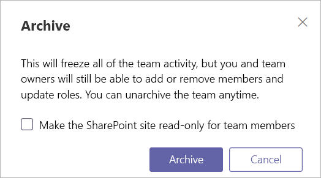

Archive or delete a team in Microsoft Teams
===========================================

Over time, a team created in Microsoft Teams might fall out of use or you might want to archive or delete a team at the end of a project. If you are a Microsoft Teams admin, follow the steps in this article to archive or delete a team that is no longer needed. When you archive a team, all activity for that team ceases, but you can still add or remove members and update roles and you can still view all the team activity in channels, files, and chats. When you delete a team, team activity in associated channels, files, and chats is also deleted. 

> [!IMPORTANT]
> Archived teams can be reactivated, but you can’t undelete a team that has been deleted. Consider archiving the team first, and postpone the deletion until you're sure that you no longer need the team.

## Archive a team

Follow these steps to archive a team.

1. In the Microsoft Teams admin center, select **Teams**.
2. Select a team by clicking the team name.
3. Select **Archive**. The following message will appear.

    

4. If you would like to make the SharePoint site for the team read-only, select the check box.
5. Select **Archive** to archive the team. The team’s status will change to **Archived**.

## Make an archived team active

Follow these steps to make an archived team active again.

1. In the Microsoft Teams admin center, select **Teams**.
2. Select a team by clicking the team name.
3. Select **Unarchive**. The team’s status will change to **Active**.

## Delete a team

If the team will not be required in the future, then you can delete it rather than archiving it. Follow these steps to delete a team.

1.	In the Microsoft Teams admin center, select **Teams**.
2.	Select a team by clicking the team name.
3.	Select **Delete**. A confirmation message will appear.
4.	Select **Delete** to permanently delete the team.

