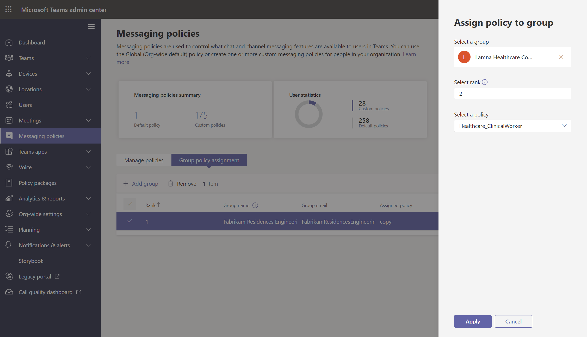

# Assign policies to users and groups

This article reviews the different ways to assign policies to users and groups in Microsoft Teams. Before reading, be sure you've read [Assign policies in Teams - getting started](policy-assignment-overview.md).

## Assign a policy to individual users

Follow these steps to assign a policy to an individual user or to a small number of users at a time.

### Use the Microsoft Teams admin center

To assign a policy to a user:

1. In the left navigation of the [Microsoft Teams admin center](https://admin.teams.microsoft.com), go to **Users** > **Manage users**.
2. Select the user by clicking to the left of the user name, and then select **Edit settings**.
3. Select the policy you want to assign, and then select **Apply**.

:::image type="content" source="media/teams-assign-policies-users-groups-edit-settings.png" alt-text="Screenshot of Edit settings pane under Manage users." lightbox="media/assign-policy-user.png":::

> [!NOTE]
> To unassign a specialized policy from a user, you can set each policy to **Global (Org-wide default)**.

You can also do the following to assign a policy to a user:

1. In the left navigation of the Microsoft Teams admin center, go to the policy page.
2. Select the policy you want to assign by clicking to the left of the policy name.
3. Select **Manage users**.
4. In the **Manage users** pane, search for the user by display name or by user name, select the name, and then select **Add**. Repeat this step for each user that you want to add.
5. When you're finished adding users, select **Apply**.


### Use PowerShell

Each policy type has its own set of cmdlets for managing it. Use the `Grant-` cmdlet for a given policy type to assign the policy. For example, use the `Grant-CsTeamsMeetingPolicy` cmdlet to assign a Teams meeting policy to users. These cmdlets are included in the Teams PowerShell module and are documented in the [Skype for Business cmdlet reference](/powershell/skype).

 Download and install the [Teams PowerShell public release](https://www.powershellgallery.com/packages/MicrosoftTeams/) (if you haven't already), and then run the following to connect.

> [!NOTE]
> Skype for Business Online Connector is currently part of the latest Teams PowerShell module.
>
> If you're using the latest [Teams PowerShell public release](https://www.powershellgallery.com/packages/MicrosoftTeams/), you don't need to install the Skype for Business Online Connector.

```powershell
  # When using Teams PowerShell Module

   Import-Module MicrosoftTeams
   $credential = Get-Credential
   Connect-MicrosoftTeams -Credential $credential
```

In this example, we assign a Teams meeting policy named Student Meeting Policy to a user named Reda.

```powershell
Grant-CsTeamsMeetingPolicy -Identity reda@contoso.com -PolicyName "Student Meeting Policy"
```

To learn more, read [Manage policies via PowerShell](teams-powershell-managing-teams.md#manage-policies-via-powershell).

## Assign a policy to a group

Policy assignment to groups lets you assign a policy to a group of users, such as a security group, an organizational unit, or a distribution list. The policy assignment is propagated to members of the group according to precedence rules. As members are added to or removed from a group, their inherited policy assignments are updated accordingly.

Policy assignment to groups is recommended for groups of up to 50,000 users but it will also work with larger groups.

When you assign the policy, it's immediately assigned to the group. However, the propagation of the policy assignment to members of the group is performed as a background operation and might take some time, depending on the size of the group. The same is true when a policy is unassigned from a group, or when members are added to or removed from a group.

Group policy assignments are only propagated to users who are direct members of the group. The assignments aren't propagated to members of nested groups.

### What you need to know about policy assignment to groups

Before you get started, it's important to understand precedence rules and group assignment ranking.

#### Precedence rules

For a given policy type, a user's effective policy is determined according to the following:

- A policy that's directly assigned to a user takes precedence over any other policy of the same type that's assigned to a group. In other words, if a user is directly assigned a policy of a given type, that user won't inherit a policy of the same type from a group. This also means that if a user has a policy of a given type that was directly assigned to them, you have to remove that policy from the user before they can inherit a policy of the same type from a group.
- If a user doesn't have a policy directly assigned to them and is a member of two or more groups and each group has a policy of the same type assigned to it, the user inherits the policy of the group assignment that has the highest ranking.
- If a user isn't a member of any groups that are assigned a policy, the global (Org-wide default) policy for that policy type applies to the user.

A user's effective policy is updated according to these rules:

- when a user is added to or removed from a group that's assigned a policy.
- a policy is unassigned from a group.
- a policy that's directly assigned to the user is removed.

#### Group assignment ranking

> [!NOTE]
> A given policy type can be assigned to a maximum of 64 groups across policy instances for that type.

When you assign a policy to a group, you specify a ranking for the group assignment. This is used to determine which policy a user should inherit as their effective policy if the user is a member of two or more groups and each group is assigned a policy of the same type.

The group assignment ranking is relative to other group assignments of the same type. For example, if you're assigning a calling policy to two groups, set the ranking of one assignment to 1 and the other to 2, with 1 being the highest ranking. The group assignment ranking indicates which group membership is more important or more relevant than other group memberships with regard to inheritance.

Say, for example, you have two groups, Store Employees and Store Managers. Both groups are assigned a Teams calling policy, Store Employees Calling Policy and Store Managers Calling Policy, respectively. For a store manager who is in both groups, their role as a manager is more relevant than their role as an employee, so the calling policy that's assigned to the Store Managers group should have a higher ranking.

|Group |Teams calling policy name  |Rank|
|---------|---------|---|
|Store Managers   |Store Managers Calling Policy         |1|
|Store Employees    |Store Employees Calling Policy      |2|

If you don't specify a ranking, the policy assignment is given the lowest ranking.

### In the Teams admin center

> [!NOTE]
> Currently, policy assignment to groups using the Microsoft Teams admin center is only available for Teams calling policy, Teams call park policy, Teams policy, Teams live events policy, Teams meeting policy, and Teams messaging policy. For other policy types, use PowerShell.

1. In the left navigation of the Microsoft Teams admin center, go to the policy type page. For example, go to **Meetings** > **Meeting policies**.
2. Select the **Group policy assignment** tab.
3. Select **Add group**, and then in the **Assign policy to group** pane, do the following:
    1. Search for and add the group you want to assign the policy to.
    2. Set the ranking for the group assignment.
    3. Select the policy that you want to assign.
    4. Select **Apply**.
    


To remove a group policy assignment, on the **Group policy assignment** tab of the policy page, select the group assignment, and then select **Remove**.

To change the ranking of a group assignment, you have to first remove the group policy assignment. Then, follow the steps above to assign the policy to a group.

### Use the PowerShell option

> [!NOTE]
> Currently, policy assignment to groups using PowerShell isn't available for all Teams policy types. See [New-CsGroupPolicyAssignment](/powershell/module/teams/new-csgrouppolicyassignment) for the list of supported policy types.

#### Install and connect to the Microsoft Teams PowerShell module

For step-by-step guidance, see [Install Teams PowerShell](teams-powershell-install.md).

#### Assign a policy to a group of users

Use the [New-CsGroupPolicyAssignment](/powershell/module/teams/new-csgrouppolicyassignment) cmdlet to assign a policy to a group. You can specify a group by using the object ID, SIP address, or email address.

In this example, we assign a Teams meeting policy named Retail Managers Meeting Policy to a group with an assignment ranking of 1.

```powershell
New-CsGroupPolicyAssignment -GroupId d8ebfa45-0f28-4d2d-9bcc-b158a49e2d17 -PolicyType TeamsMeetingPolicy -PolicyName "Retail Managers Meeting Policy" -Rank 1
```

#### Get policy assignments for a group

Use the [Get-CsGroupPolicyAssignment](/powershell/module/teams/get-csgrouppolicyassignment) cmdlet to get all policies assigned to a group. Note that groups are always listed by their group ID even if its SIP address or email address was used to assign the policy.

In this example, we retrieve all policies assigned to a specific group.

```powershell
Get-CsGroupPolicyAssignment -GroupId e050ce51-54bc-45b7-b3e6-c00343d31274
```

In this example, we return all groups that are assigned a Teams meeting policy.

```powershell
Get-CsGroupPolicyAssignment -PolicyType TeamsMeetingPolicy
```

#### Remove a policy from a group

Use the [Remove-CsGroupPolicyAssignment](/powershell/module/teams/remove-csgrouppolicyassignment) cmdlet to remove a policy from a group. When you remove a policy from a group, the priorities of other policies of the same type assigned to that group, and that have a lower ranking, are updated. For example, if you remove a policy that has a ranking of 2, policies that have a ranking of 3 and 4 are updated to reflect their new ranking. The following two tables show this example.

Here's a list of the policy assignments and priorities for a Teams meeting policy.

|Group name  |Policy name  |Rank|
|---------|---------|---------|
|Sales    |Sales policy       | 1        |
|West Region     |West Region policy         |2         |
|Division    |Division policy         |3         |
|Subsidiary   |Subsidiary policy        |4         |

If we remove the West Region policy from the West Region group, the policy assignments and priorities are updated as follows.

|Group name  |Policy name  |Rank|
|---------|---------|---------|
|Sales    |Sales policy       | 1        |
|Division    |Division policy         |2         |
|Subsidiary   |Subsidiary policy        |3        |

In this example, we remove the Teams meeting policy from a group.

```powershell
Remove-CsGroupPolicyAssignment -PolicyType TeamsMeetingPolicy -GroupId f985e013-0826-40bb-8c94-e5f367076044
```

#### Change a policy assignment for a group

> [!NOTE]
> The [Set-CsGroupPolicyAssignment](/powershell/module/teams/set-csgrouppolicyassignment) cmdlet will be available soon. In the meantime, to change a group policy assignment, you can remove the current policy assignment from the group, and then add a new policy assignment.

After you assign a policy to a group, you can use the [Set-CsGroupPolicyAssignment](/powershell/module/teams/set-csgrouppolicyassignment) cmdlet to change that group's policy assignment as follows:

- Change the ranking
- Change the policy of a given policy type
- Change the policy of a given policy type and the ranking

In this example, we change a group's Teams call park policy to a policy named SupportCallPark and the assignment ranking to 3.

```powershell
Set-CsGroupPolicyAssignment -GroupId 566b8d39-5c5c-4aaa-bc07-4f36278a1b38 -PolicyType TeamsMeetingPolicy -PolicyName SupportCallPark -Rank 3
```

#### Change the effective policy for a user

Here's an example of how to change the effective policy for a user who is directly assigned a policy.

First, we use the [Get-CsUserPolicyAssignment](/powershell/module/teams/get-csuserpolicyassignment) cmdlet together with the `PolicySource` parameter to get details of the Teams meeting broadcast policies associated with the user.

```powershell
Get-CsUserPolicyAssignment -Identity daniel@contoso.com -PolicyType TeamsMeetingBroadcastPolicy | select -ExpandProperty PolicySource
```

The output shows that the user was directly assigned a Teams meeting broadcast policy named Employee Events, which takes precedence over the policy named Vendor Live Events that's assigned to a group the user belongs to.

```console
AssignmentType PolicyName         Reference
-------------- ----------         ---------
Direct         Employee Events
Group          Vendor Live Events 566b8d39-5c5c-4aaa-bc07-4f36278a1b38
```

Now, we remove the Employee Events policy from the user. This means that the user no longer has a Teams meeting broadcast policy directly assigned to them and will inherit the Vendor Live Events policy that's assigned to the group the user belongs to.

Use the following cmdlet in the Skype for Business PowerShell module to do this.

```powershell
Grant-CsTeamsMeetingBroadcastPolicy -Identity daniel@contoso.com -PolicyName $null
```

Use following cmdlet in the Teams PowerShell module to do this at scale though a batch policy assignment, where $users is a list of users that you specify.

```powershell
New-CsBatchPolicyAssignmentOperation -OperationName "Assigning null at bulk" -PolicyType TeamsMeetingBroadcastPolicy -PolicyName $null -Identity $users  
```

## Assign a policy to a batch of users

### Use the admin center

To assign a policy to users in bulk:

1. In the left navigation of the Microsoft Teams admin center, select **Users**.
2. Search for the users you want to assign the policy to or filter the view to show the users you want.
3. In the **&#x2713;** (check mark) column, select the users. To select all users, click the &#x2713; (check mark) at the top of the table.
4. Select **Edit settings**, make the changes that you want, and then select **Apply**.

To view the status of your policy assignment, in the banner that appears at the top of the **Users** page after you select **Apply** to submit your policy assignment, select **Activity log**. Or, in the left navigation of the Microsoft Teams admin center, go to **Dashboard**, and then under **Activity log**, select **View details**. The Activity log shows policy assignments to batches of more than 20 users through the Microsoft Teams admin center from the last 30 days. To learn more, see [View your policy assignments in the Activity log](activity-log.md).

### Use PowerShell method

> [!NOTE]
> Currently, batch policy assignment using PowerShell isn't available for all Teams policy types. See [New-CsBatchPolicyAssignmentOperation](/powershell/module/teams/new-csbatchpolicyassignmentoperation) for the list of supported policy types.

With batch policy assignment, you can assign a policy to large sets of users at a time without having to use a script. You use the [New-CsBatchPolicyAssignmentOperation](/powershell/module/teams/new-csbatchpolicyassignmentoperation) cmdlet to submit a batch of users and the policy that you want to assign. The assignments are processed as a background operation and an operation ID is generated for each batch. You can then use the [Get-CsBatchPolicyAssignmentOperation](/powershell/module/teams/get-csbatchpolicyassignmentoperation) cmdlet to track the progress and status of the assignments in a batch.

Specify users by their object ID or Session Initiation Protocol (SIP) address. A user's SIP address often has the same value as the User Principal Name (UPN) or email address, but this is not required. If a user is specified using their UPN or email, but it has a different value than their SIP address, then policy assignment will fail for the user. If a batch includes duplicate users, the duplicates will be removed from the batch before processing and status will only be provided for the unique users remaining in the batch.

A batch can contain up to 5,000 users. For best results, don't submit more than a few batches at a time. Allow batches to complete processing before submitting more batches.

#### Install and connect to the Teams PowerShell module

Run the following to install the [Microsoft Teams PowerShell module](https://www.powershellgallery.com/packages/MicrosoftTeams). Make sure you install version 1.0.5 or later.

```powershell
Install-Module -Name MicrosoftTeams
```

Run the following to connect to Teams and start a session.

```powershell
Connect-MicrosoftTeams
```

When you're prompted, sign in using your admin credentials.

#### Install and connect to the Azure AD PowerShell for Graph module (optional)

You might also want to [download and install the Azure AD PowerShell for Graph module](/powershell/azure/active-directory/install-adv2) (if you haven't already) and connect to Azure AD so that you can retrieve a list of users in your organization.

Run the following to connect to Azure AD.

```powershell
Connect-AzureAD
```

When you're prompted, sign in using the same admin credentials that you used to connect to Teams.

#### Assign a setup policy to a batch of users

In this example, we use the [New-CsBatchPolicyAssignmentOperation](/powershell/module/teams/new-csbatchpolicyassignmentoperation) cmdlet to assign an app setup policy named HR App Setup Policy to a batch of users listed in the users_ids.text file.

```powershell
$user_ids = Get-Content .\users_ids.txt
New-CsBatchPolicyAssignmentOperation -PolicyType TeamsAppSetupPolicy -PolicyName "HR App Setup Policy" -Identity $user_ids -OperationName "Example 1 batch"
```

In this example, we connect to Azure AD to retrieve a collection of users and then assign a messaging policy named New Hire Messaging Policy to a batch of users specified by using their SIP address.

```powershell
Connect-AzureAD
$users = Get-AzureADUser
New-CsBatchPolicyAssignmentOperation -PolicyType TeamsMessagingPolicy -PolicyName "New Hire Messaging Policy" -Identity $users.SipProxyAddress -OperationName "Example 2 batch"
```

#### Get the status of a batch assignment

Run the following to get the status of a batch assignment, where OperationId is the operation ID that's returned by the `New-CsBatchPolicyAssignmentOperation` cmdlet for a given batch.

```powershell
$Get-CsBatchPolicyAssignmentOperation -OperationId f985e013-0826-40bb-8c94-e5f367076044 | fl
```

If the output shows that an error occurred, run the following to get more information about errors, which are in the `UserState` property.

```powershell
Get-CsBatchPolicyAssignmentOperation -OperationId f985e013-0826-40bb-8c94-e5f367076044 | Select -ExpandProperty UserState
```

To learn more, see [Get-CsBatchPolicyAssignmentOperation](/powershell/module/teams/get-csbatchpolicyassignmentoperation).

## Related topics

- [Manage Teams with policies](manage-teams-with-policies.md)
- [Teams PowerShell Overview](teams-powershell-overview.md)
- [Assign policies in Teams - getting started](policy-assignment-overview.md)
