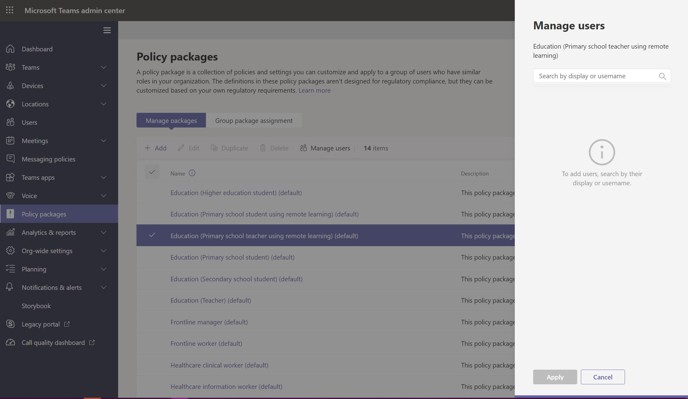

# Assign policy packages to users and groups

This article reviews the different ways to assign policy packages to users and groups in Microsoft Teams. Before reading, be sure you've read [Assign policies in Teams - getting started](policy-assignment-overview.md).

> [!NOTE]
> Each user will require the Advanced Communications add-on in order to receive a custom policy package assignment. For more information, see [Advanced Communications add-on for Microsoft Teams](/microsoftteams/teams-add-on-licensing/advanced-communications).

## Assign a policy package to users

A policy package in Teams is a collection of predefined policies and policy settings that you can assign to users who have the same or similar roles in your organization. Each policy package is designed around a user role and includes predefined policies and policy settings that support activities typical for that role. Some examples of policy packages are the Education (Teacher) package and Healthcare (Clinical worker) package. To learn more, see [Manage policy packages in Teams](manage-policy-packages.md).

### Assign a policy package to one user

1. In the left navigation of the Microsoft Teams admin center, go to **Users**, and then select the user.

2. On the user's page, select **Policies**, and then next to **Policy package**, select **Edit**.

3. In the **Assign policy package** pane, select the package you want to assign, and then select **Save**.

:::image type="content" source="media/assign-policy-package-one-user.png" alt-text="Teams admin center screenshot for policy package assignment to a user." lightbox="media/assign-policy-package-one-user-expanded.png":::

### Assign a policy package to multiple users

1. In the left navigation of the Microsoft Teams admin center, go to **Policy packages**, and then select the policy package you want to assign by clicking to the left of the package name.

2. Select **Manage users**.

3. In the **Manage users** pane, search for the user by display name or by user name, select the name, and then select **Add**. Repeat this step for each user that you want to add.

4. When you're finished adding users, select **Save**.



## Assign a policy package to a group

Policy package assignment to groups let you assign multiple policies to a group of users, such as a security group or distribution list. The policy assignment is propagated to members of the group according to precedence rules. As members are added to or removed from a group, their inherited policy assignments are updated accordingly.

Policy package assignment to groups is recommended for groups of up to 50,000 users, but it will also work with larger groups.

When you assign the policy package, it's immediately assigned to the group. However, the propagation of the policy assignment to members of the group is performed as a background operation and might take some time, depending on the size of the group. The same is true when a policy is unassigned from a group, or when members are added to or removed from a group.

> [!IMPORTANT]
> Before you get started, it's important to understand ([precedence rules](assign-policies-users-and-groups.md#precedence-rules)) and ([group assignment ranking](assign-policies-users-and-groups.md#group-assignment-ranking)). Make sure you read and understand the concepts in ([What you need to know about policy assignment to groups](assign-policies-users-and-groups.md#what-you-need-to-know-about-policy-assignment-to-groups)) earlier in this article.

### Assign a policy package to a group of users in the admin center

1. Sign in to the Teams admin center.

2. In the left navigation, go to the policy package page.

3. Select the Group policy assignment tab.

4. Select **Add group**, and then in the Assign a policy package to group pane, do the following:

    1. Search for and add the group you want to assign the policy package to.

    1. Select a policy package.

    1. Set the ranking for each policy type.

    1. Select **Apply**.

       :::image type="content" source="media/group-pkg-assignment.png" alt-text="Screenshot of Assign a policy package to a group pane." lightbox="media/group-pkg-assignment.png":::

5. To manage ranking for a specific policy type, navigate to the specific policy page.

6. To reassign a policy package to a group, first remove the group policy assignment. Then, follow the steps above to assign the policy package to a group.

### Work with PowerShell

#### Get the Teams PowerShell module

For step-by-step guidance, see [Install Teams PowerShell](teams-powershell-install.md).

#### Assign a policy package to a group of users

Use the [Grant-CsGroupPolicyPackageAssignment](/powershell/module/teams/grant-csgrouppolicypackageassignment) cmdlet to assign a policy package to a group. You can specify a group by using the object ID, SIP address, or email address. When you assign the policy package, specify a ([group assignment ranking](assign-policies-users-and-groups.md#group-assignment-ranking)) for each policy type in the policy package.

In this example, we assign the Education_Teacher policy package to a group with an assignment ranking of 1 for TeamsAppSetupPolicy and TeamsMeetingBroadcastPolicy and a ranking of 2 for TeamsMeetingPolicy.

```powershell
Grant-CsGroupPolicyPackageAssignment -GroupId "dae90bb4-120f-4a3e-a15d-30f142e79f69" -PackageName "Education_Teacher" -PolicyRankings "TeamsAppSetupPolicy, 1", "TeamsMeetingBroadcastPolicy, 1", "TeamsMeetingPolicy, 2"
```

## Assign a policy package to a batch of users

With batch policy package assignment, you can assign a policy package to large sets of users at a time without having to use a script. You use the [New-CsBatchPolicyAssignmentOperation](/powershell/module/teams/new-csbatchpolicyassignmentoperation) cmdlet to submit a batch of users and the policy package that you want to assign. The assignments are processed as a background operation and an operation ID is generated for each batch. You can then use the [Get-CsBatchPolicyAssignmentOperation](/powershell/module/teams/get-csbatchpolicyassignmentoperation) cmdlet to track the progress and status of the assignments in a batch.

Specify users by their object ID or Session Initiation Protocol (SIP) address. A user's SIP address often has the same value as the User Principal Name (UPN) or email address, but this isn't required. If a user is specified using their UPN or email, but it has a different value than their SIP address, then policy assignment will fail for the user. If a batch includes duplicate users, the duplicates will be removed from the batch before processing and status will only be provided for the unique users remaining in the batch.

A batch contains up to 5,000 users. For best results, don't submit more than a few batches at a time. Allow batches to complete processing before submitting more batches.

### Use the Teams PowerShell module

Run the following to install the [Microsoft Teams PowerShell module](https://www.powershellgallery.com/packages/MicrosoftTeams) (if you haven't already). Make sure you install version 1.0.5 or later.

```powershell
Install-Module -Name MicrosoftTeams
```

Run the following to connect to Teams and start a session.

```powershell
Connect-MicrosoftTeams
```

When you're prompted, sign in using your admin credentials.

### Assign policy packages to a batch of users

In this example, we use the [New-CsBatchPolicyAssignmentOperation](/powershell/module/teams/new-csbatchpolicyassignmentoperation) cmdlet to assign the Education_PrimaryStudent policy package to a batch of users.

```powershell
New-CsBatchPolicyPackageAssignmentOperation -Identity 1bc0b35f-095a-4a37-a24c-c4b6049816ab,user1@econtoso.com,user2@contoso.com -PackageName Education_PrimaryStudent
```

### See the status of a batch assignment

Run the following to get the status of a batch assignment, where OperationId is the operation ID that's returned by the `New-CsBatchPolicyAssignmentOperation` cmdlet for a given batch.

```powershell
$Get-CsBatchPolicyAssignmentOperation -OperationId f985e013-0826-40bb-8c94-e5f367076044 | fl
```

If the output shows that an error occurred, run the following to get more information about errors, which are in the `UserState` property.

```powershell
Get-CsBatchPolicyAssignmentOperation -OperationId f985e013-0826-40bb-8c94-e5f367076044 | Select -ExpandProperty UserState
```

To learn more, see [Get-CsBatchPolicyAssignmentOperation](/powershell/module/teams/get-csbatchpolicyassignmentoperation).

## Related topics

- [Manage Teams with policies](manage-teams-with-policies.md)
- [Manage policy packages in Microsoft Teams](manage-policy-packages.md)
- [Teams PowerShell Overview](teams-powershell-overview.md)
- [Assign policies in Teams - getting started](policy-assignment-overview.md)
