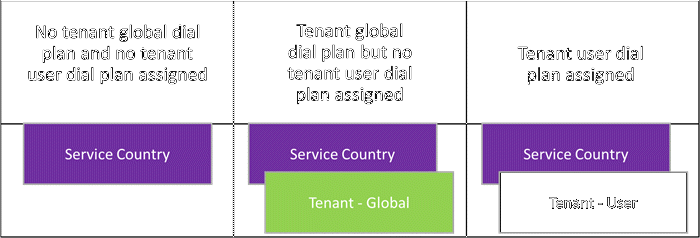

Practical guidance for Audio Conferencing in Microsoft Teams
============================================================
> [!IMPORTANT]
> [!INCLUDE [new-teams-sfb-admin-center-notice](includes/new-teams-sfb-admin-center-notice.md)]

Audio Conferencing in Office 365 allows participants to join your Teams meetings from any telephone.

Here's what you get with [Audio Conferencing](https://go.microsoft.com/fwlink/?linkid=858992) in Office 365.

This practical guidance takes you through the Office 365 FastTrack customer journey framework and its three phases, Envision, Onboard, and Drive Value, to help you plan, deliver, and operate an Audio Conferencing implementation towards successful business outcomes.

> [!TIP]
> In this practical guidance, we are providing example outputs for each activity and key discussion. The examples throughout this document are enclosed inside TIP callouts and they serve as a template that you can reuse. You'll see "TBA" (to be added) for information that you need to complete as part of your planning process.

Envision 
=========

The Envision phase provides the foundation for the Office 365 customer journey and is applicable to all workloads such as Audio Conferencing.

In this phase, business goals are captured, with relevant project stakeholders assembled, to ultimately deliver:

-   A high-level success plan that contains business use cases, key stakeholders, objectives and key results (OKRs), key success indicators (KSIs), risks, environmental assessment, adoption readiness, and operational plan.

-  A detailed Audio Conferencing technical implementation plan to achieve the desired end state.

Define business use cases for Audio Conferencing
------------------------------------------------

Audio Conferencing provides organizations with additional entry points to any meetings (adhoc and scheduled) by allowing meeting participants to join via PSTN (public switched telephone network) by dialing in using traditional land line, PBX, or mobile phones.

This is useful when the organizer or participants are not in front of a computer, or when data connections are unavailable or unreliable to support voice communications—such as when in a remote area with spotty mobile data coverage, or if connected to a free, public Wi-Fi service with limited bandwidth, or when meeting participants prefer to dial in to the meeting using telephony endpoint readily accessible to them.

In this step, core project stakeholders will define business use cases that support the implementation of Audio Conferencing.

Business use cases are meant to define and document the expected and measurable business outcomes, and include the following:

-   Description of current business process
-   Challenges with existing business process defined
-   How technology can help overcome these challenges
-   The expected and measurable business outcomes if these challenges are overcome

> [!TIP]
> The following is an example of a completed business use case:
> 
> |         |
> |---------|
> |**Description of current business process** Contoso currently relies on PSTN conferencing services provided by the incumbent local telephony provider chargeable by meeting minutes for internal meetings and meetings involving external parties.|
> |**Challenges with existing business process** Contoso spends roughly USD 1 million per year for the current PSTN conferencing service, with 75% of the cost incurred for internal meetings. The use of traditional telephony endpoints to join the meetings hosted by the PSTN conferencing service is not aligned with the plan for the organization to adopt Teams as modern communications and collaboration platform.|
> |**How technology can overcome these challenges** With the adoption of Microsoft Teams as modern communications and collaboration platform, internal users are expected to primarily join meetings using their PCs equipped with optimized headsets and meeting room devices. Audio Conferencing service will be available to support external participants or to support situations where the use of PC audio is not favorable for the internal participants.|
> |**Expected, measurable, business outcomes** The move to Teams as modern communications and collaboration platform, combined with Audio Conferencing service, will greatly reduce the cost to deliver the PSTN conferencing service to the point that Contoso is expected to only spend approximately 20% of the annual cost of the existing PSTN conferencing service.|

In addition to defining your business use cases, as you move into the next step of the Envision phase, you should also get clarity around:
- organizational scope, and
- project timelines

Identify key stakeholders
-------------------------

The business use cases defined in the previous step will include organizational scope of Audio Conferencing implementation, and based on that, the comprehensive stakeholder matrix can be completed to include the right people to be involved in the project.

> [!TIP]
> Below is an example of stakeholder matrix template that you can use to document the project stakeholders:
> 
> |                 Role                  |                                                                                                                                                                                                                                                                Description                                                                                                                                                                                                                                                                 | Name, contact information, location |
> |---------------------------------------|--------------------------------------------------------------------------------------------------------------------------------------------------------------------------------------------------------------------------------------------------------------------------------------------------------------------------------------------------------------------------------------------------------------------------------------------------------------------------------------------------------------------------------------------|-------------------------------------|
> |       Project Executive Sponsor       | <ul><li>Ultimate authority and accountability for the project and delivery on project objectives</li><li>Help resolve issues escalated by Project Lead</li><li>Sponsors communication within the company about project goals</li><li>Responsible for making key strategic decisions</li><li>Responsible for availability of required resources and budget</li><li>Leading Quarterly Business Reviews (QBR)</li><li>Buy-In and support of awareness campaign effort</li><li>Serving as the Project Sponsor to the program rollout</li></ul> |                 TBA                 |
> |             Project Lead              |                   <ul><li>Managing and leading project team</li><li>Coordinates partners and working teams engaged in the project</li><li>Accountable for creating and managing project plans to meet quarterly key results</li><li>Resolving cross-functional issues</li><li>Providing regular updates to the project sponsors</li><li>Incorporating Adoption aspects into the all-up project plan</li><li>Leading Monthly Business and Operational Reviews (MBR), contributing to Quarterly Business Reviews</li></ul>                   |                 TBA                 |
> |     Collaboration Lead/Architect      |                                                                       <ul><li>Responsible for execution on collaboration strategy defined by company executives</li><li>Analyzing and choosing collaboration products for the company that meets business goals</li><li>Responsible for the design of the operations for collaboration products</li><li>Defines operation and support model</li><li>Contributing to Monthly and Quarterly Business Reviews</li><ul>                                                                        |                 TBA                 |
> |              Consultant               |                                                                                                                                                                                                               <ul><li>Responsible for configuration services</li><li>Contributes in overall solution architecture</li></ul>                                                                                                                                                                                                                |                 TBA                 |
> |            Project Manager            |                                                      <ul><li>Developing and maintaining project plan</li><li>Managing project deliverables in line with project plan and budget</li><li>Recording and managing project issues, including escalations</li><li>Conducting weekly stand up calls</li><li>Liaises with, and provides updates to project executive sponsors</li><li>Working with the Architect to define the Change Management approach and Communication Plans</li></ul>                                                       |                 TBA                 |
> | Change Management/Adoption Specialist |                                                                                       <ul><li>Provide input on Discovery phase into adoption and training processes</li><li>Participate in adoption strategy workshop</li><li>Developing and responsible for adoption strategy</li><li>Developing and executing communication plan</li><li>Responsible for delivering trainings to end users</li><li>Collect feedback and conduct surveys</li></ul>                                                                                        |                 TBA                 |
> |             Network Lead              |                                                                                                                                                              <ul><li>Providing input on Discovery phase into network design</li><li>Participating in planning during Envisioning workshop</li><li>Coordinates work of networking team during the project execution</li></ul>                                                                                                                                                               |                 TBA                 |
> |             Security Lead             |                                                                                                                                                        <ul><li>Providing input on Discovery phase into security design and processes</li><li>Participating in planning during Envisioning workshop</li><li>Coordinates work of security team during the project execution</li></ul>                                                                                                                                                        |                 TBA                 |
> |            Telephony Lead             |                                                                                                                                                              <ul><li>Providing input on Discovery phase into telephony design</li><li>Participating in planning during envisioning workshop</li><li>Coordinates work of telephony team during the project execution</li></ul>                                                                                                                                                              |                 TBA                 |
> |             Desktop Lead              |                                                                                                                                                          <ul><li>Providing input on Discovery phase into clients and update process</li><li>Participating in planning during envisioning workshop</li><li>Coordinates work of desktop team during the project execution</li></ul>                                                                                                                                                          |                 TBA                 |
> |        Support/Help Desk Lead         |                                                                                                                          <ul><li>Providing input on Discovery phase into operational and support model</li><li>Participating in planning during envisioning workshop</li><li>Participating into support model planning</li><li>Coordinates work of support teams/resources during the project execution</li></ul>                                                                                                                          |                 TBA                 |
> |     Business Unit Representatives     |                                                                                                                                                                                                      <ul><li>Contribute in End User based adoption guides and materials</li><li>Contribute to and review Business Use Cases</li></ul>                                                                                                                                                                                                      |                 TBA                 |
> |            Deployment Lead            |                                                                                                                                                           <ul><li>Ensure that deployment prerequisites are met</li><li>Engage customer resources to engage on prepare and deploy stage activities</li><li>Participate in meetings to review prepare and deploy status</li></ul>                                                                                                                                                            |                 TBA                 |
> |               IT Admins               |                                                                                                                                                                                                                           <ul><li>IT Pros responsible for assistance with test planning and execution</li></ul>                                                                                                                                                                                                                            |                 TBA                 |
> |             Service Owner             |                                                                                                                                                                                                  <ul><li>Is responsible for the operation of the Audio Conferencing service all up</li><li>Owner of Audio Conferencing service</li></ul>                                                                                                                                                                                                   |                 TBA                 |
> |           Quality Champions           |                                                                                                      <ul><li>Drives quality, reliability and user feedback</li><li>Identifies the quality trends and drive remediation with the respective teams</li><li>Reports through the steering committee back to leadership</li><li>Reports on quality, reliability, and user sentiment through Rate My Call and Net Promoter Score</li></ul>                                                                                                       |                 TBA                 |

Define objectives and key results, key success indicators, and risks
--------------------------------------------------------------------

With the project stakeholders assembled, business use cases, organizational scope and project timelines can be translated into objectives and key results (OKRs) and the measures of project success can be defined into a list of key success indicators (KSIs).

Full participation from project stakeholders when defining the OKRs and KSIs will ensure sense of ownership and they are aligned to organizational business requirements.

OKRs will contain the list of objectives set in the beginning of the project, with measurable key results defined in a quarterly basis. The key results are reviewed monthly to track status of the overall project, and based on progress, adjustment to the quarterly plans can be made as needed.

> [!TIP]
> Example of OKRs relevant to Audio Conferencing implementation can be referenced below:
>  
> 
> **Vision: Increase productivity by maximizing Office 365 investments**
> 
> |Objectives  |Key Results  |To Do  |
> |---------|---------|---------|
> |Deploy Audio Conferencing in Teams by end of fiscal year 2018|FY18Q1: Deploy Audio Conferencing in Teams globally|Envision<ul><li>Create success plan</li><li>Create detailed technical implementation plan</li></ul>
Onboard<ul><li>Execute success plan</li><li>Execute technical implementation plan</li></ul>|
> |Decommission legacy PSTN Conferencing service globally by mid of fiscal year 2018|FY18Q2: Decommission legacy PSTN Conferencing service globally|Drive Value<ul><li>Boost user engagement and drive adoption</li><li>Manage and prepare change</li><li>Measure, share success, and iterate</li>|

KSIs measure quality and success of the key results and complement the binary nature of OKRs (achieved or not achieved), by detailing the good and/or bad results. When defining KSIs, we recommend leveraging the “specific, measurable, assignable, realistic, time-related” or SMART criteria.

> [!TIP]
> The following is an example of KSI relevant to this project:
> 
> |Type  |KSI question & criteria  |How measured  |Success criteria  |Measured  |Responsible  |
> |---------|---------|---------|---------|---------|---------|
> |Usage/adoption|Call quality is equal to or better than the previous solution|Survey|80% of users agree or strongly agree|After enablement and quarterly|Information Technology team|
> |Usage/adoption|Microsoft Teams made the communication process easier|Survey|80% of users agree or strongly agree|After enablement and quarterly|Change Management team|
> |Usage/adoption|Users actively use the solution|Office 365 reports, Call Quality Dashboard|80% of users are active daily users|Daily|Change Management team|
> |Usage/quality|Percentage of poor calls/conferences should be minimal|Call Quality Dashboard|< 5% of poor calls per month|Daily|Information Technology team|
> |Usage/support|I know how to get technical support|Survey|90% of users agree or strongly agree|After enablement and quarterly|Change Management team|
> |Usage/support|I am satisfied with the quality of technical support|Survey|80% of users agree or strongly agree|After each incident|Information Technology team|
> |Financial|Reduction of legacy conferencing minutes|Financial system|Meet defined ROI|Based on ROI|Change Management team|

You need to identify business risks as part of this exercise and define a mitigation plan for each identified risk. This information can be captured into a risk plan.

> [!TIP]
> Your risk plan can be documented as the example below:
> 
> |Risk  |Likelihood  |Impact  |Overall  |Mitigation plan  |
> |---------|---------|---------|---------|---------|
> |Upcoming merger will add up to 1,000 people|High|High|High|<ul><li>For merged companies, separate OKR with own process (Envision, Onboard, Drive Value)</li><li>Do not include them in existing OKRs</li></ul>|
> |Telephone number porting will delay project completion|High|High|High|<ul><li>Prepare all the required information to support telephone number porting ahead of time (i.e.: customer service record, billing details, Letter of Authorization)</li><li>Adjust project timeline to accommodate turnaround time of telephone number porting execution</li><li>Communicate the use of new dial-in conferencing numbers to external participants</li></ul>|
> |Planned network redesign|High|Medium|Medium|<ul><li>Before implementing Teams as modern communications and collaboration platform, run network readiness assessment for sites in scope of the project</li></ul>|

Assess environment and evaluate adoption readiness
--------------------------------------------------

To achieve the intended OKRs, you may have to define the high-level architecture of the solution. It takes environmental discovery to evaluate all aspects relating to IT and telephony infrastructure, networking, and operations.

All matters related to end-user computing, such as readiness assessment of the personal computers and mobile devices to support Audio Conferencing business use cases, from hardware requirements to software requirements, will be included as part of the environmental discovery.

Environmental discovery can also uncover if there are requirements to [transfer phone numbers to Microsoft](https://docs.microsoft.com/SkypeForBusiness/what-are-calling-plans-in-office-365/transfer-phone-numbers-to-office-365). This will help your organization to adjust the project plan accordingly and prepare the necessary information required for number porting. You can perform environmental discovery by leveraging the following [questionnaire](https://myadvisor.fasttrack.microsoft.com/CloudVoice/Downloads?SelectedIDs=4_1_0_3).

Environmental discovery must include network readiness assessment to ensure the network is ready to support the implementation of the Audio Conferencing service.

Network readiness to support Audio Conferencing can be determined by leveraging the information captured through the environmental discovery (such as details of internet connectivity and WAN topology, site links and available bandwidth) and persona analysis data (that can be translated into an expected usage of each workload) into the [My Advisor Network Planning](https://myadvisor.fasttrack.microsoft.com/CloudVoice/NetworkPlanner) tool. To further confirm network readiness, real-time media traffic simulation can be performed using the solutions provided by [Microsoft](https://www.microsoft.com/download/details.aspx?id=53885) or by [Network Readiness Assessment tools partners](https://myadvisor.fasttrack.microsoft.com/CloudVoice/Partners?ToolPartners).

The results of the Network Readiness Assessment will paint a clearer picture of the required network optimization or remediation required for the success of Audio Conferencing implementation.

Adoption readiness can be evaluated by executing persona analysis to come up with a list of personas in the organization who can be targeted for the implementation of Audio Conferencing service. The persona analysis includes the identification of additional peripherals or devices required to realize the intended business outcomes.

To perform persona analysis, you can conduct a workshop by involving relevant project stakeholders, leveraging the [Persona Alignment](https://myadvisor.fasttrack.microsoft.com/CloudVoice/Downloads?SelectedIDs=4_2_0_7) workshop deck and [Persona Feature Matrix](https://myadvisor.fasttrack.microsoft.com/CloudVoice/Downloads?SelectedIDs=4_2_0_8). The result of persona analysis workshop can be summarized into a report using the [Persona Analysis Report](https://myadvisor.fasttrack.microsoft.com/CloudVoice/Downloads?SelectedIDs=4_2_0_9) template.

> [!NOTE]
> While the Discovery Questionnaire and Persona Analysis examples were initially written for Skype for Business Online, a majority of the content is relevant to Teams. Feel free to modify and remove items that are not relevant to your project goals.

You can identify technical risks as part of an environmental assessment and adoption readiness evaluation and develop a mitigation plan for each identified risk. This information should be incorporated as part of the risk plan.

Map operational roles
---------------------

Planning for operations and identifying the teams that will operate the Audio Conferencing service is an important step, as operations must start when the first pilot users are enabled. Each identified team must review and agree on the tasks and responsibilities identified and start the preparation to operate the Audio Conferencing service. The preparation might include training and readiness, additional staffing, or ensuring external providers are set up to deliver the service.

> [!TIP]
> The following is an example of a template to document the result of operational roles mapping exercise that you performed to support this project:
> 
> |Operational Role  |Description  |Team  |Contact Details  |
> |---------|---------|---------|---------|
> |Service Owner|Service owner, interface to business divisions, strategy|TBA|TBA|
> |Audio Conferencing Operations|Daily operations, user and device account move/add/change, monitoring|TBA|TBA|
> |Tenant Admin|Change tenant-wide settings, enable new features|TBA|TBA|
> |Help Desk|Interface for end-users to get support|TBA|TBA|
> |Network Operations|Runs LAN, WAN, Wi-Fi, and Internet Access|TBA|TBA|
> |Client & Endpoints Team|Manage desktop deployments|TBA|TBA|
> |Identity Operations|Manage identity infrastructure (AD, ADFS, Azure AD)|TBA|TBA|
> |Adoption/change management|Manage awareness, training and adoption for the solution|TBA|TBA|
> |Exchange Operations|Manages the Exchange environment|TBA|TBA|

To facilitate a more detailed operational roles mapping, including the tasks associated with each operational role, you can use the [Operational Role Mapping Workbook](https://myadvisor.fasttrack.microsoft.com/CloudVoice/Downloads?SelectedIDs=4_4_0_16) to capture the details that will provide the clarity around roles and responsibilities to support Audio Conferencing service.

Document success plan
---------------------

A success plan is the documentation created in the Envision phase that consists of business case, service readiness, adoption plan, and operational plan.

The success plan will provide the project team, which can include FastTrack or deployment partner, with sufficient information to realize the organization’s goals with Audio Conferencing service.

In general, a success plan will contain the following main sections:

-   Business case
-   Service readiness
-   Adoption plan
-   Operational plan

### Business case

Business use cases, stakeholders, OKRs and KSIs, risks, and project timelines typically make up the bulk of information required for a business case. You need to document them as part of the success plan.

### Service readiness

Environmental assessment provides the initial information required to determine technical readiness for the organization to implement Audio Conferencing.

Included here is the plan to address areas needing remediation discovered through environmental assessment. You need to include the service readiness assessment and remediation plan as part of the success plan.

### Adoption plan

Following an adoption readiness assessment, further detailed planning must be completed for the project team to come up with a comprehensive set of communication plans, training plan, and pre-launch, at-launch, and post-launch adoption activities.

Resources to support adoption activities such as flyers, welcome emails, and training materials are identified at this step, along with any customizations needed to meet organizational requirements.

The templates for adoption activities are available [here](https://www.microsoft.com/download/details.aspx?id=54244).

### Operational plan

Operational roles mapping exercise will establish the roles and responsibilities, and the teams assigned to each operational role to support the implementation of Audio Conferencing.

You need to complete this and include the operational plan as part of the success plan to ensure operational readiness of the solution.

 
Technical Planning for Audio Conferencing
-----------------------------------------

To plan for the technical implementation of Audio Conferencing, a series of decisions must be made ahead of time to better prepare your organization to implement a solution that meets business requirements. These decisions will be documented into a technical implementation plan.

## Availability of Audio Conferencing

Audio Conferencing is available in these [countries and regions](country-and-region-availability-for-audio-conferencing-and-calling-plans/country-and-region-availability-for-audio-conferencing-and-calling-plans.md).

> [!IMPORTANT]
> Due to legal constraints, for Audio Conferencing to be available to multinational organizations, the contract for Office 365 subscriptions must be sourced from countries and regions covered by Audio Conferencing service, or where Audio Conferencing service is commercially available from.

After confirming your organization’s eligibility for obtaining the Audio Conferencing service, compile the list of user locations or offices where Audio Conferencing service will be implemented based on the list of available countries and regions.

 

|         |         |         |
|---------|---------|---------|
||Decision Points|<ul><li>Decide which user locations or offices will implement the Audio Conferencing service</li></ul>|
||Next Steps|<ul><li>Document the user locations or offices to be enabled for the Audio Conferencing service</li></ul>|

> [!TIP]
> Below is an example of a Phone System with Calling Plans site enablement list template:
> 
> |Office   |Location |PSTN Conference Service  |
> |---------|---------|---------|
> |One Epping Road|Australia|Audio Conferencing|
> |100 Cyberport Road|Hong Kong SAR|Legacy PSTN Conferencing|
> |One Marina Boulevard|Singapore|Audio Conferencing|
> |32 London Bridge Street|United Kingdom|Audio Conferencing|
> |39 quai du Président Roosevelt|France|Audio Conferencing|

## Licensing for Audio Conferencing

[Audio Conferencing license](teams-add-on-licensing/microsoft-teams-add-on-licensing.md) is available as part of Office 365 E5 subscription plans, or as an add-on to Office 365 E1 or Office 365 E3 subscription plans.

> [!NOTE]
> PSTN or dial-in conferencing in Teams does not support 3rd-party Audio Conferencing Providers (ACPs).
>  If you already use Skype for Business Online PSTN Conferencing today, you can immediately take advantage of Audio Conferencing in Teams.

To provide toll-free conference bridge phone numbers and to support conferencing dial-out to International phone numbers, you need to setup [Communications Credits](what-are-communications-credits.md) for your organization.

> [!IMPORTANT]
> Some countries are serviced by toll-free conference bridge phone numbers only, and in this case the use of Communications Credits is a mandatory requirement to support dial in for such countries.

The first consideration to make when implementing Communications Credits is to decide the initial amount of funds to be purchased. Recommended funding amounts can be referenced from [Communications Credits](what-are-communications-credits.md) article.

If your organization choose to use auto-recharge, a recommendation on the trigger (lowest amount of funds) is also included in the [Communications Credits](what-are-communications-credits.md) article. Auto-recharge amount needs to be determined by the actual usage. Communications Credits usage should be monitored over time and recharge amount needs to be adjusted as required.

 

|         |         |         |
|---------|---------|---------|
||Decision Points|<ul><li>If your organization has not already purchased the required Audio Conferencing licensing, decide whether Audio Conferencing licenses will be acquired by stepping up existing Office 365 subscriptions or by acquiring Audio Conferencing add-ons</li><li>Decide if Communications Credits is required for Audio Conferencing implementation. If so, decide the initial amount of funds to be purchased. Where applicable, decide the trigger amount and auto-recharge amount.</li></ul>|
||Next Steps|<ul><li>Document the users that will be assigned Audio Conferencing license</li><li>Document the Communications Credits plan (initial amount, trigger amount, auto-recharge amount)</li></ul>|

> [!TIP]
> You can document the license assignment list for Audio Conferencing users using the following example:
> 
> |User  |Office  |Office 365 License  |
> |---------|---------|---------|
> |Adele Vance|One Epping Road|Office 365 E5|
> |Alex Wilber|One Epping Road|Office 365 E3, Audio Conferencing add-on|
> |Ben Walters|One Epping Road|Office 365 E3, Audio Conferencing add-on|
> |Christie Cline|One Marina Boulevard|Office 365 E3, Audio Conferencing add-on|
> |Debra Berger|One Marina Boulevard|Office 365 E5|
> |Lee Gu|One Marina Boulevard|Office 365 E5|
> |Emily Braun|32 London Bridge Street|Office 365 E5|
> |Lidia Holloway|32 London Bridge Street|Office 365 E5|
> |Pradeep Gupta|32 London Bridge Street|Office 365 E5|
> |Marcel Beauchamp|39 quai du Président Roosevelt|Office 365 E3, Audio Conferencing add-on|
> |Rachelle Cormier|39 quai du Président Roosevelt|Office 365 E5|
> |Isabell Potvin|39 quai du Président Roosevelt|Office 365 E3, Audio Conferencing add-on|

 
> [!TIP]
> Your Communications Credits planning numbers can be documented as the following:
> |         |         |
> |---------|---------|
> |Initial amount|$ 1,000|
> |Trigger amount|$ 400|
> |Auto-recharge amount|TBA|
> 

## Conference bridge phone numbers

The Audio Conferencing service in Office 365 includes:

-   Multiple types of conference bridge phone numbers (Toll and Toll-Free)
-   Multiple categories of the phone number (dedicated and shared)
-   Support for multiple languages for the conference bridge (primary and secondary)
-   A default phone number for the tenant.

For a full description of the included capabilities, see [Set up Audio Conferencing for Microsoft Teams](set-up-audio-conferencing-in-teams.md) and [Phone numbers for Audio Conferencing](phone-numbers-for-audio-conferencing-in-teams.md).

> [!NOTE]
> Dedicated conference bridge phone numbers are counted towards the limit of phone numbers that can be acquired per tenant, based on the number of applicable licenses as described in [Getting service phone numbers for Skype for Business and Microsoft Teams](https://docs.microsoft.com/SkypeForBusiness/what-is-phone-system-in-office-365/getting-service-phone-numbers). Toll-free conference bridge phone numbers require Communications Credits.

If there are existing conference bridge phone numbers that must be transferred to the Audio Conferencing service, assuming they are meeting the country-specific requirements, then the existing conference bridge phone numbers can be transferred to Microsoft.

> [!NOTE]
> Complexity of transferring phone numbers to Microsoft varies greatly based on the countries or regions, carriers, the number of circuits involved, and many other contributing factors. To plan for phone number porting, check out the [Number Porting Guide](https://go.microsoft.com/fwlink/?linkid=859011).

Additional details on transferring phone numbers to Audio Conferencing service can be found in [Transfer phone numbers to Office 365](transfer-phone-numbers-to-office-365.md).

 

|         |         |         |
|---------|---------|---------|
||Decision Points|<ul><li>Decide whether the organization requires dedicated conference bridge phone numbers</li><li>Decide how the dedicated conference bridge phone numbers will be obtained for user locations or offices in-scope for the Audio Conferencing implementation (obtain from Microsoft or transfer existing phone numbers)</li><li>If you choose to obtain from Microsoft, decide the method to obtain phone numbers (form submission or automated) for user locations or offices in-scope for the Audio Conferencing implementation</li><li>Decide the language preferences to be set up for each dedicated conference bridge phone number</li><li>Decide the tenant default conference bridge phone number</li></ul>|
||Next Steps|<ul><li>Document the master plan for phone numbers acquisition, detailing how phone numbers will be obtained for each user location or office in-scope for the Audio Conferencing implementation.</li><li>If applicable, complete <a href="https://docs.microsoft.com/SkypeForBusiness/what-are-calling-plans-in-office-365/manage-phone-numbers-for-your-organization/manage-phone-numbers-for-your-organization">the New Telephone Number Request form</a>, one form for each location or office</li><li>If you choose to transfer existing phone numbers, check out the <a href="https://go.microsoft.com/fwlink/?linkid=859011">Number Porting Guide</a> to plan it and adjust Audio Conferencing implementation timeline accordingly</li><li>Document the detailed conference bridge phone number configurations (shared and dedicated conference bridge phone numbers, language preferences for each dedicated conference bridge phone number, tenant default conference bridge phone number)</li></ul>|

> [!TIP]
> Below is an example of a template to capture conference bridge details:
> 
> |Office   |Bridge Number Acquisition and Bridge Type |Bridge Number  |Bridge Language|
> |---------|---------|---------|---------|
> |One Epping Road|Acquire new, dedicated|TBA|English (Australia)|
> |One Marina Boulevard|Acquire new, shared|TBA|English (United States), Chinese (Simplified, PRC)|
> |32 London Bridge Street|Port existing, dedicated|+44 20 7946 0001|English (United Kingdom)|
> |39 quai du Président Roosevelt|Acquire new, dedicated|TBA|French (France), English (United Kingdom)|

## Conference bridge settings

Organization-wide configuration options around Audio Conferencing meeting join experience (meeting entry and exit notification and caller name recording), meeting organizer’s PIN length, and email notification are available to further tailor the end-user experience.

-   Meeting entry and exit notifications are available in the form of recorded name, phone number, and tones.
-   PIN length is configurable from 4 to 12 digits, with a 5-digit PIN as the default.
-   Notification emails upon enablement of Audio Conferencing license or any other admin-driven changes are enabled by default. You can disable this feature and take control of your organization’s end-user communications.

For users who are assigned an Audio Conferencing license, the default toll/toll-free numbers, shown in the Audio Conferencing coordinates, are configurable to use:

-   the tenant-level default, or
-   the automatically-assigned conference bridge phone numbers, or
-   manually defined conference bridge phone numbers for each user.

User-specific conference bridge phone numbers are typically useful in global or nationwide organizations where users are distributed and must provide local numbers as the default conference bridge phone numbers in the meeting invites.

Participants joining from different cities or overseas can look up additional numbers configured at the tenant-level, but these numbers do not appear directly in the meeting invites. The meeting invites provide a link that will take participants to the Teams Conference Dial-in Numbers page for them to lookup the closest conference bridge phone numbers available from their location.

You can also configure how unauthenticated callers are handled by each individual meeting organizer, whether to require meeting organizer to start the meeting before unauthenticated callers are admitted, or to allow unauthenticated callers to start a meeting.

Additional configurations that can be applied for each user are available to control the use of toll-free conference bridge phone numbers and dial-out from a conference.

> [!NOTE]
> These cost-related controls are currently available for preview customers only. You can enroll your organization in the preview program from [https://www.skypepreview.com](https://go.microsoft.com/fwlink/?linkid=859013).

With these controls, you can decide whether meeting organizers can provide toll-free conference bridge phone numbers for meetings organized by them, and to control whether participants can dial out from the meetings organized by them. The level of dial-out control spans from disallowing dial out, only allowing dial out to domestic numbers, to allowing dial out to both domestic and international numbers.

 

|         |         |         |
|---------|---------|---------|
||Decision Points|<ul><li>Decide whether the organization requires entry and exit notifications, and if yes, the type of notification to be implemented (tones, phone number, or recorded name)</li><li>Decide the Audio Conferencing PIN length that meets the organizational security requirements</li><li>Decide if the organization wants to take control of end-user communications related to Audio Conferencing service</li><li>Decide the conference bridge phone numbers to be assigned to each meeting organizer</li><li>Decide whether some meeting organizers require the ability to use toll-free conference bridge phone numbers for their meeings</li><li>Decide whether some meeting organizers require the ability to allow unauthenticated callers to start a meeting</li><li>Decide whether some meeting organizers require conference dial out to be controlled</li></ul>|
||Next Steps|<ul><li>Document the detailed conference bridge settings (entry and exit notifications, PIN length, configuration change email notification)</li><li>Document the conference bridge phone numbers to be assinged to each meeting organizer and the corresponding setting to control unauthenticated caller’s policy, and toll-free and dial out controls</li></ul>|

> [!TIP]
> Your conference bridge settings can be documented as the following:
> 
> |         |         |
> |---------|---------|
> |Enable meeting entry and exit notifications|Enabled|
> |Entry/exit announcement type|Tones|
> |Ask callers to record their name before joining the meeting|Disabled|
> |PIN length|5|
> |Automatically send emails to users if their dial-in settings change|Disabled|

 

> [!TIP]
> You can document the conference bridge settings assignment list for Audio Conferencing users using the following example:
>
> |User  |Office  |Default toll number  |Default toll-free number  |Allow toll-free  |Unauthenticated callers bypass lobby  |Conference dial out  |
> |---------|---------|---------|---------|---------|---------|---------|
> |Adele Vance|One Epping Road|TBA|TBA|Yes|Enabled|International and domestic|
> |Alex Wilber|One Epping Road|TBA|TBA|No|Disabled|Not allowed|
> |Ben Walters|One Epping Road|TBA|TBA|No|Disabled|Not allowed|
> |Christie Cline|One Marina Boulevard|TBA|TBA|Yes|Disabled|Domestic|
> |Debra Berger|One Marina Boulevard|TBA|TBA|Yes|Enabled|Domestic|
> |Lee Gu|One Marina Boulevard|TBA|TBA|Yes|Enabled|Domestic|
> |Emily Braun|32 London Bridge Street|+44 20 7946 0001|TBA|Yes|Enabled|Not allowed|
> |Lidia Holloway|32 London Bridge Street|+44 20 7946 0001|TBA|Yes|Disabled|Not allowed|
> |Pradeep Gupta|32 London Bridge Street|+44 20 7946 0001|TBA|Yes|Disabled|Not allowed|
> |Marcel Beauchamp|39 quai du Président Roosevelt|TBA|TBA|No|Disabled|Domestic|
> |Rachelle Cormier|39 quai du Président Roosevelt|TBA|TBA|Yes|Enabled|International and domestic|
> |Isabell Potvin|39 quai du Président Roosevelt|TBA|TBA|No|Disabled|Domestic|

## Dial plans

A [Dial Plan](https://docs.microsoft.com/SkypeForBusiness/what-are-calling-plans-in-office-365/what-are-dial-plans), in the Phone System feature of Office 365, is a set of normalization rules that translates dialed phone numbers into an alternate format (typically [E.164](https://go.microsoft.com/fwlink/?linkid=859014) format) for call authorization and call routing. Audio Conferencing service leverages the same capabilities used by Phone System to translate dialed phone numbers in conference dial out scenarios.

A dial plan allows users to dial phone numbers the way they are accustomed to, such as omitting area code for local calls, omitting country code for domestic calls, or even using short digit dialing when performing conference dial out.

Within the Phone System feature of Office 365, there are two types of dial plans:

-   **Service dial plan**. This is the default dial plan and applied to users based on Office 365 usage location, and it cannot be modified.
-   **Tenant dial plan**. This is a customizable dial plan within a tenant, and further divided into two types:
    -   **Tenant-global dial plan**—the dial plan applies to all users within the tenant.
    -   **Tenant-user dial plan**—the dial plan applies only to specific users.

> [!NOTE]
> Check out the [What are dial plans?](what-are-dial-plans.md) documentation for further details and examples.

The effective dial plan assigned to users is the combination of service dial plan (based on user’s Office 365 usage location) and tenant dial plan (can be either tenant-global dial plan or tenant-user dial plan).

There is a maximum of 25 normalization rules in each tenant dial plan, and thus duplication with normalization rules already available as part of service dial plan needs to be avoided.

 

|         |         |         |
|---------|---------|---------|
||Decision Points|<ul><li>Decide if your organization requires customized dial plans (business requirements, adoption requirements, etc.)</li><li>If applicable, decide the scope of tenant dial plan (tenant-global or tenant-user) to support the requirements for customized dial plans</li><li>If applicable, decide the tenant dial plans that will be created to support user locations or offices in-scope for the Audio Conferencing implementation</li><li>If applicable, decide which user require customized dial plan and the tenant dial plan to be assigned for each user</li></ul>|
||Next Steps|<ul><li>Document the customized dial plans and the associated normalization rules to be configured as part of Audio Conferencing implementation</li><li>Document the users to be assigned with customized dial plan and the tenant dial plan to be assigned for each user</li></ul>|

> [!TIP]
> If it is applicable to your project, you can use the following template to document the tenant dial plans configurations:
> 
> |Tenant Dial Plan Name _Description_  |Normalization Rules Name _Description_  |Pattern Translation IsInternalExtension  |
> |---------|---------|---------|
> |**AU-NSW-NorthRyde-OER** _One Epping Road North Ryde, NSW, AU Dial Plan_|**AU-NSW-NorthRyde-OER-Internal** _Internal number (x7000 - x7999) for One Epping Road office, North Ryde, NSW, Australia_|^(7\d{3})$ +6125550$1 True|
> ||**AU-NSW-Local** _Local number normalization for NSW, Australia_|^([2-9]\d{7})$ +612$1 False|
> ||**AU-TollFree** _Toll Free number normalization for Australia_|^(1[38]\d{4,8})\d*$ +61$1 False|
> ||**AU-Service** _Service number normalization for Australia_|^(000\|1[0125]\d{1,8})$ $1 False|
> |**SG-Singapore-OMB** _OMB Singapore, SG Dial Plan_|**SG-OMB-Internal** _Internal number (x8000 – x8999) for OMB office, Singapore_|^(8\d{3})$ +656888$1 True|
> ||**SG-TollFree** _Toll Free number normalization for Singapore_|^(1?800\d{7})\d*$ +65$1 False|
> ||**SG-Service** _Service number normalization for Singapore_|^(1\d{3,4}\|9\d{2})$ $1 False|
> |**FR-Paris-Issy-39qdPR** _39 quai du Président Roosevelt Issy-les-Moulineaux, France Dial Plan_|**FR-39qdPR-Internal** _Internal number (x7000 – x7999) for 39 quai du Président Roosevelt office, Issy-les-Moulineaux, France_|^(7\d{3})$ +3319999$1 True|
> ||**FR-TollFree** _Toll Free number normalization for France_|^0?(80\d{7})\d*$ +33$1 False|
> ||**FR-Service** _Service number normalization for France_|^(1\d{1,2}\|11[68]\d{3}\|10\d{2}\|3\d{3})$ $1 False|

 

> [!TIP]
> The example template below can be leveraged to document dial plan assignments to support your project:
>
> |User  |Office  |Dial Plan Type  |Dial Plan Name  |
> |---------|---------|---------|---------|
> |Adele Vance|One Epping Road|Tenant dial plan|AU-NSW-NorthRyde-OER|
> |Alex Wilber|One Epping Road|Tenant dial plan|AU-NSW-NorthRyde-OER|
> |Ben Walters|One Epping Road|Tenant dial plan|AU-NSW-NorthRyde-OER|
> |Christie Cline|One Marina Boulevard|Tenant dial plan|SG-Singapore-OMB|
> |Debra Berger|One Marina Boulevard|Tenant dial plan|SG-Singapore-OMB|
> |Lee Gu|One Marina Boulevard|Tenant dial plan|SG-Singapore-OMB|
> |Emily Braun|32 London Bridge Street|Service dial plan|N/A|
> |Lidia Holloway|32 London Bridge Street|Service dial plan|N/A|
> |Pradeep Gupta|32 London Bridge Street|Service dial plan|N/A|
> |Marcel Beauchamp|39 quai du Président Roosevelt|Tenant dial plan|FR-Paris-Issy-30qdPR|
> |Rachelle Cormier|39 quai du Président Roosevelt|Tenant dial plan|FR-Paris-Issy-30qdPR|
> |Isabell Potvin|39 quai du Président Roosevelt|Tenant dial plan|FR-Paris-Issy-30qdPR|

## Microsoft Teams configurations

Support for Audio Conferencing is available for ad-hoc and scheduled meetings. For scheduled meetings, tenant-level configurations that govern meeting scheduling (private and channel meetings) must be enabled.

> [!NOTE]
> Currently, if your organization has compliance requirements to ensure all meeting discussions are discoverable, you should disable private meetings if the organizer has an Exchange on-premises mailbox. 
> In another use case, if all meetings in the organization must be visible **to invited parties** only, to avoid disclosing meeting information to uninvited parties, we recommend that you disable the ability to schedule meetings in **channels**.

The settings, available as tenant-level configurations, are applicable to all users in the organization, and will impact all meeting scheduling in Teams, not specific to Teams meetings **with** Audio Conferencing.

 

|         |         |         |
|---------|---------|---------|
||Decision Points|<ul><li>Decide if the organization requires to enable or disable scheduling of private meetings</li><li>Decide if the organization requires to enable or disable scheduling of channel meetings</li></ul>|
||Next Steps|<ul><li>Document the meeting scheduling configurations for Teams</li></ul>|

> [!TIP]
> Your Teams meetings configurations can be documented as the following:
> 
> |         |         |
> |---------|---------|
> |Allow scheduling for private meetings|Enabled|
> |Allow scheduling for channel meetings|Disabled|

## Document technical implementation plan

Use the decision points above to document your technical implementation plan.
This technical implementation plan will provide the project team, which can include FastTrack or a deployment partner, with the information required to execute the technical onboarding for the implementation of Audio Conferencing.

In general, a technical implementation plan will contain the following main sections:

-   Audio Conferencing service site enablement list

-   License assignment list for Audio Conferencing meeting organizers

-   Communications Credits planning numbers

-   Conference bridge details

-   Conference bridge settings

-   Conference bridge settings assignments

-   Tenant dial plans

-   Dial plan assignments

-   Microsoft Teams meetings configurations

 
With the completion of success plan and technical implementation plan, you are now ready to take your organization to the next steps along the Office 365 customer journey.

 
Onboard
=======

*Coming soon.*

 
Drive Value
===========

*Coming soon.*

 
## See also

[Set up Audio Conferencing for Microsoft Teams](set-up-audio-conferencing-in-teams.md)
