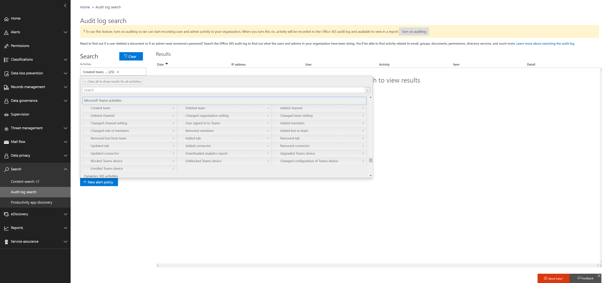

Search the audit log for events in Microsoft Teams
==================================================
> [!IMPORTANT]
> [!INCLUDE [new-teams-sfb-admin-center-notice](includes/new-teams-sfb-admin-center-notice.md)]

The audit log can help you investigate specific activities across Office 365 services. For Teams, here are some of the activities that are audited:

-   Team creation

-   Team deletion

-   Added channel

-   Changed setting

To see the complete list of activities that are audited in Office 365, read [Search the audit log in the Office 365 Security & Compliance Center](https://support.office.com/article/0d4d0f35-390b-4518-800e-0c7ec95e946c).

## Turn on auditing in Teams

Before you can look at audit data, you have to first turn on auditing in the **Security & Compliance Center**(https://protection.office.com). For help turning on auditing, read [Turn Office 365 audit log search on or off](https://support.office.com/article/Turn-Office-365-audit-log-search-on-or-off-e893b19a-660c-41f2-9074-d3631c95a014).

> [!IMPORTANT]
> Audit data is only available from the point at which you turned on Auditing.

## Retrieve Teams data from the audit log

1.  To retrieve audit logs, go to the [Security & Compliance Center](https://go.microsoft.com/fwlink/?linkid=855775). Under **Search & Investigation**, select **Audit log search**.

2.  Use **Search** to filter by the activities, dates, and users you want to audit.

3.  Export your results to Excel for further analysis.

> [!IMPORTANT]
> Audit data is only visible in the Audit Log if auditing is turned on.

## Video: TechTip: Using Audit Log Search in Teams

Join Ansuman Acharya, a program manager for Teams, as he demonstrates conducting an Audit Log search for Teams in the Office 365 Security & Compliance Center. 

> [!VIDEO https://www.youtube.com/embed/UBxaRySAxyE]

