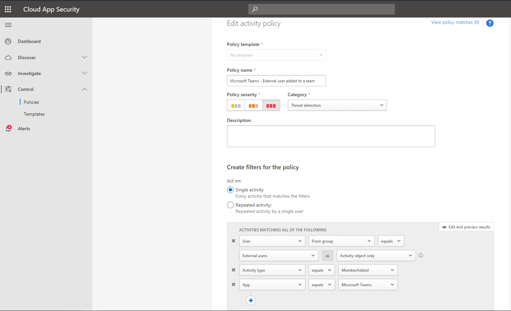
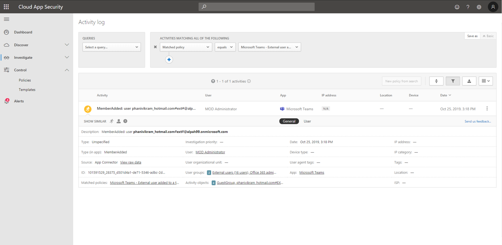
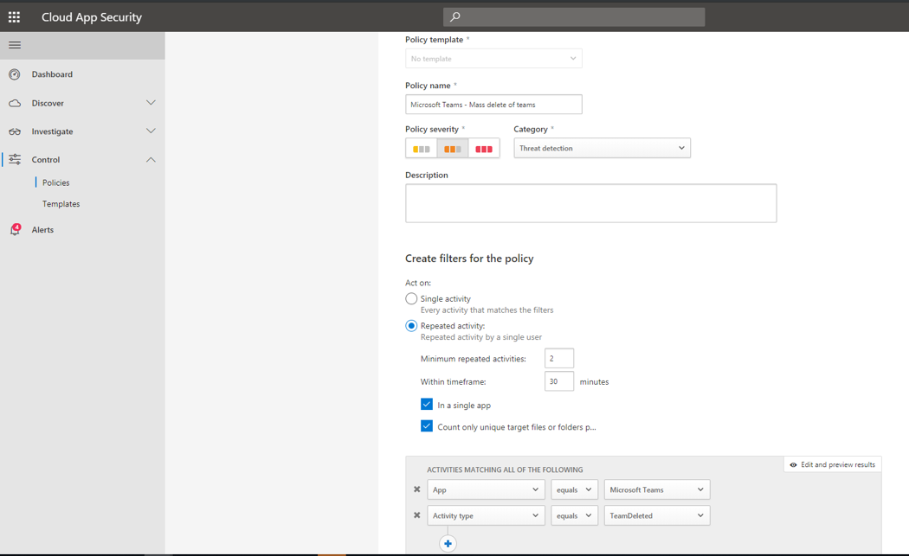
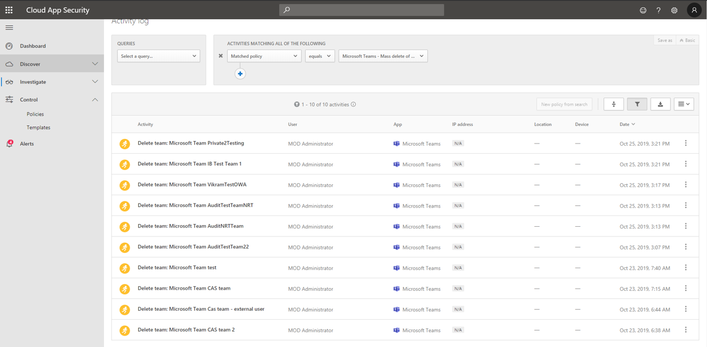

# Search the audit log for events in Microsoft Teams

> [!IMPORTANT]
> [!INCLUDE [new-teams-sfb-admin-center-notice](includes/new-teams-sfb-admin-center-notice.md)]

The audit log can help you investigate specific activities across Office 365 services. For Teams, here are some of the activities that are audited:

- Team creation

- Team deletion

- Added channel

- Changed setting

> [!NOTE]
> Audit events from private channels are also logged as they are for teams and standard channels.

To see the complete list of activities that are audited in Microsoft 365, read [Search the audit log in the Microsoft 365 Compliance Center](https://support.office.com/article/0d4d0f35-390b-4518-800e-0c7ec95e946c).

## Turn on auditing in Teams

Before you can look at audit data, you have to first turn on auditing in the [Security & Compliance Center](https://protection.office.com). For help turning on auditing, read [Turn audit log search on or off](https://support.office.com/article/Turn-Office-365-audit-log-search-on-or-off-e893b19a-660c-41f2-9074-d3631c95a014).

> [!IMPORTANT]
> Audit data is only available from the point at which you turned on Auditing.

## Retrieve Teams data from the audit log

1. To retrieve audit logs, go to the [Security & Compliance Center](https://go.microsoft.com/fwlink/?linkid=855775). Under **Search**, select **Audit log search**.
1. Use **Search** to filter by the activities, dates, and users you want to audit.
1. Export your results to Excel for further analysis.

> [!IMPORTANT]
> Audit data is only visible in the Audit Log if auditing is turned on.

## External user scenario

One scenario you might want to keep an eye on, from a business perspective, is the addition of external users to your Teams environment. If external users are enabled, then monitoring their presence is a good idea.

The screenshot of this policy to monitor external user adds allows you to name the policy, set the severity according to your business needs, set it as (in this case) a single activity, and then establish the parameters that will specifically monitor only the addition of non-internal users, and limit this activity to Microsoft Teams.

Then results from this policy will be able to be viewed in the activity log:

Here you can review matches to the policy you've set, and make any adjustments as needed, or export the results to use elsewhere.

## Mass delete scenario

As mentioned above, you can monitor deletion scenarios. It's possible to create a policy that would monitor mass deletion of Teams sites:

As the screenshot shows, you can set many different parameters for this policy to monitor Teams deletions, including severity, single or repeated action, and parameters limiting this to Teams and site deletion. This can be done independently of a template, or you may have a template created to base this policy off, depending on your organizational needs.

Once you've established a policy that will work for your business, you can then review the results in the activity log as events are triggered:

You can filter down to the policy you've set to see the results of that policy. If the results you're getting in the activity log are not satisfactory (maybe you're seeing a lot of results, or nothing at all), this may help you to fine-tune the query to make it more relevant to what you need it to do.

## Video: TechTip: Using Audit Log Search in Teams

Join Ansuman Acharya, a program manager for Teams, as he demonstrates conducting an Audit Log search for Teams in the Office 365 Security & Compliance Center.

> [!VIDEO https://www.youtube.com/embed/UBxaRySAxyE]
