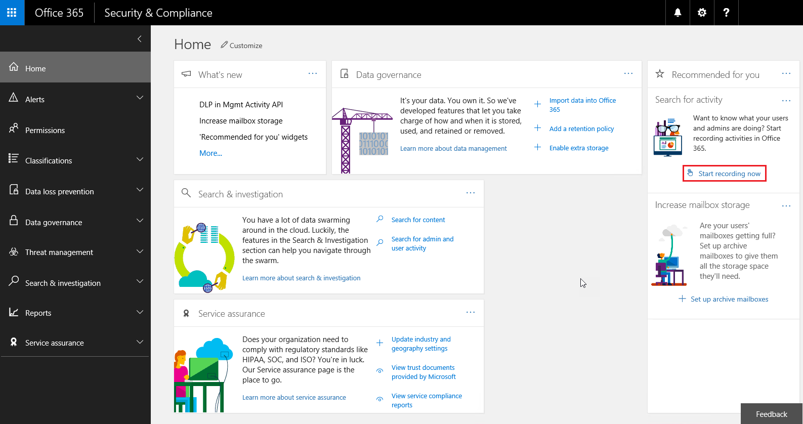

Search the audit log for events in Microsoft Teams
==================================================

The Audit Log provides ad-hoc search capabilities into notable events across Office 365 services. For Microsoft Teams specifically, below are a few examples of events captured:

-   Team Creation

-   Team Deletion

-   Added Channel

-   Changed Setting

The complete event list across Office 365 is quite extensive and can be found [here](https://support.office.com/en-us/article/Search-the-audit-log-in-the-Office-365-Security-Compliance-Center-0d4d0f35-390b-4518-800e-0c7ec95e946c?ui=en-US&rs=en-US&ad=US#ID0EABAAA=Audited_activities).

Before you can dig into audit insights, auditing must first be enabled. To enable Auditing, navigate to the *Security & Compliance* Admin Center. Under *Search for activity*, click on **Start recording now**. After 24hrs, audit data will be available via *Audit Log Search* located under the *Search & Investigation* tab.

| |  |
|---------|---------|
|  Important     |Audit data is only available from the point at which Auditing was enabled.         |

Now, let’s look at how to retrieve Microsoft Teams data from the Audit Log:

1.  To retrieve Audit Log information, navigate to the [Security & Compliance Admin Center](https://go.microsoft.com/fwlink/?linkid=855775). Under *Search & Investigation*, select **Audit log search.**

    a.  Microsoft Teams has defined audit activities that can be selected as shown below.

2.  After selecting the activities of interest, supply a date range and users to retrieve Microsoft Teams information from. Click **Search** to retrieve the results.

3.  This information can be exported to Excel and filtered as needed.

|  | |
|---------|---------|
|  Important |If auditing has not been enabled previously, that needs to be enabled before data will appear in the Audit Log.         |
