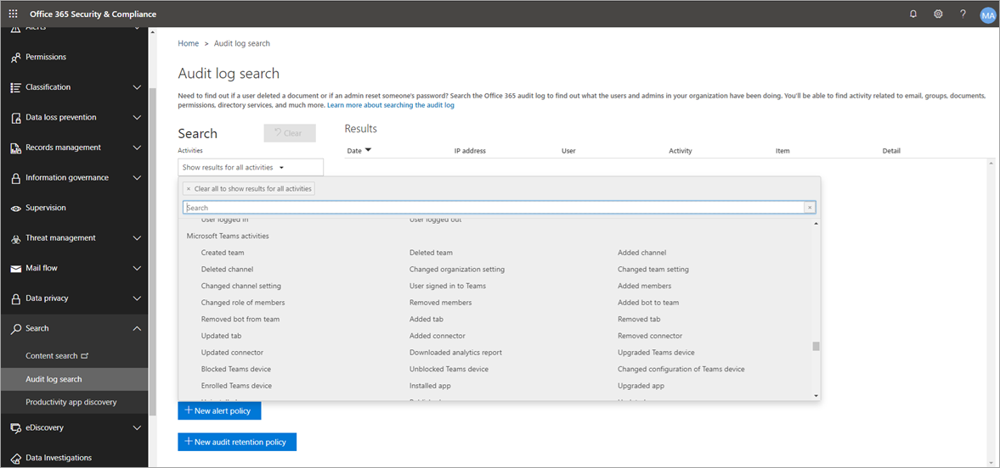

# Search the audit log for events in Microsoft Teams

> [!IMPORTANT]
> [!INCLUDE [new-teams-sfb-admin-center-notice](includes/new-teams-sfb-admin-center-notice.md)]

The audit log can help you investigate specific activities across Microsoft 365 services. For Teams, here are some of the activities that are audited:

- Team creation

- Team deletion

- Added channel

- Changed setting

> [!NOTE]
> Audit events from private channels are also logged as they are for teams and standard channels.

To see the complete list of activities that are audited in Microsoft 365, read [Search the audit log in the Microsoft 365 Compliance Center](https://support.office.com/article/0d4d0f35-390b-4518-800e-0c7ec95e946c).

## Turn on auditing in Teams

Before you can look at audit data, you have to first turn on auditing in the [Security & Compliance Center](https://protection.office.com). For help turning on auditing, read [Turn audit log search on or off](https://support.office.com/article/Turn-Office-365-audit-log-search-on-or-off-e893b19a-660c-41f2-9074-d3631c95a014).

> [!IMPORTANT]
> Audit data is only available from the point at which you turned on Auditing.

## Retrieve Teams data from the audit log

1. To retrieve audit logs, go to the [Security & Compliance Center](https://go.microsoft.com/fwlink/?linkid=855775). Under **Search**, select **Audit log search**.
1. Use **Search** to filter by the activities, dates, and users you want to audit.
1. Export your results to Excel for further analysis.

> [!IMPORTANT]
> Audit data is only visible in the Audit Log if auditing is turned on.

## External user scenario

One scenario you might want to keep an eye on, from a business perspective, is the addition of external users to your Teams environment. If external users are enabled, then monitoring their presence is a good idea.  You can use [Microsoft Cloud App Security](https://docs.microsoft.com/cloud-app-security/what-is-cloud-app-security) to identify potential threats.

The screenshot of this policy to monitor external user adds allows you to name the policy, set the severity according to your business needs, set it as (in this case) a single activity, and then establish the parameters that will specifically monitor only the addition of non-internal users, and limit this activity to Microsoft Teams.

Then results from this policy will be able to be viewed in the activity log:

Here you can review matches to the policy you've set, and make any adjustments as needed, or export the results to use elsewhere.

## Mass delete scenario

As mentioned above, you can monitor deletion scenarios. It's possible to create a policy that would monitor mass deletion of Teams sites:

As the screenshot shows, you can set many different parameters for this policy to monitor Teams deletions, including severity, single or repeated action, and parameters limiting this to Teams and site deletion. This can be done independently of a template, or you may have a template created to base this policy off, depending on your organizational needs.

Once you've established a policy that will work for your business, you can then review the results in the activity log as events are triggered:

You can filter down to the policy you've set to see the results of that policy. If the results you're getting in the activity log are not satisfactory (maybe you're seeing a lot of results, or nothing at all), this may help you to fine-tune the query to make it more relevant to what you need it to do.

## Tips for searching the audit log

Here are tips for searching for [Teams activities](#audited-activities-for-teams) when you search the audit log.

- **You can select specific activities** to search for by clicking the activity name. Or you can search for all activities in a group (such as **File and folder activities**) by clicking the group name. If an activity is selected, you can click it to cancel the selection. You can also use the search box to display the activities that contain the keyword that you type.
- To display events for activities run using cmdlets, select **Show results for all activities** in the **Activities** list. If you know the name of the operation for these activities, search for all activities, and then filter the results by typing the name of the operation in the box in the **Activity** column. To learn more, see [Step 3: Filter the search results](https://docs.microsoft.com/microsoft-365/compliance/search-the-audit-log-in-security-and-compliance?view=o365-worldwide#step-3-filter-the-search-results).
- To clear the current search criteria, click **Clear**. The date range returns to the default of the last seven days. You can also click **Clear all to show results for all activities** to cancel all selected activities.
- If 5,000 results are found, you can probably assume that there are more than 5,000 events that met the search criteria. You can refine the search criteria and rerun the search to return fewer results, or you can export all the search results by selecting **Export results** > **Download all results**.

### Video: TechTip: Using audit log search in Teams

Join Ansuman Acharya, a program manager for Teams, as he demonstrates how to conduct an audit log search for Teams. 

> [!VIDEO https://www.youtube.com/embed/UBxaRySAxyE]

## Audited activities for Teams

Here's a list of all events that are logged for user and admin activities in Teams in the Microsoft 365 audit log. 

|Friendly name  |Operation|Description |
|---------|---------|---------|
|Added bot to team   |BotAddedToTeam        |A user adds a bot to a team.        |
|Added channel   |ChannelAdded         |A user adds a channel to a team.         |
|Added connector  |ConnectorAdded          |A user adds a connector to a channel.        |
|Added members    |MemberAdded         |A team owner adds members to a team, channel, or group chat.         |
|Added tab    |TabAdded         |A user adds a tab to a channel.        |
|Changed channel setting    |ChannelSettingChanged         |The ChannelSettingChanged operation is logged when the following activities are performed by a team member. For each of these activities, a description of the setting that was changed (shown in parentheses is displayed in the **Item** column in the audit log search results. <ul><li>Changes name of a team channel (**Channel name**)</li><li>Changes description of a team channel (**Channel description**)</li> </ul>      |
|Changed organization setting   |TeamsTenantSettingChanged         |The TeamsTenantSettingChanged operation is logged when the following activities are performed by a global admin in the Microsoft 365 admin center. These activities affect org-wide Teams settings. For more information, see [Manage Teams settings for your organization](enable-features-office-365.md). For each of these activities, a description of the setting that was changed (shown in parentheses) is displayed in the **Item** column in the the audit log search results.<ul><li>Enables or disables Teams for the organization (**Microsoft Teams**).</li><li>Enables or disables interoperability between Microsoft Teams and Skype for Business for the organization (**Skype for Business interoperability**).</li><li>Enables or disables the organizational chart view in Microsoft Teams clients (**Org chart view**).</li><li>Enables or disables the ability for team members to schedule private meetings (**Private meeting scheduling**).</li><li>Enables or disables the ability for team members to schedule channel meetings (**Channel meeting scheduling**).</li><li>Enables or disables video calling in Teams meetings (**Video for Skype meetings**).</li><li>Enables or disables screen sharing in Microsoft Teams meetups for the organization (**Screen sharing for Skype meetings**).</li><li>Enables or disables that ability to add animated images (called Giphys) to Teams conversations (**Animated images**).</li><li>Changes the content rating setting for the organization (**Content rating**). The content rating restricts the type of animated image that can be displayed in conversations.</li><li>Enables or disables the ability for team members to add customizable images (called custom memes) from the internet to team conversations (**Customizable images from the Internet**).</li><li>Enables or disables the ability for team members to add editable images (called stickers) to team conversations (**Editable images**).</li><li>Enables or disables that ability for team members to use bots in Microsoft Teams chats and channels (**Org-wide bots)**.</li><li>Enables specific bots for Microsoft Teams. This doesn't include the T-Bot, which is Teams help bot that's available when bots are enabled for the organization (**Individual bots**).</li><li>Enables or disables the ability for team members to add extensions or tabs (**Extensions or tabs**).</li><li>Enables or disables the side-loading of proprietary bots for Microsoft Teams (**Side loading of Bots**).</li><li>Enables or disables the ability for users to send email messages to a Microsoft Teams channel (**Channel email**).</li></ul>|
|Changed role of members in team    |MemberRoleChanged         |A team owner changes the role of members in a team. The following values indicate the role type assigned to the user. <ul><li>**1**: Indicates the Owner role.</li><li>**2**: Indicates the Member role.</li><li>**3**: Indicates the Guest role.</li> </ul>The Members property also includes the name of your organization and the member's email address.        |
|Changed team setting    |TeamSettingChanged        |The TeamSettingChanged operation is logged when the following activities are performed by a team owner. For each of these activities, a description of the setting that was changed (shown in parentheses) is displayed in the **Item** column in the audit log search results.<ul><li>Changes the access type for a team. Teams can be set as private or public (**Team access type**). When a team is private (the default setting), users can access the team only by invitation. When a team is public, it's discoverable by anyone.</li><li>Changes the information classification of a team (**Team classification**).
For example, team data can be classified as high business impact, medium business impact, or low business impact.</li><li>Changes the name of a team (**Team name**).</li><li>Changes the team description (**Team description**).</li><li>Changes made to team settings. To access these settings,  a team owner can right-click a team, select **Manage team**, and then click the **Settings** tab. For these activities, the name of the setting that was changed is displayed in the **Item** column in the audit log search results.</li></ul>         |
|Created team    |TeamCreated         |A user creates a team.         |
|Deleted channel     |ChannelDeleted         |A user deletes a channel from a team.         |
|Deleted team  |         |TeamDeleted         |A team owner deletes a team.
|Removed bot from team   |BotRemovedFromTeam         |A user removes a bot from a team.       |
|Removed connector     |ConnectorRemoved         |A user removes a connector from a channel.         |
|Removed members    |MemberRemoved        |A team owner removes members from a team, channel, or group chat.         |
|Removed tab    |TabRemoved         |A user removes a tab from a channel.         |
|Updated connector    |ConnectorUpdated         |A user modified a connector in a channel.         |
|Updated tab   |TabUpdated         |A user modified a tab in a channel.         |
|User signed in to Teams     |TeamsSessionStarted         |A user signs in to a Microsoft Teams client. This event doesn't capture token refresh activities.         |