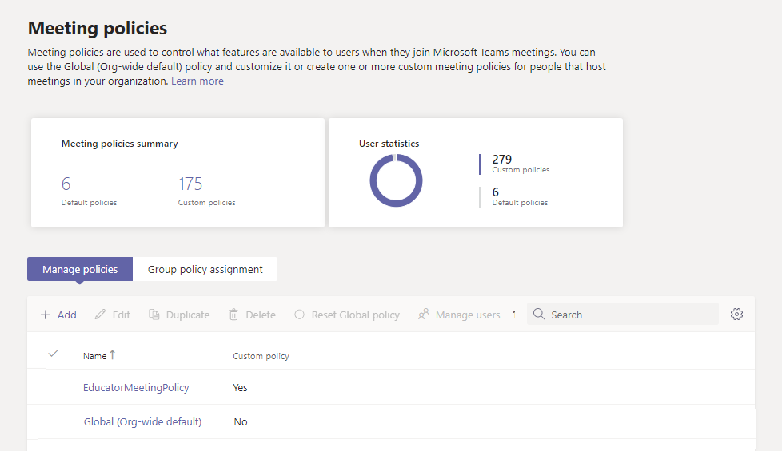
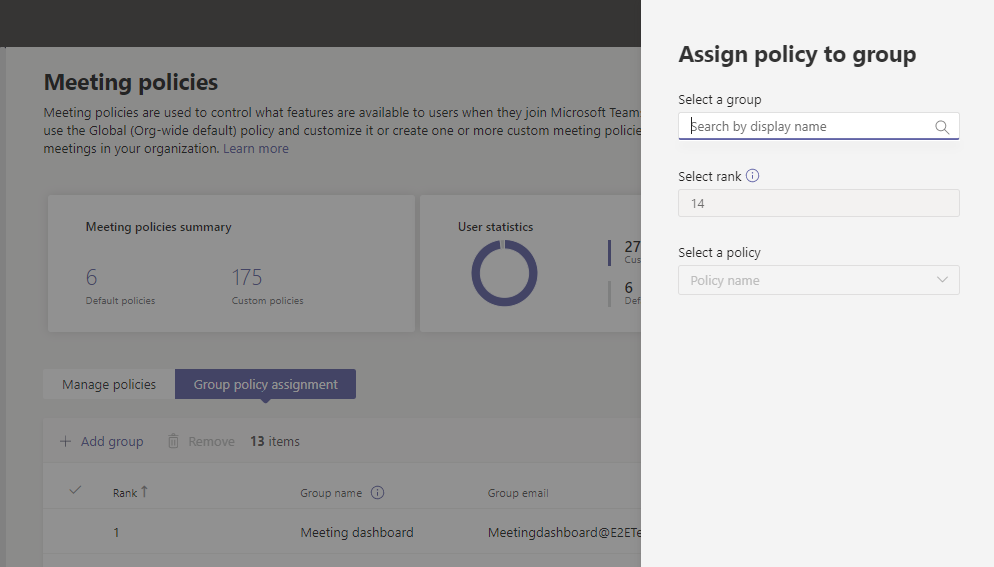

# Assign policies to large sets of users in your school

[!INCLUDE [policy-wizard-edu](includes/policy-wizard-edu.md)]

> [!NOTE]
> For the larger story on assigning policies in Microsoft Teams, see [Assign policies to your users in Teams](policy-assignment-overview.md).

## Overview

Do you need to give your students and educators access to different features in Microsoft Teams? You can quickly identify the users in your organization by license type and then assign them the appropriate policy. This tutorial shows you how to assign a meeting policy to large sets of users in your school. You can assign policies using the Microsoft Teams admin center and PowerShell and we'll show you both ways.

You can assign a meeting policy to a security group that the users are members of or directly to users at scale through a batch policy assignment. You'll learn how to:

- **Use [policy assignment to groups](#assign-a-policy-to-a-group) to assign a meeting policy to a security group (recommended)**. This method lets you assign a policy based on group membership. You can assign a policy to a security group or distribution list. As members are added to or removed from the group, their inherited policy assignments are updated accordingly. We recommend you use this method because it reduces the time to manage policies for new users or when users' roles change. This method works best for groups of up to 50,000 users but will also work with larger groups.

- **Use [batch policy assignment](assign-policies-users-and-groups.md#assign-a-policy-to-a-batch-of-users) to assign a meeting policy directly to users in bulk**. You can assign a policy for up to 5,000 users at a time. If you have more than 5,000 users, you can submit multiple batches. With this method, when you have new users, you'll need to re-run the batch assignment to assign the policy to those new users.

Remember that in Teams, users automatically get the Global (Org-wide default) policy for a Teams policy type unless you create and assign a custom policy. Because the student population is often the largest set of users and they often receive the most restrictive settings, we recommend that you do the following:

- Create a custom policy that allows core capabilities such as private chat and meeting scheduling and assign the policy to your staff and educators.
- Assign the custom policy to your staff and educators.
- Edit and apply the Global (Org-wide default) policy to restrict capabilities for students.

Keep in mind that the Global policy will apply to all users in your school until you create a custom policy and assign it to your staff and educators.

In this tutorial, students will get the Global meeting policy and we'll assign a custom meeting policy named EducatorMeetingPolicy to staff and educators. We assume that you've edited the Global policy to tailor meeting settings for students and [created a custom policy](policy-packages-edu.md) that defines the meeting experience for staff and educators.



## Assign a policy to a group

Follow these steps to create a security group for your staff and educators, and then assign a custom meeting policy named EducatorMeetingPolicy to that security group.

### Before you get started

> [!IMPORTANT]
> When you assign a policy to a group, the policy assignment is propagated to members of the group according to precedence rules. For example, if a user is directly assigned a policy (either individually or through a batch assignment), that policy takes precedence over a policy that's inherited from a group. This also means that if a user has a meeting policy that was directly assigned to them, you'll have to remove that meeting policy from the user before they can inherit a meeting policy from a security group.

Before you get started, it's important to understand [precedence rules](policy-assignment-overview.md#which-policy-takes-precedence) and [group assignment ranking](assign-policies-users-and-groups.md#group-assignment-ranking). **Make sure that you read and understand the concepts in [What you need to know about policy assignment to groups](assign-policies-users-and-groups.md#what-you-need-to-know-about-policy-assignment-to-groups)**.

You'll need to complete all these steps for your staff and educators to inherit a meeting policy from a security group.

1. [Create security groups](#create-security-groups).
2. [Assign a policy to a security group](#assign-a-policy-to-a-security-group).
3. [Remove a policy that was directly assigned to users](#remove-a-policy-that-was-directly-assigned-to-users).

### Create security groups

First, create a security group for your staff and educators.

With [School Data Sync](/SchoolDataSync/) (SDS), you can [easily create security groups educators and students](/SchoolDataSync/edu-security-groups) in your school. We recommend that you use SDS to create the security groups you need to manage policies for your school.

If you're unable to deploy SDS within your environment, use [this PowerShell script](scripts/powershell-script-security-groups-edu.md) to create two security groups, one for all staff and educators who have a Faculty license assigned and another for all students who have a Student license assigned. You'll need to run this script routinely to keep the groups fresh and up to date.

### Assign a policy to a security group

#### Using the Microsoft Teams admin center

> [!NOTE]
> Currently, policy assignment to groups using the Microsoft Teams admin center is only available for Teams calling policy, Teams call park policy, Teams policy, Teams live events policy, Teams meeting policy, and Teams messaging policy. For other policy types, use PowerShell.

1. In the left navigation of the Microsoft Teams admin center, go to **Meetings** > **Meeting policies**.
2. Select the **Group policy assignment** tab.
3. Select **Add group**, and then in the **Assign policy to group** pane, do the following:

    
    1. In the **Select a group** box, search for and add the security group that contains your staff and educators.
    2. In the **Select rank** box, enter **1**.
    3. In the **Select a policy** box, select **EducatorMeetingPolicy**.
    4. Select **Apply**.

To remove a group policy assignment, on the **Group policy assignment** tab of the policy page, select the group assignment, and then select **Remove**.

To change the ranking of a group assignment, you have to first remove the group policy assignment. Then, follow the steps above to assign the policy to a group.

#### Using PowerShell

> [!NOTE]
> Currently, policy assignment to groups using PowerShell isn't available for all Teams policy types. See [New-CsGroupPolicyAssignment](/powershell/module/teams/new-csgrouppolicyassignment) for the list of supported policy types.

##### Install and connect to the Microsoft Teams PowerShell module

Run the following to install the [Teams PowerShell module](https://www.powershellgallery.com/packages/MicrosoftTeams) (if it's not already installed). Make sure you install version 1.0.5 or later.

```powershell
Install-Module -Name MicrosoftTeams
```

Run the following to connect to Teams and start a session.

```powershell
Connect-MicrosoftTeams
```

When you're prompted, sign in using your admin credentials.

##### Assign a policy to a group

Run the following to assign the meeting policy named EducatorMeetingPolicy to the security group that contains your staff and educators and set the assignment ranking to 1. You can specify a security group by using the object Id, Session Initiation Protocol (SIP) address, or email address. In this example, we use an email address (staff-faculty@contoso.com).

```powershell
New-CsGroupPolicyAssignment -GroupId staff-faculty@contoso.com -PolicyType TeamsMeetingPolicy -PolicyName "EducatorMeetingPolicy" -Rank 1
```

### Remove a policy that was directly assigned to users

Remember that if a user was directly assigned a policy (either individually or through a batch assignment), that policy takes precedence. This means that if a user has a meeting policy that was directly assigned to them, you'll have to remove that meeting policy from the user before they can inherit a meeting policy from a security group.

To learn more, see [What you need to know about policy assignment to groups](assign-policies-users-and-groups.md#what-you-need-to-know-about-policy-assignment-to-groups).

Follow these steps to remove the meeting policy that was directly assigned to your staff and educators.

#### Install and connect to the Microsoft Teams PowerShell module

Run the following to install the [Teams PowerShell module](https://www.powershellgallery.com/packages/MicrosoftTeams) (if it's not already installed). Make sure you install version 1.0.5 or later.

```powershell
Install-Module -Name MicrosoftTeams
```

Run the following to connect to Teams and start a session.

```powershell
Connect-MicrosoftTeams
```

When you're prompted, sign in using the same admin credentials you used to connect to Azure AD.

#### Unassign a policy that was directly assigned to users

Run the following to remove a meeting policy from users who were directly assigned that policy. You can specify users by email address or object ID.

In this example, the meeting policy is removed from users specified by their email address.

```powershell
$users_ids = @("reda@contoso.com", "nikica@contoso.com", "jamie@contoso.com")
New-CsBatchPolicyAssignmentOperation -PolicyType TeamsMeetingPolicy -PolicyName $null -Identity $users_ids -OperationName "Unassign meeting policy"
```

In this example, the meeting policy is removed from the list of users in a text file named user_ids.txt.

```powershell
$user_ids = Get-Content .\users_ids.txt
New-CsBatchPolicyAssignmentOperation -PolicyType TeamsMeetingPolicy -PolicyName $null -Identity $users_ids -OperationName "Unassign meeting policy"
```

##### Get policy assignments for a group

Run the following to see all the policies assigned to a specific security group. Note that groups are always listed by their group ID even if its SIP address or email address was used to assign the policy.

```powershell
Get-CsGroupPolicyAssignment -GroupId staff-faculty@contoso.com

```

##### Get the policies assigned to a user

Run the following to see all the policies that are assigned to a specific user. The following example shows you how to get the policies that are assigned to reda@contoso.com.

```powershell
Get-CsUserPolicyAssignment -Identity reda@contoso.com
```

## Assign a policy to a batch of users

Follow these steps to assign a custom meeting policy named EducatorMeetingPolicy directly to your staff and educators in bulk.

### Using PowerShell

#### Connect to the Azure AD PowerShell for Graph module and the Teams PowerShell module

Before you perform the steps in this article, you'll need to install and connect to the Azure AD PowerShell for Graph module (to identify users by their assigned licenses) and the Microsoft Teams PowerShell module (to assign the policies to those users).

##### Install and connect to the Azure AD PowerShell for Graph module

Open an elevated Windows PowerShell command prompt (run Windows PowerShell as an administrator), and then run the following to install the Azure Active Directory PowerShell for Graph module.

```powershell
Install-Module -Name AzureAD
```

Run the following to connect to Azure AD.

```powershell
Connect-AzureAD
```

When you're prompted, sign in using your admin credentials.

To learn more, see [Connect with the Azure Active Directory PowerShell for Graph module](/office365/enterprise/powershell/connect-to-office-365-powershell#connect-with-the-azure-active-directory-powershell-for-graph-module).

##### Install and connect to the Microsoft Teams PowerShell module

Run the following to install the [Teams PowerShell module](https://www.powershellgallery.com/packages/MicrosoftTeams) (if it's not already installed). Make sure you install version 1.0.5 or later.

```powershell
Install-Module -Name MicrosoftTeams
```

Run the following to connect to Teams and start a session.

```powershell
Connect-MicrosoftTeams
```

When you're prompted, sign in using the same admin credentials you used to connect to Azure AD.

#### Identify your users

First, run the following to identify your staff and educators by license type. This tells you what SKUs are in use in your organization. You can then identify staff and educators that have a Faculty SKU assigned.

```powershell
Get-AzureAdSubscribedSku | Select-Object -Property SkuPartNumber,SkuId
```

Which returns:

```
SkuPartNumber      SkuId
-------------      -----
M365EDU_A5_FACULTY e97c048c-37a4-45fb-ab50-922fbf07a370
M365EDU_A5_STUDENT 46c119d4-0379-4a9d-85e4-97c66d3f909e
```

In this example, the output shows that the Faculty license SkuId is "e97c048c-37a4-45fb-ab50-922fbf07a370".

> [!NOTE]
> To see a list of Education SKUs and SKU IDs, see [Education SKU reference](sku-reference-edu.md).

Next, we run the following to identify the users that have this license and collect them all together.

```powershell
$faculty = Get-AzureADUser -All $true | Where-Object {($_.assignedLicenses).SkuId -contains "e97c048c-37a4-45fb-ab50-922fbf07a370"}
```

#### Assign a policy in bulk

Now, we assign the appropriate policies to users in bulk. The maximum number of users for which you can assign or update policies is 5,000 at a time. For example, if you have more than 5,000 staff and educators, you'll need to submit multiple batches.

Run the following to assign a custom meeting policy named EducatorMeetingPolicy to your staff and educators.

```powershell
New-CsBatchPolicyAssignmentOperation -PolicyType TeamsMeetingPolicy -PolicyName EducatorMeetingPolicy -Identity $faculty.ObjectId
```

> [!NOTE]
> To assign a different policy type in bulk, like TeamsMessagingPolicy, you'll need to change ```PolicyType``` to the policy that you're assigning and ```PolicyName``` to the policy name.

#### Get the status of a bulk assignment

Each bulk assignment returns an operation ID, which you can use to track the progress of the policy assignments or identify any failures that might occur. For example, run the following:

```powershell
Get-CsBatchPolicyAssignmentOperation -OperationId 3964004e-caa8-4eb4-b0d2-7dd2c8173c8c | fl
```

To view the assignment status of each user in the batch operation, run the following. Details of each user are in the ```UserState``` property.

```powershell
Get-CsBatchPolicyAssignmentOperation -OperationId 3964004e-caa8-4eb4-b0d2-7dd2c8173c8c | Select -ExpandProperty UserState
```

#### Assign a policy in bulk if you have more than 5,000 users

First, run the following to see how many staff and educators you have:

```powershell
$faculty.count
```

Instead of providing the whole list of user IDs, run the following to specify the first 5,000, and then the next 5,000, and so on.

```powershell
New-CsBatchPolicyAssignmentOperation -PolicyType TeamsMeetingPolicy -PolicyName EducatorMeetingPolicy -Identity $faculty[0..19999].ObjectId
```

You can change the range of user IDs until you reach the full list of users. For example, enter ```$faculty[0..4999``` for the first batch, use ```$faculty[5000..9999``` for the second batch, enter ```$faculty[10000..14999``` for the third batch, and so on.

#### Get the policies assigned to a user

Run the following to see all the policies that are assigned to a specific user. The following example shows you how to get the policies that are assigned to hannah@contoso.com.

```powershell
Get-CsUserPolicyAssignment -Identity hannah@contoso.com
```

## FAQ

**I'm not familiar with PowerShell for Teams. Where can I learn more?**

For an overview of using PowerShell to manage Teams, see [Teams PowerShell overview](teams-powershell-overview.md). For more information about the cmdlets used in this article, see:

- [New-CsGroupPolicyAssignment](/powershell/module/teams/new-csgrouppolicyassignment)
- [Get-CsGroupPolicyAssignment](/powershell/module/teams/get-csgrouppolicyassignment)
- [New-CsBatchPolicyAssignmentOperation](/powershell/module/teams/new-csbatchpolicyassignmentoperation)
- [Get-CsBatchPolicyAssignmentOperation](/powershell/module/teams/get-csbatchpolicyassignmentoperation)
- [Get-CsUserPolicyAssignment](/powershell/module/teams/get-csuserpolicyassignment)

## Related topics

- [Assign policies to your users](policy-assignment-overview.md)
- [Teams policies and policy packages for Education](policy-packages-edu.md)
- [Manage meeting policies in Teams](meeting-policies-overview.md)