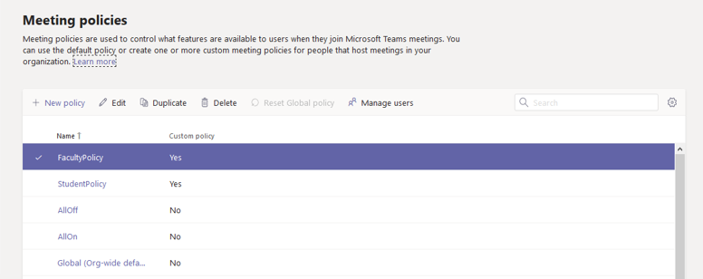

# Assign policies to large sets of users in your school

Do you need to give your students and educators access to different features in Microsoft Teams? You can quickly identify the users in your organization by license type and then assign them the appropriate policy. This tutorial shows you how to use [batch policy assignment](assign-policies.md#assign-a-policy-to-a-batch-of-users) to assign a meeting policy to users in bulk.

Remember that in Teams, users automatically get the Global (Org-wide default) policy for a Teams policy type unless you create and assign a custom policy. Because the student population is often the largest set of users and they often receive the most restrictive settings, we recommend that you do the following:

- Edit and apply the Global (Org-wide default) policy to restrict capabilities for students. 
- Create a custom policy that allows core capabilities such as private chat and meeting scheduling and assign the policy to your staff and educators.

Keep in mind that the Global policy will apply to all users in your school until you create a custom policy and assign it to your staff and educators.

In this tutorial, students will get the Global meeting policy and we use PowerShell to assign a custom meeting policy named EducatorMeetingPolicy to staff and educators in bulk. We assume that you've edited the Global policy to tailor meeting settings for students and created a custom policy that defines the meeting experience for staff and educators.



Follow these steps to assign a custom meeting policy to staff and educators in bulk.

## Connect to the Azure AD PowerShell for Graph module and the Teams PowerShell module

Before you perform the steps in this article, you'll need to install and connect to the Azure AD PowerShell for Graph module (to identify users by their assigned licenses) and the Microsoft Teams PowerShell module (to assign the policies to those users).

### Install and connect to the Azure AD PowerShell for Graph module

Open an elevated Windows PowerShell command prompt (run Windows PowerShell as an administrator), and then run the following to install the Azure Active Directory PowerShell for Graph module.

```powershell
Install-Module -Name AzureAD
```

Run the following to connect to Azure AD.

```powershell
Connect-AzureAD
```

When you're prompted, sign in using your admin credentials.

To learn more, see [Connect with the Azure Active Directory PowerShell for Graph module](https://docs.microsoft.com/office365/enterprise/powershell/connect-to-office-365-powershell#connect-with-the-azure-active-directory-powershell-for-graph-module).

### Install and connect to the Microsoft Teams PowerShell module

Run the following to install the [Microsoft Teams PowerShell module](https://www.powershellgallery.com/packages/MicrosoftTeams). Make sure you install version 1.0.5 or later.

```powershell
Install-Module -Name MicrosoftTeams
```

Run the following to connect to Teams and start a session.

```powershell
Connect-MicrosoftTeams
```
When you're prompted, sign in using the same admin credentials you used to connect to Azure AD.

## Identify your users

First, run the following to identify your staff and educators by license type. This tells you what SKUs are in use in your organization. You can then identify staff and educators that have a Faculty SKU assigned.

```powershell
Get-AzureAdSubscribedSku | Select-Object -Property SkuPartNumber,SkuId
```

Which returns:

```
SkuPartNumber      SkuId
-------------      -----
M365EDU_A5_FACULTY e97c048c-37a4-45fb-ab50-922fbf07a370
M365EDU_A5_STUDENT 46c119d4-0379-4a9d-85e4-97c66d3f909e
```

In this example, the output shows that the Faculty license SkuId is "e97c048c-37a4-45fb-ab50-922fbf07a370".

> [!NOTE]
> To see a list of Education SKUs and SKU IDs, see [Education SKU reference](sku-reference-edu.md).

Next, we run the following to identify the users that have this license and collect them all together.

```powershell
$faculty = Get-AzureADUser -All $true | Where-Object {($_.assignedLicenses).SkuId -contains "e97c048c-37a4-45fb-ab50-922fbf07a370"}
```

## Assign a policy in bulk

Now, we assign the appropriate policies to users in bulk. The maximum number of users for which you can assign or update policies is 20,000 at a time. For example, if you have more than 20,000 staff and educators, you'll need to submit multiple batches.

> [!IMPORTANT]
> We're currently recommending that you assign policies in batches of 5,000 users at a time. During these times of increased demand, you may experience delays in processing times. To minimize the impact of these increased processing times, we suggest that you submit smaller batch sizes of up to 5,000 users, and submit each batch only after the previous one is completed. Submitting batches outside your regular business hours can also help.

Run the following to assign the meeting policy named EducatorMeetingPolicy to your staff and educators.

```powershell
New-CsBatchPolicyAssignmentOperation -PolicyType TeamsMeetingPolicy -PolicyName EducatorMeetingPolicy -Identity $faculty.ObjectId
```

> [!NOTE]
> To assign a different policy type in bulk, like TeamsMessagingPolicy, you'll need to change ```PolicyType``` to the policy that you're assigning and ```PolicyName``` to the policy name.

## Get the status of a bulk assignment

Each bulk assignment returns an operation ID, which you can use to track the progress of the policy assignments or identify any failures that might occur. For example, run the following:

```powershell
Get-CsBatchPolicyAssignmentOperation -OperationId 3964004e-caa8-4eb4-b0d2-7dd2c8173c8c | fl
```

To view the assignment status of each user in the batch operation, run the following. Details of each user are in the ```UserState``` property.

```powershell
Get-CsBatchPolicyAssignmentOperation -OperationId 3964004e-caa8-4eb4-b0d2-7dd2c8173c8c | Select -ExpandProperty UserState
```

## Assign a policy in bulk if you have more than 20,000 users

First, run the following to see how many staff and educators you have:

```powershell
$faculty.count
```

Instead of providing the whole list of user IDs, run the following to specify the first 20,000, and then the next 20,000, and so on.

```powershell
New-CsBatchPolicyAssignmentOperation -PolicyType TeamsMeetingPolicy -PolicyName EducatorMeetingPolicy -Identity $faculty[0..19999].ObjectId
```

You can change the range of user IDs until you reach the full list of users. For example, enter ```$faculty[0..19999``` for the first batch, use ```$faculty[20000..39999``` for the second batch, enter ```$faculty[40000..59999``` for the third batch, and so on.

## Get the policies assigned to a user

Run the following to see all the policies that are assigned to a specific user. The following example shows you how to get the policies that are assigned to hannah@contoso.com.

```powershell
Get-CsUserPolicyAssignment -Identity hannah@contoso.com
```

## FAQ

**I want to make sure that all users that are students, staff, and educators automatically get policies assigned. How can I do that?**

The Teams product team is doing work to support assigning policies to security groups. At that time, you'll be able to create groups for your students and teachers, and then the appropriate policies to those groups. Note that explicit user assignments (such as the policies that you've assigned using this tutorial) will override policies inherited from a group. When this feature is supported, we'll provide more instructions on how to use policy assignment to groups and update your users to ensure they get the inherited group policies.

**I'm not familiar with PowerShell for Teams. Where can I learn more?**

See [Teams Powershell overview](teams-powershell-overview.md).

## Related topics

- [Assign policies to your users](assign-policies.md)
- [New-CsBatchPolicyAssignmentOperation](https://docs.microsoft.com/powershell/module/teams/new-csbatchpolicyassignmentoperation)
- [Get-CsBatchPolicyAssignmentOperation](https://docs.microsoft.com/powershell/module/teams/get-csbatchpolicyassignmentoperation)
- [Get-CsUserPolicyAssignment](https://docs.microsoft.com/powershell/module/teams/get-csuserpolicyassignment)
