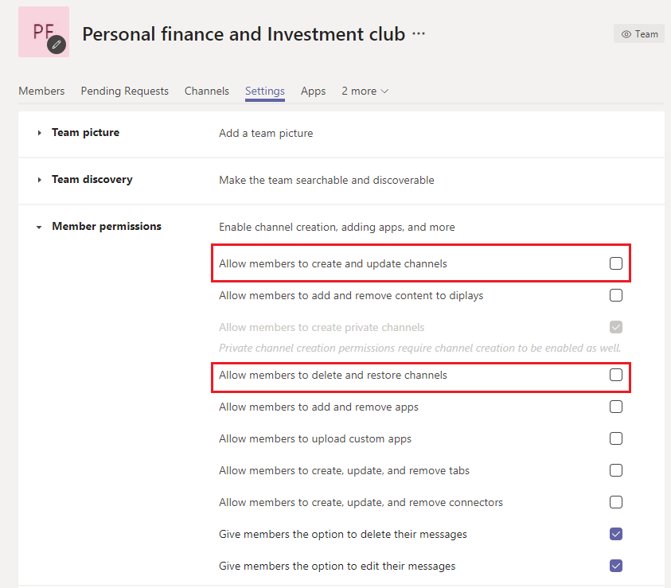
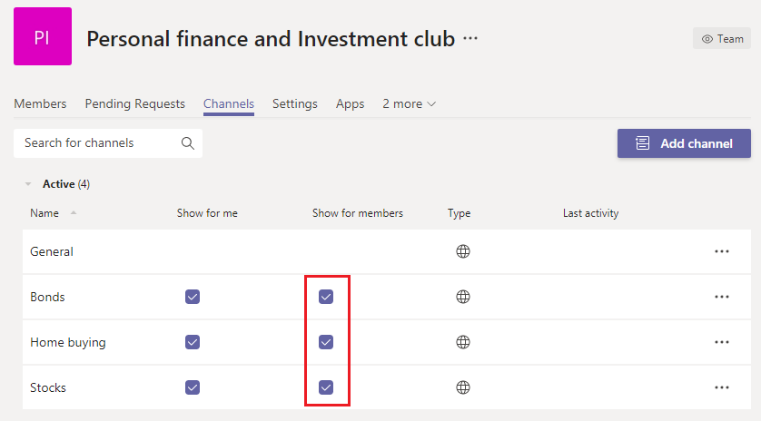
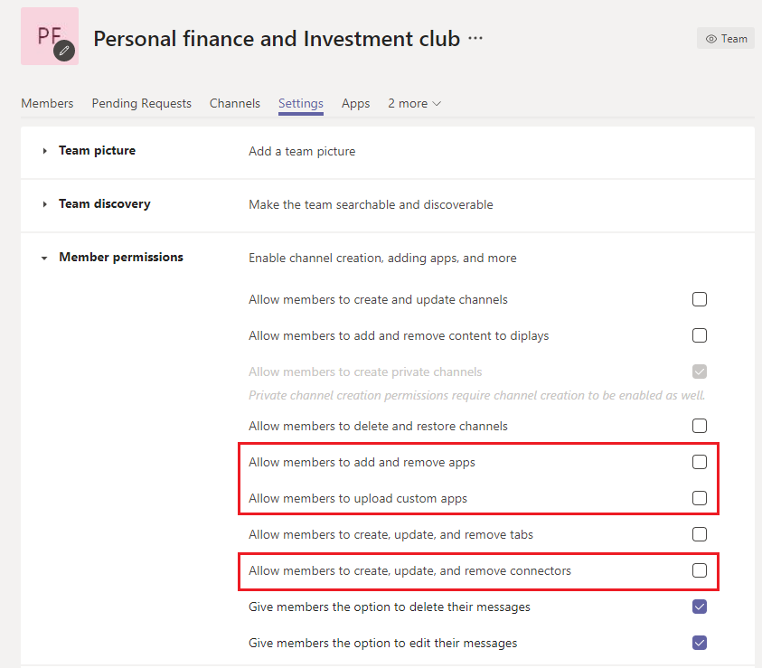
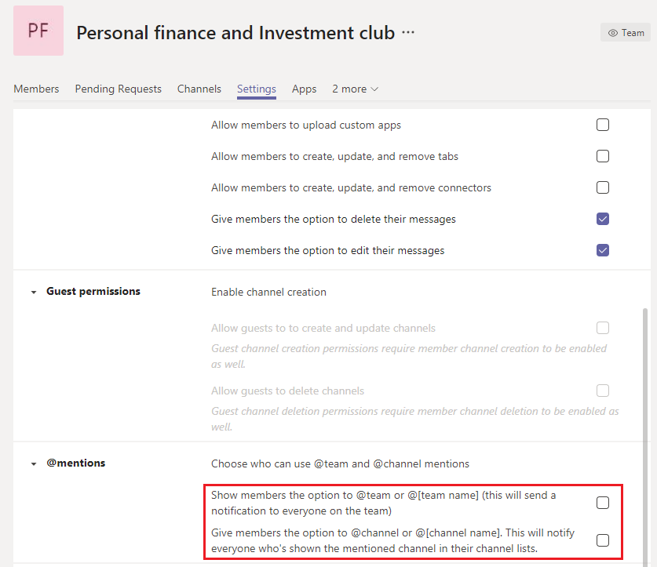

# Manage large teams in Microsoft Teams - Best practices

Microsoft Teams is equally effective at facilitating communications between small groups with dozens of members and large groups with thousands of members. Review [Limits and specifications for Teams](limits-specifications-teams.md) for updates on team sizes. Increase in team size leads to unique management and operational challenges. This article describes best practices for creating and managing large teams comprised of thousands of members.

## Value of large teams

Large teams are very useful in enabling the following collaboration scenarios:

- **Department-wide collaboration**: If your organization has multiple departments such as Finance, Operations, R&D etc., then you can create a single team that includes all members in a specific department. Now all communications relevant to a department can be shared in this team, which facilitates instant reach and engagement from members.

- **Collaboration in employee resource groups**: Organizations often have large groups of people with mutual interests who belong to a different department or work group. As an example, there can be a group of people who share a passion for personal finance and investing. It's often hard to connect in a large organization. To develop communities for such groups, tenant admins can create a large team that serves as a public company-wide resource group that anyone can join and take advantage of. Eventually, these communities collect information that both new and existing members can enjoy.

- **Collaboration between internal and external members**: Popular products often develop a community of early adopters who are eager to try new product releases and provide feedback. Early adopters develop a relationship with product groups to help shape the product. In such scenarios, tenant admins can set up a large team which includes both internal product groups and external product evaluators to facilitate a rich product development process. These teams can also provide customer support to a select set of customers.

## Create teams from existing groups

Use contact groups, security groups, or Office groups to jump start your team. You can import a group to make a team or create a team from an Office group.

**Import a group to make a team**: When you import a group with up to 3,500 members into Teams, Teams automatically calculates the total number of members in the group. This is a one-time import only and future changes in the group will not automatically be updated in Teams.

**Create a team from a large Microsoft 365 group**: When you create a team from a large Microsoft 365 group, members are automatically part of the Microsoft 365 group **and** the team. In the future, as team members join or leave the Microsoft 365 group, they're automatically added or removed from the team.

## Bulk import/export/remove members in a team

The Azure portal allows users to bulk import/export/remove members in a Microsoft 365 Group. For more information, see [To bulk import group members](/azure/active-directory/enterprise-users/groups-bulk-import-members#to-bulk-import-group-members).

Since every team is backed by a Microsoft 365 Group, you can use the Azure portal to perform these operations in the group corresponding to the team. The member operations will be reflected in the team within 24 hours.

## Create channels to focus discussions

You can narrow the group discussions by creating focused channels. See [Best practices for organizing teams](best-practices-organizing.md).

## Restrict channel creation

If any team member is allowed to create channels, that team can have channel sprawl. Team owners should turn off channel create, update, delete, and restore for members in **Settings > Member permissions**. See [Overview of teams and channels](teams-channels-overview.md).

## Add favorite channels

In order to speed up new user engagement and content discovery, you can select favorite channels that are available to the user by default. In the **Channels** pane of the admin center, check the channels under the **Show for members** column.

 See [Create your first teams and channels](get-started-with-teams-create-your-first-teams-and-channels.md) for details.

## Regulate applications and bots in large teams

To prevent addition of distracting applications or bots, team owners can disable, add, remove, and upload apps and connectors for team members. In the admin center under **Settings > Member permissions**, uncheck the three options that allow members to add apps or connectors.

See [Apps, bots, & connectors](deploy-apps-microsoft-teams-landing-page.md).

## Regulate team and channel mentions

Team and channel mentions can be used to draw the attention of the whole team to certain channel posts. Once a mention is used in a post, a notification is sent to thousands of team members. If the notifications are too frequent, then team members can become overloaded and might complain to team owners. To prevent team or channel mentions, turn off team and channel mentions for members by unchecking the boxes in the teams **Settings > @mentions** pane.

## Consider setting up moderation in your channels

Team owners can turn on moderation for a channel to control who can start new posts and reply to posts in that channel. When you set up moderation, you can choose one or more team members to be moderators. Team owners are moderators by default. For more information, see [Set up and manage channel moderation](manage-channel-moderation-in-teams.md).

## Related topics

- [Best practices for organizing Teams](best-practices-organizing.md)
- [Create an org-wide team](create-an-org-wide-team.md)