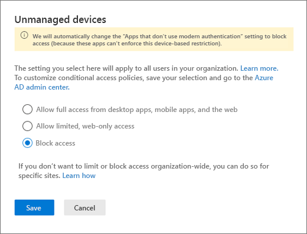

# Block access to SharePoint for specific users

Applying any Conditional Access (CA) policy on SharePoint Online (SPO) is also applied to Teams. However, some organizations want to block access to SharePoint files (upload, download, view, edit, create) yet allow their employees to use Teams desktop, mobile, and web clients on unmanaged devices. Under the CA policy rules, blocking SPO would lead to blocking Teams as well. This article explains how you can work around this limitation and allow your employees to continue using Teams while completely blocking access to files stored in SPO or limiting the access to view-only.

> [!Note]
> If you would like to block copy & paste on the web, then use additional MCAS policies (insert link to MCAS policies here)

> [!Note]
> Blocking or limiting access on unmanaged devices relies on Azure AD conditional access policies. Learn about [Azure AD licensing](https://azure.microsoft.com/pricing/details/active-directory/). For an overview of conditional access in Azure AD, see [Conditional access in Azure Active Directory](https://docs.microsoft.com/azure/active-directory/conditional-access/overview). For info about recommended SharePoint access policies, see [Policy recommendations for securing SharePoint sites and files](https://docs.microsoft.com/microsoft-365/enterprise/sharepoint-file-access-policies). If you limit access on unmanaged devices, users on managed devices must use one of the [supported OS and browser combinations](https://docs.microsoft.com/azure/active-directory/conditional-access/technical-reference#client-apps-condition), or they will also have limited access.

You can block or limit access for:

- Users in the organization or only some users or security groups.

- All sites in the organization or only some sites.

Blocking access helps provide security and protects secure data. When access is blocked, users will see an error message.

1. Open the SharePoint [Admin Center](https://admin.microsoft.com/sharepoint?page=accessControl&modern=true).

2. Expand **Policies** > **Access Policies**.

3. In the **Unmanaged Devices** section,  select **Block Access** and click **Save**.

   

4. Open the [Azure Active Directory](https://portal.azure.com/#blade/Microsoft_AAD_IAM/ConditionalAccessBlade/Policies) portal and navigate to **Conditional Access Policies** section.

    You'll see a new policy has been created by SharePoint that's similar to this example:

    

5. Update the policy to target only specific users/group.

    

  > [!Note]
> Setting this policy will cut your access to the SharePoint admin portal. We recommended that you configure the exclusion policy and select the Global and SharePoint admins.

6. Verify that only SharePoint Online is selected as targeted Cloud App

    

7. Update **Conditions** to include desktop clients, as well.

    

8. Make sure that **Grant access** is enabled

    

9. Make sure **Use app enforced restrictions** is enabled.

10. Enable your policy and click **Save**.

    

To test your policy, you need to sign out from any client such as the Teams desktop app or the OneDrive sync client and sign in again to see the policy
working.

## Related topics

[Control access for unmanaged devices in SharePoint](https://docs.microsoft.com/sharepoint/control-access-from-unmanaged-devices)
