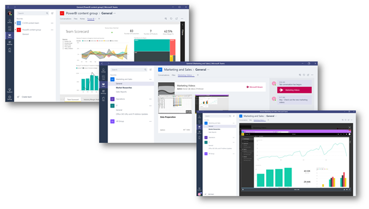
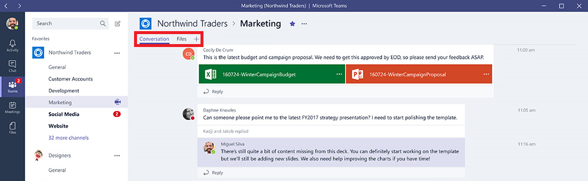
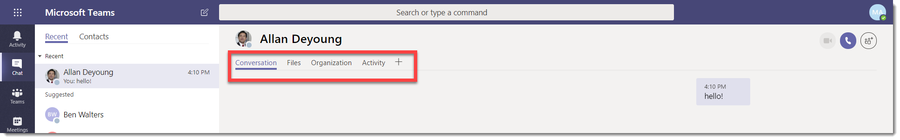
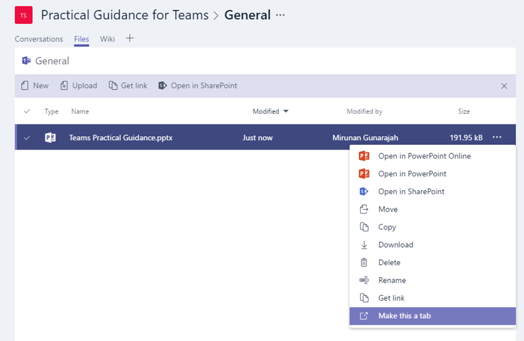
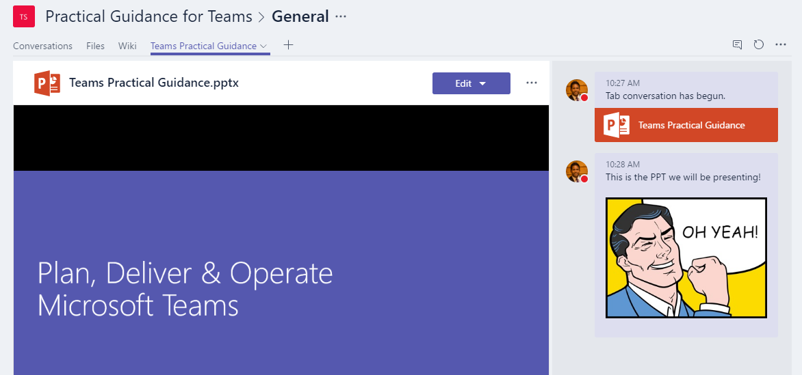
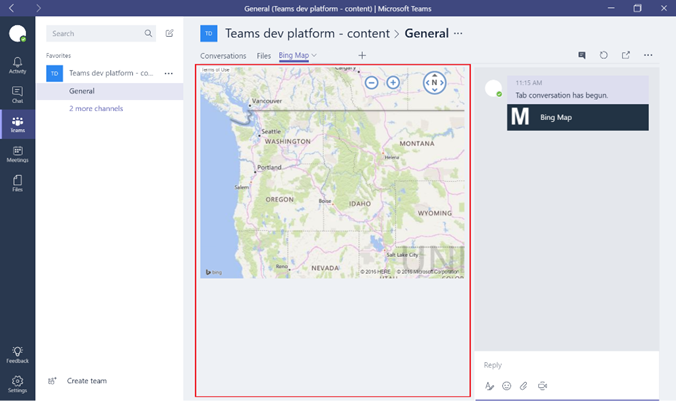

Use built-in and custom tabs in Microsoft Teams
==================================================

Tabs allow team members to access services and content in a dedicated space within a channel or in a chat. This lets the team work directly with tools and data, and have conversations about the tools and data, all within the context of the channel or chat.

Owners and team members can add tabs to a channel, private chat, and group chat to help integrate their cloud services. Tabs can be added to help users easily access and manage the data they need or interact with the most. This can be a Power BI report, a dashboard, or even a [Microsoft Stream](https://go.microsoft.com/fwlink/?linkid=855785) video channel where you publish training videos.

## Work with tabs

- With every new channel, two tabs are provisioned by default: Conversations and Files.

    
- With every private chat, four tabs are provisioned by default: Conversations, Files, Organization, and Activity.

    

- Owners and team members can add more tabs to a channel or chat by clicking **Add a tab**  at the top of the channel or chat.

- Excel, PowerPoint, Word, and PDF files must be uploaded to the **Files** tab before they can be converted to tabs. Any existing uploaded file can be converted to a tab with a single click, as shown below.

    

- To add a website, the URL must start with an **https** prefix so information that's exchanged remains secure.

- Detailed instructions are provided when a team member tries to add a custom tab to their channel or chat. When a custom tab is added to a channel, a **Tab conversation** is created that allows team members to have focused discussions about the content.

    

## Develop custom tabs

In addition to the built-in tabs, you can design and develop your own tabs to integrate to Teams or share with the rest of the community. You can [control access to your custom tab](https://docs.microsoft.com/en-us/microsoftteams/platform/get-started/design#streamline-access) by configuring the appropriate Office 365 Groups.

The Microsoft Developer Network provides [sample tabs](https://go.microsoft.com/fwlink/?linkid=855787) developed by Microsoft that you can download, and [detailed instructions](https://go.microsoft.com/fwlink/?linkid=855786) for designing and building your own tabs.

---
