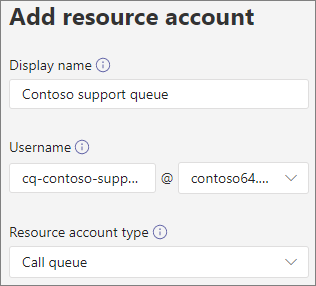
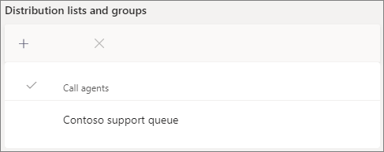

# Create a call queue - small business tutorial

Call queues provide a method of routing callers to people in your organization who can help with with a particular issue or question. Calls are distributed one at a time to the people in the queue (who are known as *agents*). 

Call queues provide:

- A greeting message.

- Music while people are waiting on hold in a queue.

- Call routing - in *First In, First Out* (FIFO) order - to agents.

- Handling options for queue overflow and timeout.

#### Before you begin

Get some [Phone System - Virtual User licenses](../teams-add-on-licensing/virtual-user.md) if you don't already have them. Get one for each call queue and auto attendant that you plan to set up. These licenses are free, so we suggest getting a few extra in case you decide to make changes to your setup in the future.

#### Follow these steps to set up your call queue

# [Step 1 Create a team](#tab/create-team)

When creating a call queue, you can add individual users to the queue, or you can use an existing security group, Microsoft 365 group, or Microsoft Teams team. We recommend using a team. This allows members of the queue to chat with each other, share ideas, and create documents or other resources to help them help your customers. A team also provides a voice mailbox for callers to leave a message after hours or if the queue reaches its maximum capacity.

To create a team

1. First, click **Teams** on the left side of the app, then click **Join or create a team** at the bottom of your teams list.

2. Then click **Create team** (first card, top left corner).

3. Choose **Build a team from scratch**.

4. Next, choose whether you want a public or private team. We recommend **Private** for your call queue to avoid people unintentionally becoming part of the queue by joining the team.

5. Name your team and add an optional description.

6. When you're done, click **Create**.

8. Type the names of the people that you want to have in your call queue, and then click **Add**.

9. Click **Close**. People you add to a team will receive an email letting them know they are now a member of your team and the team will show up in their teams list.

> [!div class="nextstepaction"]
> [Step 2 - Resource accounts >](https://review.docs.microsoft.com/microsoftteams/business-voice/create-a-phone-system-call-queue-smb?branch=mikeplum-smb-voice&tabs=resource-account#steps)

# [Step 2 Resource accounts](#tab/resource-account)

Each call queue that you create requires a resource account. This is similar to a user account, except the account is associated with an auto attendant or call queue instead of a person. In this step, we'll create the account, assign it a *Microsoft 365 Phone System - Virtual User* license, and then use it to start creating the call queue.

### Create a resource account

You can create a resource account in the Teams admin center.

1. In the Teams admin center, expand **Org-wide settings**, and then click **Resource accounts**.

2. Click **Add**.

3. In the **Add resource account** pane, fill out **Display name**, **Username**, and the **Resource account type**. The resource account type can be either **Auto attendant** or **Call queue**, depending how you intend to use this resource account.

    

4. Click **Save**.

The new account will appear in the list of accounts.

### Assign a license

You must assign a *Microsoft 365 Phone System - Virtual User* license to the resource account.

1. In the Microsoft 365 admin center, click the resource account to which you want to assign a license.

2. On the **Licenses and Apps** tab, under **Licenses**, select **Microsoft 365 Phone System - Virtual User**.

3. Click **Save changes**.

    

### Create a call queue

Next, we'll start creating a new call queue and assign the resource account.

1. In the Teams admin center, expand **Voice**, click **Call queues**, and then click **Add**.

1. Type a name for the call queue. Agents will see this name when they receive an incoming call from the queue.

2. Click **Add accounts**, search for the resource account that you want to use with this call queue, click **Add**, and then click **Add**.

3. Choose a language. This language will be used for system-generated voice prompts and voicemail transcription (if you enable them).

    

4. Specify if you want to play a greeting to callers when they arrive in the queue. You must upload an MP3, WAV, or WMA file containing the greeting that you want to play.

5. Teams provides default music to callers while they are on hold in a queue. If you want to play a specific audio file, choose **Play an audio file** and upload an MP3, WAV, or WMA file.

> [!NOTE]
> The uploaded recording can be no larger than 5 MB.
> The default music supplied in Teams call queues is free of any royalties payable by your organization. 

> [!div class="nextstepaction"]
> [Step 3 - Call agents >](https://review.docs.microsoft.com/microsoftteams/business-voice/create-a-phone-system-call-queue-smb?branch=mikeplum-smb-voice&tabs=call-agents#steps)

# [Step 3 Call agents](#tab/call-agents)

To add agents to the call queue, we'll add the team that we created earlier.

1. Click Add groups.
2. Type the name of the team that you created.
3. Click Add, and then click Add.

    

You can add up to 20 agents individually and up to 200 agents via groups or teams.

> [!NOTE]
> When new users are added to the team, it can take up to eight hours for their first call to arrive.

> [!div class="nextstepaction"]
> [Step 4 - Resource accounts >](https://review.docs.microsoft.com/microsoftteams/business-voice/create-a-phone-system-call-queue-smb?branch=mikeplum-smb-voice&tabs=call-routing#steps)

# [Step 4 Call routing](#tab/call-routing)

## Call routing

**Conference mode** significantly reduces the amount of time it takes for a caller to be connected to an agent, after the agent accepts the call. For conference mode to work, agents in the call queue must use one of the following clients:

  - The latest version of the Microsoft Teams desktop client, Android app, or iOS app
  - Microsoft Teams phone version 1449/1.0.94.2020051601 or later
  
Agents' Teams accounts need to be set to Teams-only mode. Agents who don't meet the requirements aren't included in the call routing list. We recommend enabling conference mode for your call queues if your agents are all using compatible clients.

> [!NOTE]
> Busy on Busy is not supported by conference mode. Agents on non-call queue calls may still be presented with a call queue call if presence-based routing is not enabled.

**Routing method** determines the order in which agents receive calls from the queue. Choose from these options:

- **Attendant routing** rings all agents in the queue at the same time. The first call agent to pick up the call gets the call.

- **Serial routing** rings all call agents one by one in the order specified in the **Call agents** list. If an agent dismisses or does not pick up a call, the call will ring the next agent and will try all agents until it is picked up or times out.

- **Round robin** balances the routing of incoming calls so that each call agent gets the same number of calls from the queue. This may be desirable in an inbound sales environment to assure equal opportunity among all the call agents.

- **Longest idle** routes each call to the agent who has been idle the longest time. An agent is considered idle if their presence state is Available or if their presence state has been Away for less than 10 minutes. Agents whose presence state has been Away for more than 10 minutes are not considered idle and will not be eligible to receive calls until they change their presence to Available. 

**Presence-based routing** uses the availability status of call agents to determine whether an agent should be included in the call routing list for the selected routing method. Call agents whose availability status is set to **Available** are included in the call routing list and can receive calls. Agents whose availability status is set to any other status are excluded from the call routing list and won't receive calls until their availability status changes back to **Available**. 

You can enable presence-based call routing with any of the routing methods.

If an agent opts out of getting calls, they won't be included in the call routing list regardless of what their availability status is set to. 

> [!NOTE]
> Agents who use the Skype for Business client aren't included in the call routing list when presence-based routing is enabled. If you have agents who use Skype for Business, don't enable presence-based call routing.

**Agent alert time** specifies how long an agent's phone will ring before the queue redirects the call to the next agent.

For high volume queues, we recommend the following settings:

- **Conference mode** to **Auto**
- **Routing method** to **Attendant routing**
- **Presence-based routing** to **On**
- **Agent alert time:** to **20 seconds**

> [!div class="nextstepaction"]
> [Step 5 - Resource accounts >](https://review.docs.microsoft.com/microsoftteams/business-voice/create-a-phone-system-call-queue-smb?branch=mikeplum-smb-voice&tabs=call-overflow#steps)

# [Step 5 Call overflow](#tab/call-overflow)

## Call overflow handling

**Maximum calls in the queue** specifies the maximum number of calls that can wait in the queue at any given time. The default is 50, but it can range from 0 to 200. When this limit is reached, the call is handled as specified by the **When the maximum number of calls is reached** setting.

You can choose to disconnect the call or redirect it to any of the call routing destinations. For example, you might have the caller leave a voicemail for the agents in the queue. For external transfers, please refer to [Prerequisites](../plan-auto-attendant-call-queue.md#prerequisites) and the [external phone number transfers - technical details](../create-a-phone-system-auto-attendant.md#external-phone-number-transfers---technical-details) for number formatting.

> [!NOTE]
> If the maximum number of calls is set to 0 then the greeting message will not play.

> [!div class="nextstepaction"]
> [Step 6 - Resource accounts >](https://review.docs.microsoft.com/microsoftteams/business-voice/create-a-phone-system-call-queue-smb?branch=mikeplum-smb-voice&tabs=call-timeout#steps)

# [Step 6 Call timeout](#tab/call-timeout)

## Call timeout handling

**Call Timeout: maximum wait time** specifies the maximum time a call can be on hold in the queue before it is redirected or disconnected. You can specify a value from 0 seconds to 45 minutes.

You can choose to disconnect the call or redirect it to one of the call routing destinations. For example, you might have the caller leave a voicemail for the agents in the queue. For external transfers, please refer to [Prerequisites](../plan-auto-attendant-call-queue.md#prerequisites) and the [external phone number transfers - technical details](../create-a-phone-system-auto-attendant.md#external-phone-number-transfers---technical-details) for number formatting.

When you have selected your call timeout options, click **Save**.

---

## Caller ID for outbound calls

Since agents in a call queue may dial out to return a customer call, consider setting the caller ID for members of a call queue to the service number of an appropriate auto attendant. See [Manage caller ID policies in Microsoft Teams](../caller-id-policies.md) for more information.

