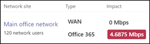

# Check your Internet connection

Business Voice is located in the cloud with Microsoft 365. Every device that uses Microsoft Teams and Business Voice needs a connection to the Internet. To get the best experience with Business Voice, you need a broadband Internet connection that can support the maximum number of phone calls that might be made at any one time. You also need to make sure that computers on your network can reach Microsoft 365 servers.

To follow these steps, you need to have a tenant with one of the following subscriptions:

* Office 365 Business Essentials
* Office 365 Business Premium
* Office 365 E1
* Office 365 E3
* Office 365 F1
* Microsoft 365 A1
* Microsoft 365 A3
* Microsoft 365 E3
* Microsoft 365 Business

You don't need a Business Voice license to follow these steps.

## Check your Internet connection speed

This article helps you determine whether your Internet connection is fast enough for the number of people who need to make phone calls, host video conferences, and do similar things. You'll enter some information about your organization and get back a report that shows how much of your Internet connection will be used by Teams and Business Voice.

### Gather information about your Internet use

Before you start, you need the following information:

* The speed of your Internet connection
* How many people will use Business Voice mainly from your office
* How many people will use Business Voice mainly from a remote location, such as a home office

### Enter the information into the network planner

Follow these steps:

1. In a browser, go to https://admin.teams.microsoft.com. Sign in by using an account that has Global Administrator permissions. The account that you used to sign up for Office 365 has these permissions.
2. Open **Planning** and select **Network planner**.
3. Under **Network plans**, select **Add**. Enter a name for your plan, and then select **Apply**. Your network plan should look like this:

    
1. Select the name of your network plan (it's **Main office** in the preceding picture).
2. On the next page, select **Add a network site** on the **Network sites** tab.
3. Fill in only the fields as indicated in the following screenshot, and then select **Save**. Leave the other fields on this screen blank, and don't select the **ExpressRoute** or **Connected to WAN** options.

    
1. On the **Report** tab, select **Start a report**.
1. Enter the following information, and then select **Generate report** to create a report that shows the bandwidth requirements for Teams. We'll show you how to read the report in the next section.

    

### Find your minimum Internet connection speed

When you select **Generate report**, Office 365 creates a report that looks like this:

The highlighted number shows how much of your Internet connection Teams and Business Voice will use. We recommend that this number be no more than 30 percent of your total Internet connection speed. For example, if your Internet connection is 60 Mbps, Teams and Business Voice should use no more than 18 Mbps.

Use this equation to determine your minimum Internet connection speed: `<highlighted number> / .3`. Using the highlighted number in the picture above, the calculation would be `4.6875 / .3 = 15.6`. This means that your Internet connection speed should be at least 15.6 Mbps.

If Teams and Business Voice will use more than 30 percent of your total Internet connection speed, the highlighted number will appear red. In that case, you may need to upgrade your Internet connection.

## Make sure your networked devices can reach Microsoft 365

Devices that use Business Voice must use specific network ports to communicate with Microsoft 365 servers. These ports are essentially doors through which devices talk to each other over a network or the Internet. Your firewall needs to allow devices on your network to reach Microsoft 365 by using the following "outbound" network ports:

* **TCP ports** 80 and 443
* **UDP ports** 3478, 3479, 3480, and 3481

The easiest way to check whether your firewall allows communication on these network ports is to make a test call in Teams:

1. Go to https://aka.ms/getteams on a computer on your network and install Teams. Make sure that the computer has speakers and a microphone.
2. Open Teams and sign in by using a Microsoft 365 account
3. In Teams, select your profile picture, and then go to **Settings** > **Devices**.
4. Under **Audio devices**, select **Make a test call**. 
5. Follow the steps to leave a message and have it played back to you.

   * If the call connects and you hear your message played back, your firewall is set up correctly.
   * If the call connects, but you can't hear the instructions or your message played back, make sure that your speakers and microphone are set up correctly, and then try again.
   * If the call doesn't connect or if it connects but you can't hear your message played back, you might need to update your firewall to allow the network ports listed above. Check your firewall's documentation on how to allow network ports to reach the Internet, or contact an IT specialist for help.

If you want information about how to prepare larger or more complex networks to support Business Voice, see [Evaluate my environment](../3-envision-evaluate-my-environment.md). This article provides additional information about bandwidth, proxy and firewall requirements, and how to use the [Network Assessment Tool](../3-envision-evaluate-my-environment.md#test-the-network) to test your network.
