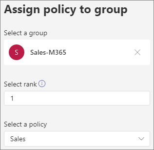

# Call park and retrieve in Microsoft Teams

Call park and retrieve is a feature that lets a user place a call on hold. When a call is parked, the service generates a unique code for call retrieval. The user who parked the call or someone else can then use that code with a supported app or device to retrieve the call. (See see [Park a call in Teams](https://support.office.com/article/park-a-call-in-teams-8538c063-d676-4e9a-8045-fc3b7299bb2f) for details.)

Some of the common scenarios for using call park are:

- A receptionist parks a call for someone working in a factory. The receptionist then announces the call and the code number over the public address system. The user who the call is for can then pick up a Teams phone on the factory floor and enter the code to retrieve the call.
- A user parks a call on a mobile device because the device battery is running out of power. The user can then enter the code to retrieve the call from a Teams desk phone.
- A support representative parks a customer call and sends an announcement on a Teams channel for an expert to retrieve the call and help the customer. An expert enters the code in Teams clients to retrieve the call

To park and retrieve calls, a user must be an Enterprise Voice user and must be included in a call park policy.

> [!NOTE]
> Call park and retrieve is only available in [Teams Only deployment mode](teams-and-skypeforbusiness-coexistence-and-interoperability.md) and is not supported on Skype for Business IP phones.

## Configure call park and retrieve

You must be a Teams admin to configure call park and retrieve. It is disabled by default. You can enable it for users and create user groups using the call park policy. When you apply the same policy to a set of users, they can park and retrieve calls among themselves.

By default, the range of call pickup numbers is from 10-99. You can also create your own custom range between 10-9999. The first parked call will be rendered a pickup code of the start of range (for instance 10). The next parked call will be rendered a pickup code incremented by 1; that is, 11, and so on, until the end of the range is rendered as a pickup code. After which, the rendered pickup codes start over from the start of the range once again. 

You can specify a timeout as the number of seconds to wait before ringing back when the parked call hasn't been picked up. The allowed range is 120-1800 seconds, and the default value is 300 seconds.

To enable a call park policy:

1. In the left navigation of the Microsoft Teams admin center, go to **Voice** > **Call park policies**.
2. On the **Manage policies** tab, click **Add**.
3. Give the policy a name, and then switch **Allow call park** to **On**.
4. Change the range and park timeout as required.
5. Select **Save**.

You can edit the policy by selecting it in the list and clicking **Edit**.

In order for the policy to work, it must be assigned to users. You can [assign the policy to users individually](assign-policies-users-and-groups.md) or assign them to a group.

To assign a call park policy to a group

1. On the **Call park policies** page, on the **Group policy assignment** tab, click **Add group**.
2. Search for the group that you want to use, and then click **Add**.
3. Choose a rank compared to other group assignments.
4. Under **Select a policy**, choose the policy that you want to assign this group to.

    

5. Select **Apply**.

## Related topics

[Park a call in Teams](https://support.office.com/article/park-a-call-in-teams-8538c063-d676-4e9a-8045-fc3b7299bb2f)

[Assign policies to your users in Teams](policy-assignment-overview.md)

[New-CsTeamsCallParkPolicy](/powershell/module/skype/new-csteamscallparkpolicy)

[Set-CsTeamsCallParkPolicy](/powershell/module/skype/set-csteamscallparkpolicy)

[Grant-CsTeamsCallParkPolicy](/powershell/module/skype/grant-csteamscallparkpolicy)
