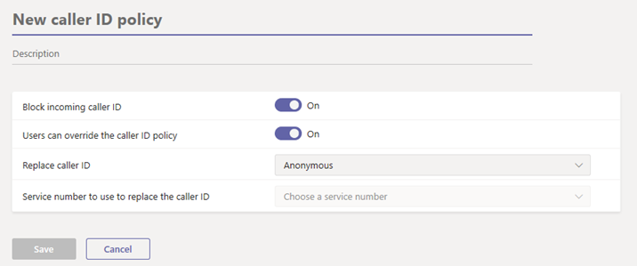

# Manage caller ID policies in Microsoft Teams

>[!INCLUDE [new-feature-teams-admin-center](includes/new-feature-teams-admin-center.md)]

As an admin, you can use caller ID policies in Microsoft Teams to change or block the caller ID (also known as calling line ID). By default, the phone number of Teams users can be seen when they make a call to a PSTN phone and the phone number of PSTN callers can be seen when they call a Teams user. You can use caller ID policies to display an alternate phone number for Teams users in your organization or block an incoming number from being displayed.

For example, when users make a call, you can change the caller ID to display your organization's main phone number instead of users' phone numbers.

You manage caller ID policies by going to **Voice** > **Caller ID policies** in the Microsoft Teams admin center. You can use the global (Org-wide default) policy or create and assign custom policies. Users in your organization will automatically get the global policy unless you create and assign a custom policy.

## Create a custom caller ID policy

1. In the left navigation of the Microsoft Teams admin center, go to **Voice** > **Caller ID policies**.
2. Click **Add**.  

3. Enter a name and description for the policy.
4. From here, choose the settings that you want:

    - **Block incoming caller ID**: Turn on this setting to block the caller ID of incoming calls from being displayed.
    - **Override the caller ID policy**: Turn on this setting to let users override the settings in the policy regarding displaying their number to callees or not. This means that users can choose whether to display their caller ID. For more information, see [End user control of outbound caller ID](https://docs.microsoft.com/microsoftteams/how-can-caller-id-be-used-in-your-organization#end-user-control-of-outbound-caller-id).
    - **Replace the caller ID with**: Set the caller ID to be displayed for users by selecting one of the following:

        - **User's number**: Displays the user's number. 
        - **Service number**: Lets you set a service phone number to display as the caller ID.
        - **Anonymous**: Displays the caller ID as Anonymous.

    - **Replace the caller ID with this service number**: Choose a service number to replace the caller ID of users. This option is available if you selected **Service number** in **Replace the caller ID with**.

5. Click **Save**.

## Edit a caller ID policy

You can edit the global policy or any custom policies that you create. 

1. In the left navigation of the Microsoft Teams admin center, go to **Voice** > **Caller ID policies**.
2. Select the policy by clicking to the left of the policy name, and then click **Edit**.
3. Change the settings that you want, and then click **Save**.

## Assign a custom caller ID policy to users

[!INCLUDE [assign-policy](includes/assign-policy.md)]

## Related topics

[New-CsCallingLineIdentity](https://docs.microsoft.com/powershell/module/skype/new-cscallinglineidentity?view=skype-ps)

[Assign policies to your users in Teams](assign-policies.md)
