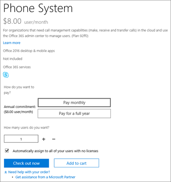

# Calling Plans for Microsoft Teams

Calls to other Skype for Business and Microsoft Teams users are free, but if you want your users to be able to call regular phones, and you don't already have a service provider to make voice calls, you need to buy a Calling Plan. For more information, see [Phone System and Calling Plans](calling-plan-landing-page.md).
  
Here are the Calling Plans options:
  
- **Domestic Calling Plan**: Licensed users can call out to numbers located in the country/region where they're assigned in Microsoft 365. Unlimited incoming minutes are included. Outgoing minutes are included based on the license purchased.

- **International Calling Plan**: Licensed users can call out to numbers located in the country/region where their Microsoft 365 license is assigned to the user based on the user's location, and to international numbers in [196 countries/regions](country-and-region-availability-for-audio-conferencing-and-calling-plans/users-can-make-outbound-calls-to-these-countries-and-regions.md). Unlimited incoming minutes are included. Outgoing minutes are included based on the license purchased.

- **Pay-As-You-Go Calling Plan**: Licensed users can call out to numbers located in the country/region where their Microsoft 365 license is assigned to the user based on the user's location, and to international numbers in [196 countries/regions](country-and-region-availability-for-audio-conferencing-and-calling-plans/users-can-make-outbound-calls-to-these-countries-and-regions.md). Unlimited incoming minutes are included. No outgoing minutes are included. All outgoing calls are charged based on the minutes used, either with Communication Credits or Post Pay billing. There are 2 options to choose from:
  - **Pay-As-You-Go Calling Plan Zone-1**: Buy this for users in the United States, including Puerto Rico, Canada, and the United Kingdom.
    - Zone 1 licenses aren't currently available for sale in the United States and Puerto Rico, but they can be provisioned to US and Puerto Rico users if bought in other countries.
  - **Pay-As-You-Go Calling Plan Zone-2**: Buy this for users in Austria, Belgium, Croatia, Czech Republic, Denmark, Estonia, Finland, France, Germany, Hungary, Ireland, Italy, Latvia, Lithuania, Luxembourg, Netherlands, New Zealand, Norway, Poland, Portugal, Romania, Singapore, Slovakia, Slovenia, South Africa, Spain, Sweden, and Switzerland.
    - Zone 2 licenses aren't currently available for sale in the United States and Puerto Rico.

All users in the same country/region (this is the user country location defined in the licensing area of the Microsoft 365 admin center) with the same Calling Plan share a pool of minutes. For example, if you have 100 users located in the same country/region with a 120 minutes Domestic Calling Plan assigned, they share a pool of 12,000 minutes. All calls exceeding these minutes are billed per minute.

Visit [Country and region availability](country-and-region-availability-for-audio-conferencing-and-calling-plans/country-and-region-availability-for-audio-conferencing-and-calling-plans.md) to find out about monthly minutes available for each organization in each country/region.
  
> [!IMPORTANT]
> The country/region is based on the location of the user's license in the **Microsoft 365 admin center** > **Active users** and **NOT** the billing address listed under the **Organization Profile** in the **Microsoft 365 admin center**.

> [!NOTE]
> Pooling is only available on identical calling plans.

  
For detailed information about usage limits and terms of use, see [Audio Conferencing complimentary dial-out period](complimentary-dial-out-period.md).
  
## How to buy a Calling Plan

1. You must first purchase a **Phone System add-on license**. To do that, [sign in to the Microsoft 365 admin center and choose **Billing**](https://go.microsoft.com/fwlink/p/?linkid=868433) > **Purchase services** > **Add-on subscriptions** > **Buy now**.

    
  
    > [!NOTE]
    > Depending on your plan, you may need to buy more add-ons before you can buy Phone System licenses. To learn more, see [Microsoft Teams add-on licensing](./teams-add-on-licensing/microsoft-teams-add-on-licensing.md).
  
2. After you buy Phone System licenses, you can buy the Calling Plan by [signing in to the Microsoft 365 admin center and choose **Billing**](https://go.microsoft.com/fwlink/p/?linkid=868433) > **Purchase services** > **Add-on subscriptions**, and then selecting **Buy now**. You'll see the Calling Plans there.

You can buy and assign different Calling Plans to different users, depending on the needs of your organization. After you select the Calling Plan you need, proceed to checkout. You assign a plan to each user in the Microsoft 365 admin center. To learn how, see [Assign Microsoft Teams add-on licenses](./teams-add-on-licensing/microsoft-teams-add-on-licensing.md).
  
## Do you have a service provider that provides on-premises PSTN connectivity for hybrid users?

If so, you don't need to buy a Calling Plan. Office 365 Enterprise E5 includes the **Phone System** add-on, so you can proceed to checkout.
  
Then, assign the Enterprise E5 or **Phone System** add-on licenses to users in the Microsoft 365 admin center. To learn how, see [Assign Microsoft Teams add-on licenses](./teams-add-on-licensing/microsoft-teams-add-on-licensing.md).
  
## Pricing information

- [Pricing for Calling Plans and Phone System](https://www.microsoft.com/microsoft-365/microsoft-teams/voice-calling)
- [Pricing for Audio Conferencing](https://www.microsoft.com/microsoft-365/microsoft-teams/online-meetings)

## For more information

Here are more articles that explain how to set up your Calling Plans:
  
- [Set up Calling Plans](set-up-calling-plans.md)
- [Microsoft Teams add-on licensing](./teams-add-on-licensing/microsoft-teams-add-on-licensing.md)
- [Here's what you get with Phone System in Microsoft 365 or Office 365](./here-s-what-you-get-with-phone-system.md)

## Related articles

- [Set up Skype for Business Online](/SkypeForBusiness/set-up-skype-for-business-online/set-up-skype-for-business-online)
- [Set up Cloud Voicemail - Admin help](set-up-phone-system-voicemail.md)
- [Set up Calling Plans](set-up-calling-plans.md)
- [Add funds and manage Communications Credits](add-funds-and-manage-communications-credits.md)
