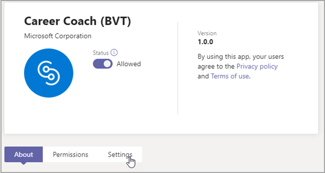
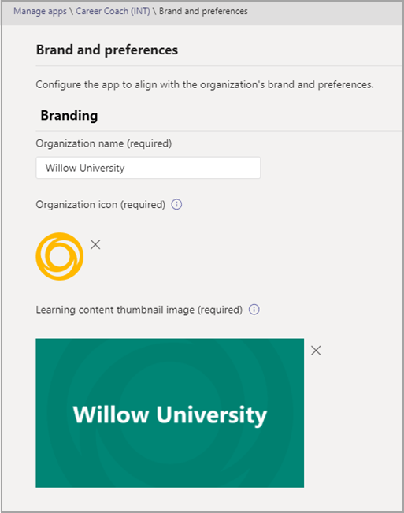
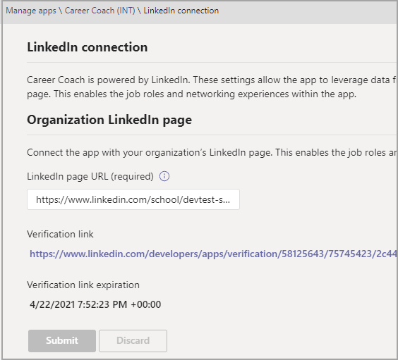
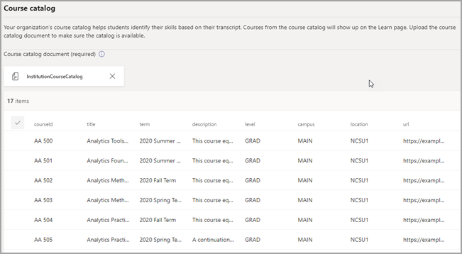

# Purchase, configure, and enable Career Coach for Microsoft Teams

Career Coach is a Microsoft Teams for Education app powered by LinkedIn that provides personalized guidance for higher education students to navigate their career journey. Career Coach offers educational institutions a unified career solution for students to discover their career path, grow real-world skills, and build their network all in one place.

Learn more about [Career Coach](https://aka.ms/career-coach).

> [!NOTE]
> Use the best practices and helpful tips in this guide to enable the capabilities of Career Coach for students, faculty, and staff. See the [marketing & edu support](https://support.microsoft.com/office/c5d0b934-bfcf-4fe7-8a85-ba7bbb1b6ad4) article.

## Review the requirements

To enable Career Coach for your educational institution, review what you need to get the app up and running.

**Technical requirements**

  - Office 365 tenant with Azure Active Directory

  - Microsoft Teams

  - LinkedIn account connections in Azure Active Directory

**Licenses**

  - Faculty 

  - Students

> [!NOTE]
> A Career Coach Faculty license must be assigned to the IT admin completing the configuration.

**Data and files from your educational institution**

  - Course catalog data

  - Fields of study and degrees offered

  - Educational institution’s LinkedIn page

  - LinkedIn Learning campus subscription (preferred)

## Purchase the Career Coach licenses

Career Coach is available worldwide (except China and Russia) for qualified higher education institutions through Enrollment for Education Solutions (EES), Cloud Service Providers (CSP), and Microsoft 365 admin center (web direct). As a Microsoft Teams app, customers must have Microsoft 365 A3/A5 or Office 365 A1/A3/A5.

### Assign app licenses to users

For step-by-step instructions, see [Assign licenses to users](https://docs.microsoft.com/microsoft-365/admin/manage/assign-licenses-to-users).

### Turn on LinkedIn account connections

Career Coach **requires** your educational institution’s users to have the ability to connect their Microsoft 365 account to their LinkedIn account that is facilitated within Career Coach

1. Sign in to the [Azure AD admin center](https://aad.portal.azure.com/) with an account that's a global admin for the Azure AD organization.

2. Select **Users**.

3. On the **Users** page, select **User settings**.

4. Under **LinkedIn account connections**, allow users to connect their accounts to access their LinkedIn connections within some Microsoft apps. No data is shared until users consent to connect their accounts.

   - Select **Yes** to enable the service for all users in your educational institution

   - Select **Selected group** to enable the service for only a group of selected users in your educational institution

   - Select **No** to withdraw consent from all users in your educational institution

Learn how to [Integrate LinkedIn account connections in Azure Active Directory](/azure/active-directory/enterprise-users/linkedin-integration)

## Configure Career Coach in the Teams admin center

Using the admin settings in the Microsoft Teams admin center, you can configure Career Coach for your educational institution and enable it for users.

## Access the Career Coach app settings

Use the [Manage apps page](/microsoftteams/manage-apps) to view the Teams apps in your educational institution’s app catalog.

1. Sign in to the **Teams admin center**.

2. In the left navigation, select **Teams apps** > **Manage apps**.  

    > [!NOTE]
    > You must be a global admin or Teams service admin to access the page.

3. Search or browse for **Career Coach**.  

4. Select **Career Coach**, and then select **Settings.**  

    

### Configure the Career Coach app settings

Career Coach has five configuration categories:

- [Brand and preferences](#brand-and-preferences)

- [LinkedIn configuration](#linkedin-configuration)

- [Course catalog](#course-catalog)

- [Fields of study](#fields-of-study)

- [Customization](#customization)

> [!NOTE]
> Brand and preferences, LinkedIn configuration, Course catalog, and Fields of study are **required** to effectively enable the app for students, faculty, and staff.

#### Brand and preferences

Set your educational institution’s name, logo, and default language on the brand and preferences settings page.



##### Educational institution icon

The educational institution icon is used throughout Career Coach to identify content unique to your educational institution, course catalog resources throughout the app, and on the real-world experiences section of the dashboard. The icon is best formatted as:

 - A transparent PNG
 - Aspect ratio of 1:1
 - Maximum size of 64 px x 64 px.

##### Educational institution thumbnail

The educational institution icon will be used for course catalog resources throughout the app when a specific image isn't available for a course. The icon is best formatted as:

- A PNG
- Aspect ratio of 16:9
- Maximum size of 360 px x 200 px.

#### LinkedIn configuration

The LinkedIn configuration connects Career Coach with public alumni data from LinkedIn.

> [!NOTE]
> Career Coach can't be enabled without the LinkedIn page connection verified.

##### Add and confirm the LinkedIn page

Determine the educational institution's LinkedIn page. Find the LinkedIn page by searching on LinkedIn or connecting with a career services staff member to determine the correct page to use.  
  
1. Sign in to the **Teams admin center**.

1. Select **Teams apps** > **Manage apps** > **Career Coach** > **LinkedIn connection**.

2. Enter your educational institution's LinkedIn page URL.  

3. Select **Apply**.

4. Copy the verification URL and share it with your educational institution’s LinkedIn page admin [LinkedIn page admin documentation](https://www.linkedin.com/help/linkedin/answer/4783/linkedin-page-admins-overview?lang=en). The verification link expires after 30 days.  

     

#### Course catalog

The course catalog represents the courses/classes/modules offered to students by your educational institution. These courses are used within the app in two areas:

- Courses are returned as part of learning resources.  

- Courses and course meta data, like descriptions, are used to help students identify their skills when they upload a transcript.  

To create the course catalog, put together a list of all courses taught at your educational institution and upload it as a CSV file. The app draws from the course catalog to identify a student’s skills from their transcript and to suggest courses to take. 

> [!NOTE]
> See [Location of data in Teams](location-of-data-in-teams.md) and [Security and compliance](security-compliance-overview.md) for information about protecting of student information. 

##### Course catalog documents formatting and schema

The document needs to be in CSV format with a maximum size of 18 MB. The document must contain the required fields **course title** and **course ID**. Including the recommended fields improves the experience for students by returning better search results and skill identification.

> [!NOTE]
> Start with the [sample course catalog]( https://aka.ms/career-coach/docs/it-admins/sample-catalog) document to get started.

##### Sample .CSV file

```
courseId,title,sourceLink,description,language,format,thumbnailLink,thumbnailAltText,educationLevel,topics
"AA-501","Analytics Foundations","https://example.com/course-id","This course equips the student with the knowledge and skills needed to conduct and present large-scale studies based on advanced analytics.","en-us","In-person","https://via.placeholder.com/360x200","Undergraduate","Alt text for the thumbnail","analytics, data science, data analysis, linear regression"
```

The following table shows the items to include in the course catalog:


| Name             | Status      | Type   | Description                                                                    |
|------------------|-------------|--------|--------------------------------------------------------------------------------|
| courseId         | Required    | string | Usually the course id (Typically maps to what is generated in the transcript). |
| title            | Required    | string | Usually the course title.                                                      |
| sourceLink       | Required    | URL    | Website link to the course page.                                               |
| description      | Recommended | string | Introduction text for the course.                                              |
| language         | Recommended | string | Language of the course. Use standard language codes.                           |
| format           | Recommended | string | Mode of teaching, e.g., online, video, in-person.                              |
| thumbnailLink    | Recommended | URL    | Thumbnail link to the course image.                                            |
| thumbnailAltText | Recommended | string | Accessibility alt text for the image                                           |
|                  |             |        |                                                                                |
| educationLevel   | Recommended | string | Study level, ex. Undergraduate/Graduate.                                       |
| topics           | Recommended | string | Topics or tags that are associated with the skills the courses teach.          |

##### Add the course catalog

1. Sign in to the **Teams admin center**.

1. Select **Teams apps** &gt; **Manage apps** &gt; **Career Coach** &gt; **Settings** &gt;  **Course catalog**.

2. Upload courses in CSV format.

3. Add the course title, ID, and description.

4. Select **Apply**.

   

#### Fields of study

The fields of study are synonymous with major areas of interest, academic major, and degree. These titles are referenced by students when they start using the app and begin setting up their personalized profile.

Add all fields of study available to students such as Engineering, English, Business, and so on. The list of fields lets students discover fields of study that may interest them and add their area of focus to their profile.

##### Add the fields of study

1. Sign in to the **Teams admin center**.
1. Select **Teams apps** &gt; **Manage apps** &gt; **Career Coach** &gt; **Settings** &gt;  **Fields of study**.

2. Under Upload Field of study document, add the [field of study document](https://aka.ms/career-coach/docs/it-admins/sample-fieldsofstudy) in CSV format.

3. Select **Apply**.

#### Customization

Career Coach can be customized to be unique to your educational institution. The customization supports adding experiences to the dashboard. It's recommended to add links to the educational institution’s job boards, events, career services office and career-related events, clubs, educational institutions, and experiences and any other resources that help students gain experience.

##### Add customized experiences

1. Sign in to the **Teams admin center**.

1. Select **Teams apps** &gt; **Manage apps** &gt; **Career Coach** > **Settings** &gt; **Customization**.

2. Add each URL, a title, and short description.  
  
3. Select **Apply**.

### Enable the app

After you complete the configuration, enable the app for students and licensed users so they'll have access to Career Coach.  
  
> [!NOTE]
> You must have Global or Teams admin role permissions.

1. Sign in to the **Teams admin center**.

1. Select **Teams apps** &gt; **Manage apps** &gt; **Career Coach**.

2. Move the Status toggle to **Allowed**.  

  > [!NOTE]
  > Allowed means that the app is available for users in your educational institution. Blocked means that the app isn't available to students.

#### Pin the app

Pinning Career Coach will make the app more accessible and visible for students.

1. Sign in to the **Teams admin center**.

1. Select **Teams apps** &gt;**Setup policies** &gt; *Your policy*. 

2. Under **Pinned apps**, choose **Add apps**.

1. Search for **Career Coach**, and then select **Add**.

1. Choose the order for the app to appear and select **Save**.

   Students will be notified in Microsoft Teams that Career Coach has been pinned.  

## Resources

The following resources will help you plan your Career Coach app.

- [Welcome to Microsoft Teams](Teams-overview.md)

- [How to roll out Teams](get-started-with-teams-resources-for-org-wide-rollout.md?tabs=SmallBusiness)

- [Overview of teams and channels in Microsoft Teams](teams-channels-overview.md)

- [Managing apps in Microsoft Teams Admin Center](manage-apps.md)

- [Security, privacy, and compliance in Microsoft Teams](security-compliance-overview.md)

- [Online Virtual Orientation Kit](https://www.microsoft.com/education/remote-learning/virtual-orientation) 

- [Limits and specification of Teams channels](limits-specifications-teams.md)

- [Location of data in Microsoft Teams](location-of-data-in-teams.md)

- [Getting started with admin training for Microsoft Teams](ITAdmin-readiness.md)

- [Teams troubleshooting](/microsoftteams/troubleshoot/teams-welcome)

- [Manage app permission policies in Microsoft Teams](teams-app-permission-policies.md)
