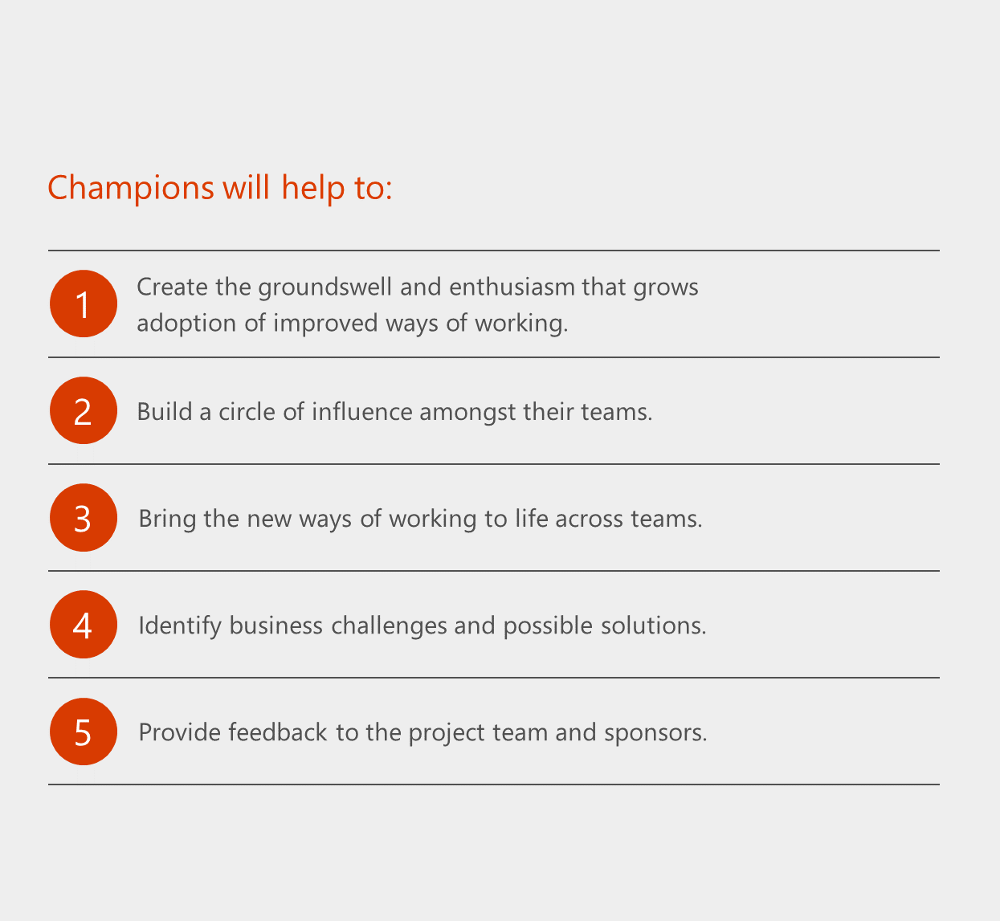

Create a change management strategy for Microsoft Teams
=======================================================

A change management strategy for end-user awareness and adoption of new technologies is critical to the successful rollout of any new technology in an organization. Successful completion of this effort will ensure user adoption and satisfaction of the new experience.  The steps identified below can be altered depending on the size of your organization but ensure a sustained level of communication with stakeholders, champions, IT adminstrators, and users is key to landing a successful change.  

Best practices for change management for Teams:

1.  Identify your key stakeholders, champions, and user profiles

2.  Identify & select your business scenarios

3.  Conduct a pilot that includes business users, champions, and IT professionals.  

4.  Design, launch and manage your adoption campaign. Download our [Customer Success Kit](https://aka.ms/TeamsSuccessKit) as a starting point. A good adoption campaign includes:

    a.  Internal awareness materials such as posters, digital signage, and events

    b.  Self-help and training information in a single location
    
    c.  A defined feedback mechanism

    d.  Pre-defined success measures (solution adoption, views of key materials, attendance at courses)

4.  Build a champion program alongside your service deployment

5.  Provide a standard feedback method

6.  Measure & share success

7.  Adjust your messaging and methods based on feedback, repeat.

Identify key stakeholders, champions, and user profiles
-----------------------------------------------

The first rule of a successful adoption is to create a dynamic team comprised of key stakeholders and the right people that can drive and effect change in others. A successful adoption strategy starts with a team of committed individuals representing a cross-section of your organization. Key stakeholder roles include an Executive Sponsor, Service Owners, IT professionals, and Champions.

|  |  |
|---------|---------|
|     |**Executive Sponsors** are key leaders within the organization and their participation is essential in driving employee adoption. They have the greatest influence on company culture and can actively communicate the value and benefits of a new technology and way.         |
|     |**Service Owners** are responsible for ensuring people use the service and get value from it. Setting Service Owners within your organization is important to ensure the business goals set for Office 365 are realized.         |
|     |Gaining buy-in from every user across an organization is a challenge. **Champions** can help alleviate this challenge and play an important role in the adoption of Office 365. They are knowledgeable, committed to furthering their expertise and are willing to provide peer coaching and assistance. They help translate Office 365 into the reality of their department or team.         |

We recommend a regular meeting of these stakeholders to keep them up to date on the progress of your program. Initiating a “collaboration council” to allow for feedback and discussion can be a useful tool depending on your corporate culture.

> [!TIP]
> Those people who may be the biggest obstacles to change can become your best allies in a deployment of this kind. We encourage you to engage with these members of your organization early and often to hear their concerns and issues. Often, they have valuable feedback that will make your campaign more successful.

User profiles
-------------

It is equally important to understand the types of users in your environment. Do you have users who are primarily mobile? Some who are in constant meetings or giving presentations? Do you know which of your users have the most difficulty with your existing collaboration solutions? Segmenting your user community can help you find groups that are most open to change. They are often the best targets for your early business pilots and their feedback is extremely valuable.

Understanding the day in the life of your users will help you to prioritize your business outcomes, design adoption goals appropriate for your deployment and sustain usage over time.

Champions
---------

Identifying the individuals who can become your collaboration champions provides you with an extended support team for your implementation. Create a community by providing them early insight and feedback to your plans. Any investment you make in this community whether it be time, attention or rewards will be returned to your implementation through their support and evangelism.

To learn about building a champion program, get [Build a champion program](https://go.microsoft.com/fwlink/?linkid=854665).

Identify and select your business scenarios
---------------------------------------------------------------

Once you have identified your key stakeholders and user segments, identifying your business scenarios will be that much easier. Here are a few examples of business outcomes:

-   Simplify the sales process

-   Speed resolution for customer issues

-   Increase employee engagement

-   Shorten product development cycles

Are your sales people having trouble coordinating to provide a great experience? Do you need to have better coordination in delivering your product or service? What about human resources (HR) related experiences for your own employees? Each organization will find their own priorities. We recommend selecting no more than three to address in your initial pilots and including users and business professionals from those specific organizations. 

It's also wise to consider the users who are embedded in these scenarios. Are they open to change? Are they mobile users or within your facility? How close are they to the hub of the executive sponsors and champions that will support them and do they have any existing community and communications methods you can use to evangelize this change?  

Technology projects become challenged when little or no attention is paid to the human change management requirements. By following these recommendations, you will enhance your chances for success!

Design, launch, and manage your adoption campaign
-------------------------------------------------

For both your initial pilots and your eventual company-wide roll out, your internal communications should be a priority. They include:

-   Internal awareness materials such as posters, digital signage and events.

-   Incorporate self-help and training information in a single location.

For your pilot phases these are the minimum steps for success:

-   Have a regular scheduled meeting with your project stakeholders for updates.

-   Pick a feedback method to gather information from people participating in the pilot. Smaller organizations can use a public channel within Teams to allow users to join and provide feedback. In larger organizations, consider launching a Yammer community to provide product support.  

-   Make self-help documentation available, including product videos.

-   Hold a kick-off meeting with the pilot users to get them excited about their participation. Creating a sense of community with enthusiasm can't be underrated.

Once you have worked through the initial pilot phases, the steps above can be expanded to reach your entire organization. Depending on your size this may take time and be approached in phases by region, user profile or organization. Within this larger scale roll out leveraging the professional talent of the communicators in your organization is extremely helpful. We recommend these individuals be involved early and often as you utilize the [available adoption materials](https://go.microsoft.com/fwlink/?linkid=854598) or design your own.

If your company has a central intranet portal for news, information or support you can utilize this as a hub for information on this roll out. Providing widely available self-help information, training and written guidance will enable users to quickly onboard to the product. Many users will simply jump in once it becomes available and we encourage this. We also know that each individual learns in different ways – so having a central information portal will support all styles of learning within your organization.

As with any communications & adoption campaign you will want to identify your success measures up front. Consider measures like:

-   Active users in the product

-   Views of your information webpages

-   Questions in your user community

-   Views of your training videos

-   Attendance at learning events

Measure and share success
-------------------------------------------------

On your project team should be IT administrators from your organization. These individuals will have access to the Office 365 Microsoft Teams usage reports that are built into the Office 365 Admin portal experience. This information can show the usage of Microsoft Teams in your company. We also recommend getting feedback directly from your users about their experience of Teams and additional ideas they have for use. Sharing these real world examples from within your own company is extremely valuable to landing sustained change over time with your user community.  

Learn more about the Microsoft Teams usage reports in the Office 365 Admin portal [here](https://support.office.com/article/Office-365-Reports-in-the-Admin-Center-Microsoft-Teams-user-activity-07f67fc4-c0a4-4d3f-ad20-f40c7f6db524)

> [!TIP]
> Use your public team or Yammer community to gather usage insights. Share them using a #TeamsStories tag for easy retrieval.  Share a #TeamsStory per month on your intranet to highlight employees who are embracing the change to increase productivity and collaboration in your environment.  

## Ongoing adoption

Driving change in an organization is an ongoing activity, not an event. Your kick-off meeting is only the beginning of empowering people to collaborate more effectively. It's important to plan moments in this journey that highlight your successes, introduce new features, and connect with your overall Office 365 service strategy - which your IT department will craft. Ensuring that your users are engaged rather than overwhelmed will reduce their change fatigue and support them in letting go of old habits - such as emailing attachments - to embrace something new, such as storing documents in the cloud.

Share your questions about service adoption of Teams and Office 365 in the [Driving Adoption community](https://techcommunity.microsoft.com/t5/Driving-Adoption/ct-p/DrivingAdoption) on the Microsoft Technical Community site. We always want to hear from you and help you in your adoption journey.  

