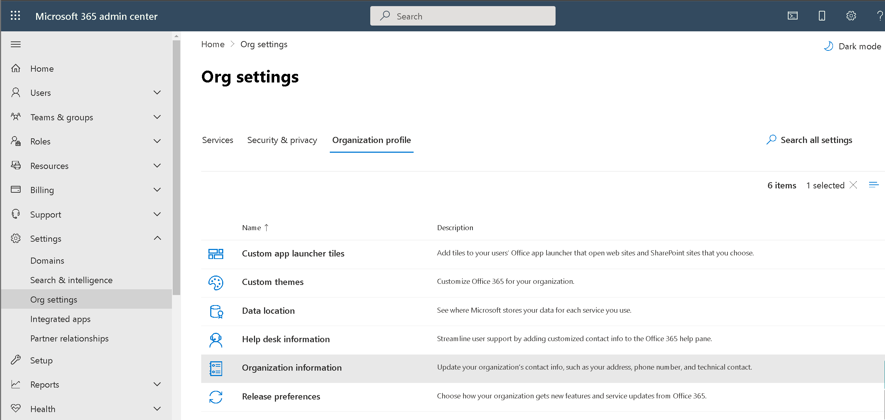
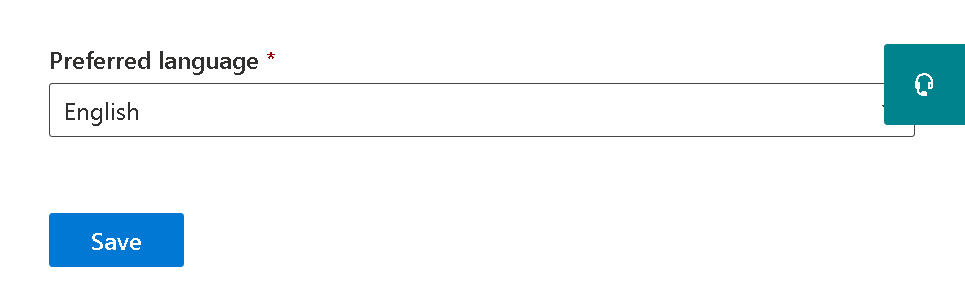

# Change the default language for greetings and emails

If you are an [Office 365 global administrator](https://support.office.com/article/da585eea-f576-4f55-a1e0-87090b6aaa9d), you can set up Skype for Business to play its default voicemail greeting in another language. The default system greeting is something like, "Please leave a message for John Smith. After the tone, please record your message. When you finish recording, hang up, or press the pound key for more options." 
  
 **First, read this important info:**
  
- **The languages that are available to you are determined by the location of your organization**. For example, if your organization is located in the United States, you can set the default language to English or Spanish. If your organization is located in Canada, you can choose between English and French. For a list of supported languages, see [Languages for voicemail greetings and messages from Skype for Business](languages-for-voicemail-greetings-and-messages.md).
    
- **There's no way to change the system language for only one person in your organization.** You can only change the greeting language for everyone on your organization.
    
    > [!NOTE]
    > Users can change their own greeting language through their settings after they sign in. 
  
- **Do you want to record your outgoing voicemail message?** See [Check Skype for Business voicemail and options](https://support.office.com/article/2deea7f8-831f-4e85-a0d4-b34da55945a8).

- **Do you want to change the voicemail prompt language?** Go to [https://mysettings.lync.com/voicemail](https://mysettings.lync.com/voicemail) and choose a new language under **Prompt Language**.
    
## Change the system language for everyone in your organization

1. Sign in with your [Office 365 global administrator](https://support.office.com/article/da585eea-f576-4f55-a1e0-87090b6aaa9d) account at[https://portal.office.com/adminportal/home](https://portal.office.com/adminportal/home). 
    
2. In the Microsoft 365 admin center, choose **Settings** > **Organization profile**. 
    
     
  
3. Choose **Edit**.
    
    
  
4. Select a language from the **Preferred language** list for everyone in your organization.
    
5. Choose **Save**.
    
## Related articles for the admin

- [Phone System and Calling Plans](calling-plan-landing-page.md)
    
- [Set up Calling Plans](set-up-calling-plans.md)
    
- [Plan Phone System in Office 365 with on-premises PSTN connectivity in Skype for Business Server](https://go.microsoft.com/fwlink/?LinkId=717947)
    
## Related topics

- [Change your display language and time zone in Office 365 for Business](https://support.office.com/article/Change-your-display-language-and-time-zone-in-Office-365-for-Business-6f238bff-5252-441e-b32b-655d5d85d15b)
    
- [Add a language or set language preferences in Office 2010 and later](https://support.office.com/article/Add-a-language-or-set-language-preferences-in-Office-663d9d94-ca99-4a0d-973e-7c4a6b8a827d))
    
- [Enable or change a keyboard layout language](https://support.office.com/article/Enable-or-change-a-keyboard-layout-language-1c2242c0-fe15-4bc3-99bc-535de6f4f258)
    
  
 
