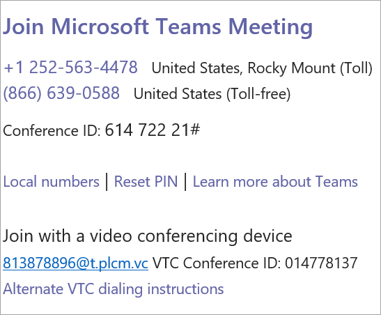

# Set up Cloud Video Interop for Microsoft Teams

After you have [chosen on your Cloud Video Interop partner(s)](cloud-video-interop.md), you will need to plan your deployment, get set up with provisioning details and partner tenant key, and consent to the video interop app in your organization. The following diagram outlines the process. 

## Plan

See [Cloud Video Interop for Microsoft Teams](cloud-video-interop.md) for information about identifying a partner or partners to use in your organization. 

To plan for user based/concurrent/site wide enablement: 

- Pick a deployment model/hosted model for your use
- Select the license plan ideal for your organization. 
- Plan for capacity of VMs is you are hosting your video infrastructure.

## Configure 

To configure Cloud Video Interop, follow these steps. 

1. Obtain configuration info from the partner/partners you have chosen (tenant key, appIds…). You can use one or more video interop partners in your organization 

2. Ensure that your network is configured correctly. Configure your standards-based video firewall for perimeter network traversal to support. For example: 
    - Cisco VCS-e				   
    - Polycom RPAD

3. Configure integrated rooms with exchange and OTD. In most cases, additional relay would need to be set up and configured in your environment.

## Provision
 
The tenant key will be the dial out to the partner service. In the following example, 813878896@t.plcm.vc is the tenant key. 

 

You will need to execute the following cmdlets to provision the tenant key, and also enable select users or your whole organization to create meetings with video interop coordinates.

 
- **[Get-CsTeamsVideoInteropServicepolicy](https://docs.microsoft.com/powershell/module/skype/get-csteamsvideointeropservicepolicy):** 
Microsoft provides pre-constructed policies for each of our supported partners that allow you to designate which partner(s) to use for cloud video interop.

    This cmdlet allows you to identify the pre-constructed policies that you can use in your organization. You can assign this policy to one or more of your users leveraging the Grant-CsTeamsVideoInteropServicePolicy cmdlet.
 
- **[Grant-CsTeamsVideoInteropServicePolicy](https://docs.microsoft.com/powershell/module/skype/grant-csteamsvideointeropservicepolicy):**
The Grant-CsTeamsVideoInteropServicePolicy cmdlet allows you to assign a pre-constructed policy for use in your organization or assign the policy to specific users.
 
- **[New-CsVideoInteropServiceProvider](https://docs.microsoft.com/powershell/module/skype/new-csvideointeropserviceprovider):**
Use the New-CsVideoInteropServiceProvider to specify information about a supported CVI partner your organization would like to use.
 
- **[Set-CsVideoInteropServiceProvider](https://docs.microsoft.com/powershell/module/skype/set-csvideointeropserviceprovider):**
Use the Set-CsVideoInteropServiceProvider to update information about a supported CVI partner your organization uses.
 
- **[Get-CsVideoInteropServiceProvider](https://docs.microsoft.com/powershell/module/skype/get-csvideointeropserviceprovider):**
Get all of the providers that have been configured for use within the organization.
 
- **[Remove-CsVideoInteropServiceProvider](https://docs.microsoft.com/powershell/module/skype/remove-csvideointeropserviceprovider):**
Use Remove-CsVideoInteropServiceProvider to remove all provider information about a provider that your organization no longer uses.  
 
## Consent

You will need to provide permission consent for the video teleconferencing devices (VTCs) to join your organizations meetings via the partner service. This consent link will also be provided by your partner.  
 
When these steps are complete, the users who are individually enabled via the Grant cmdlet above, or all of the users in the organization if the tenant is enabled, will have VTC coordinates in all the Teams meetings that they schedule. Any VTC can join these meetings via those coordinates.

|Name|Application Permission Short Description| Description|
|--|--|---|
|Calls.JoinGroupCall.All|Join Group Calls and Meetings as an app (preview)|Allows the app to join group calls and scheduled meetings in your organization, without a signed-in user.  The app will be joined with the privileges of a directory user to meetings in your tenant.|
|Calls.JoinGroupCallasGuest.All|Join Group Calls and Meetings as a guest user (preview)|Allows the app to anonymously join group calls and scheduled meetings in your organization, without a signed-in user.  The app will be joined as a guest to meetings in your tenant.|
|Calls.AccessMedia.All|Access media streams in a call as an app (preview)|Allows the app to get direct access to media streams in a call, without a signed-in user.|
|OnlineMeetings.Read.All|Read Online Meeting details (preview)|Allows the app to read Online Meeting details in your organization, without a signed-in user.|

## Schedule

Next, schedule Teams meeting with video interop coordinates. The enabled user can schedule teams meetings via:
- [Teams Meeting add-in for Outlook](teams-add-in-for-outlook.md)
- Teams client desktop and mobile

## Join

You can join Teams meetings with your VTC devices in the following ways:
 
- IVR (Interactive voice Response)
    - You can dial in to the partner's IVR using the tenantkey@domain. 
    - Once you are in the partner IVR, you will be prompted to enter the VTC conferenceId, which will then connect you to the Teams meeting.
- Direct dial
    - You can directly dial into the Teams meeting without interacting with the partner’s IVR by using the direct dial feature using the full string of tenantkey.VTC ConferenceId@domain.
- One-touch dial
    - If you have an integrated Teams room, you can use the one-touch dial capabilities offered by your partner (without needing to type any dial string).

Finally, engage with Teams users in your meetings using audio, video, and content sharing. 