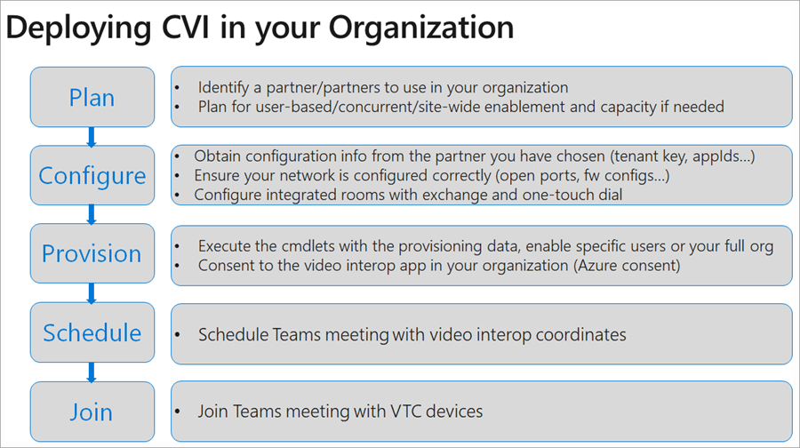

# Cloud Video Interop for Microsoft Teams

Cloud Video Interop (CVI) is a Microsoft Qualified third-party solution that enables third-party meeting rooms (telepresence) and personal video devices (VTCs) to join Microsoft Teams meetings.
 
With Microsoft Teams, you get rich online content collaboration in meetings that include audio, video, and content sharing. This can be enjoyed through the desktop and web client, as well as through many partner devices that integrate natively with Microsoft Teams. However, many customers have already invested in video teleconferencing and personal video communication devices, which can be expensive to upgrade. Cloud Video Interop provides an easy solution, allowing you to keep using your existing solutions until you are ready to upgrade.

With Cloud Video Interop, Microsoft Teams delivers a native meeting experience for all participants – in meeting rooms or inside of Teams clients.

### Is Cloud Video Interop for me?

Cloud Video Interop provides an intermediate service while you transition to a full native Microsoft Teams Solution, using Teams endpoints. The service provided should be part of your migration path.

Cloud Video Interop is intended for customers who meet the following criteria:

- Have a large deployment of meeting room devices and personal video devices deployment (50+ devices) that are not qualified for direct integration with Microsoft Teams
- Are supported by one of our Cloud Video Interop partners
- Want to retain the value of their investment in their current meeting room devices and personal video devices during the migration to a native Microsoft Teams solution

While Cloud Video Interop provides a great intermediate solution, we encourage our customers to look into our native Teams Meeting solutions, such as Teams Room Systems, for the long term. 

### Partners Certified for Microsoft Teams

The following partners have video interop solutions for Microsoft Teams. Your company may choose to work with any combination of these partners within your enterprise. 

|Partner|Partner solution|
|----|---|
| | <a href="https://aka.ms/PolycomRealConnect" target="_blank">Polycom RealConnect Service</a> |
|| <a href="https://aka.ms/PexipInfinity" target="_blank">Pexip Infinity for Microsoft Teams</a> | 
|| <a href="https://aka.ms/BluejeansGateway" target="_blank">BlueJeans Gateway for Microsoft Teams</a> |

### Cloud Video Interop overview

Cloud Video Interop is a third-party service that is offered by our partners to provide interoperability between existing video conferencing and personal video device solutions on premises, and Microsoft Teams.

The solutions offered by our partners consist of components that can be deployed either fully cloud based or partially/fully on premises. 
     
The following diagram shows the high-level architecture of our partner solutions.

## Deploy Cloud Video Interop

When deploying a Cloud Video Interop solution, it’s important to understand that you are deploying a partner solution. The general steps you should take to deploy Cloud Video Interop are listed in the following diagram.

### Plan

During the plan phase, you should identify the devices that you will not replace with a native Teams device, and find a Cloud Video Interop partner that can support these devices.  

It’s also important to understand that you will need a license for each user who will schedule meetings in which you want a Cloud Video Interop-enabled device to join. Note that exact licensing requirements can be obtained from the Cloud Video Interop partner. Ensure that this is clear before you start your deployment.

### Configure

The partner that you have chosen for your CVI deployment will provide you with a full deployment document that consists of all the steps needed to deploy successfully within your organization. This will include firewall ports and IP ranges, configuration changes for your devices, and other settings that need to change.

### Provision  

During the provision phase, you will assign licenses to the appropriate users according to the partner configuration guide. You will also need to go through the Azure Consent process to provide the partner access to your Teams environment. More information on the Azure Consent process can be found here: https://docs.microsoft.com/en-us/azure/active-directory/develop/v2-permissions-and-consent 

### Schedule

After a user is enabled for Cloud Video Interop, any meeting scheduled using either the Teams Meeting Add-in for Outlook or the Teams Client will have the appropriate additional information automatically added into the Teams meeting so that Cloud Video Interop-compatible devices can join these meetings.

### Join

Depending on the partner solution, there are several ways to join a Cloud Video Interop-enabled meeting. Exact meeting join scenarios will be provided by your Cloud Video Interop partner. We’ve listed some examples below:

- IVR (Interactive Voice Response) 
  - You can dial in to the partner's IVR using the tenantkey@domain.
  - When you are in the partner IVR, you will be prompted to enter the VTC conferenceId, which will then connect you to the Teams meeting.
- Direct dial 
  - You can directly dial in to the Teams meeting without interacting with the partner’s IVR by using the direct dial feature, using the full string of tenantkey.VTC ConferenceId@domain.
- One-touch dial 
  - If you have an integrated Teams room, you can use the one-touch dial capabilities offered by your partner (without needing to type any dial string).

## Manage Cloud Video Interop

After Cloud Video Interop is deployed, you can manage the devices using the solutions provided by our partners. Each partner will provide you with an administrative interface that will include both license and device management. 

Reporting is also available directly from the partner administrative interface. For more information on reporting capabilities, contact the partner of your choice. 

### Troubleshooting Cloud Video Interop

Cloud Video Interop is a partner-provided service. If you are experiencing issues, the first step is to connect a device that has the Teams Client installed and connect it to the same segment as the Cloud Video Interop device that is causing problems. 

If Teams functions correctly on this segment, and you have also followed all the networking and configuration guidelines the partner has provided, you will need to contact the partner for further troubleshooting. 

## PowerShell for Cloud Video Interop

The following PowerShell cmdlets are available for you to (partially) automate the Cloud Video Interop deployment.

- **Get-CsTeamsVideoInteropServicepolicy**: Microsoft provides pre-constructed policies for each of our supported partners that allow you to designate which partner(s) to use for Cloud Video Interop. This cmdlet allows you to identify the pre-constructed policies that you can use in your organization. You can assign this policy to one or more of your users by leveraging the Grant-CsTeamsVideoInteropServicePolicy cmdlet.
- **Grant-CsTeamsVideoInteropServicePolicy**: This cmdlet allows you to assign a pre-constructed policy for use in your organization or assign the policy to specific users.
- **New-CsVideoInteropServiceProvider**: Use this cmdlet to specify information about a supported CVI partner that your organization would like to use.
- **Set-CsVideoInteropServiceProvider**: Use this cmdlet to update information about a supported CVI partner that your organization uses.
- **Get-CsVideoInteropServiceProvider**: Use this cmdlet to get all of the providers that have been configured for use within the organization.
- **Remove-CsVideoInteropServiceProvider**: Use this cmdlet to remove all provider information about a provider that your organization no longer uses.
