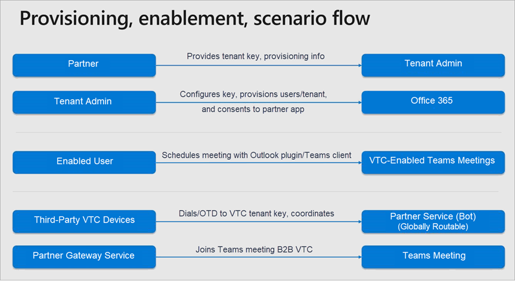
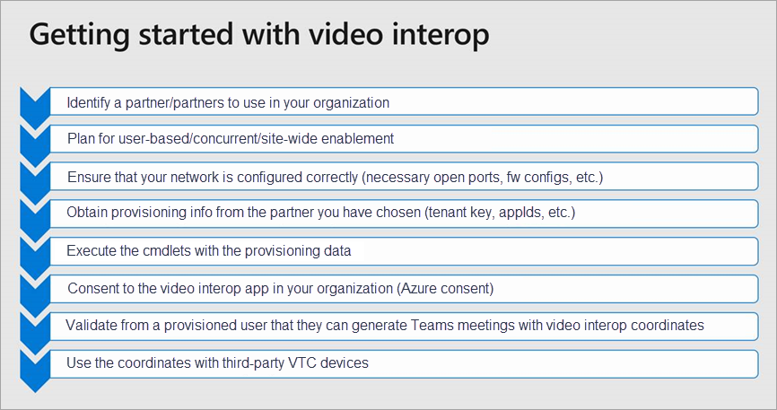

# Cloud Video Interop for Microsoft Teams

Cloud Video Interop enables third-party meeting room devices to join Microsoft Teams meetings.

Video teleconferencing with content collaboration helps you make the most out of meetings. However, meeting room systems and devices are expensive to upgrade. Cloud Video Interop for Microsoft Teams works with systems and delivers a native meeting experience for all participants – in meeting rooms or inside of Teams clients. 

## Partners Certified for Microsoft Teams

The following partners have video interop solutions for Microsoft Teams. Your company may choose to work with any combination of these partners within your enterprise. 

|Partner|Partner solution|Availability|
|----|---|----|
| |   [Polycom RealConnect for Office 365](https://aka.ms/PolycomRealConnect)|Available now|
|| [Pexip Infinity for Microsoft Teams](https://aka.ms/PexipInfinity) | October 19, 2018|
||[BlueJeans Gateway for Microsoft Teams](https://aka.ms/BluejeansGateway) | October 31, 2018|

Our partners have developed gateway solutions to connect third-party standards-based SIP and H.323 devices to Microsoft Teams meetings.  
 
**Certified and supported by Microsoft**

- Only available via Certified Partner Solutions
- Co-engineered with Microsoft
- Customer TAP prior to certification

**Enterprise Ready**

- HD video (1080p) and Content (VBSS)
- Support for H.323 and SIP meeting room devices
 -Native Teams/Exchange scheduling
 -Gateway design instead of VMR

**Scales for the cloud**

- Deployed and managed in Azure
- Auto scale with cloud solutions

 
The following diagram describes the high-level architecture of a Teams partner solution.

The scenario flow is as follows:

 

Use the following chart as a guide to get started with video interop in your organization:

After choosing a partner or partners, you're ready to [Set up Cloud Video Interop for Microsoft Teams](cloud-video-interop-for-teams-set-up.md). 