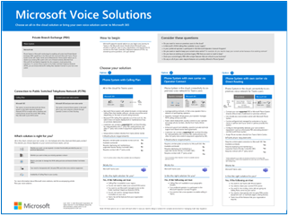
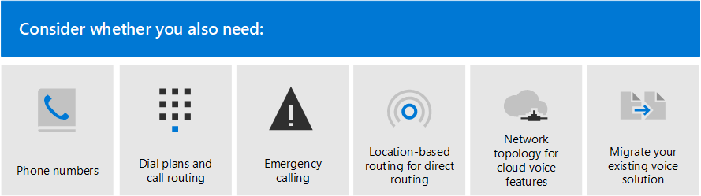
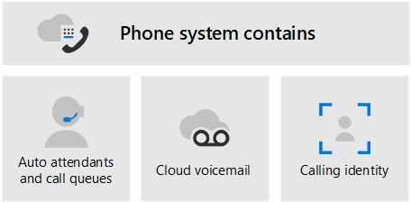

# Plan your Teams voice solution

This article helps you decide which Microsoft voice solution is right for your organization. After you've decided, the article provides a roadmap to content that will enable you to implement your chosen solution.

You might want the simplest solution&mdash;Phone System with Calling Plan. This option is Microsoft's all-in-the-cloud solution that provides Private Branch Exchange (PBX) functionality and calls to the Public Switched Telephone Network (PSTN), as shown in the following diagram. With this solution, Microsoft is your PSTN carrier.

If you answer yes to the following, then Phone System with Calling Plan is the right solution for you:

- Calling Plan is available in your region.
- You don't need to retain your current PSTN carrier.
- You want to use Microsoft-managed access to the PSTN.

However, your situation might be more complex. For example, you might have offices in locations where Calling Plan isn't available. Or you might need a combination solution that supports a complex, multi-national deployment, with different requirements for different geographic locations. Microsoft supports a combination of solutions:

- Phone System with Calling Plan
- Phone System with your own PSTN carrier with Operator Connect
- Phone System  with your own PSTN carrier with Direct Routing
- Phone System with your own PSTN mobile carrier with Operator Connect Mobile
- A combination solution that uses Phone System with Calling Plan, Phone System with Operator Connect, and/or Phone System with Direct Routing

For a visual summary of all the voice solution options, see the voice solutions poster.

   [PDF](https://download.microsoft.com/download/4/3/5/435cd4e9-ca56-4fd1-acb6-d1fda7952320/microsoft-voice-solutions.pdf)  [Visio](https://download.microsoft.com/download/7/5/c/75c13012-e20c-48bd-a6dd-ea49d1a3420d/microsoft-voice-solutions.vsdx) 
 

>[!NOTE]
>If you’re a small to medium business (300 or fewer people), Microsoft now bundles Phone System with a Domestic Calling Plan. For more information, see [Phone System guidance for small and medium businesses](/microsoftteams/business-voice/whats-business-voice) to help you plan, set up, and manage your voice solution.

## What do you need to read?

**Required for all.** Some of the sections in this article pertain to all organizations. For example, everyone should read about Phone System and understand the options for connecting to the Public Switched Telephone Network (PSTN).

| Required for all | Description |
| :------------|:-------|
| [**Phone System**](#phone-system) | Microsoft's technology for enabling call control and Private Branch Exchange (PBX) capabilities in the Microsoft 365 cloud with Microsoft Teams. |
| [**Public Switched Telephone Network (PSTN) connectivity options**](#public-switched-telephone-network-connectivity-options) | Choose Microsoft as your telephony carrier or connect your own telephony carrier to Microsoft Teams by using Operator Connect or Direct Routing. Combined with Phone System, PSTN connectivity options enable your users to make phone calls all over the world.|

**Depending on your requirements.** Some of the sections in this and related articles are pertinent depending on your existing deployment and requirements. For example, Location-Based Routing is only required for Direct Routing customers in geographic locations that do not allow toll bypass.

Consider which of these other configurations you might need:

| Depending on your requirements | Description |
| :------------|:-------|
| [**Phone number management**](pstn-connectivity.md#phone-number-management) | How to get and manage phone numbers differs depending on your PSTN connectivity option. Read this section if you need to obtain phone numbers, transfer existing numbers, obtain service numbers, and so on. |
| [**Call routing and dial plans**](pstn-connectivity.md#call-routing-and-dial-plans) | How to configure and manage dial plans that translate dialed phone numbers into an alternate format (typically E.164 format) for call authorization and call routing. Read this section if you need to understand what dial plans are and whether you need to specify dial plans for your organization.|
| [**Emergency calling**](pstn-connectivity.md#emergency-calling) | How to manage and configure emergency calling differs depending on your PSTN connectivity option. Read this section if you need to understand how to manage emergency calling for your organization. |
| [**Location-Based Routing for Direct Routing**](pstn-connectivity.md#location-based-routing-for-direct-routing) |How to use Location-Based Routing (LBR) to restrict toll bypass for Microsoft Teams users based on their geographic location. Read this section if your organization is using Direct Routing at a location that doesn't allow toll bypass.
| [**Network topology for cloud voice features**](pstn-connectivity.md#network-topology-for-voice-features) | If your organization is deploying Location-Based Routing (LBR) for Direct Routing or dynamic emergency calling, you must configure network settings for these features in Microsoft Teams. Read this section if you're implementing LBR for Direct Routing, or if you're implementing dynamic emergency calling with Calling Plan or Direct Routing. |
| [**Migrate your existing voice solution**](#migrate-your-existing-voice-solution-to-teams) | What you need to think about when migrating your voice solution to Teams.  Read this section if you're migrating from an existing voice solution to Teams. 

> [!Important]
> This article focuses on voice solutions with Microsoft Teams. Due to the retirement of Skype for Business Online on July 31, 2021, PSTN connectivity between your on-premises environment&mdash;whether through Skype for Business Server or Cloud Connector Edition&mdash;and Skype for Business Online is no longer supported. This article introduces Teams voice solutions and how you can connect your on-premises telephony network, if necessary, to Teams by using Operator Connect or Direct Routing.

## Phone System

Phone System is Microsoft's technology for enabling call control and Private Branch Exchange (PBX) capabilities in the Microsoft 365 cloud with Microsoft Teams.

Phone System works with Teams clients and certified devices. Phone System allows you to replace your existing PBX system with a set of features directly delivered from Microsoft 365. 

Calls between users in your organization--regardless of geographical area--are handled internally within Phone System. These internal calls never go to the Public Switched Telephone Network (PSTN), so your company avoids long-distance charges.

This article introduces the following Phone System key features and functionality, and the deployment decisions you'll need to consider:

- [Auto attendants and call queues](#auto-attendants-and-call-queues)
- [Cloud Voicemail](#cloud-voicemail)
- [Calling identity](#calling-identity)

For information about all Phone System features, and how to set up Phone System, see the following articles:

- [Here's what you get with Phone System](here-s-what-you-get-with-phone-system.md)
- [Set up Phone System in your organization](setting-up-your-phone-system.md) 
  Describes how to buy and assign Phone System licenses, manage phone numbers, and set up communication credits for toll-free numbers. 

For information about managing supported devices, see [Manage your devices in Microsoft Teams](devices/device-management.md) and [Teams Marketplace](https://www.microsoft.com/microsoft-365/microsoft-teams/across-devices?ms.url=officecomteamsdevices&rtc=1).

### Auto attendants and Call queues

Auto attendants allow you to set up menu options to route calls based on caller input. Call queues are waiting areas for callers. Used together, auto attendants and call queues can easily route callers to the appropriate person or department in your organization.

For information about auto attendants and call queues, see the following articles:

- [Plan for Teams auto attendants and call queues](plan-auto-attendant-call-queue.md)
- [Set up an auto attendant](create-a-phone-system-auto-attendant.md)
- [Create a call queue](create-a-phone-system-call-queue.md) 
- [Contoso case study: Auto attendants and call queues](voice-case-study-call-queues.md) 
  Describes how a fictional multi-national corporation, Contoso, implemented auto attendants and call queues for their voice solution.

### Cloud Voicemail

Cloud Voicemail, powered by Azure Voicemail services, supports voicemail deposits to Exchange mailboxes only. It doesn't support third-party email systems. 

Cloud Voicemail includes voicemail transcription, which is enabled for all users in your organization by default. Your business needs might require that you disable voicemail transcription for specific users or everyone throughout the organization.

Cloud Voicemail is automatically set up and provisioned for Teams users.  

For more information about Cloud Voicemail and its configuration, see the following articles:

- [Set up Cloud Voicemail](set-up-phone-system-voicemail.md)
- [Set voicemail policies in your organization](manage-voicemail-policies.md)

### Calling identity

By default, all outbound calls use the assigned phone number as calling identity (caller ID). The recipient of the call can quickly identify the caller and decide whether to accept or reject the call. For information about configuring caller ID or to change or block the caller ID, see [Set the caller ID for a user](set-the-caller-id-for-a-user.md). 

## Public Switched Telephone Network connectivity options

Phone System provides complete PBX capabilities for your organization. However, to enable users to make calls outside your organization, you need to connect Phone System to the Public Switched Telephone Network (PSTN). To connect Phone System to the PSTN, you can choose one of the following options:

- [**Phone System with Calling Plan**](pstn-connectivity.md#phone-system-with-calling-plan). An all-in-the-cloud solution with Microsoft as your PSTN carrier.

- [**Phone System with your own PSTN carrier by using Operator Connect**](operator-connect-plan.md). With Operator Connect, if your existing operator is a participates in the Microsoft Operator Connect program, they can manage the service for bringing PSTN calling to Teams. For information on the benefits and requirements of Operator Connect, see [Plan Operator Connect](operator-connect-plan.md).

- [**Phone System with your own PSTN mobile carrier by using Operator Connect Mobile**](operator-connect-mobile-plan.md). With Operator Connect Mobile, if your existing operator participates in the Microsoft Operator Connect Mobile program, they can manage the service for using SIM-enabled mobile phone numbers with Teams. For information on the benefits and requirements of Operator Connect, see [Plan Operator Connect Mobile](operator-connect-mobile-plan.md).

- [**Phone System with your own PSTN carrier by using Direct Routing**](pstn-connectivity.md#phone-system-with-direct-routing) to connect your on-premises environment to Teams.

You can choose a combination of options, which enables you to design a solution for a complex environment, or manage a multi-step migration. You'll read more about migration later.

Most Phone System features are the same regardless of the PSTN connectivity option you choose. There are some differences in functionality, however, that affect how you configure certain Phone System features, such as call routing and emergency calling. For more information about PSTN connectivity options and configuration considerations, see [PSTN connectivity options](pstn-connectivity.md).

## Migrate your existing voice solution to Teams

> [!NOTE]
> For guidance on planning a Teams voice solution as part as your overall plan to upgrade to Teams from Skype for Business Server, see [PSTN considerations for upgrading to Teams from Skype for Business on-premises](upgrade-to-teams-on-prem-pstn-considerations.md).

For an organization that is upgrading to Teams, the ultimate goal is to move all users to TeamsOnly mode. Using Phone System is only supported when the user is in TeamsOnly mode. If you need basic information about upgrading to Teams, start here:

- [Getting started with your Microsoft Teams upgrade](upgrade-start-here.md)
- [About the upgrade framework](upgrade-framework.md)
- [Upgrade strategies for IT administrators](upgrade-to-teams-on-prem-implement.md)

When migrating your voice solution, there are four possible calling scenarios when moving to TeamsOnly mode:

- [**A user in Skype for Business Online, with a Microsoft Calling Plan**](upgrade-to-teams-on-prem-pstn-considerations.md#from-skype-for-business-online-with-microsoft-calling-plans). Upon upgrade, this user will continue to have a Microsoft Calling Plan.

- **[A user in Skype for Business Online, with on-premises voice functionality](upgrade-to-teams-on-prem-pstn-considerations.md#from-skype-for-business-online-with-on-premises-voice) through Skype for Business on-premises or Cloud Connector Edition**. The user’s upgrade to Teams needs to be coordinated with migration of the user to Direct Routing to ensure the TeamsOnly user has PSTN functionality.

- **[A user in Skype for Business on-premises with Enterprise Voice](upgrade-to-teams-on-prem-pstn-considerations.md#from-skype-for-business-server-on-premises-with-enterprise-voice-to-direct-routing), who will be moving to online and keeping on-premises PSTN connectivity**. Migrating this user to Teams requires moving the user’s on-premises Skype for Business account to the cloud, and coordinating that move with migration of the user to Direct Routing. 

- **[A user in Skype for Business on-premises with Enterprise Voice](upgrade-to-teams-on-prem-pstn-considerations.md#from-skype-for-business-server-on-premises-with-enterprise-voice-to-microsoft-calling-plan), who will be moving to online and using a Microsoft Calling plan**.  Migrating this user to Teams requires moving the user’s on-premises Skype for Business account to the cloud, and coordinating that move with either A) the port of that user’s phone number to a Microsoft Calling Plan or B) assigning a new subscriber number from available regions.

For more information about how to implement your voice migration for each of these scenarios, see the following articles:

- [PSTN considerations when upgrading to Teams — for IT administrators](upgrade-to-teams-on-prem-pstn-considerations.md)

- [Contoso voice migration case study](voice-case-study-overview.md) 
  The case study describes how a fictional multi-national corporation, Contoso, implemented a Teams voice solution for their organization. It contains the following articles:

  - [Teams upgrade plan](voice-case-study-migration-plan.md)
  - [Phone System and PSTN connectivity options](voice-case-study-phone-system.md)
  - [Location-Based Routing implementation](voice-case-study-location-based-routing.md)
  - [Emergency calling](voice-case-study-emergency-calling.md)
  - [Auto attendants and call queues](voice-case-study-call-queues.md)
  - [Audio Conferencing](voice-case-study-audio-conferencing.md)
