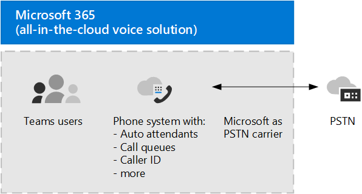

# Plan your Teams voice solution 

This article helps you decide which Microsoft voice solution is right for your organization. After you've decided, the article provides a roadmap to content that will enable you to implement your chosen solution.

> [!NOTE]
> For guidance on planning a Teams voice solution as part as your overall plan to upgrade to Teams from Skype for Business Server, see [PSTN considerations for upgrading to Teams from Skype for Business on-premises](upgrade-to-teams-on-prem-pstn-considerations.md).

You might want the simplest solution&mdash;Phone System with Calling Plan. This is Microsoft's all-in-the-cloud solution that provides Private Branch Exchange (PBX) functionality and calls to the Public Switched Telephone Network (PSTN), as shown in the following diagram. With this solution, Microsoft is your PSTN carrier.

If you answer yes to the following, then Phone System with Calling Plan is the right solution for you:

- Calling Plan is available in your region.
- You do not need to retain your current PSTN carrier.
- You want to use Microsoft-managed access to the PSTN.

However, your situation might be more complex. For example, you might have offices in locations where Calling Plan isn't available. Or you might need a combination solution that supports a complex, multi-national deployment, with different requirements for different geographic locations. Microsoft supports a combination of solutions: 

- Phone System with Calling Plan
- Phone System with your own PSTN carrier with Operator Connect (currently available only in **public preview**)
- Phone System with your own PSTN carrier with Direct Routing
- A combination solution that uses Phone System with Calling Plan, Phone System with Operator Connect, and/or Phone System with Direct Routing

## What do you need to read?

**Required for all.** Some of the sections in this article pertain to all organizations. For example, everyone should read about Phone System and understand the options for connecting to the Public Switched Telephone Network (PSTN). 

| Required for all | Description |
| :------------|:-------|
| [**Phone System**](#phone-system) | Microsoft's technology for enabling call control and Private Branch Exchange (PBX) capabilities in the Microsoft 365 cloud with Microsoft Teams. |
| [**Public Switched Telephone Network (PSTN) connectivity options**](#public-switched-telephone-network-connectivity-options) | A choice between using Microsoft as your telephony carrier or connecting your own telephony carrier to Microsoft Teams by using Direct Routing or Operator Connect. Combined with Phone System, PSTN connectivity options enable your users to make phone calls all over the world.|

**Depending on your requirements.** Some of the sections in this article are pertinent depending on your existing deployment and requirements. For example, Location-Based Routing is only required for Direct Routing customers in geographic locations that do not allow toll bypass.

Consider which of these additional configurations you might need:

| Depending on your requirements | Description |
| :------------|:-------|
| [**Phone numbers from Microsoft**](#phone-numbers-from-microsoft) | How to get and manage phone numbers from Microsoft, and how to transfer existing numbers to Microsoft. Read this if you need to obtain phone numbers for Microsoft Calling Plan, transfer existing numbers, obtain service numbers, and so on. |
| [**Dial plans and call routing**](#dial-plans-and-call-routing) | How to configure and manage dial plans that translate dialed phone numbers into an alternate format (typically E.164 format) for call authorization and call routing. Read this if you need to understand what dial plans are and  whether you need to specify dial plans for your organization.|
| [**Emergency calling**](#emergency-calling) | How to manage and configure emergency calling&mdash;depending on your PSTN connectivity option. Read this section if you are using Microsoft Calling Plan or Direct Routing and need to understand how to manage emergency calling for your organization. |
| [**Location-Based Routing for Direct Routing**](#location-based-routing-for-direct-routing) |How to use Location-Based Routing (LBR) to restrict toll bypass for Microsoft Teams users based on their geographic location. Read this section if your organization is using Direct Routing at a location that does not allow toll bypass.
| [**Network topology for cloud voice features**](#network-topology-for-voice-features) | If your organization is deploying Location-Based Routing (LBR) for Direct Routing or dynamic emergency calling, you must configure network settings for use with these features in Microsoft Teams. Read this section if you are implementing LBR for Direct Routing, or if you are implementing dynamic emergency calling with Calling Plan or Direct Routing. |
| [**Migrate your existing voice solution**](#migrate-your-existing-voice-solution-to-teams) | What you need to think about when migrating your voice solution to Teams.  Read this section if you are migrating from an existing voice solution to Teams. 

> [!Important]
> This article focuses on voice solutions with Microsoft Teams. While solutions with Skype for Business Online are still available (as described in [Microsoft telephony solutions](/SkypeForBusiness/hybrid/msft-telephony-solutions)), it's important to understand that Skype for Business Online will be retired on July 31, 2021.  After that date, the Skype for Business Online service will no longer be accessible. In addition, PSTN connectivity between your on-premises environment&mdash;whether through Skype for Business Server or Cloud Connector Edition&mdash;and Skype for Business Online will no longer be supported. This article introduces Teams voice solutions and how you can connect your on-premises telephony network, if necessary, to Teams by using Direct Routing or Operator Connect.

## Phone System

Phone System is Microsoft's technology for enabling call control and Private Branch Exchange (PBX) capabilities in the Microsoft 365 or Office 365 cloud with Microsoft Teams.

Phone System works with Teams or Skype for Business clients and certified devices. Phone System allows you to replace your existing PBX system with a set of features directly delivered from Microsoft 365 or Office 365. 

Calls between users in your organization are handled internally within Phone System, and never go to the Public Switched Telephone Network (PSTN). This applies to calls between users in your organization located in different geographical areas, removing long-distance costs on these internal calls.

This article introduces the following Phone System key features and functionality, and the deployment decisions you'll need to consider:

- [Auto attendants and call queues](#auto-attendants-and-call-queues)
- [Cloud Voicemail](#cloud-voicemail)
- [Calling identity](#calling-identity)

For information about all Phone System features, and how to set up Phone System, see the following articles:

- [Here's what you get with Phone System](here-s-what-you-get-with-phone-system.md)
- [Set up Phone System in your organization](setting-up-your-phone-system.md) 
  Describes how to buy and assign Phone System licenses, manage phone numbers, and set up communication credits for toll-free numbers. 

For information about managing supported devices, see [Manage your devices in Microsoft Teams](devices/device-management.md) and [Teams Marketplace](https://www.microsoft.com/microsoft-365/microsoft-teams/across-devices?ms.url=officecomteamsdevices&rtc=1).

### Auto attendants and Call queues

Auto attendants allow you to set up menu options to route calls based on caller input. Call queues are waiting areas for callers. Used together, auto attendants and call queues can easily route callers to the appropriate person or department in your organization.

For information about auto attendants and call queues, see the following articles:

- [Plan for Teams auto attendants and call queues](plan-auto-attendant-call-queue.md)
- [Set up an auto attendant](create-a-phone-system-auto-attendant.md)
- [Create a call queue](create-a-phone-system-call-queue.md) 
- [Contoso case study: Auto attendants and call queues](voice-case-study-call-queues.md) 
  Describes how a fictional multi-national corporation, Contoso, implemented auto attendants and call queues for their voice solution.

### Cloud Voicemail

Cloud Voicemail, powered by Azure Voicemail services, supports voicemail deposits to Exchange mailboxes only. It doesn't support third-party email systems. 

Cloud Voicemail includes voicemail transcription, which is enabled for all users in your organization by default. Your business needs might require that you disable voicemail transcription for specific users or everyone throughout the organization.

For online only users, Cloud Voicemail is automatically set up and provisioned for users after they are assigned a Phone System license. For Phone System users with an Exchange mailbox, you will need to perform extra configuration steps. 

For more information about Cloud Voicemail and its configuration, see the following articles:

- [Set up Cloud Voicemail](set-up-phone-system-voicemail.md)
- [Set voicemail policies in your organization](set-up-phone-system-voicemail.md#setting-voicemail-policies-in-your-organization)

### Calling identity

By default, all outbound calls use the assigned phone number as calling identity (caller ID). The recipient of the call can quickly identify the caller and decide whether to accept or reject the call. For information about configuring caller ID or to change or block the caller ID, see [Set the caller ID for a user](set-the-caller-id-for-a-user.md). 

## Public Switched Telephone Network connectivity options

Phone System provides complete PBX capabilities for your organization. However, to enable users to make calls outside your organization, you need to connect Phone System to the Public Switched Telephone Network (PSTN). To connect Phone System to the PSTN, you can choose one of the following options:

- [**Phone System with Calling Plan**](#phone-system-with-calling-plan). An all-in-the-cloud solution with Microsoft as your PSTN carrier.

- [**Phone System with your own PSTN carrier by using Direct Routing**](#phone-system-with-own-pstn-carrier-with-direct-routing) to connect your on-premises environment to Teams.

- [**Phone System with your own PSTN carrier by using Operator Connect**](operator-connect-plan.md), which is currently available only in **public preview.**  With Operator Connect, if your existing operator is a participant in the Microsoft Operator Connect program, they can manage the service for bringing PSTN calling to Teams. For information on the benefits and requirements of Operator Connect, and for a list of operators participating in this program, see [Plan Operator Connect](operator-connect-plan.md).

You can also choose a combination of options, which enables you to design a solution for a complex environment, or manage a multi-step migration (more about migration later).

### Phone System with Calling Plan 

As described earlier in this article, Phone System with Calling Plan is Microsoft's all-in-the-cloud voice solution for Teams users. This is the simplest option that connects Microsoft Phone System to the Public Switched Telephone Network (PSTN) to enable calls to landlines and mobile phones around the world. With this option, Microsoft provides Private Branch Exchange (PBX) functionality for your organization and acts as your PSTN carrier, as shown in the following diagram:

If you answer yes to the following, then Phone System with Calling Plan is the right solution for you:

- Calling Plan is available in your region.
- You do not need to retain your current PSTN carrier.
- You want to use Microsoft-managed access to the PSTN.

With this option: 

- You get Microsoft Phone System with added Domestic or International Calling Plans that enable calling to phones around the world (depending on the level of service being licensed).

- You do not require deployment or maintenance of an on-premises deployment&mdash;because Calling Plan operates out of Microsoft 365 or Office 365.

- Note: If necessary, you can choose to connect a supported Session Border Controller (SBC) through Direct Routing for interoperability with third-party PBXs, analog devices, and other third-party telephony equipment supported by the SBC.

This option requires uninterrupted connection to Microsoft 365 or Office 365.

For more information about Calling Plan, see the following articles:

- [Which Calling Plan is right for you?](calling-plan-landing-page.md)
- [How to buy a Calling Plan](calling-plans-for-office-365.md)
- [Country and region availability for Calling Plan](./country-and-region-availability-for-audio-conferencing-and-calling-plans/country-and-region-availability-for-audio-conferencing-and-calling-plans.md)
- [Set up Calling Plan](set-up-calling-plans.md)

### Phone System with own PSTN carrier with Direct Routing

This option connects Microsoft Phone System to your telephony network by using Direct Routing, as shown in the following diagram: 

If you answer yes to the following questions, then Phone System with Direct Routing is the right solution for you:

- You want to use Teams with Phone System.
- You need to retain your current PSTN carrier.
- You want to mix routing, with some calls going through Calling Plan, some through your carrier.
- You need to interoperate with third-party PBXs and/or equipment such us overhead pagers, analog devices, and so on.

With this option:

- You connect your own supported SBC to Microsoft Phone System without the need for additional on-premises software.

- You can use virtually any telephony carrier with Microsoft Phone System.

- You can choose to configure and manage this option, or it can be configured and managed by your carrier or partner (ask if your carrier or partner provides this option).

- You can configure interoperability between your telephony equipment&mdash;such as a third-party PBX and analog devices&mdash;and Microsoft Phone System.

This option requires the following:

- Uninterrupted connection to Microsoft 365 or Office 365.

- Deploying and maintaining a supported SBC.

- A contract with a third-party carrier.
  (Unless deployed as an option to provide connection to third-party PBX, analog devices, or other telephony equipment for users who are on Phone System with Calling Plan.)

For more information about Direct Routing, see the following articles:

- [Phone System Direct Routing](direct-routing-landing-page.md)
- [Plan Direct Routing](direct-routing-plan.md)
- [Configure Direct Routing](direct-routing-configure.md)
- [Manage voice routing policies for use with Direct Routing](manage-voice-routing-policies.md)
- [Plan Location-Based Routing for Direct Routing](location-based-routing-plan.md)
- [List of Session Border Controllers certified for Direct Routing](direct-routing-border-controllers.md)

## Phone numbers from Microsoft

Microsoft has two types of telephone numbers available: *subscriber* (user) numbers, which can be assigned to users in your organization, and *service* numbers, available as toll and toll-free service numbers. Service numbers have higher concurrent call capacity than subscriber numbers and can be assigned to services such as Audio Conferencing, Auto Attendants, or Call Queues.

You will need to decide:

- Which user locations need new phone numbers from Microsoft?
- Which type of telephone number (subscriber or service) do I need? 
- How do I port existing phone numbers to Teams?

For more information about managing phone numbers in your organization, including getting new numbers or transferring exiting numbers, see the following articles:

- [Manage phone numbers for your organization](manage-phone-numbers-for-your-organization/manage-phone-numbers-for-your-organization.md) 
- [Different kinds of phone numbers used for Calling Plan](different-kinds-of-phone-numbers-used-for-calling-plans.md)
- [Getting phone numbers for your users](getting-phone-numbers-for-your-users.md)
- [Transfer phone numbers to Microsoft Teams](phone-number-calling-plans/transfer-phone-numbers-to-teams.md)

## Dial plans and call routing

A dial plan is a set of normalization rules that translate dialed phone numbers into an alternate format (typically E.164 format) for call authorization and call routing.

You will need to decide the following: 

- Does my organization need a customized dial plan?
- Which users require a customized dial plan?
- Which tenant dial plan should be assigned to each user?

For more information, see the following articles: 

- [What are dial plans?](what-are-dial-plans.md)
- [Plan for tenant dial plans](what-are-dial-plans.md#planning-for-tenant-dial-plans)
- [Create and manage dial plans](create-and-manage-dial-plans.md)

## Emergency calling

How you configure emergency calling differs depending on your PSTN connectivity option: Microsoft Calling Plan or Direct Routing. Dynamic emergency calling for Microsoft Calling Plan and Phone System Direct Routing provides the capability to configure and route emergency calls and notify security personnel based on the current location of the Teams client. For more information about emergency calling concepts and terminology, and how to configure dynamic emergency calling, see the following articles:

- [Manage emergency calling](what-are-emergency-locations-addresses-and-call-routing.md)
- [Plan and configure dynamic emergency calling](configure-dynamic-emergency-calling.md)
- [Contoso case study: Emergency calling](voice-case-study-emergency-calling.md) 
  Describes how a fictional multi-national corporation, Contoso, implemented emergency calling for their organization.

## Location-Based Routing for Direct Routing

In some countries and regions, it's illegal to bypass the Public Switched Telephone Network (PSTN) provider to decrease long-distance calling costs. Location-Based Routing for Direct Routing enables you to restrict toll bypass for Microsoft Teams users based on their geographic location. For more information about how to plan and configure Location-Based Routing (LBR), see the following articles:

- [Plan Location-Based Routing for Direct Routing](location-based-routing-plan.md)
- [Configure network settings for Location-Based Routing](location-based-routing-configure-network-settings.md)
- [Enable Location-Based Routing for Direct Routing](location-based-routing-enable.md)
- [Contoso case study: Location-Based Routing](voice-case-study-location-based-routing.md) 
  Describes how a fictional multi-national corporation, Contoso, implemented Location-Based Routing for their organization.

## Network topology for voice features

If you are deploying dynamic emergency calling or Location-Based Routing for Direct Routing, you must configure network settings for use with these features in Microsoft Teams. To learn how to configure network settings for network regions, network sites, network subnets, and trusted IP addresses, see the following articles:

- [Network settings for cloud voice features in Microsoft Teams - Concepts and terminology](cloud-voice-network-settings.md)
- [Manage your network topology for cloud voice features in Microsoft Teams](manage-your-network-topology.md)

## Migrate your existing voice solution to Teams

For an organization that is upgrading to Teams, the ultimate goal is to move all users to TeamsOnly mode. Using Phone System with Teams is only supported when the user is in TeamsOnly mode. If you need basic information about upgrading to Teams, start here:

- [Getting started with your Microsoft Teams upgrade](upgrade-start-here.md)
- [About the upgrade framework](upgrade-framework.md)
- [Upgrade strategies for IT administrators](upgrade-to-teams-on-prem-implement.md)

When migrating your voice solution, there are four possible calling scenarios when moving to TeamsOnly mode:

- [**A user in Skype for Business Online, with a Microsoft Calling Plan**](upgrade-to-teams-on-prem-pstn-considerations.md#from-skype-for-business-online-with-microsoft-calling-plans). Upon upgrade, this user will continue to have a Microsoft Calling Plan.

- **[A user in Skype for Business Online, with on-premises voice functionality](upgrade-to-teams-on-prem-pstn-considerations.md#from-skype-for-business-online-with-on-premises-voice) through Skype for Business on-premises or Cloud Connector Edition**. The user’s upgrade to Teams needs to be coordinated with migration of the user to Direct Routing to ensure the TeamsOnly user has PSTN functionality.

- **[A user in Skype for Business on-premises with Enterprise Voice](upgrade-to-teams-on-prem-pstn-considerations.md#from-skype-for-business-server-on-premises-with-enterprise-voice-to-direct-routing), who will be moving to online and keeping on-premises PSTN connectivity**. Migrating this user to Teams requires moving the user’s on-premises Skype for Business account to the cloud, and coordinating that move with migration of the user to Direct Routing. 

- **[A user in Skype for Business on-premises with Enterprise Voice](upgrade-to-teams-on-prem-pstn-considerations.md#from-skype-for-business-server-on-premises-with-enterprise-voice-to-microsoft-calling-plan), who will be moving to online and using a Microsoft Calling plan**.  Migrating this user to Teams requires moving the user’s on-premises Skype for Business account to the cloud, and coordinating that move with either A) the port of that user’s phone number to a Microsoft Calling Plan or B) assigning a new subscriber number from available regions.

For more information about how to implement your voice migration for each of these scenarios&mdash;including information about when you need to set up hybrid connectivity and how to migrate users with on-premises voice functionality to Direct Routing&mdash;see the following articles:

- [PSTN considerations when upgrading to Teams — for IT administrators](upgrade-to-teams-on-prem-pstn-considerations.md)

- [Contoso voice migration case study](voice-case-study-overview.md) 
  The case study describes how a fictional multi-national corporation, Contoso, implemented a Teams voice solution for their organization. It contains the following articles:

  - [Teams upgrade plan](voice-case-study-migration-plan.md)
  - [Phone System and PSTN connectivity options](voice-case-study-phone-system.md)
  - [Location-Based Routing implementation](voice-case-study-location-based-routing.md)
  - [Emergency calling](voice-case-study-emergency-calling.md)
  - [Auto attendants and call queues](voice-case-study-call-queues.md)
  - [Audio Conferencing](voice-case-study-audio-conferencing.md)