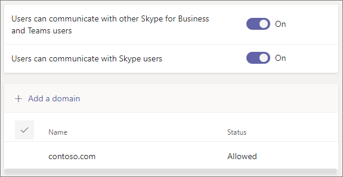

# Use guest access and external access to collaborate with people outside your organization

When you need to communicate and collaborate with people outside your organization, Microsoft Teams has two options:

- **External access** - A type of federation that allows users to find, call, and chat with people in other organizations. These people cannot be added to teams unless they are invited as guests.
- **Guest access** - Guest access allows you to invite people from outside your organization to join a team. Invited people get a guest account in Azure Active Directory.

Note that Teams allows you to invite people outside your organization to meetings. This does not require external or guest access to be configured.

## External access (federation)

Set up external access if you need to find, call, chat, and set up meetings with people outside your organization who use Teams, Skype for Business (online or on premises) or Skype. 

By default, external access is enabled for all domains. You can restrict external access by allowing or blocking specific domains or by turning it off.

To configure external access, see [Manage external access](manage-external-access.md). 

>[!NOTE]
>Microsoft Teams free licenses do not support external access.

## Guest access

Use guest access to add a person from outside your organization to a team, where they can chat, call, meet, and collaborate on files. A guest can be given nearly all the same Teams capabilities as a native team member.

Guests are added to your organization's Azure Active Directory as B2B users and must sign in to Teams using their guest account. This means that they may have to sign out of their own organization to sign in to your organization.

To configure guest access for Teams, see [Collaborate with guests in a team](/microsoft-365/solutions/collaborate-as-team).

## Compare external and guest access

The following tables show the differences between using external access (federation) and guests. In both cases, people outside your organization are identified to your users as being external.

### Things your users can do

| Users can | External access users | Guests |
|---------|-----------------------|--------------------|
| Chat with someone in another organization | Yes | Yes |
| Call someone in another organization | Yes | Yes |
| See if someone from another organization is available for call or chat | Yes | Yes1 |
| Search for people in other organizations | Yes2 | No |
| Share files | No | Yes |
| See the out-of-office message of someone in another organization | No | Yes |
| Block someone in another organization  | No | Yes |
| Use @mentions | Yes3 | Yes |

### Things people outside your organization can do

| People outside your organization can | External access users | Guests |
|---------|-----------------------|--------------------|
| Access Teams resources | No | Yes |
| Be added to a group chat | Yes | Yes |
| Be invited to a meeting | Yes | Yes |
| Make private calls | Yes | Yes5 |
| View the phone number for dial-in meeting participants | No4 | Yes |
| Use IP video | Yes | Yes5 |
| Use screen sharing | Yes3 | Yes5 |
| Use meet now | No | Yes5 |
| Edit sent messages | Yes3 | Yes5 |
| Delete sent messages | Yes3 | Yes5 |
| Use Giphy in conversation | Yes3 | Yes5 |
| Use memes in conversation | Yes3 | Yes5 |
| Use stickers in conversation | Yes3 | Yes5 |
| Presence is displayed | Yes | Yes |
| Use @mentions | Yes3 | Yes |

 

1 Provided that the user has been added as a guest and is signed with the guest account. 
2 Only by email or Session Initiation Protocol (SIP) address. 
3 Supported for 1:1 chat for Teams Only to Teams Only users from two different organizations.  
4 By default, external participants can't see the phone numbers of dialed-in participants. If you want to maintain the privacy of these phone numbers, select **Tones** for **Entry/exit announcement type** (this prevents the numbers from being read out by Teams). To learn more, read [Turn on or off entry and exit announcements for meetings in Microsoft Teams](turn-on-or-off-entry-and-exit-announcements-for-meetings-in-teams.md).  
5 Allowed by default, but can be turned off by the Teams admin

## Related topics

[External access in Teams](manage-external-access.md)

[Guest access in Teams](guest-access.md)
