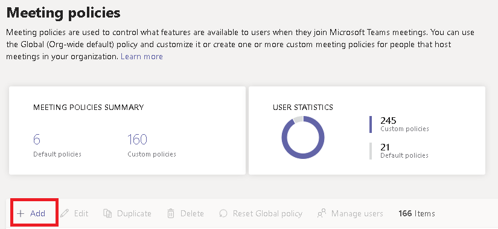

# Configure desktop sharing in Microsoft Teams

Desktop sharing lets users present a screen or app during a meeting or chat. Admins can configure screen sharing in Microsoft Teams to let users share an entire screen, an app, or a file. You can let users give or request control, allow PowerPoint sharing, add a whiteboard, and allow shared notes. You can also configure whether anonymous or external users can request control of the shared screen. External participants in Teams meetings can be categorized as follows:

- Anonymous user
- Guest users
- B2B user
- Federated user

To configure screen sharing, you create a new meetings policy and then assign it to the users you want to manage.

**In the [Microsoft Teams admin center](https://admin.teams.microsoft.com/)**

1. Select **Meetings** > **Meeting policies**.

    

2. On the **Meeting policies** page, select **Add**.

    

3. Give your policy a unique title and enter a brief description.

4. Under **Content sharing**, choose a **Screen sharing mode** from the drop-down list:

   - **Entire screen** – lets users share their entire desktop.
   - **Single application** – lets users limit screen sharing to a single active application.
   - **Disabled** – Turns off screen sharing.

    

  > [!Note]
  > You don't have to enable the calling policy in order for users to use screen share from chat. However, their audio is turned off until they unmute themselves. In addition, the user sharing the screen can click **Add Audio** to enable audio. If the calling policy is disabled, users won't be able to add audio to the screen share from a chat session.

5. Turn the following settings on or off:

    - **Allow a participant to give or request control** – lets members of the team give or request control of the presenter's desktop or application.
    - **Allow an external participant to give or request control** – This is a per-user policy. Whether an organization has this set for a user doesn't control what external participants can do, regardless of what the meeting organizer has set. This parameter controls whether external participants can be given control or request control of the sharer's screen, depending on what the sharer has set within their organization's meeting policies.
    - **Allow PowerPoint sharing** - lets users create meetings that allow PowerPoint presentations to be uploaded and shared.
    - **Allow whiteboard** – lets users share a whiteboard.
    - **Allow shared notes** – lets users take shared notes.

6. Click **Save**.

## Use PowerShell to configure shared desktop

You can also use the [Set-CsTeamsMeetingPolicy](/powershell/module/skype/set-csteamsmeetingpolicy) cmdlet to control desktop sharing. Set the following parameters:

- Description
- ScreenSharingMode
- AllowPrivateCalling
- AllowParticipantGiveRequestControl
- AllowExternalParticipantGiveRequestControl
- AllowPowerPointSharing
- AllowWhiteboard
- AllowSharedNotes

[Learn more about using the csTeamsMeetingPolicy cmdlet](/powershell/module/skype/set-csteamsmeetingpolicy).