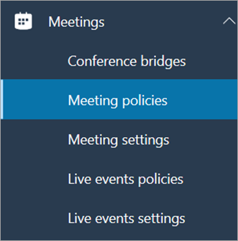
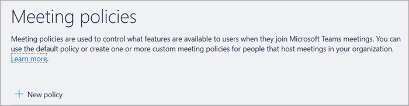
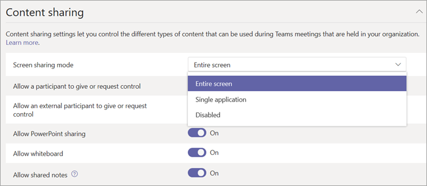

Configure desktop sharing in Microsoft Teams
============================================

Desktop sharing lets users present a screen or app during a meeting or chat. Admins can configure screen sharing in Microsoft Teams to let users share an entire screen, an app, or a file. You can let users give or request control, allow PowerPoint sharing, add a whiteboard, and allow shared notes. You can also configure whether anonymous or external users can request control of the shared screen.

To configure screen sharing, you create a new meetings policy and then assign it to the users you want to manage.

**In the Microsoft Teams admin center**

1. Select **Meetings** > **Meeting policies**.

    

2. On the **Meeting policies** page, select **New policy**.

    

3. Give your policy a unique title and enter a brief description.

4. Under **Content sharing**, choose a **Screen sharing mode** from the drop-down list:

   - **Entire screen** – lets users share their entire desktop.
   - **Single application** – lets users limit screen sharing to a single active application.
   - **Disabled** – Turns off screen sharing.

    

5. Turn the following settings on or off:

    - **Allow a participant to give or request control** – lets members of the team give or request control of the presenter’s desktop or application.
    - **Allow an external participant to give or request control** – lets guests and external (federated) users give or request control of the presenter’s desktop or application.
    - **Allow PowerPoint sharing** - lets users create meetings that allow PowerPoint presentations to be uploaded and shared.
    - **Allow whiteboard** – lets users share a whiteboard.
    - **Allow shared notes** – lets users take shared notes.

6. Click **Save**.

## Use PowerShell to configure shared desktop

You can also use the [Set-CsTeamsMeetingPolicy](https://docs.microsoft.com/en-us/powershell/module/skype/set-csteamsmeetingpolicy?view=skype-ps) cmdlet to control desktop sharing. Set the following parameters:

- Description
- ScreenSharingMode
- AllowParticipantGiveRequestControl
- AllowExternalParticipantGiveRequestControl
- AllowPowerPointSharing
- AllowWhiteboard
- AllowSharedNotes

[Learn more about using the csTeamsMeetingPolicy cmdlet](https://docs.microsoft.com/en-us/powershell/module/skype/set-csteamsmeetingpolicy?view=skype-ps).

