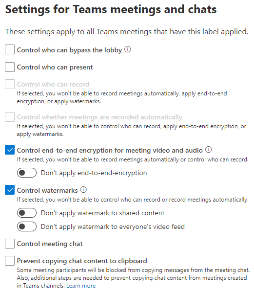

# Configure Teams meetings with baseline protection

[!INCLUDE[Teams Premium ECM](includes/teams-premium-ecm.md)]

For the *baseline* level of protection, we'll restrict who can bypass the lobby by using a sensitivity label and set a default value for who can present with a Teams admin policy. You can restrict additional actions as well if your organization requires it.

> [!Note]
> Meeting settings in sensitivity labels and custom meeting templates require Teams Premium.

The following table describes which actions we'll restrict for baseline meetings and where those settings are configured.

|Feature|Setting|Location|Enforced|
|:------|:------|:-------|:-------|
|Allow camera for attendees|**On**|Template|No|
|Allow mic for attendees|**On**|Template|No|
|Apply a watermark to everyone's video feed|**Off**|Label|Yes|
|Apply a watermark to shared content|**Off**|Label|Yes|
|End-to-end encryption|**Off**|Label|Yes|
|Manage what attendees see|**Off**|Template|No|
|Meeting chat|**On**|Template|No|
|People dialing in can bypass the lobby|**Off**|Template|Yes|
|Prevent copying chat content to clipboard|**Off**|Label|Yes|
|Record meetings automatically|**Off**|Template|No|
|Who can bypass the lobby?|**People in my organization, people in trusted organizations, and guests**|Template|No|
|Who can present|**People in my organization and guests**|Teams admin center|No|
|Who can record|**Organizers and presenters**|Template|No|

Settings that are listed as enforced are enforced by the sensitivity label or meeting template. Settings that are not enforced can be changed by the meeting organizer.

## Default values for **Who can present**

The default value for **Who can present** is **Everyone**. For the baseline protection tier, we'll set a more secure default of **People in my organization and guests** which meeting organizers can change if they want.

We can set this value with a sensitivity label, but the value will be enforced for any meetings with that label. This setting isn't available in meeting templates, so we'll set it in the Teams admin center.

To configure who can present 
1. In the Teams admin center, expand **Meetings** and select **Meeting policies**.
1. Select the policy that you want to update.
1. Under **Content sharing**, set **Who can present** to **People in my organization and guests**.
1. Select **Save**.

## Watermarks and end-to-end encryption

In the *baseline* level of protection, we'll disable watermarks and end-to-end encryption by using a sensitivity label. This will prevent meeting organizers from using these features. Watermarks and end-to-end encryption are more applicable to sensitive meetings.

End-to-end encryption and watermarks disable some other features such as meeting recording. Turning them off for the *baseline* level of protection can avert instances where meeting organizers use these features without realizing the limits they impose.

If you work in a highly regulated industry, you may want to keep these features available even in the *baseline* level of protection.

## Sensitivity labels

For the *baseline* level of protection, we'll be using a sensitivity label that you can use directly in a meeting or as part of a meeting template. Depending on the configuration you choose, this label can also be used to classify teams and individual files.

If you already have sensitivity labels deployed in your organization, consider how this label fits with your overall label strategy. You can change the name or settings show below if needed to meet the needs of your organization. If you already have a label that you use for baseline or general protection, you can edit the label and add Teams meetings to it.

To create a sensitivity label
1. Open the [Microsoft Purview compliance portal](https://compliance.microsoft.com).
1. Under **Solutions**, expand **Information protection** and then select **Labels**.
1. Click **Create a label**.
1. Give the label a name. We suggest **Sensitive**, but you can choose a different name if that one is already in use.
1. Add a display name and description, and then click **Next**.
1. On the **Define the scope for this label** page, make sure **Items** and **Include meetings** are selected. (Note that you can select other options if you want to use this label for other purposes.)
1. Select **Next**.
1. On the **Choose protection settings for labeled items** page, select **Protect Teams meetings and chats** and then select **Next**
1. On the **Settings for Teams meetings and chats** page, choose the following values:
    1. Select **Control end-to-end encryption for meeting video and audio** and set **Apply end-to-end encryption** to **Don't apply end-to-end encryption**.
    1. Select **Control watermarks** and select **Don't apply watermark to shared content** and **Don't apply watermark to everyone's video feed**.
    1. Configure any other settings that you need for your organization.
    
1. Select **Next**.
1. Complete the wizard with any additional settings you want to use, and then select **Create label**, and then select **Done**.

Once you've created the label, you need to publish it to the users who will use it. For baseline protection, we'll make the label available to all users. You publish the label in the Microsoft Purview compliance portal, on the **Label policies** tab of the **Information protection** page. If you have an existing policy that applies to all users, add this label to that policy. If you need to create a new policy, see [Publish sensitivity labels by creating a label policy](/compliance/create-sensitivity-labels#publish-sensitivity-labels-by-creating-a-label-policy).

For additional information about using sensitivity labels with meetings, see [Use sensitivity labels to protect calendar items, Teams meetings and chat](/microsoft-365/compliance/sensitivity-labels-meetings).

## Meeting templates

In the *baseline* level of protection, we'll use the template to set a default value for who can bypass the lobby that includes external participants from trusted domains.

We'll also prevent people dialing in by phone from bypassing the lobby. You can omit this setting if your organization frequently holds meetings where dial-in participants should be able to join directly. If there are certain types of meetings where this is true, consider using a separate template for those meetings.

If you've chosen to disable watermarks and end-to-end encryption in the sensitivity, you can also use the template to hide those settings from the meeting organizer.

To create a custom meeting template

1. In the Teams admin center, expand **Meetings** and select **Meeting templates**.
1. Select **Add**
1. Type a name and description for the template.
1. In the **Apply sensitivity label** section, choose the label you created above.
1. Select **Apply sensitivity label**, and then select **Lock**.
1. In the **Lobby** dropdown, select **People in my organization, trusted organizations, and guests**.
1. Make sure **People calling in my phone can bypass the lobby** is set to **Off**, then select it and select **Lock**.
1. If you've disabled watermarks and end-to-end encryption with the sensitivity label, consider selecting those settings here and selecting **Hide** so meeting organizers won't see them.
1. Change any additional settings if desired.
1. To prevent the meeting organizer from changing a setting, select the setting and then select **lock**.
1. To prevent the meeting organizer from seeing a setting, select the setting and then select **Hide**.
1. Select **Save**.

## Related topics

[Configure Teams meetings with three tiers of protection](configure-meetings-three-tiers-protection.md)

[Overview of custom meeting templates in Microsoft Teams](custom-meeting-templates-overview.md)

[Use Teams meeting templates, sensitivity labels, and admin policies together for sensitive meetings](meeting-templates-sensitivity-labels-policies.md)
