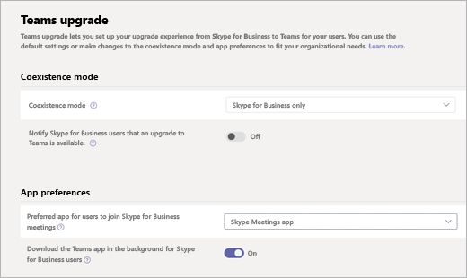

Configure the Skype Meetings App to work with Teams
===================================================

After a user is upgraded to Microsoft Teams, admins can use the Microsoft Teams admin center to specify the preferred app that users will use to join Skype for Business meetings.

To specify the Skype for Meetings App as the preferred app:

1. Sign in to the Microsoft Teams admin center.
2. In the left pane, under **Org-wide settings**, select **Teams upgrade**.
3. On the Teams upgrade page, under **App preferences**, select **Skype Meetings App**  from the **Preferred app for users to join Skype for Business meetings** drop-down list.

## Known limitations

Users who use the Skype Meetings App with Teams are subject to the following limitations:

- Users have no option to change their video device.
- After a user is upgraded to Teams, if the user is in a meeting using the Skype Meetings App and then receives a call on Teams, the meeting in Skype Meetings App is not placed on hold. Instead, the user is connected to both calls.

## See also

For more information about the Skype Meetings App, see:

- [What is Skype Meetings App (Skype for Business Web App)](https://support.office.microsoft.com/article/what-is-skype-meetings-app-skype-for-business-web-app-1ff3d412-718a-4982-8ff2-a4992608cdb5)
- [Skype Meetings App minimum network requirements](https://technet.microsoft.com/library/mt845808.aspx)
