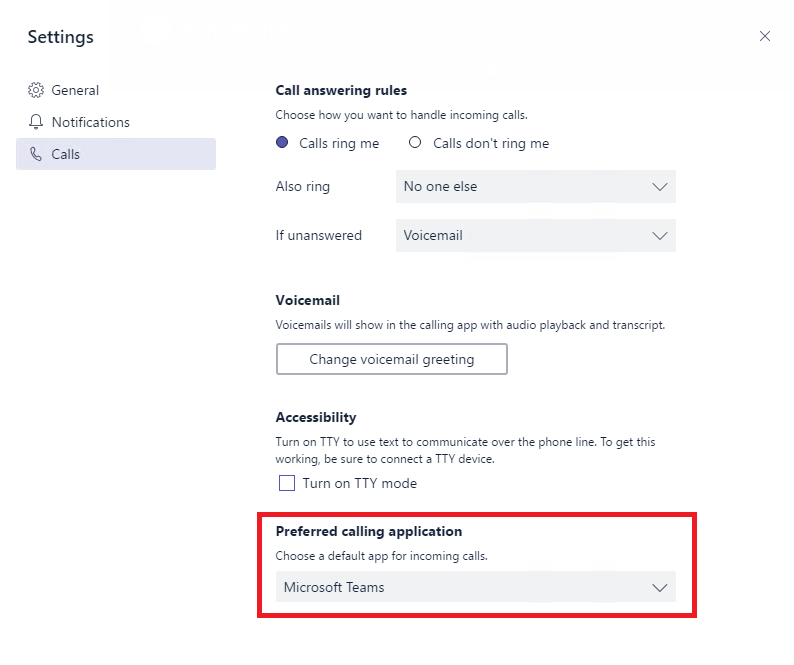

Quick start guide: Configuring Calling Plans in Microsoft Teams
==============================================================

This guide will help you get a set of users up and running so they can explore Calling Plans in Teams.

Read the December 12, 2017, announcement of Calling Plans in Teams: [Intelligent Communications takes the next step with calling in Teams](https://aka.ms/ipyqus)

> [!NOTE]
> We recommend that, in parallel with this quick-start guide, you use our [practical guidance](https://docs.microsoft.com/MicrosoftTeams/phone-system-with-calling-plans) and [FastTrack](https://aka.ms/cloudvoice) to plan and drive a successful rollout.

By adding Calling Plans - an Office 365 feature powered by Skype for Business - you can now use Teams to make and receive phone calls to or from land lines and mobile phones via the public switched telephone network (PSTN).

## Prerequisites for enabling the **Calls** tab in Teams
To enable the **Calls** tab in Teams and allow your users to make and receive PSTN calls, you will need provision users for Phone System and Calling Plans. To learn how to set this up, read [Set up Calling Plans](https://support.office.com/article/Set-up-Calling-Plans-57893158-1acd-44ac-acaf-19f58264a9e0).

> [!IMPORTANT]
> Before configuring Calling Plans in Teams, please be aware of the following limitations:
> * **Hybrid Voice is not supported in Teams** - Hybrid Voice is currently not supported in Teams. Hybrid Voice customers are not advised to change any of the policies to receive calls in Teams, as this will cause service interruptions.
> * **Federated calling is not supported in Teams** - Federated calling (calling between tenants/companies) is currently not supported in Teams. Federated calls will always be routed to Skype for Business regardless of how you configure calling, until it's supported in Teams.

## Teams interop policy configuration
To enable Teams to begin receiving calls, you'll need to update Teams interop policy, using a remote Windows PowerShell session with the Skype for Business [`*-CsTeamsInteropPolicy`](https://docs.microsoft.com/powershell/module/skype) cmdlets, to redirect calls to Teams. For more information about Teams interop policy, see [Microsoft Teams and Skype for Business Interoperability](https://docs.microsoft.com/MicrosoftTeams/teams-and-skypeforbusiness-interoperability).

> [!TIP]
> To find the PowerShell cmdlets you need, type "CsTeamsInteropPolicy" in the **Filter** box in the [Skype for Business PowerShell cmdlet documentation](https://docs.microsoft.com/powershell/module/skype).

### Default Teams interop policy
Teams has a default policy configuration designed to ensure that existing business workflows are not interrupted during a Teams deployment. By default, VoIP, PSTN, and federated calls to your users will continue to be routed to Skype for Business until you update the policy to enable inbound calling to Teams. This ensures that there are no unintended interruptions in voice services as you start to pilot and deploy Teams.

Teams interop policy has the following default configuration:

    Identity                   : Global
    AllowEndUserClientOverride : False
    CallingDefaultClient       : Default
    ChatDefaultClient          : Default

The behaviors of the default configuration are the following:
* **For existing Skype for Business customers**, this policy is designed to ensure that Skype for Business calls are directed to Skype for Business, and Teams calls are directed to Teams. PSTN and federated calls will be directed to Skype for Business when this policy is in effect.
* **For customers without Skype for Business**, when in effect, in addition to calls among Teams users, only outbound PSTN calling will be available in Teams. You will need to alter the Teams interop policy assigned to your users to receive PSTN calls in Teams.

> [!NOTE]
> Users that have been provisioned with Phone System and Calling Plans licenses for use with Skype for Business Online, and configured with the default global Teams interop policy, will have the Calls tab enabled in Teams and can place outbound PSTN calls from Teams without administrators having to take any administrative action.

#### How to configure Teams to use the default policy
By default, global Teams interop policy is applied to all users in your tenant, and it is configured with the default settings as described above. If for some reason you have granted different policies to your users and would like to revert to the default setting, you will need to apply the global Teams interop policy via Skype for Business remote Windows PowerShell session:

    Grant-CsTeamsInteropPolicy -PolicyName Global -Identity user@contoso.com

> [!WARNING]
> While it is possible to modify the global Teams interop policy from the default values, we strongly advise against it. 

## Configuring Teams to receive inbound PSTN calls
To receive inbound PSTN calls in Teams, you will need to configure Teams as the default calling application by applying Teams interop policy with `CallingDefaultClient` parameter set to Teams.

> [!IMPORTANT]
> We recommend that you apply this configuration to an initial set of users to explore these exciting new calling capabilities in Teams prior to making wider or organization-level changes.

Consider using the following preconfigured Teams interop policy to route inbound PSTN calling to Teams:

    Identity                   : Tag:DisallowOverrideCallingTeamsChatTeams
    AllowEndUserClientOverride : False
    CallingDefaultClient       : Teams
    ChatDefaultClient          : Teams

The behaviors of the policy above are the following:
* **For existing Skype for Business customers**, this policy is designed to redirect incoming calls to Teams. This includes both VoIP (from Teams and Skype for Business) and PSTN calls. Federated calls will continue to be received in Skype for Business. 
* **For customers without Skype for Business**, when in effect, PSTN calls will be received in Teams. Federated calling is currently **not supported** in Teams.

> [!WARNING]
> Currently, changing `CallingDefaultClient` to Teams will also affect calls to Skype for Business IP phones. Incoming calls will not be received on the phones and will only ring Teams clients. Please consult the [Skype for Business to Microsoft Teams Capabilities Roadmap](https://aka.ms/skype2teamsroadmap) for information about support for existing certified SIP phones.

### How to configure Teams to receive PSTN calls
Apply the Teams interop policy as described above via Skype for Business remote Windows PowerShell session to redirect calls to Teams:

    Grant-CsTeamsInteropPolicy -PolicyName tag:DisallowOverrideCallingTeamsChatTeams -Identity user@contoso.com

## Configuring Teams to allow users to change their preferred calling experience
To let users to make their own decision over the preferred calling experience, whether to receive calls in Teams or Skype for Business, you need to create a custom Teams interop policy that enables `AllowEndUserClientOverride` parameter.

The following is the example of Teams interop policy to enable user choice of the preferred calling experience:

    Identity                   : Tag:CustomPolicy
    AllowEndUserClientOverride : True
    CallingDefaultClient       : Default
    ChatDefaultClient          : Default

Once this custom policy is applied to the users, the option to change the preferred calling application will be available in Teams client for users to make the changes themselves.

> [!IMPORTANT]
> It is recommended that you apply this configuration to an initial set of users prior to making wider or organization level changes.

### How to create and apply the custom Teams interop policy
To create the custom Teams interop policy as described above via Skype for Business remote Windows PowerShell session, perform the following:

    New-CsTeamsInteropPolicy -Identity tag:CustomPolicy -AllowEndUserClientOverride:$True -CallingDefaultClient:Default -ChatDefaultClient:Default

    Grant-CsTeamsInteropPolicy -PolicyName tag:CustomPolicy -Identity user@contoso.com

## See also
[Set up Calling Plans](https://support.office.com/article/Set-up-Calling-Plans-57893158-1acd-44ac-acaf-19f58264a9e0)

[Microsoft Teams and Skype for Business Interoperability](https://docs.microsoft.com/MicrosoftTeams/teams-and-skypeforbusiness-interoperability)

[Practical Guidance for Phone System with Calling Plans in Microsoft Teams](https://docs.microsoft.com/MicrosoftTeams/phone-system-with-calling-plans)

[Skype for Business PowerShell cmdlet reference](https://docs.microsoft.com/powershell/module/skype)

[Teams PowerShell cmdlet reference](https://docs.microsoft.com/powershell/module/teams)
