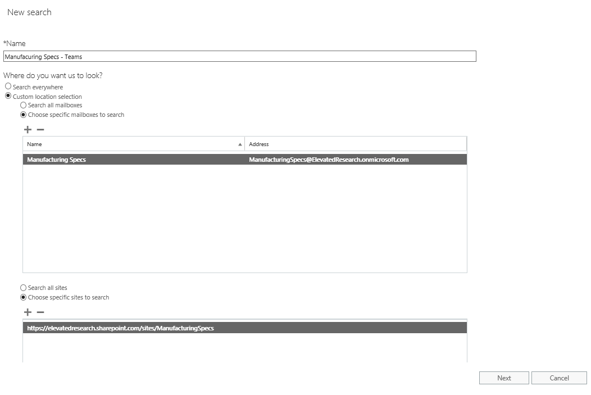
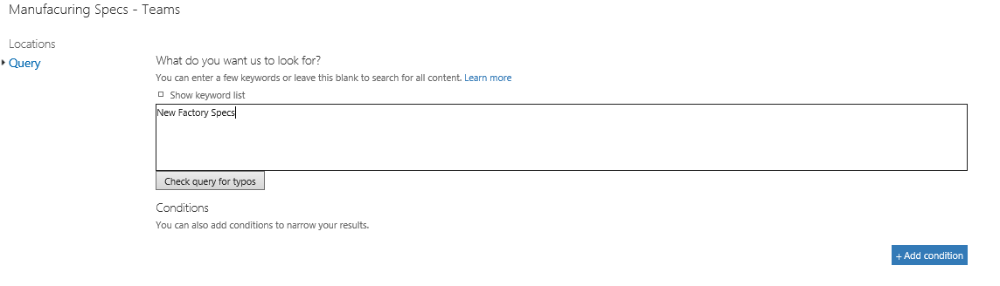

Use Content Search in Microsoft Teams
=====================================

Content Search provides an ad-hoc way to query Microsoft Teams information spanning Exchange, SharePoint Online, and OneDrive for Business.

In the example below, we created a new **Content Search**. Then, we selected the Manufacturing Specs mailbox and Manufacturing Specs SharePoint site. This allows us to search against Channel chats from Exchange, File uploads/modifications from SharePoint Online, and OneNote changes as well.

You can also add query criteria to the **Content Search** to narrow the results returned. For example, below we wanted to search both Exchange and SharePoint locations for the Manufacturing Specs team to look for content where the keywords “**New Factory Specs”** were used.

After adding search conditions should you choose to, you can then export a report or the data to your computer for analysis. For more information on how to use Content Search, review [this](https://support.office.com/article/Run-a-Content-Search-in-the-Office-365-Security-Compliance-Center-61852fd9-fe8a-4880-a339-cb19ed3bff4a) link.
