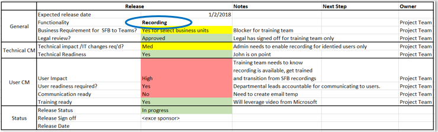

This article is part of the Operational Excellence stage of your upgrade journey, which begins as soon as you’ve completed your upgrade from Skype for Business to Teams.

# How to use Microsoft Teams Effectively

Technology is innovating at an unprecedented pace. Staying current and enabling a modern workplace environment has become a standard in how organizations operate. As Microsoft Teams, Microsoft 365, and Microsoft’s intelligent communication vision continue to unfold, having an operational plan in place will help ensure your organization is set up for long-term success. An optimal operational plan includes monitoring your environment for health and quality, continuing user momentum to optimize adoption, and planning for new functionality that will continue to come online over time.

## Monitor for network health and quality

The status of your network affects the user experience. When a user has a poor experience (for example, call drops or lag time when joining meetings), they correlate this to the technology itself, leaving them with the impression that the technology doesn’t work and opening the door for unsupported apps. Implementing a plan to monitor and mitigate network health will help ensure a positive user experience in addition to reducing calls to your support desk. For more information, see the following articles:

- [Operate your service](upgrade-operate-my-service.md)
- [Monitor quality](upgrade-monitor-quality.md)
- [Enhance your service](upgrade-enhance-my-service.md)

## Drive user momentum and adoption

To realize maximum benefit and business outcomes with Teams, users must actually use it. However, initial excitement tends to wane and users easily revert to old ways of working. Encourage user adoption and maintain excitement for Teams with an ongoing adoption plan, which can include:

- Enlisting peer champions to help evangelize and encourage fellow users.
- Checking the [Office 365 Adoption Guide](https://go.microsoft.com/fwlink/?linkid=859045) for tips on boosting engagement and driving adoption.
- Leveraging the [Teams Customer Success Kit](https://download.microsoft.com/download/A/E/9/AE984CD4-CF4B-41E7-9ABD-6735E3F01897/MicrosoftTeamsCustomerSuccessKit.zip) to enhance awareness and share best practices.
- Implementing a formal [adoption and change management strategy](http://www.successwithteams.com/) to help sustain adoption growth.

## Prepare for new functionality

The lifecycle of any given technology has shifted to a dynamic growth cycle. This means that the Teams and Microsoft 365 roadmaps will continue to unfold, with new functionality lighting up on a regular cadence. Establishing a change cycle within your organization will ensure you’re ready to manage continual collaboration improvements and realize maximum value. This can include:

- Monitor the Teams [roadmap](https://products.office.com/business/office-365-roadmap?filters=microsoft%20teams).
- Implement a change planning form (as illustrated below) to prepare and implement new functionality. Be sure to include both technical and user readiness activities.

