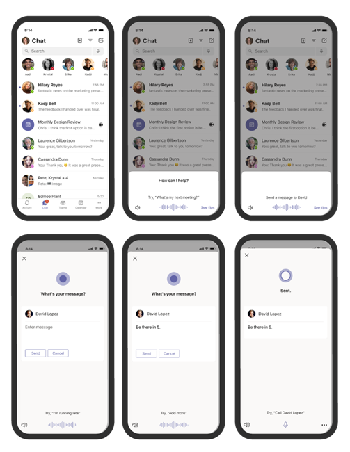

# Cortana voice assistance in Teams

> [!NOTE]
> Cortana voice assistance is supported in Microsoft Teams mobile apps for iOS and Android, Microsoft Teams Displays, and Microsoft Teams Rooms on Windows for users in the United States, United Kingdom, Canada, India, and Australia. Cortana voice assistance in the Teams mobile app is now available for EDU customers in en-US. Expansion to additional languages and regions will happen as part of future releases. Cortana voice assistance isn't currently available for GCC, GCC-High, DoD, and non-US EDU tenants.

Cortana voice assistance in the Teams mobile app, on Microsoft Teams Rooms on Windows, and on Microsoft Teams display devices enables Microsoft 365 Enterprise users to streamline communication, collaboration, and meeting-related tasks using spoken natural language. Users can speak to Cortana by selecting the microphone button located in the upper right of the Teams mobile app, or by saying "Cortana" in the Microsoft Teams Room or when using a Microsoft Teams display. To quickly connect with their team hands-free and while on the go, users can say queries such as "call Megan" or "send a message to my next meeting". Users can also join meetings by saying "join my next meeting" and use voice assistance to share files, check their calendar, and more. These voice assistance experiences are delivered using [Cortana enterprise-grade services](/microsoft-365/admin/misc/cortana-integration) that fully comply with Office 365's privacy, security, and compliance promises as reflected in the [Online Services Terms (OST)](https://www.microsoft.com/licensing/product-licensing/products?rtc=1&preserve-view=true).

## Admin control and limitations

Cortana voice assistance in Teams is delivered using services that fully comply with the Office 365 enterprise-level privacy, security, and compliance promises as reflected in the Online Services Terms (OST). The feature will be enabled by default for tenants.

Tenant admins can control who in their tenant can use Cortana voice assistance in Teams using a policy (TeamsCortanaPolicy). This policy is set at either a user account level or tenant level. Admins can use the CortanaVoiceInvocationMode field within this policy control to determine whether Cortana is disabled, enabled with push-button invocation only, or with wake word invocation as well (applicable to devices that support it, like the Microsoft Teams display).

Admins can use the following PowerShell cmdlets to manage this policy (the policy is currently not available in Microsoft Teams admin center).

- [New-CsTeamsCortanaPolicy](/powershell/module/skype/New-CsTeamsCortanaPolicy)

- [Get-CsTeamsCortanaPolicy](/powershell/module/skype/Get-CsTeamsCortanaPolicy)

- [Grant-CsTeamsCortanaPolicy](/powershell/module/skype/Grant-CsTeamsCortanaPolicy)

- [Set-CsTeamsCortanaPolicy](/powershell/module/skype/Set-CsTeamsCortanaPolicy)

- [Remove-CsTeamsCortanaPolicy](/powershell/module/skype/Remove-CsTeamsCortanaPolicy)

For example, the command below creates a new policy with name "EmployeeCortanaPolicy" where Cortana voice assistance in Microsoft Teams is disabled.

```PowerShell
PS C:\> New-CsTeamsCortanaPolicy -Identity EmployeeCortanaPolicy -CortanaVoiceInvocationMode Disabled
```

This example shows updating an existing policy with name "EmployeeCortanaPolicy" and enabling Cortana voice assistance in Microsoft Teams with push-button invocation only. Users will be able to invoke Cortana by selecting the Cortana mic button in Teams. Wake word ("Hey Cortana" or "Cortana") invocation will be disabled.

```PowerShell
PS C:\> Set-CsTeamsCortanaPolicy -Identity EmployeeCortanaPolicy -CortanaVoiceInvocationMode PushToTalkUserOverride
```

This example shows updating the policy and enabling Cortana voice assistance with both push button and wake word invocation.

```PowerShell
PS C:\> Set-CsTeamsCortanaPolicy -Identity EmployeeCortanaPolicy -CortanaVoiceInvocationMode WakeWordPushToTalkUserOverride
```

At the time, of the initial release for Microsoft 365 Enterprise users in the US in English, the following are available functions:

- The Teams mobile app won't support wake word activation, but it will be supported in the future.

- Microsoft Teams Rooms on Windows and Microsoft Teams display devices will support wake word activation.

## User control

Individual users can try Cortana voice assistance in different devices:

- Select the microphone button in the Teams mobile app.

- Select the microphone button or say "Cortana" in Microsoft Teams Rooms.

- Say "Cortana" on Microsoft Teams displays devices.

You can control whether Cortana in Teams is enabled for your device by using a setting in the device.



### Microsoft Teams Rooms on Windows

Making changes at the device level is available only if Cortana is enabled at the tenant level.

At the device level, you can configure Cortana to be used in two different ways. You can enable either option, or both at the same time:

- By tapping on a microphone, which is called Cortana _Push to talk_
- By saying "Hey, Cortana", which is called _Cortana Voice Activation_

Cortana _Push to talk_ is enabled by default if your room is set up with any of the following languages: en-au (Australia), en-ca (Canada), en-gb (United Kingdom), en-in (India), en-us (United States). [Learn More.](/MicrosoftTeams/rooms/console#to-apply-your-desired-language) Cortana icon will displace the _Present_ button under the _More..._ menu in your Teams Room console. To disable Cortana _Push to talk_ use PowerShell.[Learn More.](/powershell/module/skype/new-csteamscortanapolicy?view=skype-ps#example-1)

To enable Cortana _Voice Activation_, these conditions must be met:

- a Cortana certified device must be connected to your Teams Room. You can find a list of certified devices at the end of this article.
- the Teams Room must be set up with any of the following languages: en-au (Australia), en-ca (Canada), en-gb (United Kingdom), en-in (India), en-us (United States). More languages will be available at a later date.
- one of the following configuration changes must be made:
  - turn on the feature in Teams admin center [Learn More.](/microsoftteams/rooms/rooms-manage)
  - add the following XML attribute to the SkypeSettings XML file:

    ```xml
    <SkypeSettings>
        <CortanaWakewordEnabled>true</CortanaWakewordEnabled>
    </SkypeSettings>
    ```

At the meeting level, making changes is available only if Cortana _Voice Activation_ is enabled at the device level.  To enable Cortana _Voice Activation_ during a meeting move the toggle **On**, or **Off** to disable. Once the meeting ends, Cortana returns to the device level settings set.

Making changes at the meeting level is available if Cortana is enabled at the device level.

To enable Cortana _voice activation_ during a meeting, move the toggle **On** or **Off**. Once the meeting ends, Cortana returns to the device level settings set.

## Cortana certified devices for Teams Rooms

Cortana _Voice Activation_ can be enabled if you are using a Lenovo Hub 500 or if you have any of these devices connected to your room:

- Jabra Panacast 50
- Logitech Rally & Rally Plus conferencing systems
- Bose Video Bar VB1
- EPOS EXPAND Capture 5
- Yealink MSpeech
