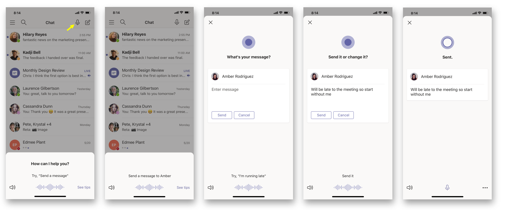

# Cortana voice assistance in Teams

> [!Note]
> Cortana voice assistance is supported in Microsoft Teams mobile apps for iOS and Android and Microsoft Teams displays for users in the United States, United Kingdom, Canada, India, and Australia. Microsoft Teams Rooms on Windows is only supported for users in the United States. Cortana voice assistance isn't currently available for GCC, GCC-High, DoD, EDU tenants. Expansion to additional languages and regions will happen as part of future releases.

> [!Note]
> Cortana voice assistance in Microsoft Teams Rooms is released under Preview. In its preview release, Cortana is supported only in the US with language EN-US on devices that have connected Rally microphones.

Cortana voice assistance in the Teams mobile app, on Microsoft Teams Rooms on Windows, and on Microsoft Teams display devices enables Microsoft 365 Enterprise users to streamline communication, collaboration, and meeting-related tasks using spoken natural language. Users can speak to Cortana by selecting the microphone button located in the upper right of the Teams mobile app, or by saying &#8220;Cortana&#8221; in the Microsoft Teams Room or when using a Microsoft Teams display. To quickly connect with their team hands-free and while on the go, users can say queries such as &#8220;call Megan&#8221; or &#8220;send a message to my next meeting&#8221;. Users can also join meetings by saying &#8220;join my next meeting&#8221; and use voice assistance to share files, check their calendar, and more. These voice assistance experiences are delivered using [Cortana enterprise-grade services](/microsoft-365/admin/misc/cortana-integration?view=o365-worldwide) that fully comply with Office 365's privacy, security, and compliance promises as reflected in the [Online Services Terms (OST)](https://www.microsoft.com/licensing/product-licensing/products?rtc=1).

The image shows sending a chat using Cortana on a mobile device.



## Admin control and limitations

Cortana voice assistance in Teams is delivered using services that fully comply with the Office 365 enterprise-level privacy, security, and compliance promises as reflected in the Online Services Terms (OST). The feature will be enabled by default for tenants.

Tenant admins can control who in their tenant can use Cortana voice assistance in Teams using a policy (TeamsCortanaPolicy). This policy can be set at either a user account level or tenant level. Admins can use the CortanaVoiceInvocationMode field within this policy control to determine whether Cortana is disabled, enabled with push-button invocation only, or with wake word invocation as well (applicable to devices that support it, like the Microsoft Teams display).

Admins can use the following PowerShell cmdlets to manage this policy (the policy is currently not available in Microsoft Teams admin center).

- [New-CsTeamsCortanaPolicy](/powershell/module/skype/New-CsTeamsCortanaPolicy)

- [Get-CsTeamsCortanaPolicy](/powershell/module/skype/Get-CsTeamsCortanaPolicy)

- [Grant-CsTeamsCortanaPolicy](/powershell/module/skype/Grant-CsTeamsCortanaPolicy)

- [Set-CsTeamsCortanaPolicy](/powershell/module/skype/Set-CsTeamsCortanaPolicy)

- [Remove-CsTeamsCortanaPolicy](/powershell/module/skype/Remove-CsTeamsCortanaPolicy)

For example, the command below creates a new policy with name &#8220;EmployeeCortanaPolicy&#8221; where Cortana voice assistance in Microsoft Teams is disabled.  

```PowerShell
PS C:\> New-CsTeamsCortanaPolicy -Identity EmployeeCortanaPolicy -CortanaVoiceInvocationMode Disabled
```

This example shows updating an existing policy with name &#8220;EmployeeCortanaPolicy&#8221; and enabling Cortana voice assistance in Microsoft Teams with push button invocation only. Users will be able to invoke Cortana by selecting the Cortana mic button in Teams. Wake word (&#8220;Hey Cortana&#8221; or &#8220;Cortana&#8221;) invocation will be disabled.  

```PowerShell
PS C:\> Set-CsTeamsCortanaPolicy -Identity EmployeeCortanaPolicy -CortanaVoiceInvocationMode PushToTalkUserOverride
```

This example shows updating the policy and enabling Cortana voice assistance with both push button and wake word invocation.

```PowerShell
PS C:\> Set-CsTeamsCortanaPolicy -Identity EmployeeCortanaPolicy -CortanaVoiceInvocationMode WakeWordPushToTalkUserOverride
```

At the time, of the initial release for Microsoft 365 Enterprise users in the US in English, the following are available functions:

- The Teams mobile app won't support wake word activation, but it will be supported in the future.  

- Microsoft Teams Rooms on Windows and Microsoft Teams display devices will support wake word activation.

## User control

Individual users can try out Cortana voice assistance in different devices:

- Select the microphone button in the Teams mobile app.

- Select the microphone button or say "Cortana" in Microsoft Teams Rooms.

- Say "Cortana" on Microsoft Teams displays devices.

You can control whether Cortana in Teams is enabled for your device by using a setting in the device.

### Teams mobile app or the Microsoft Teams display

  1. Open the Teams mobile app.

  2. Select **Settings** > **Cortana**.

  3. Move the toggle **On** or **Off**.

### Microsoft Teams display

  1. Go to the ambient (home) screen of the Microsoft Teams display.

  2. Select the user avatar, and then select **Settings**. If Cortana is enabled, say, "Cortana, go to Settings."

  3. Move the toggle **On** or **Off**.
  
### Microsoft Teams Rooms on Windows

Making changes at the device level is available if Cortana is enabled at the tenant level. Cortana will be released OFF by default.

To enable Cortana at the device level, these XML attributes must be added in the SkypeSettings XML file:

```xml
<SkypeSettings>  

        <CortanaEnabled>true</CortanaEnabled>  

        <CortanaWakewordEnabled>true</CortanaWakewordEnabled>  

</SkypeSettings> 
```

Making changes at the meeting level is available if Cortana is enabled at the device level.

To enable Cortana voice assistance during a meeting, move the toggle **On** or **Off**. Once the meeting ends, Cortana returns to the device level settings set.

## Cortana for EDU

Cortana voice assistance in the Teams mobile app and Microsoft Teams display is now available for EDU customers in en-US. Use Cortana to streamline communication, collaboration, and class-related tasks in school using spoken natural language. With Cortana voice assistance, you can call someone or perform class-related tasks, you can message someone or send message to your class. Also, you can find and share files, and search or navigate within the Teams mobile app or on the Microsoft Teams display.

Class-related tasks:

- To check your class schedule, you can select the microphone icon and say, "How many classes do I have today" or "Do I have any class at 6 pm" in the Teams mobile app, or say, "Hey Cortana, how many classes do I have today" or "Hey Cortana, do I have any class at 6 pm" on the Microsoft Teams display.

- When you're ready to join a class, say, "Join my next Science class" in the Teams mobile app, or say "Hey Cortana, join my next Science class" on the Microsoft Teams display.

- Once you're in a class, invoke Cortana voice assistance to perform various in-class tasks, like adding someone to class. For example, say, "Add Megan to the class’ in the Teams mobile app, or, "Hey Cortana, add Megan to the class" on the Microsoft Teams display.

- When you want to end your class, you can say "Hang up class" in the Teams mobile app, or "Hey Cortana, hang up class" on the Microsoft Teams display.

- To present a deck to the class, you can say "Present the Science class deck" in the Teams mobile app, or "Hey Cortana, present the Science class deck" on the Microsoft Teams display. Or you can navigate to a particular slide in your presentation by saying: "Go to the appendix slide" in the Teams mobile app, or "Hey Cortana, go to the appendix slide" on the Microsoft Teams display.

- When you want to cancel the class, you can say "Cancel my Science class I have on Monday at 8 pm" in the Teams mobile app, or "Hey Cortana, cancel my Science class I have on Monday at 8 pm" on the Microsoft Teams display.