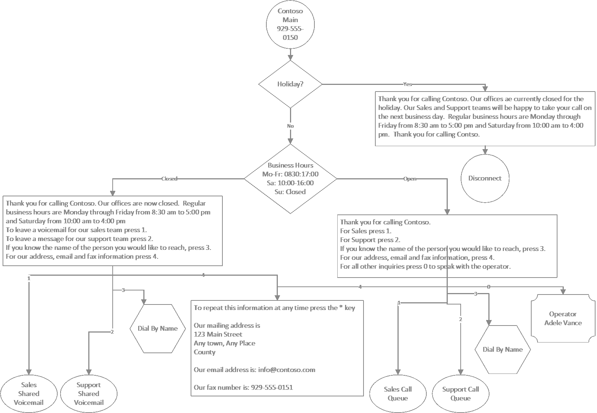

---
title: "Create an auto attendant via cmdlets"
author: CarolynRowe
ms.author: crowe
manager: serdars
ms.reviewer: colongma
ms.topic: article
ms.assetid: 6fc2687c-0abf-43b8-aa54-7c3b2a84b67c
ms.tgt.pltfrm: cloud
ms.service: msteams
search.appverid: MET150
ms.collection: 
  - M365-voice
  - m365initiative-voice
audience: Admin
appliesto: 
  - Skype for Business
  - Microsoft Teams
ms.localizationpriority: medium
f1.keywords:
- CSH
ms.custom: 
  - Phone System
description: Learn how to configure auto attendants via cmdlets
--- 
# Create an auto attendant via cmdlets

## Assumptions
1)	PowerShell is installed on your computer
- Set up your computer for [Windows PowerShell](/SkypeForBusiness/set-up-your-computer-for-windows-powershell/set-up-your-computer-for-windows-powershell)
- MSTeams Module Installed
````  (Install-Module -Name MicrosoftTeams -Force -AllowClobber) ````
- MSOnline module installed
```` Install-Module -Name MSOnline -Force -AllowClobber ````
2)	You have tenant administration rights
3)	You have purchased Microsoft Teams Phone
4)	The call queues referred to below have already been setup following the [Creating Call Queues with PowerShell cmdlets](create-a-phone-system-call-queue-via-cmdlets.md) guide.
                                                                                               
Note: Some of the cmdlets referenced below may be part of the Public Preview version of Teams PowerShell Module.  For more information, see [Install Teams PowerShell public preview](teams-powershell-install.md) and also see [Microsoft Teams PowerShell Release Notes](teams-powershell-release-notes.md).

Users who already have the MicrosoftTeams module installed should ````Update-Module MicrosoftTeams```` to ensure the most up-to-date version is installed.

## Scenario

The following auto attendant call flow will be built:



Additional configuration information:

- Auto Attendant: Contso Main
- - Operator: Adele Vance
- - Enable Voice Inputs: Off
- - Directory Search: None
- - Holidays:
- - - January 1, 2022
- - - December 24, 2022
- - - December 25, 2022

- Auto Attendant: Contoso Dial By Name
- - Operator: Adele Vance
- - Time zone: UTC
- - Language: English US
- - Enable Voice Inputs: On
- - Greeting: None
- - Menu: TTS, “Please say or enter the name of the person you would like to reach. To return to the previous menu press 9”
- - Directory Search: Dial By Name
- - Dial Scope: Sales & Support members

## Login
You will be prompted to enter your Teams administrator credentials.
```
$credential = Get-Credential
Connect-MicrosoftTeams -Credential $credential
Connect-MsolService -Credential $credential
````

## Get Operator Information
````
$operatorID = (Get-CsOnlineUser -Identity “sip:adele@contoso.com”).Identity

$operatorEntity = New-CsAutoAttendantCallableEntity -Identity $operatorID -Type User
````

## Dial By Name Auto Attendant - Resource Account Creation
Note: Creating resource account here so it can be referenced on the main auto attendant.  The actual Dial By Name auto attendant will be created later.

### Get license types
````
Get-MsolAccountSku
````

### Create and assign Resource Account
Note: Phone number not required here as call queue is front ended by an Auto Attendant
- ApplicationID
- - Auto Attendant: ce933385-9390-45d1-9512-c8d228074e07
- - Call Queue: 11cd3e2e-fccb-42ad-ad00-878b93575e07
````
New-CsOnlineApplicationInstance -UserPrincipalName ContosoDialByNameAA-RA@contoso.com -DisplayName "Contoso Dial By Name AA" -ApplicationID "ce933385-9390-45d1-9512-c8d228074e07"

Set-MsolUser -UserPrincipalName "ContosoDialByNameAA-RA@contoso.com" -UsageLocation US

Set-MsolUserLicense -UserPrincipalName “ContosoDialByNameAA-RA@contoso.com” -AddLicenses "contoso:PHONESYSTEM_VIRTUALUSER"

$dialByNameApplicationInstanceID = (Get-CsOnlineUser "ContosoDialByNameAA-RA@contoso.com").ObjectID
````

## Contoso Main Menu Auto Attendant
### Create Holiday Schedules
````
$dtr = New-CsOnlineDateTimeRange -Start "24/12/2022" -End "25/12/2022"

$christmasSchedule = New-CsOnlineSchedule -Name "Christmas" -FixedSchedule -DateTimeRanges @($dtr)

$dtr = New-CsOnlineDateTimeRange -Start "01/01/2022" -End "02/01/2022"

$newyearSchedule = New-CsOnlineSchedule -Name "New Year" -FixedSchedule -DateTimeRanges @($dtr)
````

### Create Address, FAX, and Email Information Prompt
````
$addressPrompt = New-CsAutoAttendantPrompt -TextToSpeechPrompt "To repeat this information at any time press the * key. Our mailing address is: 123 Main Street, Any town, Any Place, County. Our email address is: info@contoso.com. Our fax number is: 929-555-0151"
````

### Create Holiday Prompts and Menu Options
````
$christmasGreetingPrompt = New-CsAutoAttendantPrompt -TextToSpeechPrompt "Thank you for calling Contoso. Our offices ae currently closed for the Christmas holiday. Our Sales and Support teams will be happy to take your call on the next business day. Regular business hours are Monday through Friday from 8:30 am to 5:00 pm and Saturday from 10:00 am to 4:00 pm eastern time. Thank you for calling Contso."

$christmasMenuOption = New-CsAutoAttendantMenuOption -Action DisconnectCall -DtmfResponse Automatic

$christmasMenu = New-CsAutoAttendantMenu -Name "Christmas Menu" -MenuOptions @($christmasMenuOption)

$christmasCallFlow = New-CsAutoAttendantCallFlow -Name "Christmas" -Greetings @($christmasGreetingPrompt) -Menu $christmasMenu

$christmasCallHandlingAssociation = New-CsAutoAttendantCallHandlingAssociation -Type Holiday -ScheduleId $christmasSchedule.Id -CallFlowId $christmasCallFlow.Id

$newyearGreetingPrompt = New-CsAutoAttendantPrompt -TextToSpeechPrompt "Thank you for calling Contoso. Our offices ae currently closed for the New Year’s holiday. Our Sales and Support teams will be happy to take your call on the next business day. Regular business hours are Monday through Friday from 8:30 am to 5:00 pm and Saturday from 10:00 am to 4:00 pm eastern time. Thank you for calling Contso."

$newyearMenuOption = New-CsAutoAttendantMenuOption -Action DisconnectCall -DtmfResponse Automatic

$newyearMenu = New-CsAutoAttendantMenu -Name "New Year Menu" -MenuOptions @($newyearMenuOption)

$newyearCallFlow = New-CsAutoAttendantCallFlow -Name "New Year" -Greetings @($newyearGreetingPrompt) -Menu $newyearMenu

$newyearCallHandlingAssociation = New-CsAutoAttendantCallHandlingAssociation -Type Holiday -ScheduleId $newyearSchedule.Id -CallFlowId $newyearCallFlow.Id
````

### Create After Hours Schedules
````
$timerangeMoFr = New-CsOnlineTimeRange -Start 08:30 -end 17:00

$timerangeSa = New-CsOnlineTimeRange -Start 10:00 -end 16:00

$afterHoursSchedule = New-CsOnlineSchedule -Name "After Hours Schedule" -WeeklyRecurrentSchedule -MondayHours @($timerangeMoFr) -TuesdayHours @($timerangeMoFr) -WednesdayHours @($timerangeMoFr) -ThursdayHours @($timerangeMoFr) -FridayHours @($timerangeMoFr) -SaturdayHours @($timerangeSa) -Complement
````

### Create After Hours Prompts and Menu Options
````
$afterHoursGreetingPrompt = New-CsAutoAttendantPrompt -TextToSpeechPrompt "Thank you for calling Contoso. Our offices are now closed. Regular business hours are Monday through Friday from 8:30 am to 5:00 pm and Saturday from 10:00 am to 4:00 pm eastern time."

$afterHoursMenuPrompt = New-CsAutoAttendantPrompt -TextToSpeechPrompt “To leave a voicemail for our sales team press 1.To leave a message for our support team press 2.If you know the name of the person you would like to reach, press 3.For our address, email and fax information press 4.”

$afterHoursMenuOption1Target = (Get-Team -displayname "Sales").GroupID

$afterHoursMenuOption1Entity = New-CsAutoAttendantCallableEntity -Identity $afterHoursMenuOption1Target -Type SharedVoiceMail -EnableTranscription -EnableSharedVoicemailSystemPromptSuppression

$afterHoursMenuOption1 = New-CsAutoAttendantMenuOption -Action TransferCallToTarget -DtmfResponse Tone1 -CallTarget $afterHoursMenuOption1Entity

$afterHoursMenuOption2Target = (Get-Team -displayname "Support").GroupID

$afterHoursMenuOption2Entity = New-CsAutoAttendantCallableEntity -Identity $afterHoursMenuOption2Target -Type SharedVoicemail -EnableTranscription -EnableSharedVoicemailSystemPromptSuppression

$afterHoursMenuOption2 = New-CsAutoAttendantMenuOption -Action TransferCallToTarget -DtmfResponse Tone2 -CallTarget $afterHoursMenuOption2Entity

$dialbynameAAOption3Target = (Get-CsOnlineUser -Identity “ContosoDialByNameAA-RA@contso.com”).Identity

$dialbynameAAMenuOption3Entity = New-CsAutoAttendantCallableEntity -Identity $dialbynameAAOption3Target -Type applicationendpoint

$dialbynameAAMenuOption3 = New-CsAutoAttendantMenuOption -Action TransferCallToTarget -DtmfResponse Tone3 -CallTarget $dialbynameAAMenuOption3Entity

$afterHoursMenuOption4 = New-CsAutoAttendantMenuOption -Action Announcement -DtmfResponse Tone4 -Prompt $addressPrompt
````

### Create After Hours Menu and Call Flow
````
$afterHoursMenu = New-CsAutoAttendantMenu -Name "After Hours Menu" -MenuOptions @($afterHoursMenuOption1, $afterHoursMenuOption2, $dialbynameAAMenuOption3, $afterHoursMenuOption4) -Prompt $afterHoursMenuPrompt

$afterHoursCallFlow = New-CsAutoAttendantCallFlow -Name "After Hours Call Flow" -Greetings @($afterHoursGreetingPrompt) -Menu $afterHoursMenu

$afterHoursCallHandlingAssociation = New-CsAutoAttendantCallHandlingAssociation -Type AfterHours -ScheduleId $afterHoursSchedule.Id -CallFlowId $afterHoursCallFlow.Id
````

### Create Open Hours Prompts and Menu Options
````
$openHoursGreetingPrompt = New-CsAutoAttendantPrompt -TextToSpeechPrompt " Thank you for calling Contoso."

$openHoursMenuPrompt = New-CsAutoAttendantPrompt -TextToSpeechPrompt “For Sales press 1. For Support press 2. If you know the name of the person you would like to reach, press 3. For our address, email and fax information, press 4. For all other inquiries press 0 to speak with the operator.”

$openHoursMenuOption1Target = (Get-CsOnlineUser "Sales-RA@contoso.com").ObjectID

$openHoursMenuOption1Entity = New-CsAutoAttendantCallableEntity -Identity $openHoursMenuOption1Target -Type applicationendpoint

$openHoursMenuOption1 = New-CsAutoAttendantMenuOption -Action TransferCallToTarget -DtmfResponse Tone1 -CallTarget $openHoursMenuOption1Entity

$openHoursMenuOption2Target = (Get-CsOnlineUser "Support-RA@contoso.com").ObjectID

$openHoursMenuOption2Entity = New-CsAutoAttendantCallableEntity -Identity $openHoursMenuOption2Target -Type applicationendpoint

$openHoursMenuOption2 = New-CsAutoAttendantMenuOption -Action TransferCallToTarget -DtmfResponse Tone2 -CallTarget $openHoursMenuOption2Entity

$openHoursMenuOption4 = New-CsAutoAttendantMenuOption -Action Announcement -DtmfResponse Tone4 -Prompt $addressPrompt

$openHoursMenuOption0 = New-CsAutoAttendantMenuOption -Action TransferCallToOperator -DtmfResponse Tone0
````

### Create Open Hours Menu
````
$openHoursMenu = New-CsAutoAttendantMenu -Name "Open Hours Menu" -MenuOptions @($openHoursMenuOption1, $openHoursMenuOption2, $dialbynameAAMenuOption3, $openHoursMenuOption4, $openHoursMenuOption0) -Prompt $openHoursMenuPrompt

$openHoursCallFlow = New-CsAutoAttendantCallFlow -Name "Open Hours Call Flow" -Greetings @($openHoursGreetingPrompt) -Menu $openHoursMenu
````

### Create Auto Attendant
````
$autoAttendant = New-CsAutoAttendant -Name “Contoso Main” -DefaultCallFlow $openHoursCallFlow -CallFlows @($afterHoursCallFlow, $christmasCallFlow, $newyearCallFlow) -CallHandlingAssociations @($afterHoursCallHandlingAssociation, $christmasCallHandlingAssociation, $newyearCallHandlingAssociation) -LanguageId “en-US” -TimeZoneId “Eastern Standard Time” -Operator $operatorEntity
````

### Get license types
````
Get-MsolAccountSku
````

### Create and assign Resource Account
- ApplicationID
- - Auto Attendant: ce933385-9390-45d1-9512-c8d228074e07
- - Call Queue: 11cd3e2e-fccb-42ad-ad00-878b93575e07
````
New-CsOnlineApplicationInstance -UserPrincipalName ContosoMainAA-RA@contoso.com -DisplayName "Contoso Main AA" -ApplicationID "ce933385-9390-45d1-9512-c8d228074e07"

Set-MsolUser -UserPrincipalName "ContosoMainAA-RA@contoso.com" -UsageLocation US

Set-MsolUserLicense -UserPrincipalName “ContosoMainAA-RA@contoso.com” -AddLicenses "contoso:PHONESYSTEM_VIRTUALUSER"

$applicationInstanceID = (Get-CsOnlineUser "ContosoMainAA-RA@contoso.com").Identity

$autoAttendantID = (Get-CsAutoAttendant -NameFilter "Contoso Main").Identity

New-CsOnlineApplicationInstanceAssociation -Identities @($applicationInstanceID) -ConfigurationID $autoAttendantID -ConfigurationType AutoAttendant
````

### Get list of unassigned service numbers
````
Get-CsOnlineTelephoneNumber -IsNotAssigned -InventoryType Service
````

#### Assign available phone number
Note: Usage location assigned to the phone number must match the usage location assigned to the Resource Account.

````
Set-CsPhoneNumberAssignment -Identity ContosoMainAA-RA@contoso.com -PhoneNumber +{spare number from output of above command} -PhoneNumberType CallingPlan
````

## Dial By Name Auto Attendant - Completion
### Create Dial Scope
````
$salesGroupID = Find-CsGroup -SearchQuery "Sales" | % { $_.Id }

$supportGroupID = Find-CsGroup -SearchQuery "Support" | % { $_.Id }

$dialScope = New-CsAutoAttendantDialScope -GroupScope -GroupIds @($salesGroupID, $supportGroupID)
````

### Create Prompts and Menu Options
````
$dialByNameMenuPrompt = New-CsAutoAttendantPrompt -TextToSpeechPrompt "Please say or enter the name of the person you would like to reach. To return to the previous menu press 9”

$dialByNameMenuOption9Target = (Get-CsOnlineUser "ContosoMainAA-RA@contoso.com").Identity

$dialByNameMenuOption9Entity = New-CsAutoAttendantCallableEntity -Identity $dialByNameMenuOption9Target -Type applicationendpoint

$dialByNameMenuOption9 = New-CsAutoAttendantMenuOption -Action TransferCallToTarget -DtmfResponse Tone9 -CallTarget $dialByNameMenuOption9Entity

$dialByNameMenu = New-CsAutoAttendantMenu -Name "Contoso Dial By Name AA" -MenuOptions @($dialByNameMenuOption9) -Prompt $dialByNameMenuPrompt

$dialByNameMenu = New-CsAutoAttendantMenu -Name "Contoso Dial By Name AA" -MenuOptions @($dialByNameMenuOption9) -Prompt $dialByNameMenuPrompt -EnableDialByName -DirectorySearchMethod ByName

$dialByNameCallFlow = New-CsAutoAttendantCallFlow -Name "Contoso Dial By Name Call Flow" -Menu $dialByNameMenu

$dialByNameAutoAttendant = New-CsAutoAttendant -Name “Contoso Dial By Name” -DefaultCallFlow $dialByNameCallFlow -LanguageId “en-US” -TimeZoneId “UTC” -Operator $operatorEntity -EnableVoiceResponse -InclusionScope $dialScope
````

### Assign Resource Account
````
New-CsOnlineApplicationInstanceAssociation -Identities @($dialByNameApplicationInstanceID) -ConfigurationID $dialByNameAutoAttendant.Id -ConfigurationType AutoAttendant
````
