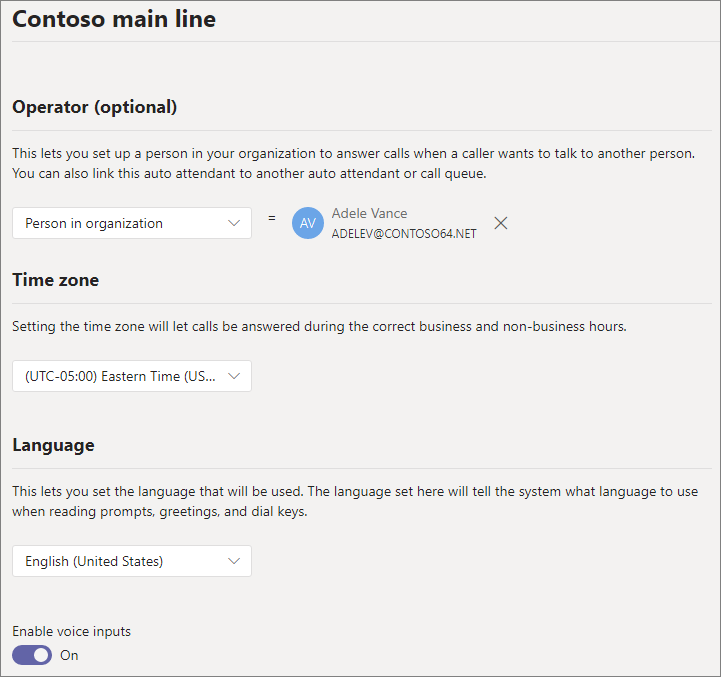
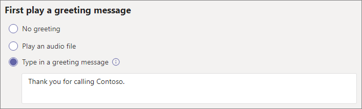
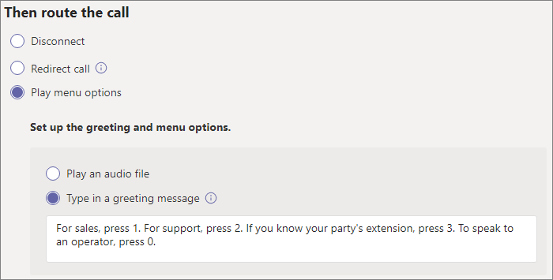
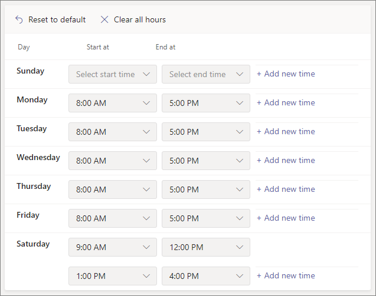
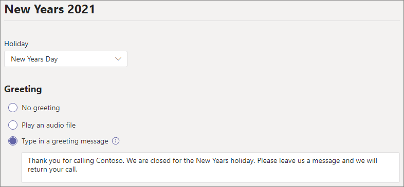
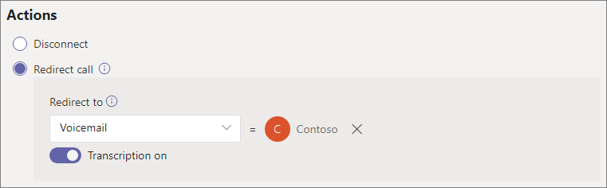
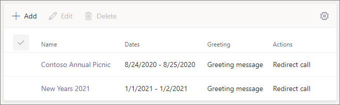
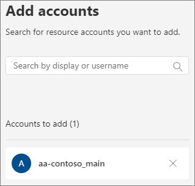
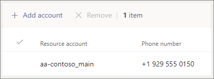

---
title: "Set up an auto attendant for Microsoft Teams"
author: CarolynRowe
ms.author: crowe
manager: serdars
ms.reviewer: colongma
ms.topic: article
ms.assetid: 6fc2687c-0abf-43b8-aa54-7c3b2a84b67c
ms.tgt.pltfrm: cloud
ms.service: msteams
search.appverid: MET150
ms.collection: 
  - M365-voice
  - m365initiative-voice
audience: Admin
appliesto: 
  - Skype for Business
  - Microsoft Teams
ms.localizationpriority: medium
f1.keywords:
- CSH
ms.custom: 
  - Phone System
description: "Learn how to set up and test auto attendants for large organizations in Microsoft Teams."
--- 
# Set up an auto attendant

Auto attendants let people call your organization and navigate a menu system to speak to the right department, call queue, person, or an operator. You can create auto attendants for your organization with the Microsoft Teams admin center, or with PowerShell.

> [!TIP]
> This article is for large organizations. If your organization is a small business, read [Set up an auto attendant - small business tutorial](/microsoftteams/business-voice/create-a-phone-system-auto-attendant-smb) instead.

Be sure you have read [Plan for Teams auto attendants and call queues](plan-auto-attendant-call-queue.md) and followed the [getting started steps](plan-auto-attendant-call-queue.md#getting-started) before you follow the procedures in this article.

Auto attendants can direct calls, based on callers' input, to one of the following destinations:

- **Operator** - the operator defined for the auto attendant. Defining an operator is optional. The operator can be defined as any of the other destinations in this list.
- **Person in the organization** - a person in your organization who can receive voice calls. This person can be an online user or a user hosted on-premises using Skype for Business Server.
- **Voice app** - another auto attendant or a call queue. (Choose the resource account associated with the auto attendant or call queue when choosing this destination.)
- **Voicemail** - the voice mailbox associated with a Microsoft 365 group that you specify. You can choose if you want voicemail transcriptions and the "Please leave a message after the tone." system prompt.
- **External phone number** - any phone number. (See [external transfer technical details](create-a-phone-system-auto-attendant.md#external-phone-number-transfers---technical-details)).
- **Announcement (Audio file)** - Play an audio file. A recorded announcement message you upload that's saved as audio in .WAV, .MP3, or .WMA format. The recording can be no larger than 5 MB. The system plays the announcement, and then returns to the auto attendant menu.
- **Announcement (Typed)** - Type in a message. Text you want the system to read. You can enter up to 1000 characters. The system plays the announcement, and then returns to the auto attendant menu.

You'll be prompted to choose one of these options at various stages as you set up an auto attendant.

To set up an auto attendant, in the Teams admin center, expand **Voice**, select **Auto attendants**, and then select **Add**.

## Video demonstration

This video shows a basic example of how to create an auto attendant in Teams.

> [!VIDEO https://www.microsoft.com/videoplayer/embed/RWEnCG?autoplay=false]

## General info

1. Type a name for the auto attendant in the box at the top.

2. To designate an operator, specify the destination for calls to the operator. This designation is optional (but recommended). Set the **Operator** option to allow callers to break out of the menus and speak to a designated person.

3. Specify the time zone for this auto attendant. The time zone is used for calculating business hours if you [create a separate call flow for after hours](#call-flow-for-after-hours).

4. Specify a [supported language](create-a-phone-system-auto-attendant-languages.md) for this auto attendant. This is the language that will be used for system-generated voice prompts.

5. Choose if you want to enable voice inputs. When enabled, the name of every menu option becomes a speech-recognition keyword. For example, callers can say "One" to select the menu option mapped to key 1, or they can say "Sales" to select the menu option named "Sales."

   > [!NOTE]
   > If you choose a language in Step 4 that doesn't support voice inputs this option will be disabled.

6. Select **Next**.

## Call flow

Choose if you want to play a greeting when the auto attendant answers a call.

If you select **Play an audio file** you can use the **Upload file** button to upload a recorded greeting message saved as audio in .WAV, .MP3, or .WMA format. The recording can be no larger than 5 MB.

If you select **Type a greeting message** the system will read the text that you type (up to 1000 characters) when the auto attendant answers a call.

Choose how you want to route the call.

If you select **Disconnect**, the auto attendant will hang up the call.

If you select **Redirect call**, you can choose one of the call routing destinations.

If you select **Play menu options**, you can choose to **Play an audio file** or **Type in a greeting message** and then choose between menu options and directory search.

### Menu options

For dialing options, assign the 0-9 keys on the telephone keypad to one of the call routing destinations. (The keys \* (asterisk) and \# (pound) are reserved by the system and can't be reassigned. Pressing either of these keys will repeat the current menu.)

> [!NOTE]
> The # key only backs up to the most recent auto attendant. Once the boundary is crossed to a new auto attendant, the # key will not be able to take you to the previous one.

Key mappings don't have to be continuous. It's possible to create a menu with keys 0, 1, and 3 mapped to options, while the number 2 key isn't used.

We recommend mapping the zero key to the operator if you've configured one. If the operator isn't set to any key, the voice command "Operator" is also disabled.

For each menu option, specify the following settings:

- **Dial key** - the key on the telephone keypad to access this option. If voice inputs are available, callers can also say this number to access the option.

- **Voice command** - defines the voice command that a caller can give to access this option, if voice inputs are enabled. It can contain multiple words like "Customer Service" or "Operations and Grounds." For example, the caller can press 2, say "two," or say "Sales" to select the option mapped to the two keys. This text is also rendered by text to speech for the service confirmation prompt, which might be something like "Transferring your call to sales."

- **Redirect to** - the call routing destination used when callers choose this option. If you are redirecting to an auto attendant or call queue, choose the resource account associated with it.

### Directory search

If you assign dial keys to destinations, we recommend that you choose **None** for **Directory search**. If a caller attempts to dial a name or extension using keys that are assigned to specific destinations, they might be unexpectedly routed to a destination before they finish entering the name or extension. We recommend that you create a separate auto attendant for directory search and have your main auto attendant link to it with a dial key.

If you didn't assign dial keys, then choose an option for **Directory search**.

**Dial by name** - If you enable this option, callers can say the user's name or type it on the telephone keypad. Any online user or any user hosted on-premises using Skype for Business Server, is an eligible user and can be found with Dial by name. (You can set who is and isn't included in the directory on the [Dial scope](#dial-scope) page.)

**Dial by extension** - If you enable this option, callers can connect with users in your organization by dialing their phone extension. Any online user or any user hosted on-premises using Skype for Business Server, is an eligible user and can be found with **Dial by extension**. (You can set who is and isn't included in the directory on the [Dial scope](#dial-scope) page.)

Users you want to make available for Dial By Extension need to have an extension specified as part of one of the following phone attributes defined in Active Directory (and synchronized via Azure AD Connect) or Azure Active Directory. (See [Add users individually or in bulk](/microsoft-365/admin/add-users/add-users) for more information.)

- OfficePhone/TelephoneNumber (AD and Azure AD)
- HomePhone (AD)
- Mobile/MobilePhone (AD and Azure AD)
- OtherTelephone (AD)

The required format to enter the extension in the user phone number field can be one of the following formats:

- *+\<phone number>;ext=\<extension>*
- *+\<phone number>x\<extension>*
- *x\<extension>*

- Example 1: Set-MsolUser -UserPrincipalName usern@domain.com -Phonenumber "+15555555678;ext=5678"
- Example 2: Set-MsolUser -UserPrincipalName usern@domain.com -Phonenumber "+15555555678x5678"
- Example 3: Set-MsolUser -UserPrincipalName usern@domain.com -Phonenumber "x5678"

You can set the extension in the [Microsoft 365 admin center](https://admin.microsoft.com/) or the [Azure Active Directory admin center](https://aad.portal.azure.com). It can take up to 12 hours before changes are available to auto attendants and call queues.

> [!NOTE]
> If you want to use both the **Dial by name** and **Dial by extension** features, you can assign a dial key on your main auto attendant to reach an auto attendant enabled for **Dial by name**. Within that auto attendant, you can assign the 1 key (which has no letters associated with it) to reach the **Dial by extension** auto attendant.

Refer to [Dial and voice reference](dial-voice-reference.md) for more information.

Once you have selected a **Directory search** option, select **Next**.

## Call flow for after hours

Business hours can be set for each auto attendant. If business hours aren't set, all days and all hours in the day are considered business hours because a 24/7 schedule is set by default. Business hours can be set with breaks in time during the day, and all of the hours that are not set as business hours are considered after-hours. You can set different incoming call-handling options and greetings for after-hours.

Depending on how you have configured your auto attendants and call queues, you may only need to specify after-hours call routing for auto attendants with direct phone numbers.

If you want separate call routing for after-hours callers, then specify your business hours for each day. Select **Add new time** to specify multiple sets of hours for a given day, for example, to specify a lunch break.

Once you've specified your business hours, then choose your call routing options for after hours. The same options are available as for the business hours call routing that you specified above.

Select **Next** when you're done.

## Call flows during holidays

Your auto attendant can have a call flow for each [Holiday you've set up](set-up-holidays-in-teams.md). You can add up to 20 scheduled holidays to each auto attendant.

1. On the Holiday call settings page, select **Add**.

2. Type a name for this holiday setting.

3. From the **Holiday** dropdown, choose the holiday that you want to use.

4. Choose the type of greeting that you want to use.

    

5. Choose if you want to **Disconnect**, **Redirect**, or **Play menu options**.

6. If you chose to redirect, choose the call routing destination for the call.

7. If you choose to play menu options, configure the [Menu options](#menu-options).

8. Select **Save**.

Repeat the procedure as needed for each additional holiday.

When you've added all your holidays, select **Next**.

## Dial scope

The *dial scope* defines which users are available in the directory when a caller uses dial-by-name or dial-by-extension. The default of **All online users** includes all users in your organization that are Online users or hosted on-premises using Skype for Business Server.

You can include or exclude specific users by selecting **Custom user group** under **Include** or **Exclude** and choosing one or more Microsoft 365 groups, distribution lists, or security groups. For example, you might want to exclude executives in your organization from the dialing directory. (If a user is in both lists, they will be excluded from the directory.)

> [!NOTE]
> It might take up to 36 hours for a new user to have their name listed in the directory.

When you're done setting the dial scope, select **Next**.

## Resource accounts

All auto attendants must have an associated resource account.  First-level auto attendants will need at least one resource account that has an associated service number. If you wish, you can assign several resource accounts to an auto attendant, each with a separate service number.

To add a resource account, select **Add account** and search for the account that you want to add. Select **Add**, and then select **Add**.

When you have finished adding resource accounts, select **Submit** to complete auto attendant configuration.

See [Manage Teams resource accounts](manage-resource-accounts.md) for more information.

## External phone number transfers - technical details

Refer to the [Prerequisites](plan-auto-attendant-call-queue.md#prerequisites) in order to allow auto attendants to transfer calls externally.  In addition:

- For a resource account with a [Calling Plan license](calling-plans-for-office-365.md) or [Operator Connect](operator-connect-plan.md) number, the external transfer phone number must be entered in E.164 format (+[country code][area code][phone number]).

- For a resource account with a Microsoft Teams Phone License and Direct Routing online voice routing policy, the external transfer phone number format is dependant on the [Session Border Controller (SBC)](direct-routing-connect-the-sbc.md) settings.

The outbound phone number that's displayed is determined as follows:

  - For Calling Plan and Operator Connect numbers, the original caller's phone number is displayed.
  - For Direct Routing numbers, the number sent is based on the P-Asserted-Identity (PAI) setting on the SBC, as follows:
    - If set to Disabled, the original caller's phone number is displayed. This is the default and recommended setting.
    - If set to Enabled, the resource account phone number is displayed.

In a Skype for Business hybrid environment, to transfer an auto attendant call to the PSTN, create a new on-premises user with call forwarding set to the PSTN number. The user must be enabled for Enterprise Voice and have a voice policy assigned. To learn more, see [Auto attendant call transfer to PSTN](/SkypeForBusiness/plan/exchange-unified-messaging-online-migration-support#auto-attendant-call-transfer-to-pstn).

## Auto attendant cmdlets

Windows PowerShell allows you to create and manage auto attendants via the command line in a batch or programmatic manner.

The following cmdlets allow you to manage auto attendants:

- [New-CsAutoAttendant](/powershell/module/skype/new-csautoattendant)  
- [Get-CsAutoAttendant](/powershell/module/skype/get-csautoattendant)
- [Set-CsAutoAttendant](/powershell/module/skype/set-csautoattendant)
- [Update-CsAutoAttendant](/powershell/module/skype/update-csautoattendant)
- [Remove-CsAutoAttendant](/powershell/module/skype/remove-csautoattendant)
- [New-CsOnlineTimeRange](/powershell/module/skype/new-csonlinetimerange)
- [New-CsOnlineDateTimeRange](/powershell/module/skype/new-csonlinedatetimerange)
- [New-CsOnlineSchedule](/powershell/module/skype/New-CsOnlineSchedule)
- [Get-CsAutoAttendantHolidays](/powershell/module/skype/get-csautoattendantholidays)
- [Import-CsAutoAttendantHolidays](/powershell/module/skype/import-csautoattendantholidays)
- [Export-CsAutoAttendantHolidays](/powershell/module/skype/export-csautoattendantholidays)
- [New-CsAutoAttendantDialScope](/powershell/module/skype/New-CsAutoAttendantDialScope)
- [New-CsAutoAttendantPrompt](/powershell/module/skype/New-CsAutoAttendantPrompt)
- [New-CsAutoAttendantCallableEntity](/powershell/module/skype/New-CsAutoAttendantCallableEntity)
- [New-CsAutoAttendantMenuOption](/powershell/module/skype/New-CsAutoAttendantMenuOption)
- [New-CsAutoAttendantMenu](/powershell/module/skype/new-csautoattendantmenu)
- [New-CsAutoAttendantCallFlow](/powershell/module/skype/New-CsAutoAttendantCallFlow)
- [New-CsAutoAttendantCallHandlingAssociation](/powershell/module/skype/New-CsAutoAttendantCallHandlingAssociation)
- [Get-CsAutoAttendantStatus](/powershell/module/skype/Get-CsAutoAttendantStatus)
- [Get-CsAutoAttendantTenantInformation](/powershell/module/skype/Get-CsAutoAttendantTenantInformation)

The following additional cmdlets are also required to manage the users, resource accounts, Microsoft Teams Phone licenses, phone numbers, audio files, and supported language that will be used with call queues:

Users/Teams

- Users
- - [Get-CsOnlineUser](/powershell/module/skype/Get-CsOnlineUser)

- Teams: 
- - [Get-Team](/powershell/module/teams/Get-Team)

Resource accounts:

- [New-CsOnlineApplicationInstance](/powershell/module/skype/New-CsOnlineApplicationInstance)
- [Find-CsOnlineApplicationInstance](/powershell/module/skype/Find-CsOnlineApplicationInstance)
- [Get-CsOnlineApplicationInstance](/powershell/module/skype/Get-CsOnlineApplicationInstance)
- [Set-CsOnlineApplicationInstance](/powershell/module/skype/Set-CsOnlineApplicationInstance)
- [New-CsOnlineApplicationInstanceAssociation](/powershell/module/skype/New-CsOnlineApplicationInstanceAssociation)
- [Get-CsOnlineApplicationInstanceAssociation](/powershell/module/skype/Get-CsOnlineApplicationInstanceAssociation)
- [Remove-CsOnlineApplicationInstanceAssociation](/powershell/module/skype/Remove-CsOnlineApplicationInstanceAssociation)
- [Get-CsOnlineApplicationInstanceAssociationStatus](/powershell/module/skype/Get-CsOnlineApplicationInstanceAssociationStatus)

Virtual Teams Phone licenses:

- [Get-MsolAccountSku](/powershell/module/msonline/get-msolaccountsku)
- [Set-MsolUserLicense](/powershell/module/msonline/set-msoluserlicense)

Phone number assignment:

- [Get-CsOnlineTelephoneNumber](/powershell/module/skype/Get-CsOnlineTelephoneNumber)
- [Set-CsPhoneNumberAssignment](/powershell/module/teams/Set-CsPhoneNumberAssignment)

Audio Files

- [Get-CsOnlineAudioFile](/powershell/module/skype/Get-CsOnlineAudioFile)
- [Import-CsOnlineAudioFile](/powershell/module/skype/Import-CsOnlineAudioFile)
- [Export-CsOnlineAudioFile](/powershell/module/skype/Export-CsOnlineAudioFile)
- [Remove-CsOnlineAudioFile](/powershell/module/skype/Remove-CsOnlineAudioFile)

Support Languages and Time zones

- [Get-CsAutoAttendantSupportedLanguage](/powershell/module/skype/Get-CsAutoAttendantSupportedLanguage)
- [Get-CsAutoAttendantSupportedTimeZone](/powershell/module/skype/Get-CsAutoAttendantSupportedTimeZone)

For a step-by-step guide to creating auto attendants with PowerShell, see [Creating Auto Attendants with PowerShell cmdlets](create-a-phone-system-auto-attendant-via-cmdlets.md)

## Auto Attendant Diagnostic Tool

If you're an administrator, you can use the following diagnostic tool to validate that an auto attendant is able to receive calls:

1. Select **Run Tests** below, which will populate the diagnostic in the Microsoft 365 Admin Center. 

   > [!div class="nextstepaction"]
   > [Run Tests: Teams Auto Attendant](https://aka.ms/TeamsAADiag)

2. In the Run diagnostic pane, enter the Resource Account in the **Username or Email** field, and then select **Run Tests**.

3. The tests will identify tenant, policy, or resource account configurations that are preventing the auto attendant from being able to receive calls and provide steps to fix any problems identified.

## Related topics

[Here's what you get with Teams Phone](./here-s-what-you-get-with-phone-system.md)

[Getting service phone numbers](./getting-service-phone-numbers.md)

[Country and region availability for Audio Conferencing and Calling Plans](./country-and-region-availability-for-audio-conferencing-and-calling-plans/country-and-region-availability-for-audio-conferencing-and-calling-plans.md)

[An introduction to Windows PowerShell and Skype for Business Online](/SkypeForBusiness/set-up-your-computer-for-windows-powershell/set-up-your-computer-for-windows-powershell)
