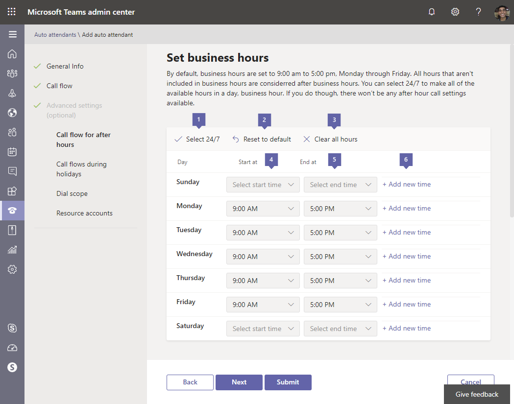
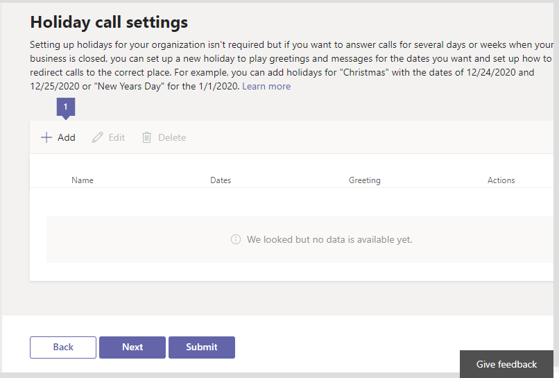
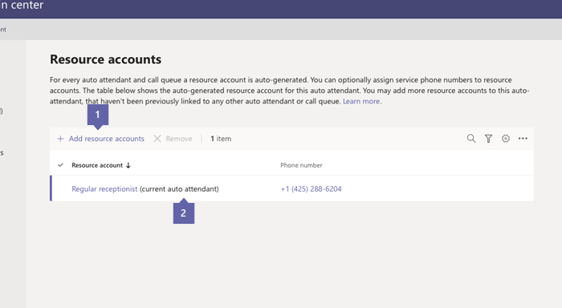
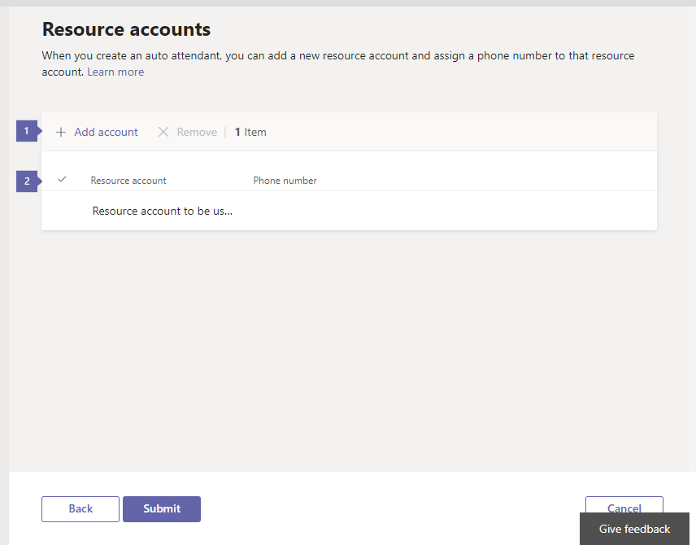
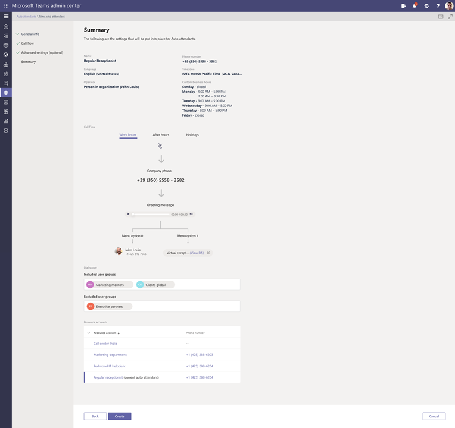

# Set up a Cloud auto attendant

Auto attendants let people call your organization and navigate a menu system to speak to the right department, call queue, person, or an operator. You can create auto attendants for your organization with the Microsoft Teams admin center, or with Powershell. To create an auto attendant, go to **Voice** in the left navigation, and then select **Auto attendants** > **Add new**.

If you want to learn more about auto attendants, see [What are Cloud auto attendants?](/microsoftteams/what-are-phone-system-auto-attendants)

> [!NOTE]
> This article applies to both Microsoft Teams and Skype for Business Online.

Phone numbers are not directly assigned to the auto attendant, but rather to a [resource account](manage-resource-accounts.md) that is associated to the auto attendant.

Auto attendant implementations often involve several auto attendants. A *first-level* auto attendant usually has a resource account with an assigned phone number. A nested auto attendant is used as a second-level menu that the *first-level* auto attendant connects  as call to. A *nested* auto attendant isn't required to  have a phone number assigned to its resource account.

## Step 1 — Get started

- An auto attendant is required to have an associated resource account. See [Manage resource accounts in Teams](manage-resource-accounts.md) for details on resource accounts and all licenses required. 
 
<!-- When you create a new auto attendant in Teams after October 10th, 2019, the required auto attendant is automatically created and linked with the new auto attendant. -->
 
> [!TIP]
> To redirect calls to an operator or a menu option that is an Online user with a Phone System license, you will need to enable them for Enterprise Voice. See [Assign Skype for Business licenses](/skypeforbusiness/skype-for-business-and-microsoft-teams-add-on-licensing/assign-skype-for-business-and-microsoft-teams-licenses) or [Assign Microsoft Teams licenses](assign-teams-licenses.md). You can also use Windows PowerShell. For example, run: `Set-CsUser -identity "Amos Marble" -EnterpriseVoiceEnabled $true`

## Step 2 — Create auto attendants

> [!IMPORTANT]
> Every auto attendant is required to have an associated [resource account](manage-resource-accounts.md). You must create the resource account first, then you can associate it to the auto attendant.

### With the Microsoft Teams admin center

In the **Microsoft Teams admin center**, click   **Voice** > **Auto attendants**, then click **+ Add**:

#### General info page

* * *

**Name** Enter a display name for your auto attendant. The name is required and can contain up to 64 characters, including spaces. The **Name** you designate here is listed in a column on the **Auto attendants** tab.

* * *

**Operator** This is optional (but recommended). You can set the **Operator** option to allow callers to break out of the menus and speak to a designated person.

The 0 key is assigned to Operator by default.

If you set an Operator, tell people who call about the option in **Edit menu options** on the **Call flow** page. If you set an operator on your auto attendant, you enter the corresponding prompt text in the **Callers will hear** box or change your audio file to include this option. For example, "For the Operator, press zero."

You have several ways to set the Operator:

- **No operator** disables the "Operator" and "Press 0" options. This is the current default.
- **Person in your organization** assigns a person with a Phone System license that is enabled for Enterprise Voice or assigned Calling Plans in Office 365. You can also set it up so the caller is sent to voicemail. To send a caller to voicemail, select **Person in your organization** and set that account's settings to send calls directly to voicemail.

     > [!Note]
     > **Person in your organization** can be an Online user or a user hosted on-premises using Skype for Business Server.

- **Voice app**  Select the name of the resource account linked to an auto attendant or call queue that has already been created. Callers that request an operator are redirected there.  
<!--   

- **Auto attendant** Select the name of the resource account linked to an auto attendant that has already been created. Callers that request an operator are redirected there.
- **Call queue** Select the name of the resource account linked to a call queue that has already been created. Callers that request an operator are redirected there.

**Phone number (optional)** Enter the service phone number you want to assign to the new resource account this wizard creates and links to the new auto attendant. If you intend this auto attendant to be a nested auto attendant, it doesn't need a phone number. You can add one if for some reason you require several ways to connect to the auto attendant system.

> [!NOTE]
> Auto attendants created after October 10th, 2019 also create a new [resource account](manage-resource-accounts.md) that is associated with the auto attendant. If a phone number is applied to the auto attendant's resource account,  a Phone System - Virtual user license is applied to the resource account if one is available.
-->

* * *

 **Time zone** You are required to set the time zone for your auto attendant. The setting can be the same as the time zone of the main address listed for your organization, or a different time zone. Each auto attendant can have a different time zone. The business hours set for the auto attendant also use this time zone. Make sure to set the right timezone to avoid business-hours discrepancies since not all regions have Daylight Saving. 

* * *

**Language** Select the language that you want to use for your auto attendant. The auto attendant uses that language with callers, and all system prompts are played in this language.

 * * *

**Enable voice inputs** Speech recognition is available if this option is selected. Callers can use voice input in the  [language you set](set-auto-attendant-languages-for-audio-conferencing-in-teams.md). If you want to only let people use their phone keypad to make selections, you can leave speech recognition set to **Off**.

* * *  

When you finish with your selections, click **Next**.

#### Call flow

> [!TIP]
> You can choose to set up a custom business hours schedule, with different call flow behaviors during and after business hours. To set a custom schedule, set the optional [Call flow for after hours](#call-flow-for-after-hours). By default, an auto attendant uses business hours call flows.

You can set up customized greetings, prompts, and menus that people hear when they reach your auto attendant.

* * *

**First play a greeting message** A greeting is optional and can be set to **No greeting**, **Play an audio file**, or **Type a greeting message**.

> [!NOTE]
> A greeting is most valuable for a first-level auto attendant. A nested auto attendant often doesn't need a greeting.

If you select **No Greeting**, the caller doesn't hear a message or greeting before the call is handled by one of the actions you select later. 

<!-- You can also upload an audio file (in .wav, mp3 or .wma formats), or create a custom greeting using Text-to-Speech.-->

 If you select **Play an audio file** you can use the **Upload file** button to upload a recorded greeting message saved as audio in .WAV, .MP3, or .WMA format. The recording can be no larger than 5 MB.

 **Type a greeting message** If you choose this option, enter the text you want the system to read (up to 1000 characters) in the field provided. For example, enter "Welcome to Contoso. Your call is important to us." Output is created by text-to-voice software.

* * *

You can select what happens next to calls from the following actions in the  **Then route the call** section. Settings are **Disconnect**, **Redirect call**, or **Play menu options**.

If you select **Disconnect**, the caller is disconnected after the greeting plays. 

 **Redirect call** sends the caller to the chosen destination without choosing from options. The possible settings are:

  - **Person in organization** The account you choose must have a Phone System license enabled for Enterprise Voice or have an assigned Calling Plan in Office 365. You can set it up so the caller can be sent to voicemail: select **Person in organization** and set that account to have calls forwarded directly to voicemail.

  > [!Note]
  > **Person in organization** can be an Online user or a user hosted on-premises using Skype for Business Server.

  - **Voice App** Select an auto attendant or call queue that has already been set up. You search for the auto attendant or call queue by the name of the resource account associated with the service.

<!-- - **Auto attendant** Select the name of an existing auto attendant.
- **Call queue** Select the name of an auto attendant that has already been created.
- **External phone number** routes the caller to a phone number outside your local system.
- **Operator** directs the call to a user you designate as an Operator. If you haven't previously set up an operator, an option to create one now shows up. The 0 key is assigned to Operator by default. Options for setting an Operator are:

  - **No operator** disables the "Operator" and "Press 0" options.
  - **Person in your organization** can be an Online user or a user hosted on-premises using Skype for Business Server. They must have a Phone System license that is enabled for Enterprise Voice or assigned Calling Plans in Office 365. Search for the operator in the **Destination for your operator** field.
  - **Auto attendant** lets you choose the name of an existing auto attendant.
  - **Call queue** lets you select an existing call queue.
  - **Group Voicemail** routes the call to a voicemail box that you select. -->

 * * *

 When you select **Play menu options** You can select whether to use an audio file or enter text that will be rendered as text to speech to give dialpad menu options to callers. Select this instead of the **Redirect call to** or **Disconnect** options.

 **Play an audio file** lets you set up a prompts and options for the caller to choose. 
- If you select **Play an audio file** you can use the **Upload file** button to upload a recorded greeting message saved as audio in .WAV, .MP3, or .WMA format. The recording can be no larger than 5 MB.

- **Type a greeting message** If you choose this option, enter the text you want the system to read (up to 1000 characters) in the field provided. For example, enter "Welcome to Contoso. Your call is important to us." Output is created by text-to-voice software.

**Set menu options** Telephone keypad or voice commands can be added or removed in this dialog. To delete a menu option, remove the voice command entry and set **Redirect to** back to **Select**.

> [!TIP]
> Update menu prompt text or re-record the audio prompts when you remove options. The menu prompt played for callers isn't automatically updated.  
>
> Any menu option can be added and removed in any order, and the key mappings don't have to be continuous. It is possible, for example, to create a menu with keys 0, 1, and 3 mapped to options, while the key 2 isn't used.

> [!NOTE]
> The keys \* (Repeat) and \# (Back) are reserved by the system and can't be reassigned. If speech recognition is enabled, pressing * will correspond with "Repeat" and # will correspond with the "Back" voice commands.

 To set up a menu option, click on the  **+Assign a dial key** and enter information for the following options:

  **Voice command** column for an option can be up to 64 characters long, and can contain multiple words like "Customer Service" or "Operations and Grounds." If speech recognition is enabled, the name is automatically recognized, and the caller is able to press 3, say "three," or say "Customer Service" to select the option mapped to key 3. This text is also rendered by text to speech for the service confirmation prompt, which might be something like "Transferring your call to the Operator."

  The **Redirect to** option sets where the call goes if the corresponding key is pressed, or the option is selected using speech recognition. The call can be sent to:

<!-- Is the Operator behavior changing here? Looks like operator is only an available option for dial key 0 -->

- **Operator** If an operator is already set up, the option is automatically mapped to key 0, but can also be deleted or reassigned to a different key. The caller who selects this option is sent to the designated Operator. If Operator isn't set to any key, the voice command "Operator" is also disabled. 
- **Person in organization** can be an Online user or a user hosted on-premises using Skype for Business Server. The user must have a Phone System license that is enabled for Enterprise Voice or assigned Calling Plans in Office 365. Search for the person in the **Search by name** field.

  - **Voice App** Select an auto attendant or call queue that has already been set up. You search for the auto attendant or call queue by the name of the resource account associated with the application.

<!-- - **Auto attendant** Select the name of an existing auto attendant in the **Search by name** field. You will also have to select a resource account associated to the auto attendant. The caller who selects this option is sent to that auto attendant.
- **Call queue** Select the name of an existing call queue in the **Search by name** field. You will also have to select a resource account associated to the call queue. The caller who selects this option is sent to that call queue, where the call is answered by a call agent.
- **External phone number** routes the caller to a designated phone number outside your local system.<!-- does this have prerequisites like direct routing?
- **Group Voicemail** routes the call to a voicemail box that you select.  -->

  **Directory search** In this section, you can enable **Dial by name** and **Dial by Extension** for the auto attendant. You can set who is and is not included in these services in the optional Dial Scope page. Directory search is set to **None** by default.

**Dial by name** If you enable this option, callers can search for people in your organization using **Dial by name**. They say the user's name and voice recognition matches them to a user. You can set who is and is not included in these services in the optional Dial Scope page. Any online user with a Phone System license, or any user hosted on-premises using Skype for Business Server, is an eligible user and can be found with Dial by name.

**Dial by extension** If you enable this option, callers can connect with users in your organization by entering their phone extension. You can select which users are listed as available or not available for **Dial by extension** in the optional Dial Scope page. Any online user with a Phone System license, or any user hosted on-premises using Skype for Business Server, is an eligible user and can be found with Dial by extension.

> [!IMPORTANT]
> Please observe the following:
>- Users you wish to make available for Dial By Extension need to have an extension specified as part of their phone number or mobile phone number assigned in the [Microsoft 365 admin center](https://docs.microsoft.com/office365/admin/add-users/add-users?view=o365-worldwide#use-the-new-admin-center-to-add-users).  The required format to enter the extension in the user phone number field is is either `+<phonenumber>;ext=<extension>` or `x<extension>`.
>- Assigning an extension in Teams Admin center is not currently supported. You must either use the [Set-MsolUser](https://docs.microsoft.com/powershell/module/msonline/set-msoluser?view=azureadps-1.0) powershell command or the Microsoft 365 admin center.
>- It can take up to 12 hours before changes to the AAD PhoneNumber and MobilePhone attributes are available.
>- Please do NOT define an extension for the LineUri of a user. This is  not supported currently.
>- An auto attendant can be configured for either dial by name or dial by extension, but not both.

> [!NOTE]
> If you want to use both the **Dial by name** and **Dial by extension** features, you can create  main auto attendant (enabled for **Dial by name**) that prompts callers to choose a menu option if they know the extension of the user, and set that option to transfer the call to an auto attendant enabled for Dial by extension.

* * *

<!--
**Instructions for callers** lets you choose **Use recorded call instructions** or **Write your call instructions**.  

If you choose **Use recorded call instructions**, you have the option to record and upload new or prerecorded sound files to play as menu instructions. The same app used in recording the auto attendant greeting is used here.

If you choose **Write your call instructions**, enter the script  you want the system to read (up to 1000 characters). For example, you might enter text that begins "Please choose from one of the following menu options ... " and provide a script written to reflect your configuration.
* * *  -->

When you are finished with your selections, you can click **Next** if you want to change advanced settings, or click **Submit** if you want to use default settings for things like:
- Call flow for after hours
- Call flow for holidays
- Dial Scope
- Resource accounts

Since your auto attendant is required to have a resource account, you have a choice of proceeding to the **Resource account** page and associating a resource account you've already configured, or creating a resource account and associating it to the auto attendant as described in [Manage resource accounts in Microsoft Teams](manage-resource-accounts.md). You won't be able to use this auto attendant until it has been associated to a resource account. to do this, click the **Next** button at the bottom of the screen and then click on **Resource accounts** in the left navigation to go straight to the Resource accounts page and associate your auto attendant to a resource account.

#### Advanced settings (optional)

There are four additional screens that you can configure or leave at defaults as you choose.

##### Call flow for after hours

By default, an auto attendant's business hours are set to 9am-5pm, Monday to Friday  <!--24/7-->, and the call flow options for *after hours* calls are disabled because all hours are considered *business hours*. When you select the **Setup custom business hours** option, the **Call flow for after hours** page configures the call handling rules used by the auto attendant after hours. The options available are the same, the difference is the ability to set a schedule for different menus and behaviors.

A system of auto attendants may only need to set after hours call handling behavior for the first-level auto attendant. Nested auto attendants may not even be called by the first-level auto attendant, but alternately the system can define after-hours behavior for each auto attendant it uses.

Initially, the business hours are defined to start at 12:00 am and end at 12:00 pm, Sunday through Saturday. All hours that aren't during business hours are considered *after hours*.

 * * *

You can click **Select 24/7** to make all hours business hours for this auto attendant.

Select the **Reset to default** option to revert all changes in the schedule and return to the default definition of business hours as 9:00 am to 5:00 pm Monday to Friday.

Select **Clear all hours** to completely clear the schedule. Selecting this and leaving the hours unset is not recommended, so use this option only if you want to completely redo your business hours.

  
To customize start or end time for a day of the week, click on **Start at** or **End at** time you wish to reset and select the new time from the list that appears. The list allows you to select business hours in 15-minute intervals, and the business hours you select here are based on the time zone that you set on the **General info** page.

 <!-- The **Apply to all days** option can be used to reset all days of the week to match the settings for that day. This makes setting weekdays and weekends to different hours easier.-->

  To set up a break (a lunch break, for example), select **Add new time** for that day of the week to create anew table row, and select new start and end times. You can set multiple breaks within business hours.

The [Call flow](#call-flow) options available after hours are the same as the options available during business hours. Scroll down on the information entry page to set after hours call flow options.

* * *

When you are finished with your selections, click **Next**. You can also click on **Resource accounts** in the left navigation to go straight to the Resource accounts page and associate your auto attendant to a resource account.

##### Call flow during holidays

You can add up to 20 scheduled holidays to each auto attendant. Your organization may already have defined holidays as described in [Set up holidays in Microsoft Teams](set-up-holidays-in-teams.md). If not you will see the following screen: 

 To set a custom call flow for a holiday on the auto attendant, click **+ Add** the see the **New holiday call flow** screen.
> [!TIP]
> To create Holidays you can  go to the screen at **Org-wide settings** > **Holidays**.  

* * *

  Enter a **Name** for your new call flow.

 If you've already created holidays, you'll see them in the **Holiday** pull-down menu and can select them. You might see an unused option that you can edit into what you need. If not, click on **Add** at the bottom of the pull-down list to create a new Holiday.  See [Set up holidays in Microsoft Teams](set-up-holidays-in-teams.md) for the steps used to create a holiday. 

A holiday call flow name can be up to 64 characters long and must be unique for the organization. For example, you can't have two holiday call flows named "Thanksgiving" in the same organization. Your auto attendant can have a call flow for each Holiday you've set up, but you might want to have a common set of behaviors planned other than a customized greeting.

 The [Greetings](#call-flow) options available for a holiday call flow are the same as the options available during business hours. The **Actions** performed after the greeting plays is also similar, except that the only available actions are to **Disconnect** or **Redirect to**, and when choosing the **Redirect to** option the Operator is not one of the available choices. You can't set up a menu specific to a Holiday flow.

> [!NOTE]
> By default, all calls received during a holiday period are set to **Disconnect** after the greeting (if any), so you must specify a redirect if you want a custom behavior.

Click on Save to finish creating the Holiday call flow. Once you have created a Holiday call flow, it will show up on the **Call Flows during holidays** screen.

Click on **Next** to set Dial scope, **Back** to make changes to after hour call flows, and **Submit** if you are finished. You can also click on **Resource accounts** in the left navigation to go straight to the Resource accounts page and associate your auto attendant to a resource account.

#### Dial scope

On this page, you can set who is listed in your directory and available for Dial by Name when a person calls your organization. Dial by name is set to **Off** by default in an earlier screen. All users with an extension will be available if **Dial by extension** was selected earlier.

 **Include** The options in this section are either **All online users** or **Custom user groups**

If you select **All online users**, all eligible users are included in directory search.

**Custom user groups** This option lets you search for and select an Office 365 Group, distribution list, or security group already created in your organization. Users are added to the directory if they are in the chosen Office 365 Group, distribution list, or security group and they are **Online users with a Phone System license** or hosted on-premises using Skype for Business Server. You can add multiple Office 365 Groups, distribution lists, and security groups to the directory.

On this page, you can set up which users in your organization will be listed in your directory and available for Dial by Name when a person that calls in to your organization.

 **Exclude** The options in this section let you exclude specific users or groups of users from the organization's directory.

If you select **None**, all eligible users are included in directory search.

**Custom user group** You can search for an Office 365 Group, distribution list, or security group that has been created in your organization. Users in that group are excluded from directory search. You can add multiple Office 365 Groups, distribution lists, and security groups.

If you leave settings at their default when Dial by Name is enabled, all eligible users are included in directory search.

> [!NOTE]
> It might take up to 36 hours for a new user to have their name listed in the directory. When someone uses Dial by Name with speech recognition, new accounts may not be available for this feature.

After you enter all the required fields and set up call handling menus and options, click **Next** to proceed to associating a resource account.

#### Resource accounts

All auto attendants must have an associated resource account.  First level auto attendants will definitely need at least one resource account that has an associated service number. If you wish, you can assign several resource accounts to an auto attendant, each with a separate service number.

If you haven't already configured a resource account to your auto attendant, you would see the following screen: 

 

 To add one or more existing and unassigned resource accounts to the auto attendant, click **Add accounts** and search and select them from the provided dialogs.

 To add an additional resource account, click on **+ Add account**.

 The resource account or accounts assigned to this auto attendant are shown in a list.

## Edit auto attendants

After you save your new auto attendant, it is listed on the **Auto attendants** page. That page allows you to quickly see some of the options that you have set up, including the name, associated resource account, language, and assigned Operator.

If you want to change auto attendant settings, select the auto attendant, and then in the Action pane click **Edit**.

<!-- To quickly place a test call to your auto attendant, click the **Test** button in the Action pane. -->

<!-- ## Summary view

You can use the Summary page to review the settings you've created.

Press the **Create** button to finish setup of your new auto attendant. -->

### Create an auto attendant with Powershell

You can also use PowerShell to create and set up auto attendants. Here are the cmdlets that you need to manage an auto attendant:

- [New-CsAutoAttendant](https://docs.microsoft.com/powershell/module/skype/new-csautoattendant?view=skype-ps)  
- [Set-CsAutoAttendant](https://docs.microsoft.com/powershell/module/skype/set-csautoattendant?view=skype-ps)
- [Get-CsAutoAttendant](https://docs.microsoft.com/powershell/module/skype/new-csautoattendant?view=skype-ps)
- [Get-CsAutoAttendantHolidays](https://docs.microsoft.com/powershell/module/skype/get-csautoattendantholidays?view=skype-ps)
- [Remove-CsAutoAttendant](https://docs.microsoft.com/powershell/module/skype/remove-csautoattendant?view=skype-ps)
- [New-CsAutoAttendantMenu](https://docs.microsoft.com/powershell/module/skype/new-csautoattendantmenu?view=skype-ps)
- [New-CsOnlineAudioFile](https://docs.microsoft.com/powershell/module/skype/new-CsOnlineAudioFile?view=skype-ps)
- [New-CsAutoAttendantCallFlow](https://docs.microsoft.com/powershell/module/skype/New-CsAutoAttendantCallFlow?view=skype-ps)
- [Export-CsAutoAttendantHolidays](https://docs.microsoft.com/powershell/module/skype/export-csorganizationalautoattendantholidays?view=skype-ps)
- [New-CsOnlineTimeRange](https://docs.microsoft.com/powershell/module/skype/new-csonlinetimerange?view=skype-ps)
- [New-CsOnlineDateTimeRange](https://docs.microsoft.com/powershell/module/skype/new-csonlinedatetimerange?view=skype-ps)
- [New-CsOnlineSchedule](https://docs.microsoft.com/powershell/module/skype/New-CsOnlineSchedule?view=skype-ps)
- [Get-CsAutoAttendantSupportedTimeZone](https://docs.microsoft.com/powershell/module/skype/Get-CsAutoAttendantSupportedTimeZone?view=skype-ps)
- [New-CsAutoAttendantCallHandlingAssociation](https://docs.microsoft.com/powershell/module/skype/New-CsAutoAttendantCallHandlingAssociation?view=skype-ps)
- [Get-CsAutoAttendantSupportedLanguage](https://docs.microsoft.com/powershell/module/skype/Get-CsAutoAttendantSupportedLanguage?view=skype-ps)
- [Import-CsAutoAttendantHolidays](https://docs.microsoft.com/powershell/module/skype/import-csautoattendantholidays?view=skype-ps)
- [New-CsAutoAttendantCallableEntity](https://docs.microsoft.com/powershell/module/skype/New-CsAutoAttendantCallableEntity?view=skype-ps)

### More about Windows PowerShell

- Windows PowerShell is all about managing users and what users are allowed or not allowed to do. With Windows PowerShell, you can manage Office 365 and Microsoft Teams from a single point of administration that can simplify your daily work. To get started with Windows PowerShell, see these topics:

  - [An introduction to Windows PowerShell and Skype for Business Online](/SkypeForBusiness/set-up-your-computer-for-windows-powershell/set-up-your-computer-for-windows-powershell)

  - [Why you need to use Office 365 PowerShell](https://docs.microsoft.com/office365/enterprise/powershell/why-you-need-to-use-office-365-powershell)

- Windows PowerShell has many advantages in speed, simplicity, and productivity over only using the Microsoft 365 admin center, such as making setting changes for many users at once. Learn about these advantages in the following topics:

  - [Manage Office 365 with Office 365 PowerShell](https://docs.microsoft.com/office365/enterprise/powershell/manage-office-365-with-office-365-powershell)

  - [Using Windows PowerShell to manage Skype for Business Online](/SkypeForBusiness/set-up-your-computer-for-windows-powershell/set-up-your-computer-for-windows-powershell)

## Related topics

[Here's what you get with Phone System in Office 365](/MicrosoftTeams/here-s-what-you-get-with-phone-system)

[Getting service phone numbers](/microsoftteams/getting-service-phone-numbers)

[Country and region availability for Audio Conferencing and Calling Plans](/microsoftteams/country-and-region-availability-for-audio-conferencing-and-calling-plans/country-and-region-availability-for-audio-conferencing-and-calling-plans)

[New-CsOrganizationalAutoAttendant](https://docs.microsoft.com/powershell/module/skype/new-csorganizationalautoattendant?view=skype-ps)  

[What are Cloud auto attendants?](what-are-phone-system-auto-attendants.md)

[Small business example — Set up an auto attendant](/microsoftteams/tutorial-org-aa)  
