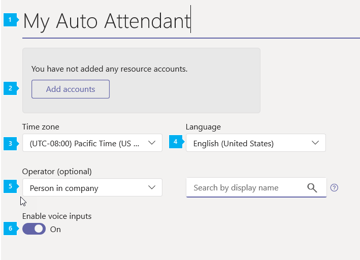
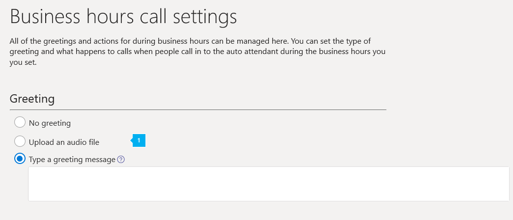
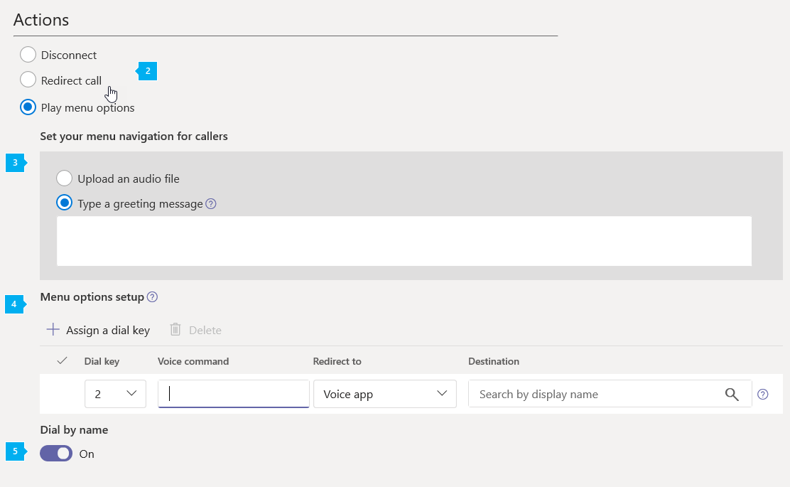
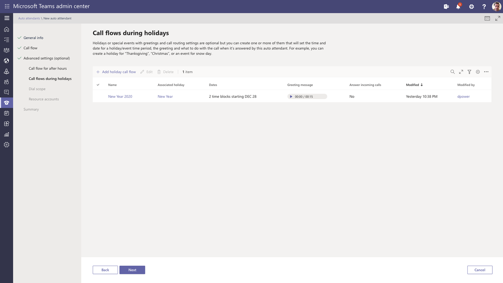
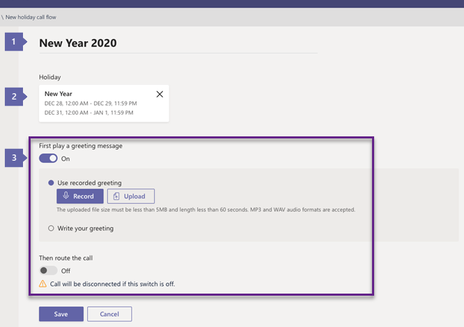
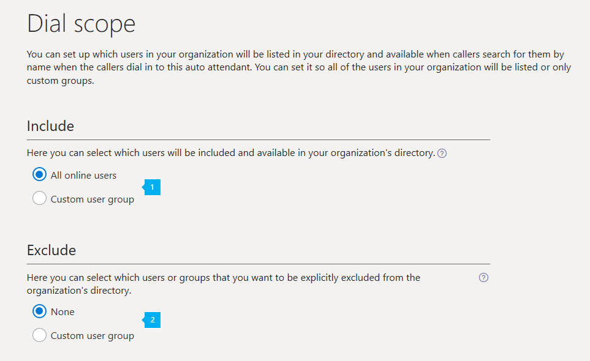

# Set up a Cloud auto attendant

Auto attendants let people that call in to your organization and navigate a menu system to get them to the right department, call queue, person, or the operator. You can create an auto attendant for your organization by using the Microsoft Teams admin center. To create a new auto attendant, go to **Voice** in the left navigation, and then select **Auto attendants** > **Add new**.

If you want to learn more about auto attendants, see [What are Cloud auto attendants?](/microsoftteams/what-are-phone-system-auto-attendants)

> [!NOTE]
> This article applies to both Microsoft Teams and Skype for Business Online.

## Step 1 - Get started

- An auto attendant is required to have an associated resource account. See [Manage resource accounts in Teams](manage-resource-accounts.md) for details on resource accounts.
- If you plan to assign a Direct Routing number, you need to acquire and assign the following licenses to your resource accounts \(Office 365 Enterprise E1, E3 or E5, with the Phone System add-on\).
- If you are assigning a Microsoft service number instead, you need to acquire and assign the following licenses to your resource account \(Office 365 Enterprise E1, E3 or E5, with the Phone System add-on and a Calling Plan\).

> [!NOTE] 
> Microsoft is working on a cost-free licensing model for applications such as Cloud auto attendants and call queues, for now you need to use the user-licensing model.

> [!CAUTION]
> To get and use toll-free phone numbers, you need to set up Communications Credits. To do this see [What are Communications Credits?](what-are-communications-credits.md) and [Set up Communications Credits for your organization](set-up-communications-credits-for-your-organization.md).

> [!TIP]
> To redirect calls to an operator or a menu option that is an Online user with a **Phone System** license, you will need to enable them for Enterprise Voice or assign Calling Plans in Office 365 to them. See [Assign Skype for Business licenses](/skypeforbusiness/skype-for-business-and-microsoft-teams-add-on-licensing/assign-skype-for-business-and-microsoft-teams-licenses) or [Assign Microsoft Teams licenses](assign-teams-licenses.md). You can also use Windows PowerShell. For example, run: `Set-CsUser -identity "Amos Marble" -EnterpriseVoiceEnabled $true`

## Step 2 - Create a new auto attendant

> [!IMPORTANT]
> Every auto attendant is required to have an associated [resource account](manage-resource-accounts.md). You must create the resource account first, then you can associate it to the auto attendant.

### Using the Microsoft Teams admin center

In the **Microsoft Teams admin center**, click   **Voice** > **Auto attendants**, then click **+ New**:

#### General info page

* * *

**Name** Enter a descriptive display name for your auto attendant. The name is required and can contain up to 64 characters, including spaces. It will be listed in the **Name** column on the **Auto attendants** tab.

* * *

**Resource account** Click this button to select one or more resource accounts to connect to your new auto attendant. All auto attendants are required to have an associated resource account. A resource account can have a phone number associated to the account, but it might not. A top-level auto attendant usually have a resource account with an assigned phone number, but nested auto attendant (used as a level 2 menu that the first level auto attendant connects to) might not have a phone number assigned to its resource account.

* * *

**Time zone** You must set the time zone for your auto attendant, but it doesn't need to correspond to the time zone of the main address listed for your organization. Each auto attendant can have a different time zone, and the business hours set for the auto attendant will be set based on the time zone that you select here.

* * *

**Language** Select the language that you want to use for your auto attendant from any of the available languages listed. The language you set here is the language that the auto attendant will use to interact with people that call in to this auto attendant, and all the system prompts will be played in this language.

* * *

**Operator** This is optional and doesn't need to be set for the auto attendant. However, you can set the **Operator** option for people that call in to be able to break out of the menus to speak to a person to help them.

The key 0 is automatically assigned to Operator.

If you set this up, you will also need to tell people who call in that this is an available option in the **Edit menu options** on the **Business hours call handling** page. If you set an operator on your auto attendant, you will need to enter the corresponding prompt text in the **Callers will hear** box or change your audio file to include this option. For example, "For the Operator, press zero."

You can set one of the following as Operator:

- **Person in your company** with a **Phone System** license that is enabled for Enterprise Voice or assigned Calling Plans in Office 365.

     > [!Note]
     > **Person in your company** can be an Online user or a user hosted on-premises using Skype for Business Server 2015 or Lync Server 2013.

- A **call queue** that you have set up.
- You can set it up so the person calling will be sent to voicemail. To do this, select **Person in your company** and set this person's calls to be forwarded directly to voicemail.

* * *

**Enable voice inputs** Speech recognition is available if this option is selected. People that call in can use voice input in the  [language you set](set-auto-attendant-languages-for-audio-conferencing-in-teams.md). You can disable speech recognition by setting it to off if you want to only let people use their phone keypad.

* * *

When you are finished with your selections, click on **Next**.

#### Business hours page

By default, business hours are set to 9am to 5pm, Monday through Friday.  All of the hours that aren't included in business hours are considered after business hours. You can click on **Select 24/7** to make all hours business hours. Unless you select the **Select 24/7** option, the **After hours call settings** page will be used to configure the call handling for after business hours for the auto attendant.

* * *

By default, business hours are set to Monday to Friday, 9:00 am-5:00 pm. Select **Clear all hours** option to unselect all hours hours in the schedule. When you select **Reset to default**, business hours will be reset to Monday to Friday, 9:00 am-5:00 pm.

* * *

To change business hours, highlight the business hours you want to set using the calendar. The calendar allows you to select business hours in 30-minute intervals, and the business hours you select here will be set based on the time zone that you set on the **General info** page. To set up a break (a lunch break, for example), deselect or drag to deselect the time on the calendar. You can set multiple breaks within business hours.

* * *

When you are finished with your selections, click on **Next**.

#### Business hours call settings

> [!TIP]
> If you use a custom business hours schedule, you will also need to set up call handing for after business hours using the **After hours call handling** page, which will give you the same options as **Business hours call settings**.

You can set up greetings, prompts, and menus that people who call in to your organization's auto attendant phone number will hear during the business hours.

* * *

**Greeting** A business hours greeting is optional and can be set to **No greeting**. In this case, the caller will hear no message or greeting before the call is handled by one of the actions you select. You can also upload an audio file (in .wav, mp3 or .wma formats), or create a custom greeting using Text-to-Speech.

- **No greeting** No greeting will be played when people call in to the auto attendant phone number.
- **Upload an audio file** If you choose this, record the greeting and then upload your audio file (in a .wav, .mp3 or .wma format).
- **Type a greeting message** If you choose this option, enter the text you want the system to read (up to 1000 characters). For example, you might enter "Welcome to Contoso. Your call is important to us." in the **Callers will hear** box.

* * *

You can select what happens to calls that arrive during business hours. You can chose from the following actions:

- **Disconnect** If you select it, the person calling in will be disconnected after hearing a business hours greeting.
- **Redirect call** This can be used to automatically send the call to:
  - **Person in company** with a **Phone System** license that is enabled for Enterprise Voice or assigned Calling Plans in Office 365. You can set it up so the person calling in can be sent to voicemail. To do this, select **Person in company** and set this person to have their calls forwarded directly to voicemail.

    > [!Note]
    > **Person in company** can be an Online user or a user hosted on-premises using Skype for Business Server 2015 or Lync Server 2013.

   - Another **Auto attendant**

   You can use an existing auto attendant to create a second level of menu options containing a sub-menu. These are called nested auto attendants. To send the call to a nested auto attendant, select **Person in company** and assign a resource account, either one that already has an associated auto attendant or one that you will associate to an auto attendant once you are done creating this auto attendant.

- **Play menu options** can also be used to let you set up a prompt you want played.

* * *

**Menu prompt** To create main menu prompt, you can either use Text-to-Speech or upload an audio file (.wav, .mp3 or .wma). You can type the prompt in the **Set your menu navigation for callers** box or record an audio file and say, for example: "For Sales, say or press or say 1. For Services, press or say 2. For Customer Support, press or say 3. For the operator, press or say 0. To hear this menu again, press the star key or say repeat." **Type a greeting message** If you chose this, you should enter the text you want the system to read (up to 1000 characters). **Upload an audio file** If you chose this, you will need to record the greeting and then upload your audio file (in a .wav, mp3 or .wma format).

* * *

**Menu options setup** Menu options using key buttons on the keypad can be added or removed. To add a menu option, press **+ Assign a dial key**. A corresponding row of options will appear below. To delete a menu option, simply click to the left of the corresponding key on the keypad control and click on the delete icon above. The key mapping row will be removed.

> [!TIP]
> You will have to update menu prompts text or re-record the audio separately when adding to removing options because it won't be automatically done for the existing menu prompt.  
>
>Any menu option can be added and removed in any order, and the key mappings don't have to be continuous. It is possible, for example, to create a menu with keys 0, 1, and 3 mapped to options, while the key 2 isn't used.

> [!NOTE]
> The keys \* (Repeat) and \# (Back) are reserved by the system and can't be reassigned. If speech recognition is enabled, pressing * will correspond with "Repeat" and # will correspond with the "Back" voice commands.

To set up your menu options, after you select the dial key(s), you will need to:

- Enter the **Voice command**  of the option. This can be up to 64 characters long, and can contain multiple words like "Customer Service" or "Operations and Grounds." If speech recognition is enabled, the name will automatically be recognized, and the person calling in will be able to either press 3, say "three," or say "Customer Service" to select the option mapped to key 3.
- Select where the call is to be sent if the corresponding key is pressed, or the option is selected using speech recognition. The call can be sent to:

  - **Operator** If operator is already set up, it is automatically mapped to key 0, but it can also be deleted or reassigned to a different key. If operator isn't set to any key, then the voice command "Operator" will be disabled too.
  - A **Person in your company** with a **Phone System** license that is enabled for Enterprise Voice or assigned an Calling Plan in Office 365. You can set it up so the person calling in can be sent to voicemail. To do this, select **Person in your company** and set this person to have their calls forwarded directly to voicemail.

    > [!Note]
    > **Person in your company** can be an Online user or a user hosted on-premises using Skype for Business Server 2015 or Lync Server 2013. 
    - Another **Auto attendant**

       You can use an existing auto attendant to create a second level of menu options containing a sub-menu. These are called nested auto attendants. To send the call to a nested auto attendant, select **Person in company** and assign a resource account, either one that already has an associated auto attendant or one that you will associate to an auto attendant once you are done creating this auto attendant.

        > [!Note]
        > The **Business Hours** of nested (or second-level) auto attendants will also be used, including for the calls sent from other auto attendants that have been set up.

<!--    - **call queue** Using a call queue option allows the call to be transferred to an existing call queue that you have set up. -->

* * *

**Dial by name** If you choose this option, this will enable people who call in to search for people in your organization using Directory Search. You can select which people will be listed as available or not available for Dial by Name by setting up those options on the **Dial scope** page. Any online user with a **Phone System** license, or any user hosted on-premises using Skype for Business Server 2015 or Lync Server 2013, can be found with Dial by Name.

* * *

When you are finished with your selections, click on **Next**.

#### Holiday call settings

You can add up to 20 scheduled holidays to each auto attendant.

> [!TIP]
> You can go the the screen at **Org-wide settings** > **Holidays** to create Holidays, or you can create them as part of creating a new call handler.

If you've already created other auto attendants, you might see an option you can use or edit into what you need on this list. If not, you'll need to create a new call handler.

To add a new call handler, click on **+ New call handler**.

* * *

In the new window, enter a name for your new Call  handler at the top of the screen.

If the name of your holiday already exists in the **Holiday** pull-down list, you can use it. If the holiday name you need does not already exist, select **Create new holiday** in the pull-down list and assign a name and a date for the new holiday in the new screen that appears. Click on **Save** when ready.

Holiday names may consist of up to 64 characters and must be unique for the same auto attendant. For example, you cannot have two holidays named "Thanksgiving" in the same auto attendant.

**Greeting** The greeting is optional and can be set to **No greeting**. In this case, the caller will hear no message or greeting before the call is handled by one of the options you select. You can also upload an audio file (in .wav, mp3 or .wma formats), or create a custom greeting using Text-to-Speech.

- **No greeting** No greeting will be played when people call in to the auto attendant phone number.
- **Upload an audio file** If you choose this, record the holiday greeting and then upload your audio file (in a .wav, .mp3 or .wma format)
- **Type a greeting message** If you choose this option, enter the text you want the system to read (up to 1000 characters). For example, you might enter "Happy New Year! Our offices are currently closed." in the **Type a greeting message** box.

**Actions** You can select what happens to the calls that arrive during this holiday. You can chose from the following options:

- **Disconnect** The person calling in will be disconnected after hearing the holiday greeting.
- **Redirect call** This can be used to automatically send the call to:
  - A **Person in your company** with a **Phone System** license that is enabled for Enterprise Voice or assigned Calling Plans in Office 365. You can set it up so the person calling in can be sent to voicemail. To do this, select **Person in your company**, and set this person to have their calls forwarded directly to voicemail.

    > [!Note]
    > **Person in your company** can be an Online user or a user hosted on-premises using Skype for Business Server 2015 or Lync Server 2013. 

  - A **call queue** to transfer the call to an existing call queue that you have set up.
  - Another **Auto attendant**, to create a second level of menu options containing a sub-menu. These are called nested auto attendants.

    > [!Note]
    > By default, all calls arriving during a holiday period are set to disconnect after the greeting (if any), so you must specify a redirect if a different behavior is desired.

#### Select dial scope page

On this page, you can set up which users in your organization will be listed in your directory and available for Dial by Name when a person that calls in to your organization.

* * *

 Using the **Include** option, you have two options:

- **All Online users** Using this option allows all of the people in your organization to be included in directory search. All Online users with a **Phone System** license, as well as users hosted on-premises using Skype for Business Server 2015 or Lync Server 2013 who have Calling Plans in Office 365, will be listed.
- **Custom user group** If you use this option, you can search for an Office 365 Group, distribution list, or security group that has been created in your organization, and the people added to this Office 365 Group, distribution list, or security group who are either **Online users with a Phone System license** or hosted on-premises using Skype for Business Server 2015 or Lync Server 2013. You can add multiple Office 365 Groups, distribution lists, and security groups.

* * *

Using the **Exclude** option, you have two options:

- **None** Using this option will indicate that no Online users will be excluded from directory search.
- **Custom user group** If you use this option, you can search for an Office 365 Group, distribution list, or security group that has been created in your organization, and all people added to this Office 365 Group, distribution list, or security groups will be excluded from directory search. You can add multiple Office 365 Groups, distribution lists, and security groups.

> [!NOTE]
> It might take up to 36 hours for a new user to have their name listed in the directory when someone uses Dial by Name with speech recognition.

After you enter all the required fields and set up call handling menus and options, click **Submit**.

## Editing and testing auto attendants

After you have saved your auto attendant, it will be listed on the **Auto attendants** page. This will allow you to quickly see some of the options that you have set up, including the name, phone number, language, and status.

If you want to make changes to an auto attendant, select the auto attendant, and then in the Action pane click **Edit**.

You can also quickly place a test call to your auto attendant by using the **Test** button in the Action pane.

## Want to know more?

You can also use Windows PowerShell to create and set up auto attendants.

### Auto attendant cmdlets

Here are the cmdlets that you need to manage an auto attendant.

- [New-CsAutoAttendant](https://docs.microsoft.com/powershell/module/skype/new-csautoattendant?view=skype-ps)  
- [Set-CsAutoAttendant](https://docs.microsoft.com/powershell/module/skype/set-csautoattendant?view=skype-ps) 
- [Get-CsAutoAttendant](https://docs.microsoft.com/powershell/module/skype/get-csattendant?view=skype-ps) 
- [Get-CsAutoAttendantHolidays](https://docs.microsoft.com/powershell/module/skype/get-csautoattendantholidays?view=skype-ps) 
- [Remove-CsAutoAttendant](https://docs.microsoft.com/powershell/module/skype/remove-csautoattendant?view=skype-ps) 
- [New-CsAutoAttendantMenu](https://docs.microsoft.com/powershell/module/skype/new-csautoattendantmenu?view=skype-ps) 
- [New-CsOnlineAudioFile](https://docs.microsoft.com/powershell/module/skype/new-CsOnlineAudioFile?view=skype-ps) 
- [New-CsAutoAttendantCallFlow](https://docs.microsoft.com/powershell/module/skype/New-CsAutoAttendantCallFlow?view=skype-ps) 
- [Export-CsAutoAttendantHolidays](https://docs.microsoft.com/powershell/module/skype/export-Export-CsAutoAttendantHolidays?view=skype-ps) 
- [New-CsOnlineTimeRange](https://docs.microsoft.com/powershell/module/skype/new-New-CsOnlineTimeRange?view=skype-ps) 
- [New-CsOnlineDateTimeRange](https://docs.microsoft.com/powershell/module/skype/new-csonlinedatetimerange?view=skype-ps) 
- [New-CsOnlineSchedule](https://docs.microsoft.com/powershell/module/skype/New-CsOnlineSchedule?view=skype-ps) 
- [Get-CsAutoAttendantSupportedTimeZone](https://docs.microsoft.com/powershell/module/skype/Get-CsAutoAttendantSupportedTimeZone?view=skype-ps)
- [New-CsAutoAttendantCallHandlingAssociation](https://docs.microsoft.com/powershell/module/skype/New-CsAutoAttendantCallHandlingAssociation?view=skype-ps)
- [Get-CsAutoAttendantSupportedLanguage](https://docs.microsoft.com/powershell/module/skype/Get-CsAutoAttendantSupportedLanguage?view=skype-ps)
- [Import-CsAutoAttendantHolidays](https://docs.microsoft.com/powershell/module/skype/import-csautoattendantholidays?view=skype-ps) 
- [New-CsAutoAttendantCallableEntity](https://docs.microsoft.com/powershell/module/skype/New-CsAutoAttendantCallableEntity?view=skype-ps) 

### More about Windows PowerShell

- Windows PowerShell is all about managing users and what users are allowed or not allowed to do. With Windows PowerShell, you can manage Office 365 and Microsoft Teams using a single point of administration that can simplify your daily work, when you have multiple tasks to do. To get started with Windows PowerShell, see these topics:

  - [An introduction to Windows PowerShell and Skype for Business Online](/SkypeForBusiness/set-up-your-computer-for-windows-powershell/set-up-your-computer-for-windows-powershell)

  - [Why you need to use Office 365 PowerShell](https://docs.microsoft.com/en-us/office365/enterprise/powershell/why-you-need-to-use-office-365-powershell)

- Windows PowerShell has many advantages in speed, simplicity, and productivity over only using the Microsoft 365 admin center such as when you are making setting changes for many users at one time. Learn about these advantages in the following topics:

  - [Manage Office 365 with Office 365 PowerShell](https://docs.microsoft.com/en-us/office365/enterprise/powershell/manage-office-365-with-office-365-powershell)

  - [Using Windows PowerShell to manage Skype for Business Online](/SkypeForBusiness/set-up-your-computer-for-windows-powershell/set-up-your-computer-for-windows-powershell)

## Related topics

[Here's what you get with Phone System in Office 365](/MicrosoftTeams/here-s-what-you-get-with-phone-system)

[Getting service phone numbers](/microsoftteams/getting-service-phone-numbers)

[Country and region availability for Audio Conferencing and Calling Plans](/microsoftteams/country-and-region-availability-for-audio-conferencing-and-calling-plans/country-and-region-availability-for-audio-conferencing-and-calling-plans)

[New-CsOrganizationalAutoAttendant](https://docs.microsoft.com/en-us/powershell/module/skype/new-csorganizationalautoattendant?view=skype-ps)  

[What are Cloud auto attendants?](what-are-phone-system-auto-attendants.md)

[Small business example - Set up an auto attendant](/microsoftteams/tutorial-org-aa)  
