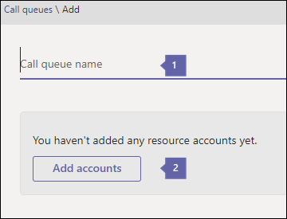
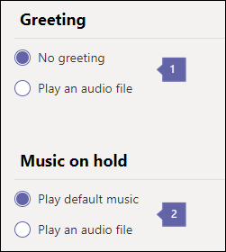
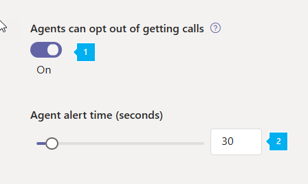
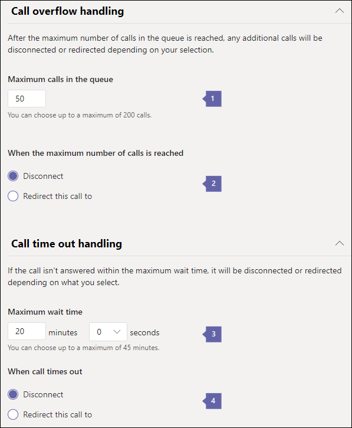

# Create a Cloud call queue

Cloud call queues can provide:
 
- A greeting message.
- Music while people are waiting on hold.
- Redirecting of calls to call agents in mail-enabled distribution lists and security groups.
- Settings different parameters such as queue maximum size, timeout, and call handling options.

When someone calls a phone number that is associated with a call queue via a [resource account](manage-resource-accounts.md): 
1. They  hear a greeting (if any is set up) 
2. Their call is put in the queue to wait for the next available call agent. 
 

The caller hears music while they are on hold, and the call connects to the call agents in *First In, First Out* (FIFO) order.
 
All calls in the queue are sent to agents by one of the following methods:
 
- With attendant routing, the first call in the queue  rings all agents at the same time.
- With serial routing, the first call in the queue rings all call agents one by one.
- With round robin, routing of incoming calls is balanced so that each call agent gets the same number of calls from the queue.

    > [!NOTE]
    > Call agents who are **Offline**, have set their presence to **Do not Disturb,** or have opted out of the call queue will not recieve calls.
 
- Only one incoming call notification (for the call at the head of the queue) at a time goes to the call agents.
- After a call agent accepts the call, the next incoming call in the queue will start ringing call agents.

> [!NOTE]
> This article applies to both Microsoft Teams and Skype for Business Online.

## Step 1 — Get started

To get started using call queues, it's important to remember a few things:
 
- A call queue is required to have an associated resource account. See [Manage resource accounts in Teams](manage-resource-accounts.md) for details on resource accounts.
- When you assign a phone number to a resource account, you can now use the cost-free Phone System [Virtual User license](teams-add-on-licensing/virtual-user.md). Phone System allows phone numbers at the organizational level for use with low-cost auto attendant and call queue services.

> [!NOTE]
> Direct Routing service numbers for call queues are supported for Microsoft Teams users and agents only.

> [!NOTE]
> To redirect calls to people in your organization who are Online, they must have a **Phone System** license and be enabled for Enterprise Voice or have Office 365 Calling Plans. See [Assign Skype for Business licenses](../Skype/SfbOnline/skype-for-business-and-microsoft-teams-add-on-licensing/assign-skype-for-business-and-microsoft-teams-licenses.md) or [Assign Microsoft Teams licenses](assign-teams-licenses.md). To enable them for Enterprise Voice, you can use Windows PowerShell. For example run: `Set-CsUser -identity "Amos Marble" -EnterpriseVoiceEnabled $true`
 
- To learn more about Office 365 Calling Plans, see [Phone System and Calling Plans](calling-plan-landing-page.md) and [Calling Plans for Office 365](calling-plans-for-office-365.md).

- You can only assign Cloud call queues toll and toll-free service phone numbers that you got in the **Microsoft Teams admin center** or transferred from another service provider. Communications Credits are required for toll-free service numbers.

    > [!NOTE]
    > User (subscriber) phone numbers can't be assigned to call queues - only service toll or toll-free phone numbers can be used.
 
- The following clients are supported for call agents associated to a Cloud call queue:

  - Skype for Business desktop client 2016 (32-bit and 64-bit versions)

  - Lync desktop client 2013 (32-bit and 64-bit versions)

  - All IP phone models supported for Microsoft Teams. See [Getting phones for Skype for Business Online](/skypeforbusiness/what-is-phone-system-in-office-365/getting-phones-for-skype-for-business-online/getting-phones-for-skype-for-business-online).

  - Mac Skype for Business Client (version 16.8.196 and later)

  - Android Skype for Business Client (version 6.16.0.9 and later)

  - iPhone Skype for Business Client (version 6.16.0 and later)

  - iPad Skype for Business Client (version 6.16.0 and later)

  - Microsoft Teams Windows client (32-bit and 64-bit versions)

  - Microsoft Teams Mac client

  - Microsoft Teams iPhone app

  - Microsoft Teams Android app

## Step 2 - Getting or transferring toll or toll-free service phone numbers

Before you can create and set up your call queues, you need to get or transfer your existing toll or toll-free service numbers. After you get the toll or toll-free service phone numbers, they will show up in **Microsoft Teams admin center** > **Legacy Portal** > **Voice** > **Phone numbers**, and the **Number type** will be listed as **Service - Toll-Free**. To get your service numbers, see [Getting service phone numbers](getting-service-phone-numbers.md) or if you want to transfer an existing service number, see [Transfer phone numbers to Office 365](transfer-phone-numbers-to-office-365.md).
 
> [!NOTE]
> If you are outside the United States, you can't use the Microsoft Teams admin center to get service numbers. Go to [Manage phone numbers for your organization](manage-phone-numbers-for-your-organization/manage-phone-numbers-for-your-organization.md) instead to see how to do it from the outside of the United States.

If you are setting up multiple auto attendants, you may only need to assign a phone number to the main auto attendant's resource account, which can direct callers to your call queues or nested auto attendants. In those situations you should create all auto attendants and call queues in your system without assigning dialpad options, and then edit the settings later. This is necessary because you aren't allowed to create an option linking to a call queue or auto attendant that does not yet exist.
 
## Step 3 - Create a new call queue

[!INCLUDE [updating-admin-interfaces](includes/updating-admin-interfaces.md)]

> [!IMPORTANT]
> Every call queue is required to have an associated [resource account](manage-resource-accounts.md). You must create the resource account first, then you can associate it to the call queue.

### Using the Microsoft Teams admin center

In the **Microsoft Teams admin center**, **Voice** > **Call queues**, then click **+ Add new**:

### Set the call queue display name and resource account



* * *


**Name** Enter a descriptive display name for the call queue. This name is required and can contain up to 64 characters, including spaces.

 This name is displayed in the notification for the incoming call.

* * *


**Add Accounts** Select a resource account. The resource account may or may not be associated with a service toll or toll-free phone number for the call queue, but each call queue requires an associated resource account.

If there aren't any listed, you need to get service numbers and assign them to a Resource account before you can create this call queue, as described earlier. To get your service numbers, see [Getting service phone numbers](getting-service-phone-numbers.md). You'll need to create a resource account as described in [Manage resource accounts in Teams](manage-resource-accounts.md) if you want your call queue to have an associated phone number.

> [!NOTE]
> If you want or need to assign a **Domain** you would do so by assigning it to the resource account for the call queue.

### Set the greeting and music played while on hold


 
* * *


**Greeting** is optional. This is the greeting that is played for people who call in to the call queue number.

You can upload an audio file (.wav, .mp3, or .wma formats).


**Music on hold** You can either use the default Music on Hold provided with the call queue, or you can upload an audio file in .wav, mp3, or .wma formats to use as your custom Music on Hold.

* * *

### Select the call answering options


You can select up to 200 call agents who belong to any of the following mailing lists or groups:

- Office 365 group
- Security group
- Distribution list

Call agents selected must **either** be online users with a **Phone System** license and Enterprise Voice enabled **or** have a Calling Plan.

  > [!NOTE]
  > This also applies if you want to redirect calls to people in your organization who are online. These individuals must have a **Phone System** license and Enterprise Voice enabled **or** have a Calling Plan. For more information see [Assign Skype for Business licenses](/Skype/SfbOnline/skype-for-business-and-microsoft-teams-add-on-licensing/assign-skype-for-business-and-microsoft-teams-licenses.md), [Assign Microsoft Teams licenses](https://docs.microsoft.com/microsoftteams/assign-teams-licenses), or [Which Calling Plan is right for you?](https://docs.microsoft.com/microsoftteams/calling-plan-landing-page)

 To enable an agent for Enterprise Voice, you can use Windows PowerShell. For example run: `Set-CsUser -identity "Amos Marble" -EnterpriseVoiceEnabled $true`

- Online users with a **Phone System** license or a Calling Plan that are added to either an Office 365 Group; a mail-enabled Distribution List; or a Security Group. It might take up to three hours for a newly added agent in a distribution list, or a security group, to start receiving calls from a call queue. A newly created distribution list or security group might take up to 48 hours to become available to be used with call queues. Newly created Office 365 Groups are available almost immediately.

- If your agents are using Microsoft Teams App to receive call queue calls, they need to be in TeamsOnly mode.


**Routing method** You can choose either **Attendant**, **Serial**, or **Round Robin** for your call queue distribution method. All new and existing call queues will have attendant routing selected by default. When attendant routing is used, the first call in the queue will ring all of the call agents at the same time. The first call agent to pick up the call gets the call.

- **Attendant routing** causes the first call in the queue to ring all call agents at the same time. The first call agent to pick up the call gets the call.
- **Serial routing** incoming calls will ring call agents one by one, starting from the beginning of the call agent list. Agents cannot be ordered within the call agent list. If an agent dismisses or does not pick up a call, the call will ring the next agent on the list and will try all agents one by one until it is picked up or times out waiting in the queue.
  > [!NOTE]
  > Serial routing will skip agents who are **Offline**, have set their presence to **Do not Disturb**, or have **opted out** of getting calls from this queue.
- **Round robin** balances routing of incoming calls so that each call agent will get the same number of calls from the queue. This may be very desirable in an inbound sales environment to assure equal opportunity among all the call agents.

### Select an agent opt-out option


 
* * *


**Agent can opt out of getting calls** You can choose to allow call queue agents to opt-out of taking calls from a particular queue by enabling this option.

Enabling this option allows all agents in this queue to start or stop receiving calls from this call queue at will. You can revoke the agent opt-out privilege at any time by clearing the check box, causing agents to become automatically opted in for this queue again (the default setting for all agents).

To access the opt-out option, agents can do the following:

 1. Open **Options** in their desktop Skype for Business client.
 2. On the **Call Forwarding** tab, click the **Edit settings online** link.
 3. On the user settings page, click **Call Queues**, and then clear the check boxes for any queues for which they want to opt-out.

    > [!NOTE]
    > Agents using apps or endpoints other than Skype for Business Desktop can access the opt-out option from the user settings portal [https://aka.ms/cqsettings](https://aka.ms/cqsettings).


**Agent Alert setting**

This defines the duration of an agent being notified of a call before the Serial or Round Robin routing methods move to the next agent.

The default setting is 30 seconds, but it can be set for up to 3 minutes.

* * *

### Set the call overflow and timeout handling options


 
* * *


**Maximum calls in the queue** Use this to set the maximum calls that can wait in the queue at the same time. The default is 50, but it can range from 0 to 200. When this limit is reached, the call will be handled in way you have set on the **When the maximum number of calls is reached** setting below.

* * *


**When the maximum number of calls is reached** When the call queue reaches its maximum size (set using the **Maximum calls in the queue** setting), you can choose what happens to new incoming calls.

- **Disconnect** The call will be disconnected.
- **Redirect to** When you choose this, select one of the following:

  - **Person in your company** An Online user with a **Phone System** license and be enabled for Enterprise Voice or have a Calling Plan. You can set it up so the person calling in can be sent to voicemail. To do this, select a **Person in your company** and set this person to have their calls forwarded directly to voicemail.

  To learn about licensing required for voicemail, see [Set up Cloud Voicemail](set-up-phone-system-voicemail.md).

  - **Voice application** Select the name of either a call queue or auto attendant that has already been created.

* * *


**Call Timeout: maximum wait time** You can also decide how much time a call can be on hold in the queue before it times out and needs to be redirected or disconnected. Where it will be redirected is based on how you set the **When a call times out** setting. You can set a time from 0 to 45 minutes.

The timeout value can be set in seconds, at 15-second intervals. This allows you to manipulate the call flow with finer granularity. For example, you could specify that any calls that are not answered by an agent within 30 seconds go to a Directory Search auto attendant.


**When call times out** When the call reaches the limit you set on the **How long a call can wait in the queue** setting, you can choose what happens to this call:

- **Disconnect** The call will be disconnected.
- **Redirect this call to** When you choose this, you will have these options:
  - **Person in your company** An Online user with a **Phone System** license and be enabled for Enterprise Voice or have Calling Plans. You can set it up so the person calling in can be sent to voicemail. To do this, select a **Person in your company** and set this person to have their calls forwarded directly to voicemail.

  To learn about licensing required for voicemail, see [Set up Cloud Voicemail](set-up-phone-system-voicemail.md).

  - **Voice application** Select the name of either a call queue or auto attendant that has already been created.

## Changing a user's Caller ID for outbound calls

You can protect a user's identity by changing their caller ID for outbound calls to a call queue, auto attendant, or any service number instead by creating a policy using the **New-CsCallingLineIdentity** cmdlet.

To do this, run:

``` Powershell
New-CsCallingLineIdentity -Identity "UKSalesQueue" -CallingIdSubstitute "Service" -ServiceNumber 14258828080 -EnableUserOverride $False -Verbose
```

Then apply the policy to the user using the **Grant-CallingLineIdentity** cmdlet. To do this, run:
 
``` Powershell
Grant-CsCallingLineIdentity -PolicyName UKSalesQueue -Identity "AmosMarble@contoso.com"
```

You can get more information on how to make changes to caller ID settings in your organization in the article [How can caller ID be used in your organization](/microsoftteams/how-can-caller-id-be-used-in-your-organization).

## Call queue cmdlets

You can also use Windows PowerShell to create and set up call queues. Here are the cmdlets that you need to manage a call queue.
 
- [New-CsCallQueue](https://docs.microsoft.com/powershell/module/skype/new-CsCallQueue?view=skype-ps)

- [Set-CsCallQueue](https://docs.microsoft.com/powershell/module/skype/set-CsCallQueue?view=skype-ps)

- [Get-CsCallQueue](https://docs.microsoft.com/powershell/module/skype/get-CsCallQueue?view=skype-ps)

- [Remove-CsCallQueue](https://docs.microsoft.com/powershell/module/skype/remove-CsCallQueue?view=skype-ps)

### More about Windows PowerShell

- Windows PowerShell is all about managing users and what users are allowed or not allowed to do. With Windows PowerShell, you can manage Office 365 and Microsoft Teams using a single point of administration that can simplify your daily work, when you have multiple tasks to do. To get started with Windows PowerShell, see these topics:

  - [An introduction to Windows PowerShell and Skype for Business Online](/SkypeForBusiness/set-up-your-computer-for-windows-powershell/set-up-your-computer-for-windows-powershell)

  - [Why you need to use Office 365 PowerShell](https://docs.microsoft.com/en-us/office365/enterprise/powershell/why-you-need-to-use-office-365-powershell)

- Windows PowerShell has many advantages in speed, simplicity, and productivity over only using the Microsoft Teams admin center such as when you are making setting changes for many users at one time. Learn about these advantages in the following topics:

  - [Manage Office 365 with Windows PowerShell](https://docs.microsoft.com/en-us/office365/enterprise/powershell/manage-office-365-with-office-365-powershell)

  - [Set up your computer for Windows PowerShell](https://docs.microsoft.com/en-us/SkypeForBusiness/set-up-your-computer-for-windows-powershell/set-up-your-computer-for-windows-powershell)

## Related topics

[Here's what you get with Phone System in Office 365](here-s-what-you-get-with-phone-system.md)

[Getting service phone numbers](getting-service-phone-numbers.md)

[Country and region availability for Audio Conferencing and Calling Plans](country-and-region-availability-for-audio-conferencing-and-calling-plans/country-and-region-availability-for-audio-conferencing-and-calling-plans.md)

[New-CsOnlineApplicationInstance](https://docs.microsoft.com/powershell/module/skype/new-csonlineapplicationinstance?view=skype-ps)
