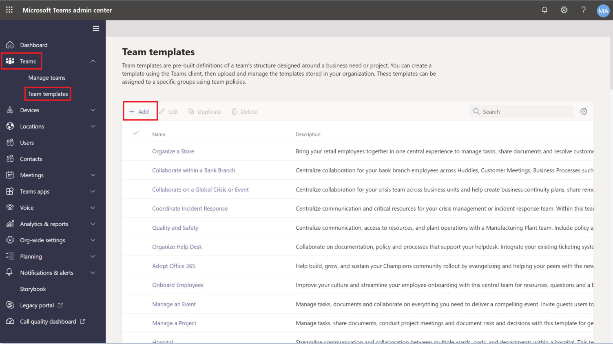
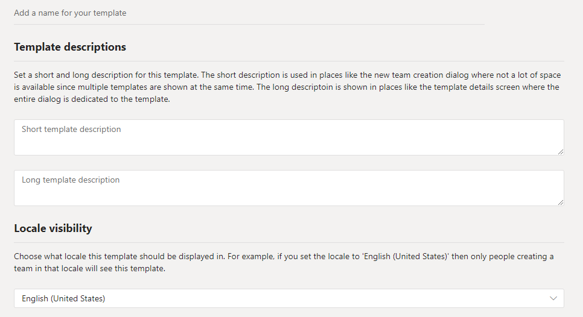
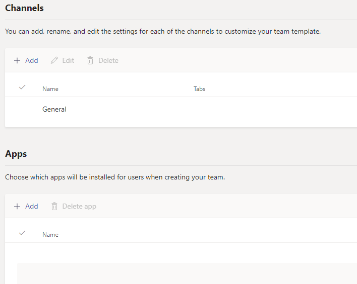
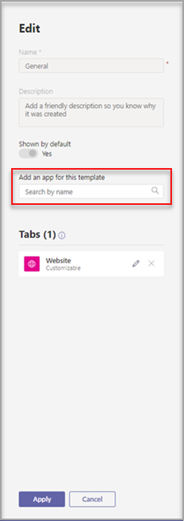
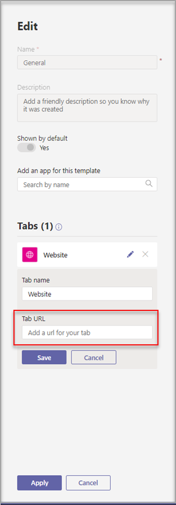
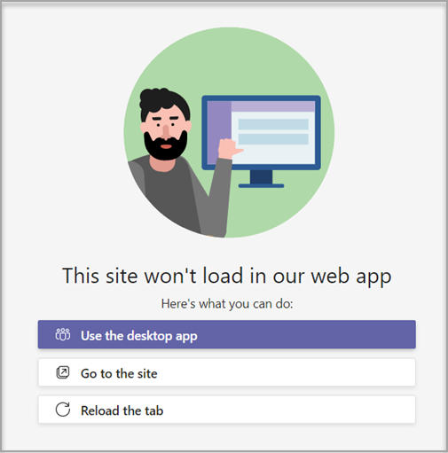

# Create a custom team template in Microsoft Teams

**Custom templates are not yet supported for EDU customers.**

A custom team template is a predefined team structure with a set of channels, tabs, and apps. You can develop a template that helps you create the right collaboration space quickly. Your custom team template uses your preferred settings.  

 

> [!VIDEO https://www.microsoft.com/en-us/videoplayer/embed/RE4P5rx]

To get started:

1. Sign in to the Teams admin center.

2. In the left navigation, expand **Teams** > **Team templates**.

3. Select **Add**.

    

4. In the **Team templates** section, select **Create a brand new template**.

5. In the **Template settings** section, complete the following fields and then select **Next**:
    - Template name
    - Template short and long descriptions
    - Locale visibility  

    

6. In the **channels, tabs, and apps** section, add any channels and apps that your team needs.

    1. In the **Channels** section, select **Add**.
    2. In the **Add** dialog, name the channel.
    3. Add a description.
    4. Decide if the channel should be shown by default.
    5. Search for an app name that you want to add to the channel.
    6. Select **Apply** when finished.

    

8. Select **Submit** when completed.

Your new template is displayed in the **Team templates** list. The template can be used to create a team in Teams.

> [!Note]
> It can take up to 24 hours for teams users to see a custom template change in the gallery.

## Customizing Website Tab apps

> [!Note]
> This feature is in early preview

You might want to specify URLs for website tabs for channels in custom team templates. End users who create teams with templates will have website tabs that are preset to the specified site URL.

To get started:

1. Create a new team template or edit an existing team template.

2. In the Channels section, add a new channel or select an existing channel and select **Edit**.

3. In the **Add an app for this template** section, add a Website app.

    

4. Select the edit icon and input the URL of your choice.

    

5. Select **Save** for your tab app edits, and then select **Apply** to save your changes.

## Known issues

**Problem**: If you've created a team from a custom template that contained additional custom tabs, you might see blank tabs in place of your custom tab apps. Your default tabs (such as **Posts**, **Files**, and **Wiki**) will appear as expected.

**Solution**: To fix this issue, remove the custom tab and add a new tab with the same app. If you don't have permissions to remove the custom tab and add a new tab, contact the team owner for assistance.

We're currently working on a fix for future teams created from custom templates.

**Problem**: When using Teams in the browser, some websites don't support being rendered within a Teams tab.

**Solution**: If you have trouble viewing the contents of the website tab, you'll be redirected to either open the tab in a separate webpage, or open Teams in the desktop app instead to view your website tab app.

## Related topics

- [Get started with team templates in the admin center](get-started-with-teams-templates-in-the-admin-console.md)
- [Create a template from an existing team](create-template-from-existing-team.md)
- [Create a team template from an existing team template](create-template-from-existing-template.md)
