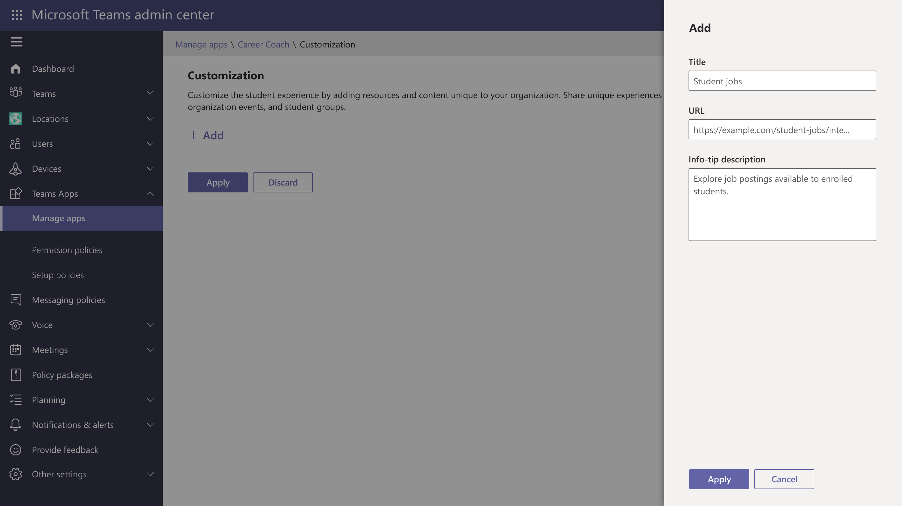

# Create custom team template

## What is a team template? 

A team template is a predefined team structure with a set of channels,
tabs, and apps. Team templates enable users to create the right
collaboration space quickly.

## How do I create my own custom team templates?

1.  Navigate to <https://admin.teams.microsoft.com>

2.  Login with your Teams service admin credentials

3.  Click teams on the left rail

4.  Click team templates to open the team templates section

5.  Click on the “add” button on the template table

6.  Select how you would like to create your team template

1.  Create template from scratch

2.  Create template from an existing team
    
    1.  Select the team you would like to use as your new template base
        from the table

> 

3.  Create template from an existing template
    
    1.  Select the template you would like to use as your new template
        base from the table

> 

7.  Enter the template details

1.  Name your template

> 

2.  Give your template a short description (This will show up on the
    template card in the gallery)

3.  Give your template a long description (this will show up on the
    template details page)

> 

4.  Enter the locale of your template. This template will only show in
    the template gallery for the locale selected.

<!-- end list -->

8.  Create the structure for your team template
    
    1.  Add/remove channels

> 

2.  Add/remove tabs

> 

3.  Rename tabs

> 
> 
> 

4.  Add bots and other apps to team template

> 
> 
> 

9.  Click save and your new template will be available in the template
    table

## The template will now be available in the template gallery

##  

## 

## FAQ’s

**How do I edit a custom template?**

*To edit a template, click on a template in the Teams admin center and
click edit in the table.*

**How do I delete a custom template?**

*To delete a custom template, select on a template in the Teams admin
center and click delete.*

**Can I delete templates created by Microsoft?**

*No, these templates cannot be deleted.*

**Can I edit a template created by Microsoft?**

*No, templates created by Microsoft cannot be edited.*

**Can I hide templates?**

*No, templates are visible to all users who can create a team in the
Teams client.*

**Can I target templates to specific users/groups?**

*Not yet, we’re currently working on this feature.*

**Who can see my custom team template?**

*Custom templates are only visible to users in your organization who
have the ability to create a team in the client.*

**Can I create templates through PowerShell or Graph?**

*Not yet, we’re working on this feature.*

**Can I create a team from a template using Graph?**

Yes, you will just need to know the template Id.

<https://docs.microsoft.com/en-us/MicrosoftTeams/get-started-with-teams-templates>

<https://docs.microsoft.com/en-us/graph/api/team-post?view=graph-rest-beta&tabs=http>

**Where can I find the teams template Id?**

*The teams template ID can be found in the teams admin center. Navigate
to the templates section, Select a template, and click edit. The
template Id will be available in this view.*

**Can I get a list of templates using Graph or PowerShell?**

*Not yet, we are working on this feature.*

**Can I preconfigure the apps in the team template?**

*Not yet, we are working on this feature*

**Do templates support private channels?**

*Not yet, we are working on this feature*

**Can I import/export a custom template?**

*Not yet, we are working on this feature.*
