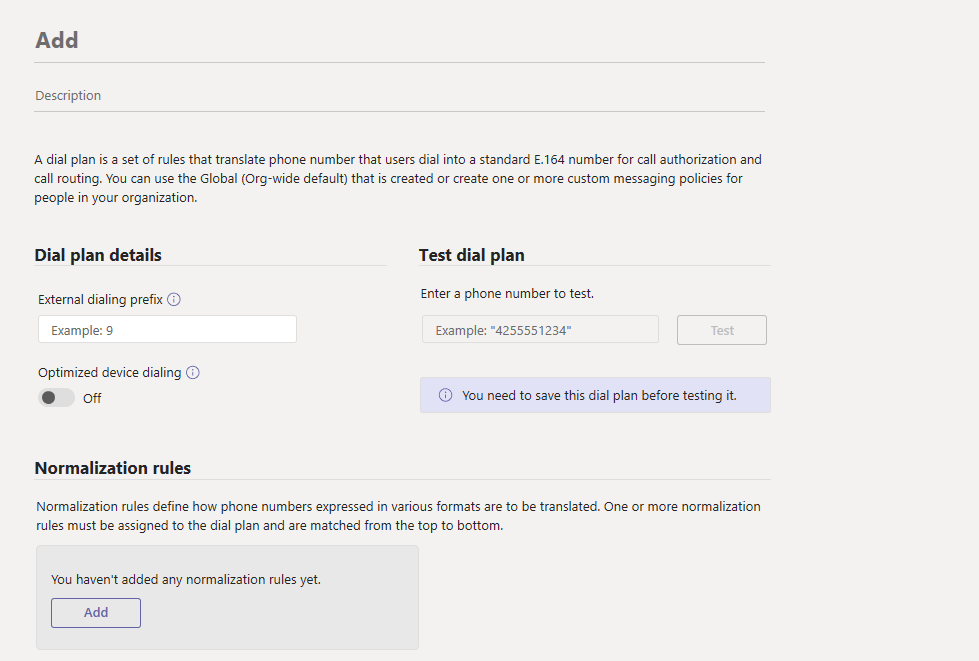

# Create and manage dial plans

After you plan the dial plans for your organization and figured out all the normalization rules that need to be created for call routing, you're ready to create the dial plans. You can use the Microsoft Teams admin center or Windows PowerShell to create and manage dial plans.  

## Using the Microsoft Teams admin center

### Create a dial plan

1. In the left navigation of the Microsoft Teams admin center, go to **Voice** > **Dial plan**.
2. Click **Add**, and then enter a name and description for the dial plan.
    
3. Under **Dial plan details**, specify an external dialing prefix if users need to dial one or more additional leading digits (for example, 9) to get an external line. To do this:
    1. In the **External dialing prefix** box, enter an external dialing prefix. The prefix can be up to four characters (#,*, and 0-9).
    2. Turn on **Optimized device dialing**. If you specify an external dialing prefix, you must also turn on this setting to apply the prefix so calls can be made outside your organization.
4. Under **Normalization rules**, configure and associate one or more [normalization rules](what-are-dial-plans.md#normalization-rules) for the dial plan. Each dial plan must have at least one normalization rule associated with it.  To do this, do one or more of the following:
    - To create a new normalization rule and associate it with the dial plan, click **Add**, and then define the rule.
    - To edit a normalization rule that's already associated with the dial plan, select the rule by clicking to the left of the rule name, and then click **Edit**. Make the changes you want, and then click **Save**.
    - To remove a normalization rule from the dial plan, select the rule by clicking to the left of the rule name, and then click **Remove**.
5. Arrange the normalization rules in the order that you want. Click **Move up** or **Move down** to change the position of rules in the list.

    > [!NOTE]
    > Teams traverses the list of normalization rules from the top down and uses the first rule that matches the dialed number. If you set up a dial plan so that a dialed number can match more than one normalization rule, make sure the more restrictive rules are sorted above the less restrictive ones.

6. Click **Save**.
7. If you want to test the dial plan, under **Test dial plan**, enter a phone number, and then click **Test**.

### Edit a dial plan

1. In the left navigation of the Microsoft Teams admin center, go to **Voice** > **Dial plan**.
2. Select the dial plan by clicking to the left of the dial plan name, and then click **Edit**.
3. Make the changes that you want, and then click **Save**.

### Add users to a dial plan

1. In the left navigation of the Microsoft Teams admin center, go to **Voice** > **Dial plan**.
2. Select the dial plan by clicking to the left of the dial plan name.
3. Select **Manage users**.
4. In the **Manage users** pane, search for the user by display name or by user name, select the name, and then select **Add**. Repeat this step for each user that you want to add.
5. When you're finished adding users, select **Apply**.

## Using PowerShell
  
### Verify and start Remote PowerShell

 **Check that you are running Windows PowerShell version 3.0 or later**
  
1. To verify that you're running version 3.0 or higher: **Start Menu** > **Windows PowerShell**.
    
2. Check the version by typing  _Get-Host_ in the **Windows PowerShell** window.
    
3. If you don't have version 3.0 or later, download and install updates to Windows PowerShell. See [Windows Management Framework 4.0](https://go.microsoft.com/fwlink/?LinkId=716845) to download and update Windows PowerShell to version 4.0. Restart your computer when you're prompted.
    
4. You'll also need to install the Windows PowerShell module for Skype for Business Online that enables you to create a remote Windows PowerShell session that connects to Skype for Business Online. You can download this module, which is supported only on 64-bit computers, at [Windows PowerShell Module for Skype for Business Online](https://go.microsoft.com/fwlink/?LinkId=294688). Restart your computer if you're prompted.
    
To learn more, see [Connect to all Office 365 services in a single Windows PowerShell window](https://docs.microsoft.com/office365/enterprise/powershell/connect-to-all-office-365-services-in-a-single-windows-powershell-window).
  
 **Start a Windows PowerShell session**
  
1. Click **Start** > **Windows PowerShell**.
    
2. In the **Windows PowerShell** window, connect to your Office 365 organization by running:
    
    > [!NOTE]
    > You only have to run the **Import-Module** command the first time you use the Skype for Business Online Windows PowerShell module.
  
> 
>   ```
>     Import-Module "C:\\Program Files\\Common Files\\Skype for Business Online\\Modules\\SkypeOnlineConnector\\SkypeOnlineConnector.psd1"
>     $credential = Get-Credential
>     $session = New-CsOnlineSession -Credential $credential
>     Import-PSSession $session
>   ```

For more information about starting Windows PowerShell, see [Connect to all Office 365 services in a single Windows PowerShell window](https://technet.microsoft.com/library/dn568015.aspx).
  
### Create and manage your dial plans

You can either use a single cmdlet or a PowerShell script to create and manage tenant dial plans.
  
#### Using single cmdlets

- To create a new dial plan, run:
    
  ```
  New-CsTenantDialPlan -Identity RedmondDialPlan -Description "Dial Plan for Redmond" -NormalizationRules <pslistmodifier> -ExternalAccessPrefix 9 -SimpleName "Dial-Plan-for-Redmond"
  ```

    For other examples and parameters, see [New-CsTenantDialPlan](https://docs.microsoft.com/powershell/module/skype/new-cstenantdialplan).
    
- To edit the settings of an existing dial plan, run:
    
  ```
  Set-CsTenantDialPlan -Identity RedmondDialPlan  -NormalizationRules <pslistmodifier> -ExternalAccessPrefix 9
    -SimpleName "Dial-Plan-for-Redmond"
  ```

    For other examples and parameters, see [Set-CsTenantDialPlan](https://docs.microsoft.com/powershell/module/skype/set-cstenantdialplan).
    
- To add users to a dial plan, run:
    
  ```
  Grant-CsTenantDialPlan -Identity amos.marble@contoso.com -PolicyName RedmondDialPlan
  ```
tp
    For other examples and parameters, see [Grant-CsTenantDialPlan](https://docs.microsoft.com/powershell/module/skype/grant-cstenantdialplan).
    
- To view the settings on a dial plan, run:
    
  ```
  Get-CsTenantDialPlan -Identity RedmondDialPlan
  ```

    For other examples and parameters, see [Get-CsTenantDialPlan](https://docs.microsoft.com/powershell/module/skype/get-cstenantdialplan?view=skype-ps).
    
- To delete a dial plan, run:
    
  ```
  Remove-CsTenantDialPlan -Identity RedmondDialPlan -force
  ```

    For other examples and parameters, see [Remove-CsTenantDialPlan](https://docs.microsoft.com/powershell/module/skype/remove-cstenantdialplan?view=skype-ps).
    
- To see the settings of the effective dial plan, run:
    
  ```
  Get-CsEffectiveTenantDialPlan -Identity amos.marble@contoso.com
  ```

    For other examples and parameters, see [Get-CsEffectiveTenantDialPlan](https://docs.microsoft.com/powershell/module/skype/get-cseffectivetenantdialplan).
    
- To test the effective settings of a dial plan, run:
    
  ```
  Test-CsEffectiveTenantDialPlan -DialedNumber 14255550199 -Identity amos.marble@contoso.com
  ```

    For other examples and parameters, see [Test-CsEffectiveTenantDialPlan](https://docs.microsoft.com/powershell/module/skype/test-cseffectivetenantdialplan?view=skype-ps).
    
#### Using a PowerShell script

Run this to delete a normalization rule that is associated with a tenant dial plan without needing to deleting the tenant dial plan first:
```
$b1=New-CsVoiceNormalizationRule -Identity Global/NR4 -InMemory
Set-CsTenantDialPlan -Identity RedmondDialPlan -NormalizationRules @{add=$b1}
(Get-CsTenantDialPlan -Identity RedmondDialPlan).NormalizationRules
$b2=New-CsVoiceNormalizationRule -Identity Global/NR4 -InMemory
Set-CsTenantDialPlan -Identity RedmondDialPlan -NormalizationRules @{remove=$b2}
```
Run this to add the following normalization rule to the existing tenant dial plan named RedmondDialPlan.
```
$nr1=New-CsVoiceNormalizationRule -Parent Global -Description 'Organization extension dialing' -Pattern '^(\\d{3})$' -Translation '+14255551$1' -Name NR1 -IsInternalExtension $false -InMemory
Set-CsTenantDialPlan -Identity RedmondDialPlan -NormalizationRules @{add=$nr1}
```
Run this to remove the following normalization rule from the existing tenant dial plan named RedmondDialPlan.
```
$nr1=New-CsVoiceNormalizationRule -Parent Global/NR1 -InMemory
Set-CsTenantDialPlan -Identity DP1 -NormalizationRules @{remove=$nr1}
```

Run the following when you want to also examine the existing normalization rules, determine which one you want to delete, and then use its index to remove it. The array of normalization rules starts with index 0. We would like to remove the 3-digit normalization rule, so that is index 1.
  
```
Get-CsTenantDialPlan RedmondDialPlan).NormalizationRules
Description         : 4-digit
Pattern             : ^(\\d{4})$
Translation         : +1426666$1
Name                : NR2
IsInternalExtension : False

Description         : 3-digit
Pattern             : ^(\\d{3})$
Translation         : +14255551$1
Name                : NR12
IsInternalExtension : False

$nr1=(Get-CsTenantDialPlan RedmondDialPlan).NormalizationRules[Number 1]
Set-CsTenantDialPlan -Identity RedmondDialPlan -NormalizationRules @{remove=$nr1}
```

Run this to find all users who have been granted the RedmondDialPlan tenant dial plan.
  
```
Get-CsOnlineuser | where-Object {$_.TenantDialPlan -eq "RedmondDialPlan"}
```

Run this to delete policyname for all users who have HostingProvider sipfed.online.lync.com.
```
Get-CsOnlineUser -Filter {HostingProvider -eq “sipfed.online.lync.com”} | Grant-CsTenantDialPlan -policyname $null
```

Run these to add the existing on-premises dial plan named OPDP1 as a tenant dial plan for your organization. You need to first save the on-premises dial plan to an .xml file, and then use it to create the new tenant dial plan.
  
Run this to save the on-premises dial plan to the .xml file.
  
```
$DPName = "OPDP1"
$DPFileName = "dialplan.xml"
Get-CsDialplan $DPName | Export-Clixml $DPFileName
```

Run this to create the new tenant dial plan.
  
```
$DPFileName = "dialplan.xml"
$DP = Import-Clixml $DPFileName
$NormRules = @()
ForEach($nr in $dp.NormalizationRules)
{
 $id1 = "Global/" +$nr.Name
$nr2 = New-CsVoiceNormalizationRule -Identity $id1 -Description $nr.Description -Pattern $nr.Pattern -Translation $nr.Translation  -IsInternalExtension $nr.IsInternalExtension -InMemory
$NormRules += $nr2
}
New-CsTenantDialPlan -Identity $dp.SimpleName -ExternalAccessPrefix $dp.ExternalAccessPrefix -Description $dp.Description -OptimizeDeviceDialing $dp.OptimizeDeviceDialing -SimpleName $dp.SimpleName -NormalizationRules $NormRules
```
    
## Related topics

- [What are dial plans?](what-are-dial-plans.md)
- [Transferring phone numbers common questions](transferring-phone-numbers-common-questions.md)
- [Different kinds of phone numbers used for Calling Plans](different-kinds-of-phone-numbers-used-for-calling-plans.md)
- [Manage phone numbers for your organization](manage-phone-numbers-for-your-organization/manage-phone-numbers-for-your-organization.md)
- [Emergency calling terms and conditions](emergency-calling-terms-and-conditions.md)
- [Emergency calling disclaimer label](https://github.com/MicrosoftDocs/OfficeDocs-SkypeForBusiness/blob/live/Teams/downloads/emergency-calling/emergency-calling-label-(en-us)-(v.1.0).zip?raw=true)
- [Teams PowerShell overview](teams-powershell-overview.md)