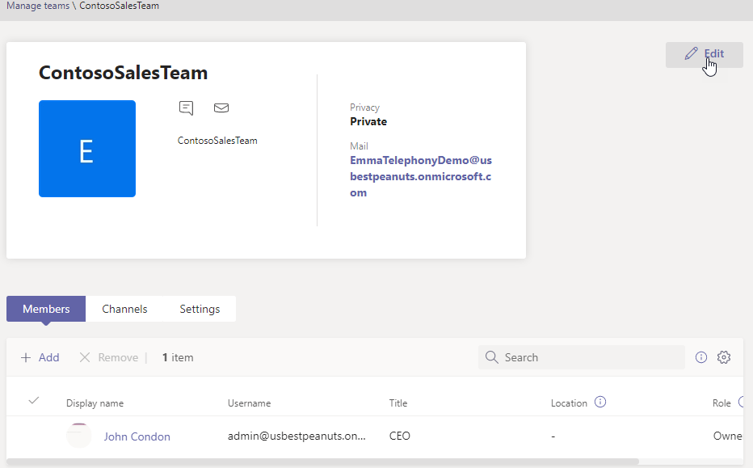
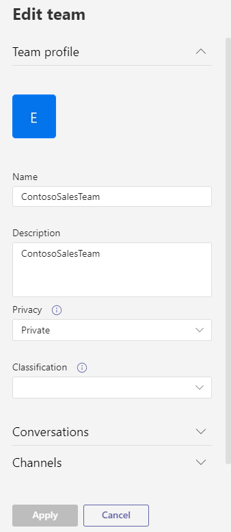

# Create a team from an existing team in Microsoft Teams

Microsoft Teams lets you create a team from an existing team that can be saved and modified to meet your particular organizational needs.

1. Log in to the admin center.

2. In the left navigation, expand **Teams** > **Team templates**.

3. Click **Add**.

4. Select **Use an existing team as a template**, and click **Next**.

 

5. Select a team to use as a starting point.

6. In the selected team window, click **Edit**.

 

7. In the team profile window, complete the following fields:

    - Team name
    - Description
    - Privacy
    - Classification

8. Modify the **Channels** and **Conversations** tabs as necessary. See [Manage team policies](teams-policies.md) for information on completing those fields.

 

9. Click **Apply** to save your changes.

10. In the **Manage Teams** window, edit the **Members**, **Channels**, and **Settings** fields.

## Related articles:

- [Get started with teams templates in the admin center](get-started-with-teams-templates-in-the-admin-console.md)
- [Create a team from an existing team template](modify-existing-team-template.md)
- [Create a team template](create-a-team-template.md)