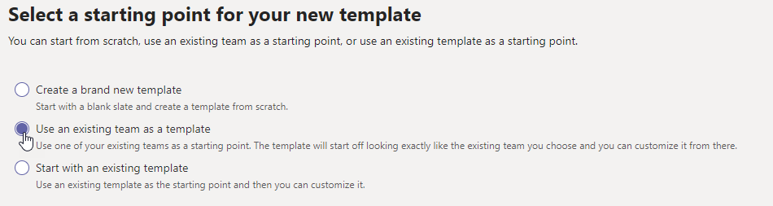
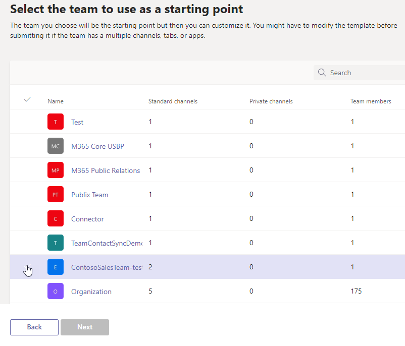

# Create a team template from an existing team in Microsoft Teams

[!INCLUDE [preview-feature](includes/preview-feature.md)]

**Custom templates are not yet supported for EDU customers.**

Microsoft Teams lets you create a template from an existing team that can be saved and modified to meet your particular organizational needs.

1. Sign in to the Teams admin center.

2. In the left navigation, expand **Teams** > **Team templates**.

3. Select **Add**.

4. Select **Use an existing team as a template**, and select **Next**.

 

5. Select a team to use as a starting point by selecting next to the team name, and then select **Next**.

6. In the **Template settings** section, complete the following fields and then select **Next**:
    - Template name
    - Template short and long descriptions
    - Locale visibility  
  
7. In the **channels, tabs, and apps** section, add any channels and apps that your team needs.

    1. In the **Channels** section, select **Add**.
    2. In the **Add** dialog, name the channel.
    3. Add a description.
    4. Decide if the channel should be shown by default.
    5. Search for an app name that you want to add to the channel.
    6. Select **Apply** when finished.

8. Select **Submit** to save your changes.

Your new template is displayed in the **Team templates** list. The template can be used to create a team in Teams.

> [!Note]
> It can take up to 24 hours for teams users to see a custom template in the gallery.

## Related articles

- [Get started with team templates in the admin center](get-started-with-teams-templates-in-the-admin-console.md)
- [Create a template from an existing team template](create-template-from-existing-template.md)
- [Create a team template](create-a-team-template.md)
