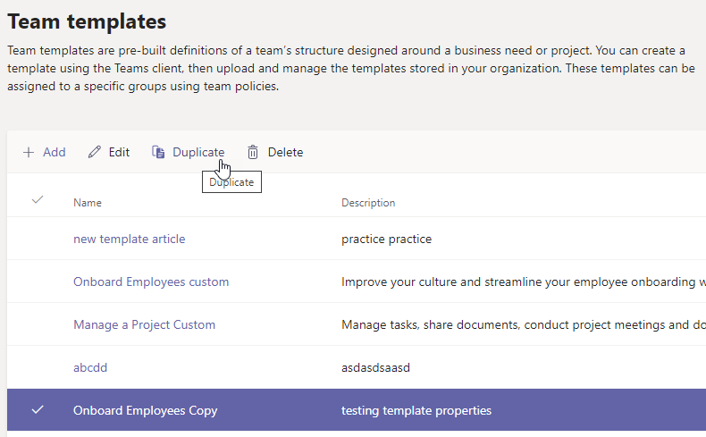
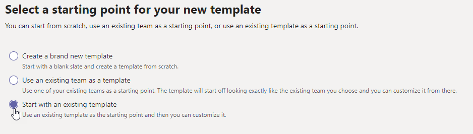

# Create a new team template from an existing team template in Microsoft Teams

**Custom templates are not yet supported for EDU customers.**

Microsoft Teams provides pre-built templates that can be saved and modified to meet your particular organizational needs.

1. Sign in to the Teams admin center.

2. In the left navigation, expand **Teams** > **Team templates**.

3. In the **Team templates** section, select next to a team template that you want to duplicate to highlight it.

4. Select **Duplicate**.

(Alternatively, you can select **Add** > **Start with an existing template** to open **Select the template to use as a starting point**.)

5. In the **Select the template to use as a starting point** screen, select **Next**.

    The duplicated template opens, and the word **Copy** is appended to the name.

6. Complete the following fields and then select **Next**:
    - Template name
    - Template short and long descriptions
    - Locale visibility  

7. In the **channels, tabs, and apps** section, modify any existing channels and apps that your team needs.

    1. Select a channel to edit, and select **Edit**.
    2. **Apply** your changes when finished.

8. Add any channels or apps that your team needs.

    1. In the **Channels** section, select **Add**.
    2. In the **Add** dialog, name the channel.
    3. Add a description.
    4. Decide if the channel should be shown by default.
    5. Search for an app name that you want to add to the channel.
    6. Select **Apply** when finished.

7. Select **Submit** when you're finished adding channels and apps.

    The new template is saved to the template library.

> [!Note]
> It can take up to 24 hours for teams users to see a custom template in the gallery.

## Related articles

- [Get started with team templates in the admin center](get-started-with-teams-templates-in-the-admin-console.md)
- [Create a template from an existing team](create-template-from-existing-team.md)
- [Create a team template](create-a-team-template.md)