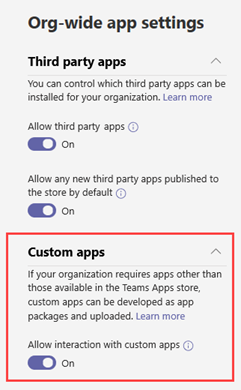
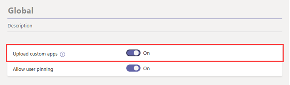

# Submit and approve custom apps in Microsoft Teams

This article provides end-to-end guidance for how to take your Teams app from development to deployment to discovery. You'll get an overview of the connected experiences that Teams provides across the app lifecycle to streamline how to develop, deploy, and manage custom apps in your tenant app catalog.

We'll cover each step of the lifecycle, including how developers can use the Teams App Submission API to submit custom apps directly to the Microsoft Teams admin center for you to review and approve, how to set policies to manage apps for users in your organization, and how your users discover them in Teams.

This guidance focuses on the Teams aspects of the app and is intended for admins and IT pros. For information about developing Teams apps, see the <a href="https://docs.microsoft.com/microsoftteams/platform" target="_blank">Teams developer documentation</a>.

## Set up

To create and manage custom apps in Teams, you'll need two tenants: a test tenant for development and a production tenant.

### Set up your test tenant

> [!NOTE]
> If you don't already have a test tenant, you can quickly create one and populate it with test data using the <a href="https://developer.microsoft.com/microsoft-365/dev-program" target="_blank">Microsoft 365 Developer Program</a>.

### Create test users

Make sure that your developers, whether in-house or external, have accounts in your test tenant. To learn more, see <a href="https://docs.microsoft.com/microsoft-365/admin/add-users/add-users?view=o365-worldwide" target="_blank">Add users and assign licenses at the same time</a>.

### Allow custom apps in the test tenant

To give developers the access they need for testing, allow all users in the test tenant to upload custom apps (also known as sideloading). This lets developers upload a custom app to be used personally or across the test tenant without having to submit the app to the Teams app store. Uploading a custom app lets developers test an app before you distribute it more widely.

To allow users to upload custom apps, follow these steps:

1. Turn on the **Allow interaction with custom apps** org-wide app setting. To do this:
    1. In the left navigation of the Microsoft Teams admin center, go to **Teams apps** > **Manage apps**, and then click **Org-wide app settings**.
    2. Under **Custom apps**, turn on **Allow interaction with custom apps**, and then click **Save**.

    

2. Turn on the **Upload custom apps** setting in the global app setup policy. To do this:
    1. In the left navigation of the Microsoft Teams admin center, go to **Teams apps** > **Setup policies**, and then click the **Global (Org-wide default)** policy.
    2. Turn on **Upload custom apps**, and then click **Save**.

    

> [!NOTE]
> There's also an upload custom app setting at the team level. By default this setting is on. However, if developers are unable to upload a custom app to a team, check the setting by following the steps <a href="https://docs.microsoft.com/microsoftteams/teams-custom-app-policies-and-settings#team-custom-app-setting" target="_blank">here</a>.

## Develop

### Create the app

Developers should now have what they need to create your app. For more information, see the <a href="https://docs.microsoft.com/microsoftteams/platform" target="_blank">Teams developer documentation</a>.

### Submit the app

When the app is ready for use in production, the developer can submit the app using the Teams App Submission API, which can be called from Graph API, an integrated development environment (IDE), or a platform such as Power Apps and Power Virtual Agents. Doing this makes the app available on the <a href="https://docs.microsoft.com/microsoftteams/manage-apps" target="_blank">Manage apps</a> page of the Microsoft Teams admin center, where you can review and approve it.

The Teams App Submission API, built on Microsoft Graph, allows your organization to develop on the platform of your choice and automates the submission-to-approval process for custom apps on Teams. To learn more, see [LINK TO DEV DOCS].

Here's an example of what this app submission step looks like in Visual Studio:

Keep in mind that this doesn't publish the app to your tenant app store. This step submits the app to the Microsoft Teams admin center where you can approve it for publishing to your tenant app store.

## Validate

The <a href="https://docs.microsoft.com/microsoftteams/manage-apps" target="_blank">Manage apps</a> page in the Microsoft Teams admin center (in the left navigation, go to **Teams apps** > **Manage apps**), gives you a view into all apps in your tenant catalog. The **Pending requests** area near the top of the page lets you know when a custom app is submitted for approval.

In the table, a newly submitted app automatically shows an **App publishing status** of **Submitted** and **App status** of **Blocked**. You can sort the table according to status to quickly find the app.

Click the app name to go to the app details page. On the **About** tab, you can view details about the app, including description, status, submitter, and app ID.

## Publish

When you're ready to make the app available to users, publish the app.

1. In the left navigation of the Microsoft Teams admin center, go to **Teams apps** > **Manage apps**.
2. Click the app name to go to the app details page, and then in the **App publishing status** box, select **Published**.

    After you publish the app, the **App publishing status** changes to **Published** and the **App status** changes to **Allowed**.

## Set up and manage

### Control access to the app

By default, all users in your organization can access the app in your tenant app store. To restrict and control who has permission to use the app, you can create and assign an app permission policy. To learn more, see <a href="https://docs.microsoft.com/microsoftteams/teams-app-permission-policies" target="_blank">Manage app permission policies in Teams</a>.

### Pin the app for users to discover

By default, for users to find the app they have to go to your tenant app store and browse or search for it. To make it easy for users to get to the app, you can pin the app to the app bar in Teams. To do this, create an app setup policy and assign it to users. To learn more, see <a href="https://docs.microsoft.com/microsoftteams/teams-app-setup-policies" target="_blank">Manage app setup policies in Teams</a>.

## Discover and adopt

Users who have have permissions to the app can find it in your tenant app store. Go to **Built for *Your Organization Name*** on the Apps page to find your organization's custom apps. 

If you created and assigned an app setup policy, the app is pinned to the app bar in Teams for easy access for those users who were assigned the policy.

## Update

To update an app, developers should continue to follow the steps in the [Develop](#develop) section.

When the developer submits an update to a published custom app, you'll get notified in the **Pending requests** area of the <a href="https://docs.microsoft.com/microsoftteams/manage-apps" target="_blank">Manage apps</a> page. In the table, the **App publishing status** of the app will be set to **Update submitted**.

To review and publish an app update:

1. In the left navigation of the Microsoft Teams admin center, go to **Teams apps** > **Manage apps**.
2. Click the app name to go to the app details page, and then select **Update available** to review details of the update.

    
3. When you're ready, select **Publish** to publish the update. Doing this replaces the existing app, updates the version number, and changes the **App publishing status** to **Published**. All app permission policies and app setup policies remain enforced for the updated app.

    If you reject the update, the earlier version of the app remains published.

Keep in mind the following:

- When an app is approved, any one can submit an update to the app. This means other developers, including the developer who originally submitted the app, can submit an update to the app.
- When a developer submits an app and the request is pending, only that same developer can submit an update to the app. Other developers can submit an update only after the app is approved.

### Update experience for users

In most cases, after you publish an app update, the new version automatically appears for users. However, there are some updates to the <a href="https://docs.microsoft.com/microsoftteams/platform/resources/schema/manifest-schema" target="_blank">Microsoft Teams manifest</a> that require user acceptance to complete:

* A bot was added or removed
* An existing bot's "botId" property changed
* An existing bot's "isNotificationOnly" property changed
* The bot's "supportsFiles" property changed
* A messaging extension was added or removed
* A new connector was added
* A new static tab was added
* A new configurable tab was added
* Properties inside "webApplicationInfo" changed

## Related topics

- [Manage your apps in the Microsoft Teams admin center](manage-apps.md)
- [Manage custom app policies and settings in Teams](teams-custom-app-policies-and-settings.md)
- [Manage app permission policies in Teams](teams-app-permission-policies.md)
- [Manage app setup policies in Teams](teams-app-setup-policies.md)
